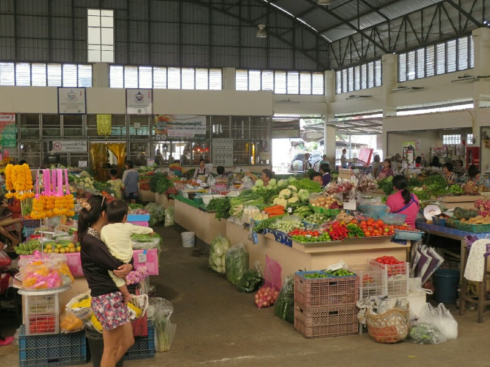
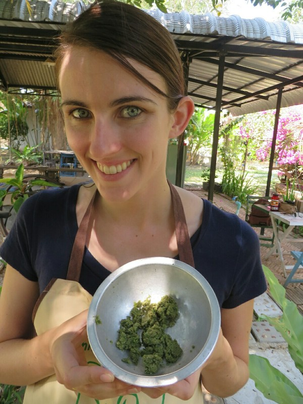
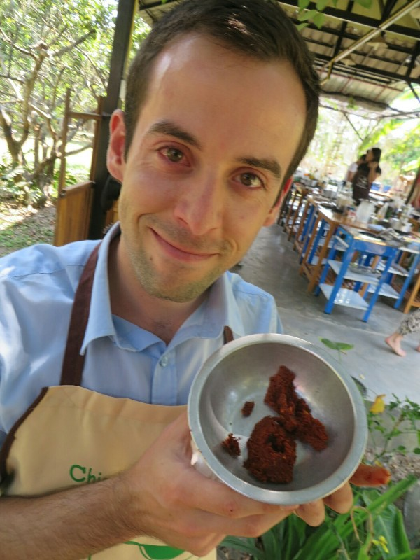
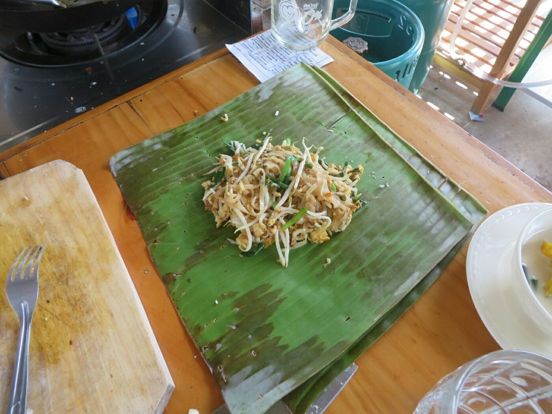
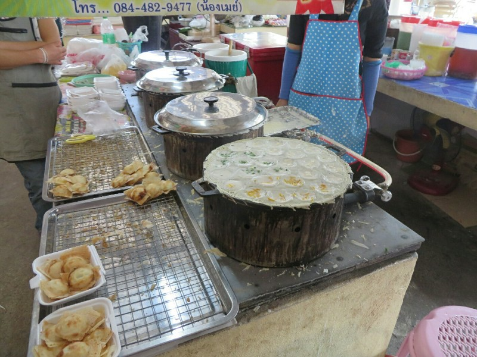
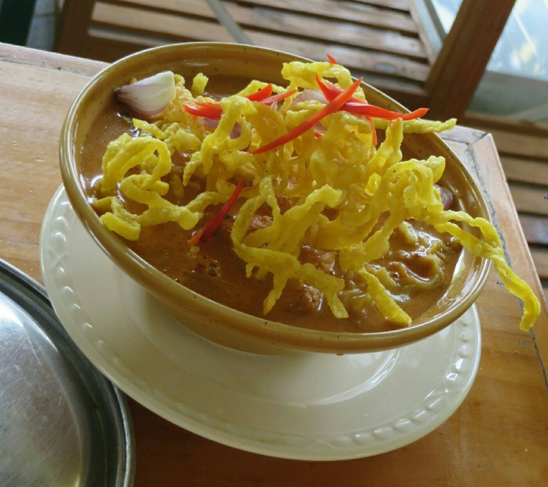
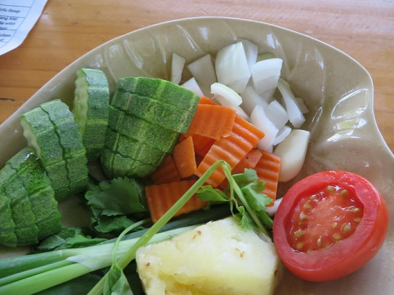
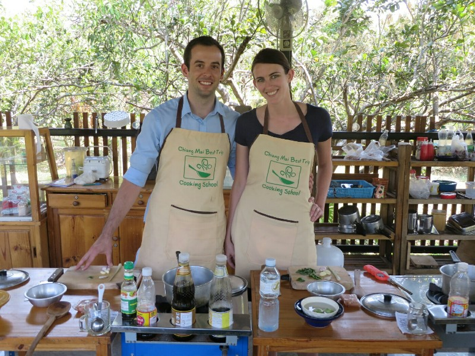

Courtesy of Bobby Doyle, we had a cooking class scheduled for today that would hopefully end our frustrations with non-spicy Thai food once and for all.  Now we would be able to make our curry as spicy as we wanted (cue evil laugh).

The teacher arrived about 9.30 with 4 people in the back of the truck already. Two Canadian girls from Nova Scotia a little younger than us and a Dutch couple a little older than us who live in Italy half the year running a catering company for Dutch tourists. Sounds like a good gig to me!

*Local Market*

First stop was the local markets where we were going to buy all of our ingredients. Before we got started buying things, we were treated to an amazing coconut pancake thing. Everyone was a bit unsure at first, but once we had one, we all were clamoring for seconds. Delicious. We moved into the butcher section and were surrounded by all maner of meat in various states of being prepared for sale. Kate was particularly upset by live catfish sitting in plastic tubs, slowly dying out of water. Maybe we'll become vegetarians.

Then again, probably not.

We moved back to the fruit and veg area and had several stall owners showing us unusual fruit, encouraging us to take photos and laughing at us not knowing what they were.

After leaving the markets we finally arrived at the teacher's house - she had very nice backyard filled with fruit trees and herbs and a great outdoor cooking setup. Kate and I were both jealous.

During the first session she talked us through tons of food, all delicious. Katie made green curry, holy basil chicken and tom yum soup. Pat made chiang mai noodles, sweet and sour veggies and tofu soup. She gave us one chilli each for each dish at first, after some prodding she upped it to 5-7. Apparently that's appropriately spicy for a Thai child. Suited us perfectly. Spicy food- yum.

*Proud Katie*

Somehow she managed to give everyone different instructions for different meals at the same time. We had plenty of chances to taste each others food and all of it turned out amazing. Hard to believe we made it all from scratch, including the curry paste.

*Pat misread the instructions and thought it said "put chili in eye" instead of "grind chili in mortar and pestle". Easy mistake to make.*

During the break everyone had a bit of a nap in hammocks while the teacher cleaned up. We spent most of the time watching chickens and the dog. After our break we made deserts (banana and pumpkin in coconut milk), thai tea and a noodle dish each to take away. No plastic used here, all wrapped to go in banana leaves. Quite impressed with how well we cooked everything. Hopefully we don't forget it all!

*Clever Take Away Container*

After we arrived home, we left hotel in search of the night markets.  Stumbled across ASEAN festival with live music, food from all the South East Asian countries, and information about the group. Fun atmosphere! Got to watch a Thai pop star thrusting in leather jacket, girls screaming and swooning.

Kept walking and eventually found the markets. Mostly overpriced but very fun to walk through. Lots of fake watches, Beats by Dre headsets, and tons of knives and swords (a bit distressing). Didn't buy anything in the end. We headed home past a lot of seedy looking pubs, maybe the red light district? We both were feeling old and lame so we didn't go in anywhere and decided to call it a night.

*Coconut Milk Pancakes - Yum!*

*Chiang Mai Noodles*

*Pre Sweet and Sour Veggies*

*Team Thai Food*
