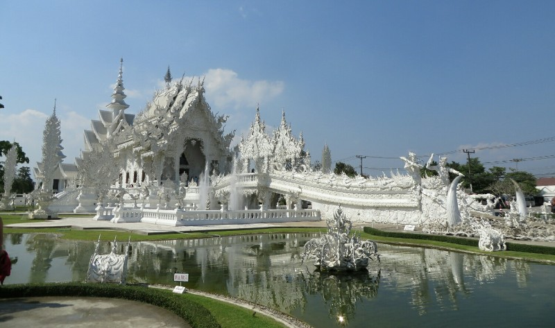
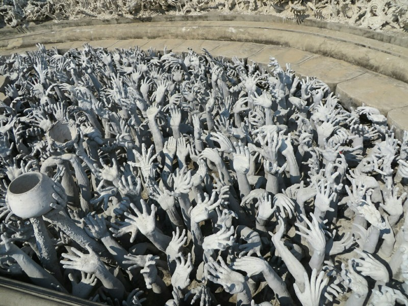
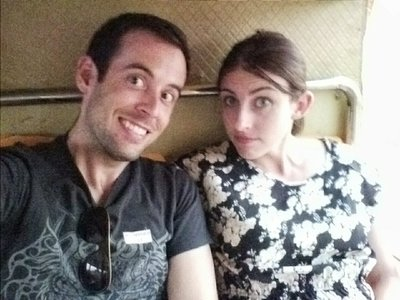
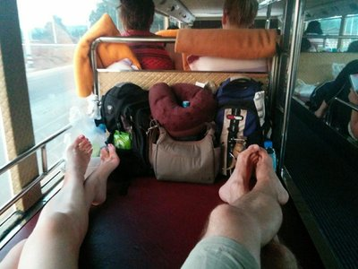

Today we have the 12 hours in a minivan we organised with the local travel agent. Hm. Already questioning the sanity of that decision. It arrived just after 10am, we gave the driver our receipt and got a voucher in return.

Hopped on and joined 6 other travelers. As we headed out of town we thought 'if it's just us 8, it shouldn't be too bad'.  As soon as we expressed this out loud we stopped at another hotel on the edge of town. Bugger.  Initially we thought one Asian guy was joining us, but more and more ladies kept coming out behind him. 4-5 or more? 4 seats max left in the van. The asian people look cross. The van driver called someone then sat down for a smoke. No idea what's going on...

2 guys showed up on motorbikes at 10.40, the asian guy and 3 of the ladies ran off to them around the corner. 5 minutes later they came back, we squeezed them all in and apparently now we're ready to leave. Last minute coke deal?

*The White Temple*

After the first 3 hours (which weren't too bad) we stopped in Chiang Rai to look at The White Temple. It's a newish temple, a self funded labor of love by a Thai artist/millionaire. It was very impressive from the outside- creepy hands reaching up from hell at you as you enter. Inside the temple are the most bizzare murals: batman, goku, angry birds, twin towers, spiderman, etc. Not sure what to make of it. No photos allowed unfortunately. After 20 minutes trying to figure out how the Minions from Despicable Me relate to Buddhism, we were back on the bus.

Another 3 hours and we arrive at Thai border. We all get kicked off the bus. Stood looking very worried until a man came up and took our voucher in exchange for a sticker and ticket. Through immigration. On other side another man again took our new ticket and put us on a nice big new bus with aircon and TV (VIP bus). We think we could live with this for the next 6 hours...

*Hands reaching from hell at the white temple*

5 minutes later we arrive at the Laos border and are kicked off again. It is disorganized as here! One Visa Payment window, one Visa Application Window, one woman very unhelpful, the other guy very chatty and jovial. Instead of calling out full names he'd call out national stereotypes and a first name- "Emu Kangaroo Kaitlyn?"

After buying our visas we were met by another random stranger, a lady who saw our stickers and gave us each another new ticket! We got on another minibus... For 10 mins. Turfed out at the bus station. They said our bus left in a half hour. We grabbed a bite to eat and had a chat with 4 of the girls we were traveling with. Icelandic apparently! Very nice people.

At 6 we got onto another big bus, this one with double bed bunks. The tickets seem to be a bit messed up... Kate is in a double bunk with an Iceland girl, Pat is in with a random Asian man. Kate was very unhappy and had who knows what number mini mental breakdown. The Icelandic girls were not phased and did some person shuffling gymnastics, talking to almost everyone in the bus, to get the 4 of them in two doubles and Pat and I in a double. Our new best friends.

*Our top and bottom halves on the sleeper bus*

Our bus driver honks at everything. They beeped to warn other road users they were coming in Myanmar, but this is like Myanmar on crack. Passing a scooter? (Beep, beep). Oncoming traffic? (Beep, beep). Pedestrian? (Beep, beep). Tree? (Beep, beep). Cow? (Beep, beep). Chicken? (Mother fucking beep, beep, BEEEEEEEEEEEEEP).

Finally at 9pm we arrived in Luang Namtha. We took a tuk tuk from Luang Namtha bus station into town. Cost $10 for a 5 minute ride. The whole 12 hours up to that point had cost $60. Sigh. The second hotel we tried had vacancy. Thank God! Welcome to Laos.
