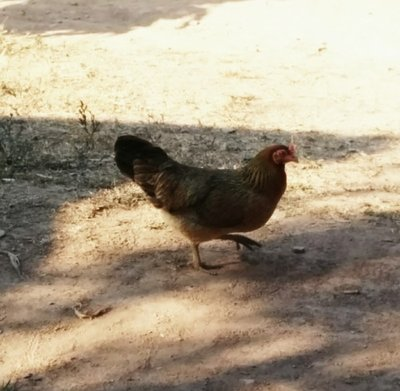
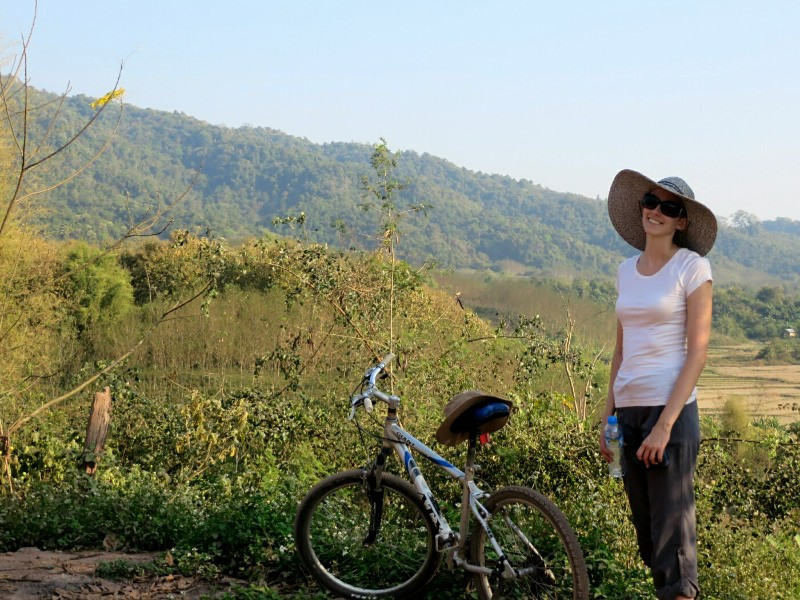
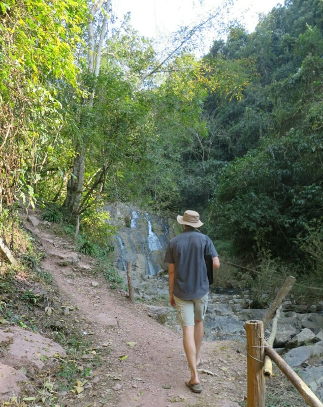
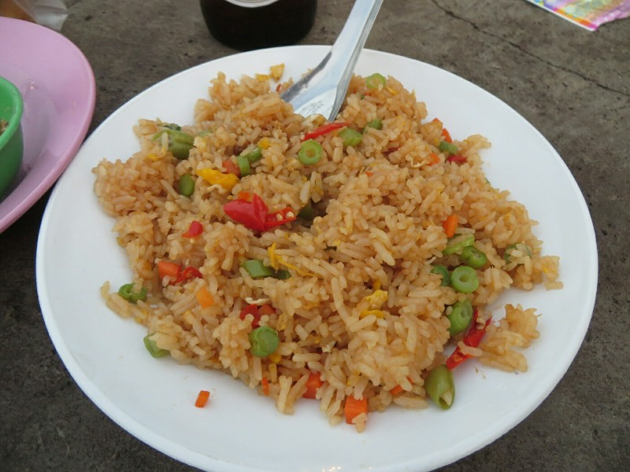
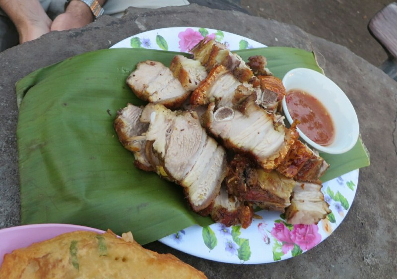
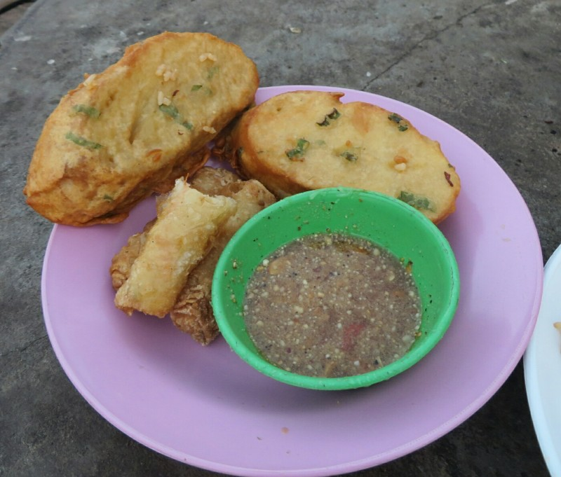

Ugh.

What a terrible night. Can't say we "woke up" because we didn't sleep. Car alarms, babies crying, a lift dinging, doors opening and slamming shut, worst sheets of all time, sink leaking in the bathroom... No way we were staying here another night. Everyone was grumpy pants. Pat was trying to force an extra 15 min sleep, Kate wasn't having any of it and went for a walk to check out a couple alternative Guest Houses. Lots of farm animals hanging out on the road here.

*One of our 100s of farm animal photos. We seem to take a photo every time we see a chicken.*

She managed to rule couple out (a lot of dirty guest houses here and all surprisingly highly rated on TripAdvisor) but didn't find any good alternatives. After a while I got hungry and went home to make Pat wake up. Pat in toe we walked across the road and had an awesome brekky: eggs with onion and tomato and a fresh French baguette. Bless the French for teaching to world to bake during their colonial period. Older ladies in traditional dress keep coming over trying to sell us woven bracelets. We say no thanks.

Next stop- money change. A guy with a loaded AK47 was sitting across from us on a bench very nonchalant. At the counter the teller miscounted  our money by $100 dollars and wouldn't listen to Kate trying to explain he got $100 from 10 x $20 in his mental calculations. Kate got cross, took it back and counted it for him while he watched. He did not respond with word or facial expressions but changed the total by $100.

Then we finally found a new guesthouse. Yay! Working WiFi, soft sheets, sold. We had a little nap.

*Katie lacking fitness for bumpy bike riding*

Rejuvenated, we rented bikes for the afternoon and rode to the waterfalls North East of town. The road was unpaved; painfully rocky and uneven. But we coped pretty well. Saw lots of local people, kids, dogs, a tiny tiny puppy, ducks, chickens with their tiny day old chicks, roosters having crowing competitions, cows getting rowdy and told off by their owner, rice fields and a brick factory all around the river.

The waterfalls were nice. We tried to walk up beyond them but after a 200 meter uphill scramble track started to taper off. Opted not to keep going in case of unexploded landmines.

*Pat and some waterfalls*

After a painful ride back to town we went to a Wat on a hill to the West of town. It had a nice overview of the city. We watched kids and adults at soccer practice for a while. We pondered where soccer was invented, impressed with how anywhere we go in the world there are kids playing soccer.

We finished off the day at the night markets across the street from our hotel. Heaps of food stalls, some more questionable than others. Got some rice, spring rolls with a fresh mixed dipping sauce, what turned out to be deep fried bread (gross), and amazing BBQ pork with crackling (delicious) and a beer. All stalls had signs with costs for tourists, then ended up charging even more again. Oh well! It was still less than $10 for us both.

*Delicious rice*

The bracelet ladies are at the markets too, now begging for left over food from our plates. I wonder if they have no one to help support them? We gave them some pork. There were also lots of dogs who knew this was the place to be. All of them were sitting patiently showing how much of a good dog they were and how much they deserved that pork you were eating. We caved and gave one thay was lying pathetically next to us some pork too (sorry Jill and Peter).

Then, still stuffed from last night, headed for (we hope) a good night's sleep.

*Slow cooked pork with crackling*

*Unfortunate fried bread and delicious spring rolls*
