Good night sleep. Yay! Today we have a day kayaking down the Nam Tha river through a protected natural park and primary forests. Hopefully we spot a monkey.

After another delicious baguette we met our guide at his office, his name was Air. Turned out no one else signed up for today so it's just us three. Hopped in a truck and headed upstream. We passed the only traffic lights in town- apparently they were installed a few months ago and everyone was getting tickets because they'd never seen them before and had no idea they were meant to stop at red.

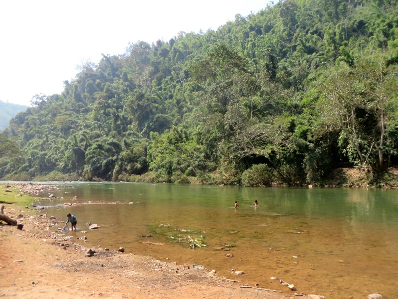

*Today's challenge*

The starting point was a small village settled by Chinese immigrants 200 years ago. They even still write in Chinese characters. Many locals were in traditional dress, Kate questions whether out of genuine desire to wear those clothes or just for the benefit of tourists. Air brought out the kayaks. Kate was excited because they're inflatable and look more comfy than the hand made, sharp, wooden thing she was imagining (having never seen one before). Pat not so happy as looks very lackluster compared to kayaks he has seen in the US. After minimal instruction, we were in the river.

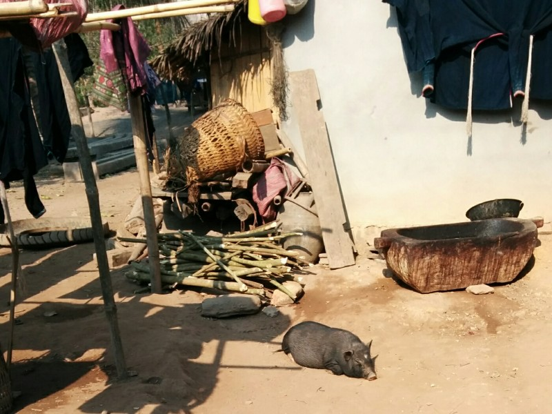

*Pig snoozing in the first village. We really took a lot of livestock photos....*

Immediately have rapids to deal with. Kayak goes sideways and water pours in but we don't capsize. Yay! We're definitely struggling. Kate in the front can see the rocks but Pat in the back is steering. We're taking on a lot of water and feeling quite stressed. Not noticing the scenery much.

After maybe 40 minutes we make our first stop. This time at a Khmer (Cambodian heritage) village. They speak a different language here to the last village, but everyone speaks Lao also. Again livestock and dogs everywhere. Apparently the animals are owned communally by the village. The men spend the day working in rice paddies - the rice they grow is used by the village, not sold. The women collect food and look after the kids. Even the kids help with washing clothes and feeding the animals. Everyone contributes and everyone is looked after. It's kinda nice.

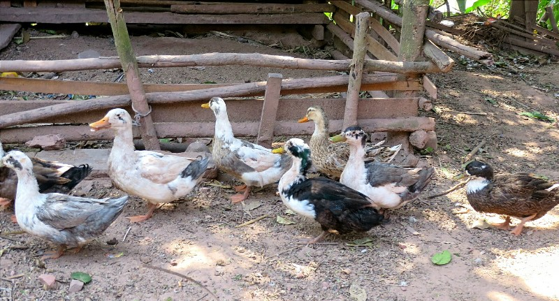

*Ducks!*

Back in the boats. Pat's starting to learn how to steer but finding it difficult. Kate keeps breaking her nails on the side of the kayak. Painful. But we're looking at the scenery more. We pass ladies in the river picking river weed. Apparently they take it home, sort it, dry it on the roofs then deep fry and eat it. There are kids playing, swimming and using scuba masks to fish. Sadly we pass the area that usually has monkeys and there are none home. Sad times.

We stopped for lunch on side of river- sticky rice, green beans with ginger and garlic, and a plain omelette served on a banana leaf. It was very tasty. We had a bit of a chat with Air. He has three siblings aged 9-18, all are still in school. He had to stop school at an early age because his parents couldn't afford it. After a few years he joined a monastery- he's very grateful he could go as they teach the kids how to read and write, and how to speak some English. After 4 years as a monk he joined the military for 4 years. Bit of a dramatic change! He found the army harder than the monastery, but said it was very hard to not be able to speak to or touch women as a monk in his teen years. After leaving the army he became a guide and he's been doing this close to 5 years. He's married with a little 3 month old baby. He said we'll stop at his village next and meet his family.

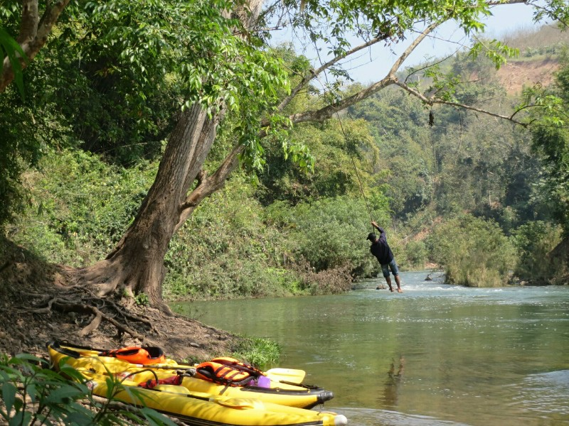

*Air having fun on our lunch stop*

After lunch we actually improved a bit with the kayak. We spent more time looking at the amazing ancient forest, the millions of butterflies and the birds flying overhead. Apparently a big snake also swam past us but we missed it. They wait for people to come past before crossing the river to avoid eagles.

The next village was Air's village. We met his cute baby, Jackie. A tiny dog follows us around licking Pat's pants. Lots of locals try to talk to us, but we don't speak Lao so we didn't get far. Everyone was really nice and you could see they take the 'it takes a village to raise a child' to heart.

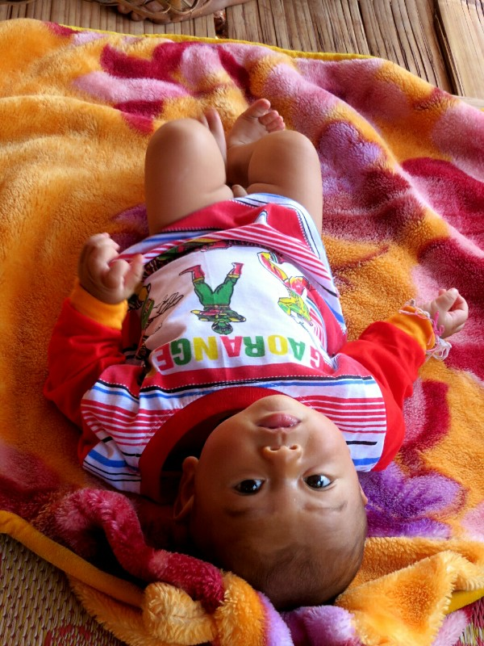

*Jackie - total cutie*

Back in kayak, definitely getting the hang of it. Kate's having fun and even Pat isn't minding so much. We can hear music from the next village although it's quite a long time before we get there. At the village we find the music is from a wedding reception. The groom is a friend of Air's so we were invited to come along. Air asked if we wanted to buy some beer to take. We just got one, he got 5. On arrival at wedding, he gave all beer to a lady at the door. Apparently it's pot luck, not BYO. We feel stingy.

Pat made a few friends. One kept making him repeat Lao words, then when he finally got it right, made him skull his beer. Everyone was force feeding us Beer Lao. The father of the bride (who is also the village leader) spoke to us via Air. He said thanks for coming and it's very good luck to have tourists at a wedding. He is very happy to have tourists coming to the village, apparently all the groups who do any activity with this company go to his village so they are now able to build some places in brick instead of thatch. He said we should get our friends to come too. Okay guys?

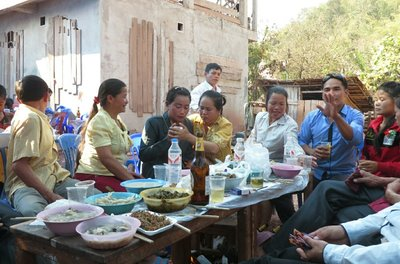

*Peer pressure, and when that fails, force feeding!*

The music was loud! Everyone was dancing, which in Laos is basically walking in a circle. After a few hours we were getting tired and asked Air when we were leaving. He called the truck and said 1 hour.

We went to another friend's house to wait (her father died the day prior, he wanted to keep her company/force feed her beer). While we waited we helped sort river weeds with locals. They started us with our own bucket because we were hopeless, but eventually we graduated to the same basket as everyone else. The locals were laughing, teasing each other and throwing weeds at each other. There was a cute little girl waving at Pat and laughing.

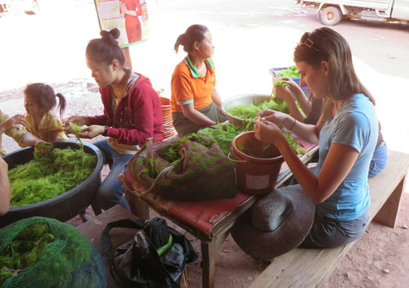

*Katie sorting reeds in the 'special' bucket*

Unfortunately the truck was late getting us, and after 2 hours we were getting pretty sore and tired. Pat was badly sunburnt with a sore back. Kate ended up with a hurt wrist (stirred up her Switzerland snowboarding injury), blistered hands and broken, messed up nails. On the drive home we dropped Air off at his village. The cute dog remembered us and came back to say hello.

In town we went to night markets and had more pork. Then we went back to travel shop and had our free cocktail and a pizza. Very tired and a bit sore, but all in all a fun day.

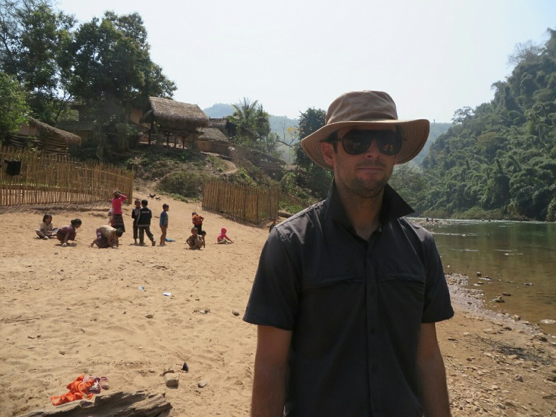

*Pat unsure about this kayaking thing*

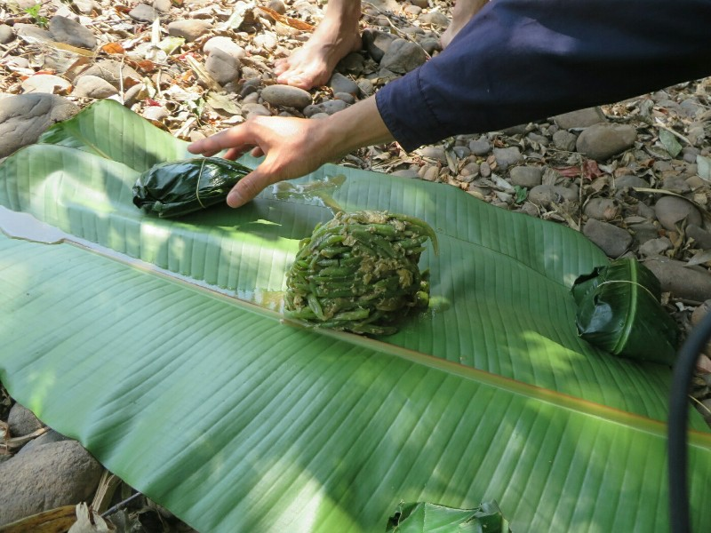

*Lunch*

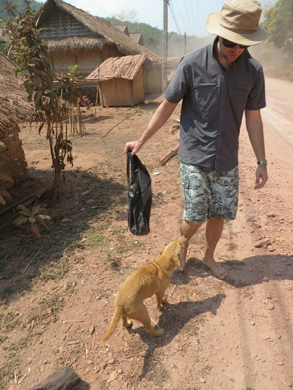

*Pat trying to dodge cute dog licks*

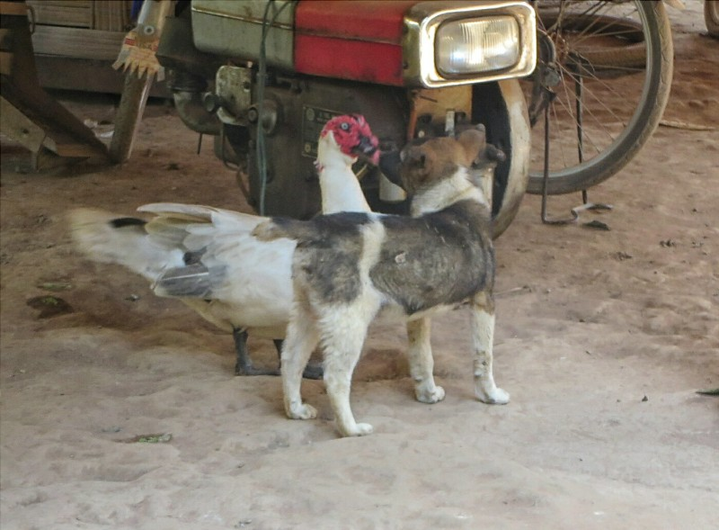

*A duck who tried to bark like a dog and wagged it's tail like a dog. And his best friend the dog.*

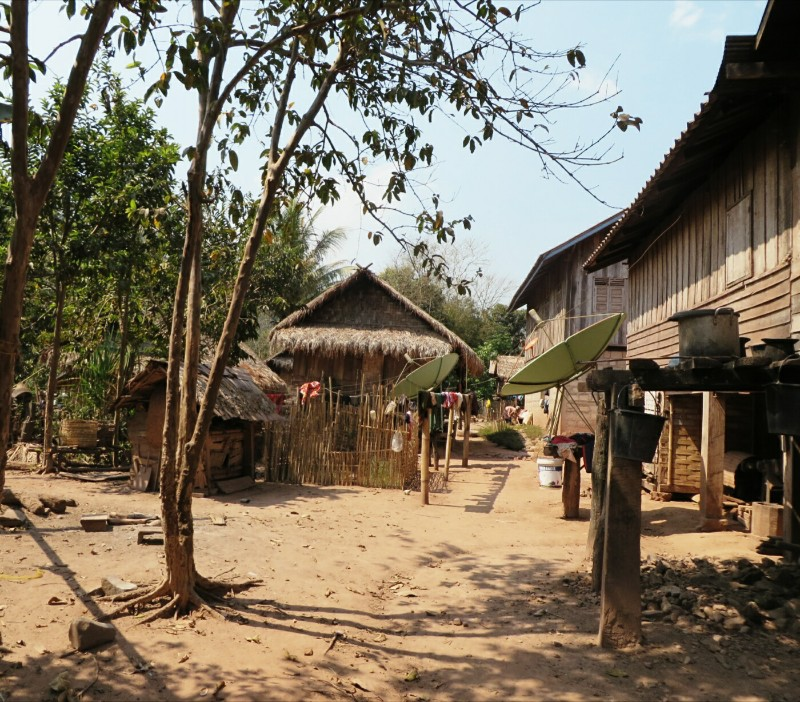

*Air's Village*
