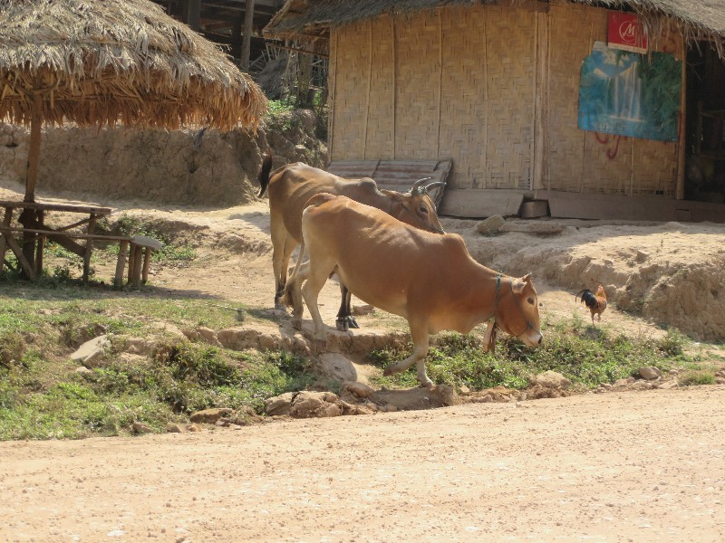
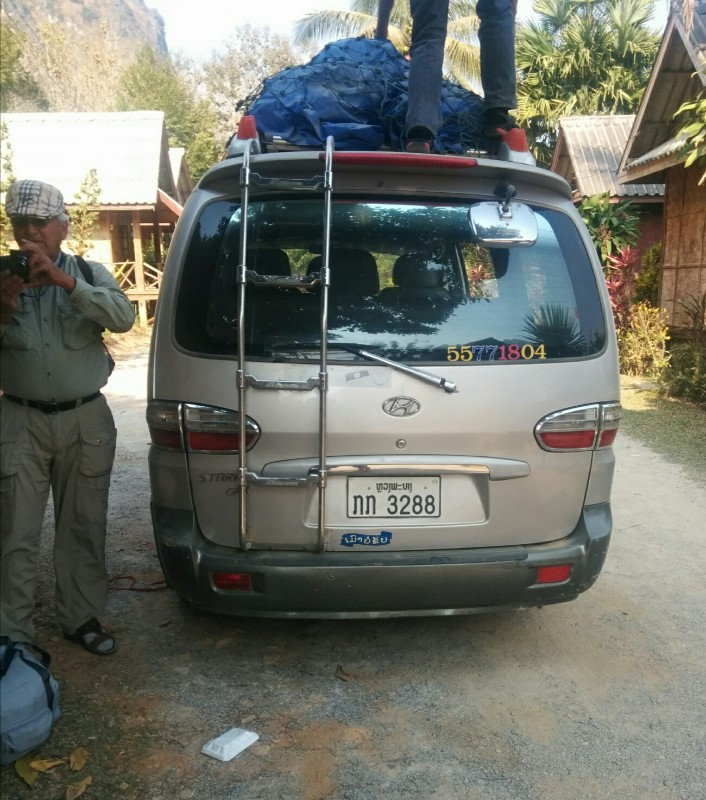
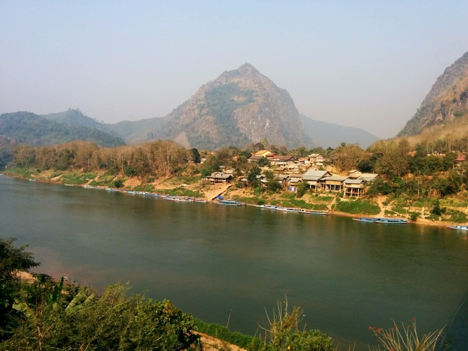

Had breakfast at the local bakery (still loving the French influence!) then headed to get our minibus to Nong Khiaw. We ended up getting a minibus rather than a big VIP because some days the VIP doesn't show up, a dodgy old local one does. While you get some money refunded, we thought we'd rather join some random tourists hiring a minibus than take the risk.

The passengers consisted of us, a European couple, a British woman who reminded me of Sharyn Borret and an older guy who reminded me of Pierce Hawthorn. Bus wasn't full and we thought we might get away with a semi comfortable, if not long, bus ride. Silly Pat and Kate, will you never learn??

First 20 minutes were fine. Mostly paved roads, no huge potholes, no dramas. The bus driver then stopped and picked up a family of 3 people (Mum, Dad, son). Apparently this is a hybrid private/public bus. Either way, now the bus was full - one seat for each person. We carried on for a while longer and then he stopped again for a mother and two kids. We all looked around, unsure how these three new people are going to fit. Somehow we manage to squeeze everyone in with a few of the kids sitting on their parent's laps. Cozy.

*We give the people what they want, and we're pretty sure that's more farm animal photos. So here's some cows we passed!*

After 2.5 hours we arrive in Oudomxay. Stop for petrol and the mother and two kids got off. The kids were so well behaved, we're very impressed.

It was another 80km to Pak Mong consisting of awful half paved, half dirt roads with huge potholes. The worst roads we've ever driven on anywhere in the world. Less and less paved sections as the drive went on. Despite this, the driver isn't too bad at this stage. About 25 km out of Pak Mong he suddenly decides he's a rally driver. Speeds up a huge amount, quickly into and out of pot holes, Kate and Pat bouncing around a lot, lightly banging their heads against the roof with frequency as we were stuck in the very back seat. The minivan almost rolled over once when the van veered off road and into a huge pothole sending Kate flying into Pat. Maybe the driver thought I needed a cuddle?

We started overtaking motorcycles who were already on the wrong side of the road overtaking trucks while going around corners on narrow roads with high cliff face drops off the side. We passed other vehicles that had collided, which apparently didn't phase the driver in the slightest. The poor little boy and his Mum were getting violently ill. Driver could care less and kept on driving like a maniac.

We finally arrive at Pak Mong and stop for lunch at 2:30. It took 5 hours rather than the normal 6-7. Would have preferred a longer drive and to be in less pain, but I suppose what's done is done. At least we are alive, which feels like a mini miracle at this stage.

*Pierce Hawthorn and the minibus from hell*

The girl in the European couple was very agitated that we had stopped and kept pestering the driver asking when we were going to leave. If I could speak Lao I would have told him to ignore the annoying woman. She then made a comment about the silly people getting car sick, despite having claimed the front seat herself because she gets carsick! Sigh. Sharyn bought some snack food and shared it with the local kids. European girl asked 'Uh... WHY are you feeding the local kids??' like it was a crime. Not crazy about her.

Left Pak Mong at 3pm and we were back on paved roads, 27 km out, limited twists and pot holes. Thought the worst was behind us. Except the driver decided it was now a life or death race and drove like a psycho. Hit potholes at full speed, smashing our heads against the roof seriously hard, very painful! Yelled at him to slow down as we could see him laughing in the rear view mirror. Pretty sure he didn't speak English, but he seemed to get the message given the frantic tone in our voices... For a few minutes anyways.

He continued to speed down the road, narrowly missing school children. Pierce Hawthorn now joined in, hitting him on the shoulder telling him to slow down. He didn't listen.

Awful. Awful. Awful.

After 20 minutes we arrived in Nong Khiaw. Thank Christ. Very cross. Kate is feeling dizzy and nauseous and is worried about being mildly concussed. Finally walked down to our guest house - the Nam Ou River Lodge where we were greeted by a very  enthusiastic Mr Mang. Apparently everybody know Mang! He was younger than I pictured but seemed nice. Our room had a nice view of the river. In the distance we could see fire on limestone cliff/mountain on the other side. This was brushed off initially, but would come into play tomorrow, so stay tuned!

*Nong Khaiw*
