Today the plan is to hike up one of the surrounding mountains to a viewpoint. Mr Mang passes us walking towards town and asks what Mr James is doing? When he hears, he suggests against the viewpoint walk because of the fire yesterday. Then he says we should visit his travel shop for treks instead! Seems a bit fishy. We say thanks and carry on.

We wander through town and stop for breakfast. We admire the pyjama pants every young white tourist seems to be wearing. For a moment we were jealous, then we remembered we are in fact adults and wearing pyjama pants around town when you're older than 10 years old is completely inappropriate.

There are bomb shells everywhere: cafes, restaurants, travel agents, our hotel.... They're used as benches, stands for menus, specials boards, anything they can think of. During the Vietnam War the US dropped over 2 million tonnes of explosive ordinance on Laos (a country not involved in the war) averaging one bombing mission every eight minutes, 24 hours a day, for nine years. They hold the undesirable title of the most bombed country per capita in history. About 30% of the bombs didn't explode on impact leaving massive areas contaminated today.

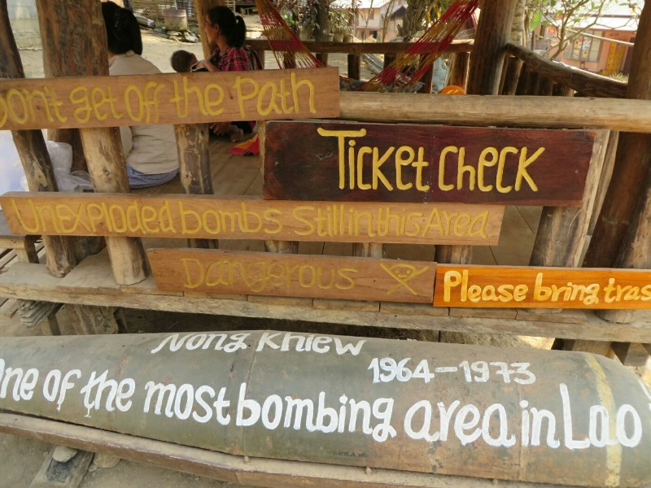

*Creative Use of old Bombs*

The USA bombed Laos for a couple of reasons- some were dropped in an attempt to block Vietnamese supply lines, and some when they aborted missions in Vietnam and it was too costly to fly the fully loaded planes back to base. The worst part is only 1% of the bombs have been cleared. The US spent $17 million a day dropping bombs across the Lao countryside and villages, they now spend only $2.7 million a year cleaning up. 37% of agricultural land in Laos is currently contaminated with unexploded ordinance, and unfortunately still used sometimes as a lack of food is a more immediate threat than the possibility of exploding a cluster bomb. About 300 people in Laos die annually as a result of unexploded ordinances, 40% of whom are children. We both found it sad that in our respective countries, this information doesn't seem to be common knowledge (at least not to either of us) while the people here are still very much affected by a war that ended nearly 40 years ago which they weren't even a part of.

We got to the starting point for the walk, and in fact the sign was on a bomb shell. We pay our 20,000 Kip to climb and get a water each. It's already quite hot out and we get puffed quickly. It's steep and it's long. We took lots of water breaks and after a half hour were dripping with sweat. Almost half way up we pass a tree that is still on fire.

We think back to Aussie bushfire safety- fairly sure they recommend against walking up a hill into bushland that's still on fire... Especially when you can't leave the path in an emergency due to unexploded bombs... But what does the Australian Government know?? We decide we'll be right and soldier on (sorry Mom (and sorry Mum)). We aren't very smart.

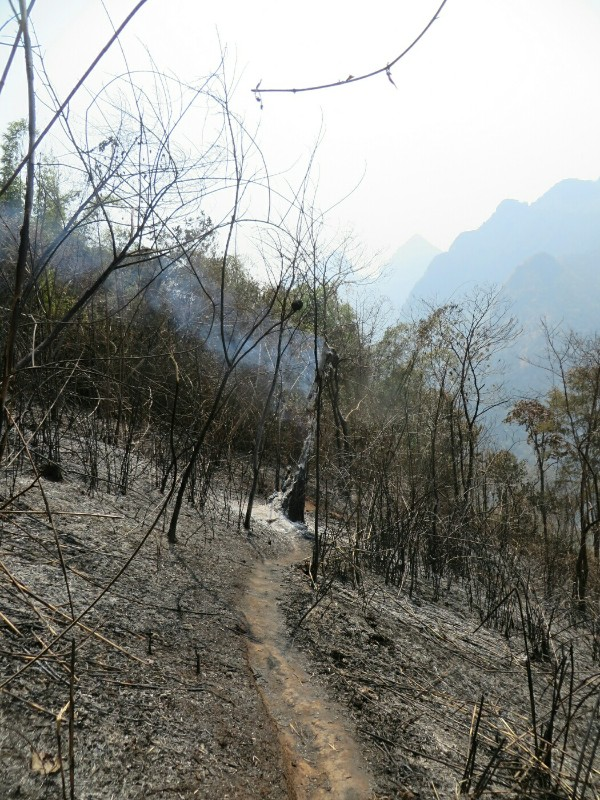

*Smoldering Tree*

It is a really hot climb! We pass a few people coming down who say the view is worth it. Good motivation. After just over an hour of uphill scrambling in the sun the track goes into the shade. So much better. And in the last 10 minutes it levels off as well.

Finally after 85 minutes (not that we were counting) we make it to the top. What a stunning view. We have a panoramic outlook over Nong Khiaw, the Nam Ou river and nearby villages (one of which is having a party, sounds fun).

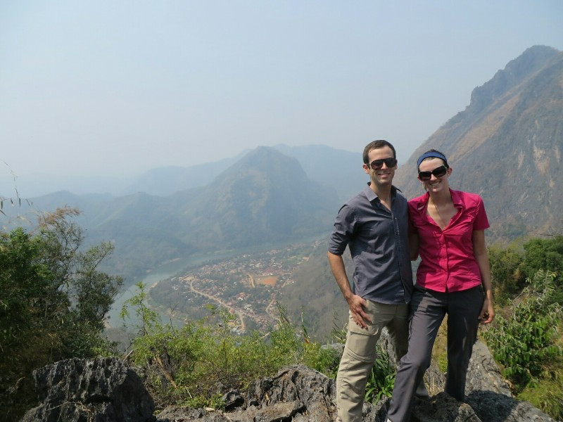

*Well Earned View*

After a good breather we start walking down. We're getting little worried about the fire as we can hear one crackling nearby. Can't see it though! We don't pass anyone coming up either- we wonder if the fire has spread and they've closed the track. We hurry back past the burning tree (still on fire) and 45 minutes after we started our descent we get to the bottom. And we didn't die! Good times.

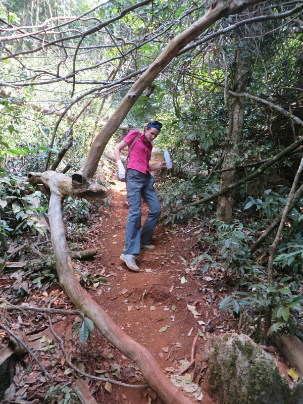

*Cautious Katie on the Descent, Wrist Still Bandaged from Kayaking*

We go and grab a late lunch at a local restaurant called Alex's. It was run by an older lady who basically converted the front of her house into a restaurant. We had to walk through her living room to the bathroom (a squat toilet again, I miss toilets with a dry floor). The food came out one dish at a time and we could see her cooking everything from scratch in the back.  It takes 1.5 hours for our 3 dishes to come out but they were all delicious and worth the wait.

The rest of the day (after a good long shower) was spent trying to organise the waterfalls trek for tomorrow, a kind gift from Elise and Hugh. We know only one company does the official '100 Waterfalls Trek' (Tiger Trail) but we were unable to get into their office. We thought one of the other agencies may do something similar. In fact they all do the same alternative day tour- visit a town up the river, visit a historic cave rice farmers sheltered in during the bombings, take an hour walk to a waterfall (very flat and easy) then boat or kayak home. It didn't really sound like a 'trek' like we wanted so we reattempted getting into the Tiger Trail office. It actually wasn't that hard; we were trying to get in through a window instead of the open door last time. Oops.

And that did us for the day.

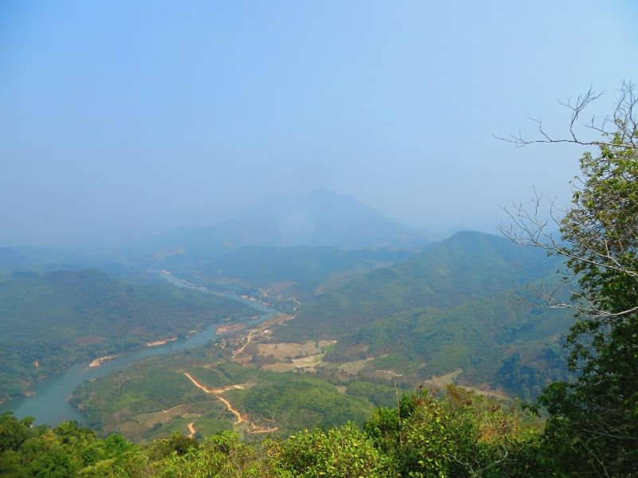

*Village Downriver*

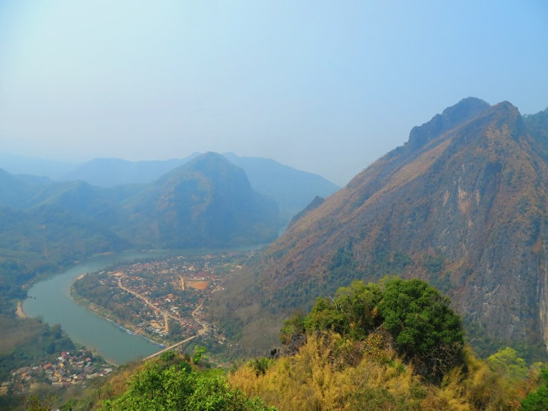

*Nong Khiaw*

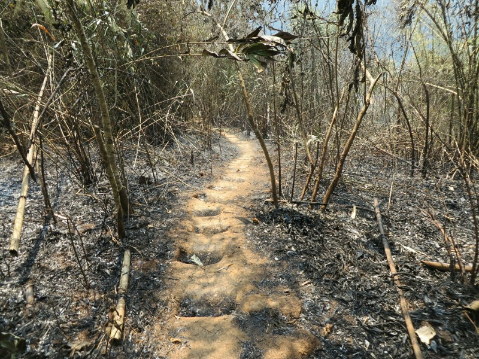

*Damage From Yesterday's Fire*

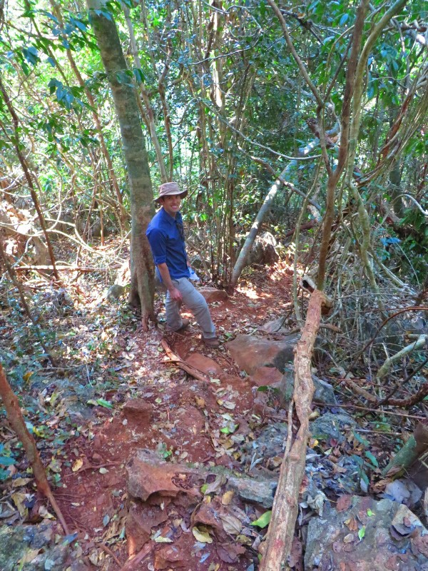

*Pat Leads the Way*

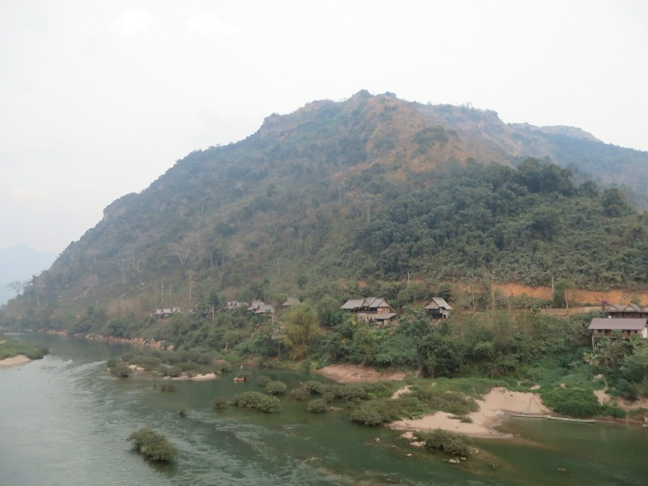

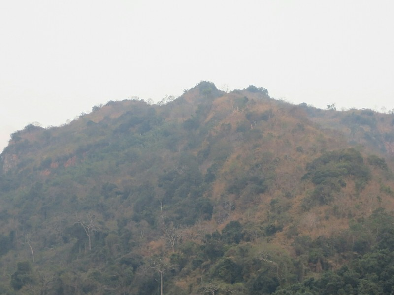

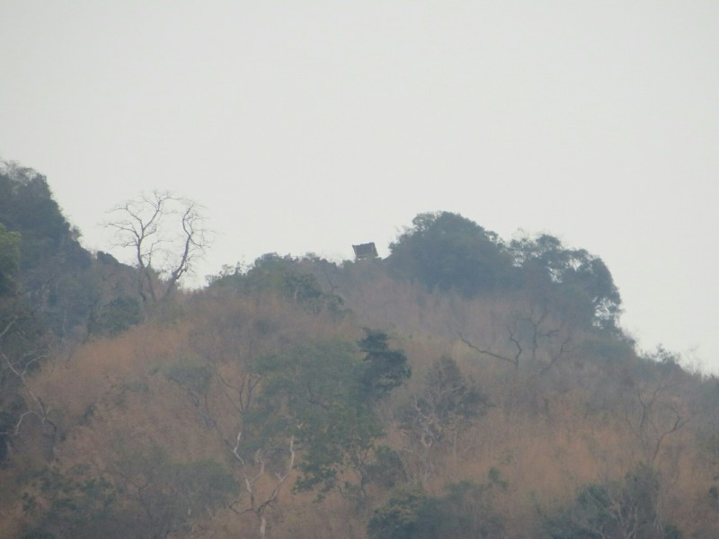

*Where we Climbed*
