Kate woke up feeling okay for 20 minutes, then her stomach turned on her. Pat went to brekky alone with a request for take away for Kate. He brought back half a baguette. Kate not happy- half a stale baguette isn't exactly what she was imagining. Pat not happy- Kate was unappreciative and what do you expect for take away in South East Asia? Sad times. We made up quickly.

We met our guide for the day (named Banana!) and the others in the group. There were 9 of us- Pat, Kate, two Dutch ladies who live in the UK (physios), a Brazilian American man with colorful dreads, three Israelis and one girl by herself who wasn't very chatty (she reminded Pat of April from Parks and Rec).

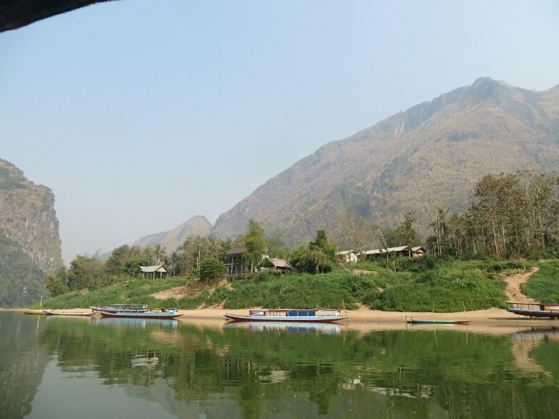

*Floating Down The River Through Nong Khiaw*

We took an hour long boat ride to the starting point. The scenery was spectacular the whole way- tall imposing mountains that looked untouched by humans. Pat was picturing dinosaurs roaming around. Kate missed most of it focusing on trying not to vomit.

We were greeted in the small starting point village by a little girl saying "Sabaidee!" (Hello!) and waving nonstop. A little boy standing with her looking at us, but he was a bit more shy. They were accompanied by a dog. All three started following us around.

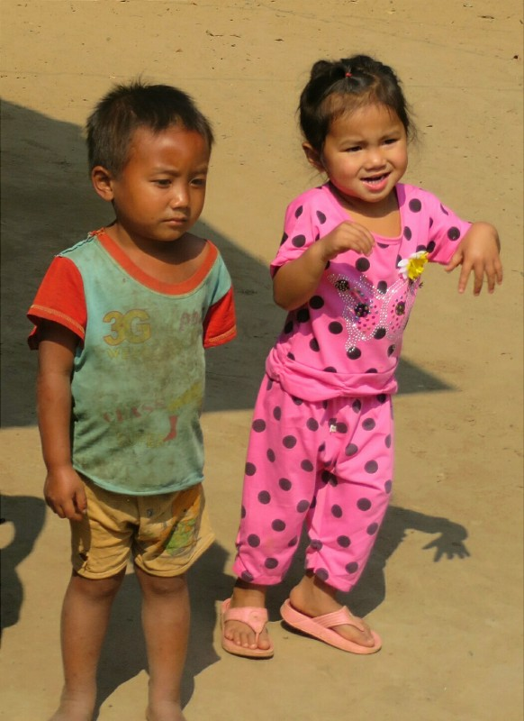

*Sabaidee Girl Mid Wave*

First stop was the local school where Banana dropped off a bunch of pens and exercise books. We hung out with the kids for a bit. Very cute. The little girl and little boy who followed us and sat at desks but looked too young to be there. The dog came in and sat down too. The Isralie guy was teaching some of the kids how to count in English and was writing English words for them. They made him write in Lao and laughed hysterically at his attempt. It was fun to watch.

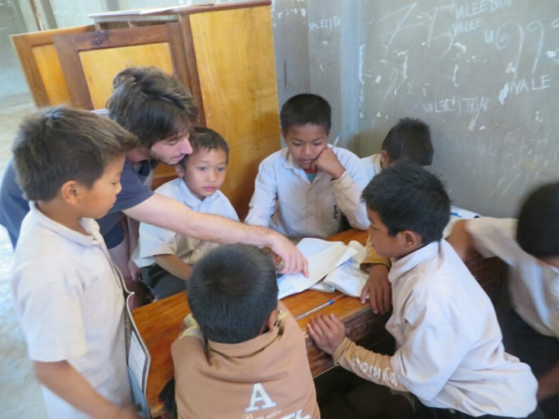

*English and Lao Lessons*

After we had  sufficiently disrupted the class and stirred up the kids, we left them with their teacher and started the trek. Another guide joined us but he didn't speak English. We walked through an area of vegetation for 20 minutes or so, then crossed a few streams and came out into some rice paddies. We watched the water buffalo as we passed through. We lost the kids at the school but the dog was still following us. She had a play with the buffalo- Pat thinks herding them, I think riling them up.

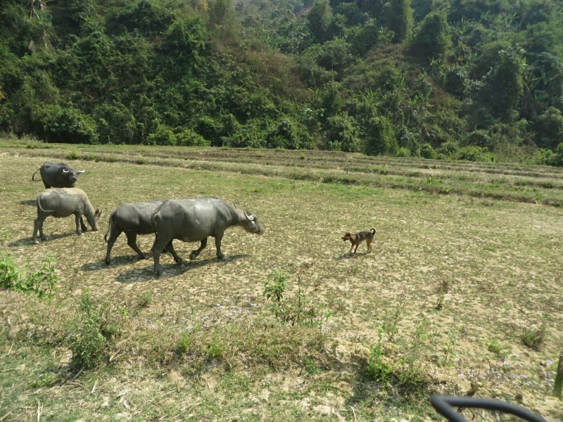

*Buffalo Are Not Impressed Either Way*

After a half hour of farm land we arrived at the base of the waterfall hike. There were lots of small waterfalls to hike through varying from 30cm to 5 meters or more. We both went barefoot and quite enjoyed it, there were only a few slippery bits (more than Kate expected from the reviews online- 'not slippery at all!', but she managed to stay upright). It was very pretty along the way and didn't look too trampled by people yet. It still felt like you were one of the first people to stumble across this pristine area. Only two sections had man made helpers: a rope and a bamboo railing. Aside from that, a few footholds in the rocks were the only evidence of human interaction. It's a shame we couldn't take many photos, we had the camera in a dry bag.

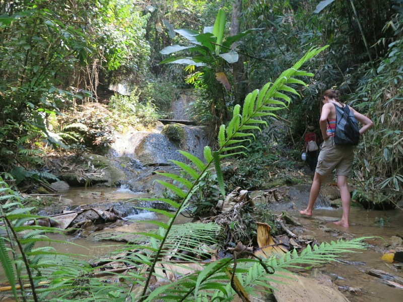

*Katie Not Falling Down*

A while up we all stopped. Lunchtime? The dog settled in a good spot she found and laid down. Banana started collecting leaves for what I thought was plates. Turned out he was just collecting leaves! We soldiered on towards the top, no lunch yet.

A bit later again we got to what we thought

must be the top- only a huge unclimbable 15-20 meter vertical waterfall lay ahead. Again, we were mistaken. We rock climbed/scampered up a very very steep path along side the fall and were greeted with the lunch spot. There were bamboo tables and chairs set up and spectacular view of all the surrounding mountains including the one we had just scaled. I naturally forgot to take a photo.

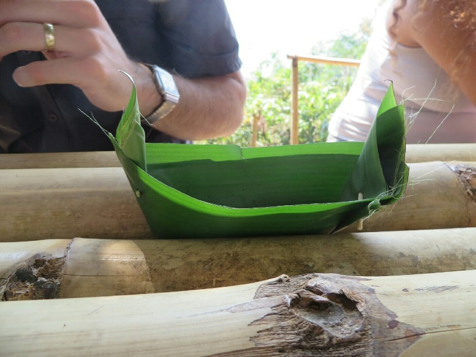

*But I got two of the banana leaf soy sauce container!*

We all got fried rice that looked like too much then promptly all finished it. Hiking and climbing is hungry work! The dog got some nibbles and was happy she made the hike.

After lunch it was time to head down. Very steep with lots of loose dirt. Slippery! Other people in the group were sliding, Kate fell down about 5 times. The first time the guide was really worried because she had a little graze. Kate had to reassure him she falls down a lot, even if there's no reason to fall, and it didn't hurt. By the 5th time he was laughing along with her.

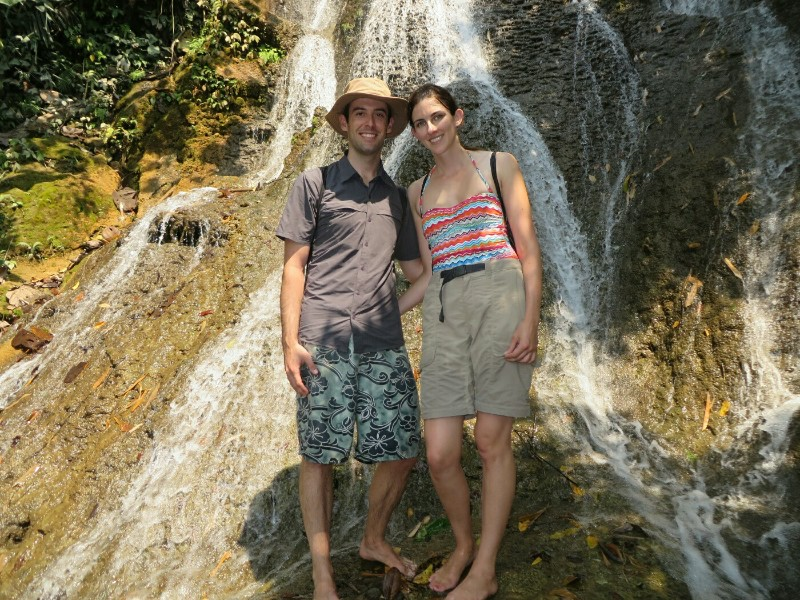

*Kate and Pat at the Top!*

We walked back down a separate trail near the waterfalls. Very pretty scenery again. Then back through the farm, lots of chicks and piglets hanging around, super cute! It made us feel bad for being omnivores. We told them "see you for dinner", sarcastically as we left. Turns out we had pork and chicken for dinner unintentionally. Oops.

We continued back through rice paddies to the village where we sat and waited for the boat. A man came around and gave everyone a nip of Lao Lao (local whiskey). Wasn't half bad.  The Brazilian guy showed the local kids how to spin a stick like a ninja turtle. They enjoyed it. Kate had to use the toilet- she opened the door to find two chickens chilling in the thatch bathroom. They freaked out at the sight of her and panicked because she was blocking the only exit. They ran around spastically until Kate walked in and they shot past her. Freedom! Horrible horrible freedom! Silly chickens.

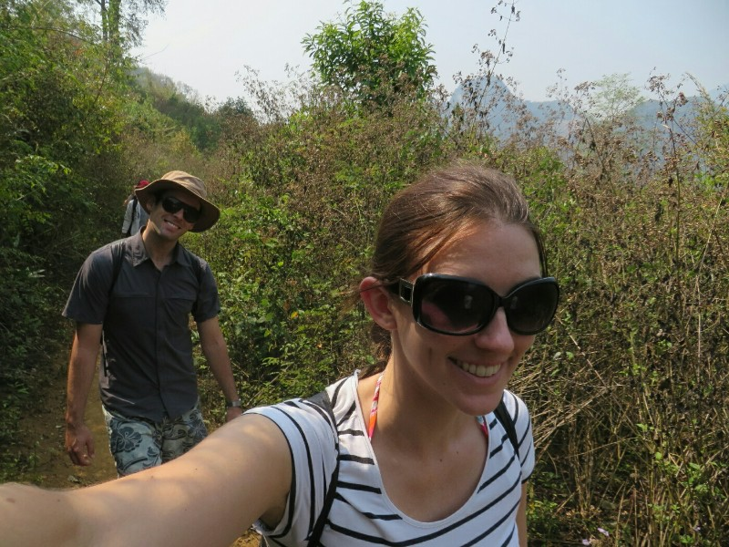

*Enjoying the Walk*

The boat arrived and we all headed off. They warned us to watch our heads. Pat immediately hit his. Kate laughed then did the same thing. So glad we found each other; at least the brain damage will develop at the same rate in both of us.

Kate found the ride back very scenic and wondered if the afternoon light made it look better. Apparently it just looked better without nausea. The Dutch/English ladies were staying at the same place as us and organised for the boat to drop us on the beach there. We all climbed the hill up to the guesthouse. Kate took a gleeful jump up the last step, feeling happy and satisfied with the day.

This gets a bit gruesome, opt out here if you don't like hearing about blood. No photos though, we promise.

....

She kicked her big toe. Pat made a joke about her getting one last bump in. Kate laughed. Then decided it was actually very sore. Looked down and saw loose skin and dripping blood. We got into room as fast as possible and washed it with bottled water. Very very sore. The nail was loose and the whole cuticle was ripped off to the root of the nail along with the full thickness of skin of the tip and side of the toe. Blood +++++

Kate was saying ouch ouch ouch get me pain killers with codeine, a cloth to clean it and something to bandage it with, Pat was panicking because aside from our mobile pharmacy with every drug imaginable, we didn't have any practical first aid items except tiny Band-Aids and toilet paper. We've mentioned before how we aren't too bright. Few too many bumps on the head?

The Dutch neighbours heard the commotion as the door was open and there was blood all over the floor and asked if we needed alcohol wipes, a sterile bandage, and tape. Pat said "yes please!". Good thing someone was prepared!

With Kate sorted for the moment, Pat went in search of supplies. I walked to the bridge where we saw a chemist earlier, they were closed, bugger. Asked around, was told there's another chemist right across from our accommodation, would have been helpful to know 15 min ago! Walked back. They were open but the lady didn't speak English. She called her daughter up and she spoke a bit, enough to tell me they didn't have what I wanted. Bugger!! She said I had to go to the hospital. Off I went.

The woman at the hospital spoke no English. I tried to mime having a bleeding cut and needing a bandage. A local man noticed my struggle and translated for me, thank God! She opened the door to their store room and got a bunch of bandages, alcohol, iodine, tape and gloves. Score! Only $6 for the lot. First aid kits in Aus are a rip off.

Walked back to Kate and got a Sprite and a water on the way.

Meanwhile Kate was sitting in the hotel room alone with blood soaking through the bandage. I called and texted my parents to ask what to do. No reply. I tried googling what to do. Discovered because the nail root was exposed the nail would fall off and never grow back, the build up of blood under the nail would need to be drained but without sterile instruments in Asia I'd get incurable diseases, because the water here isn't clean and the climate is tropical it will get infected and I may lose a toe, the bones are probably broken, I need urgent medical attention!! Google doctors nearby,  learn the only ones who treat tourists are in Vientiane, a 4 hour drive and then 2 hour flight away. Freak out. Tell Bini I'm going to die.

I eat a packet of cheese crackers and feel better.

Mum writes back. Says to see how it looks tomorrow, go to hospital in Luang Prabang if looking bad. Use Tom's supply kit for antibiotic cream. Bini says I can always paint where the nail should be and trick everyone into thinking I still have a nail if I lose it permanently. Feel much better. Close Google.

Pat comes home with supplies. The pain killers are working and it's stopped bleeding. We rebandaged the toe and I sat with it elevated for a while. I will not die. Phew.

After a rest we went to book bus to Luang Prabang for tomorrow. We got quotes then went to dinner at Alex's. We had spring rolls, Lao noodle soup and Lao sausage. The soup was OK but not as good as pho. After a calming Lao Lao (great idea after blood loss with an open wound, we know) we headed home to bed. It was too late to book the bus ticket, will need to do it in the morning. We'll have plenty of time because we won't be walking up to the viewpoint again as planned.

On the walk home a drunk Lao man hugged Kate. Gave us a shock! Nice that strangers on dark roads hug you here rather than robbing you.

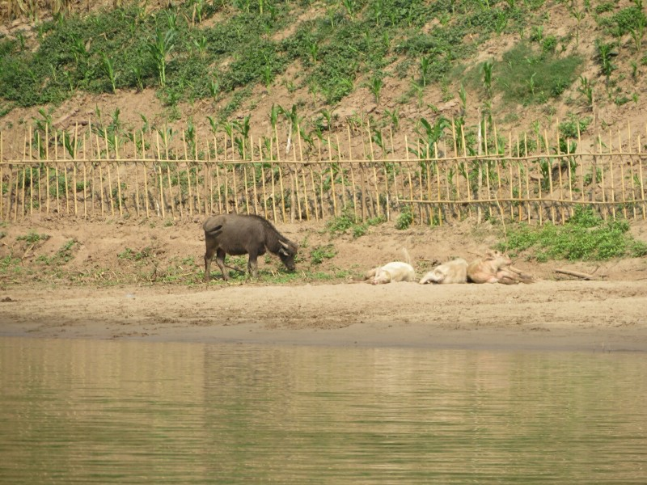

*Buffalo on the Riverbank*

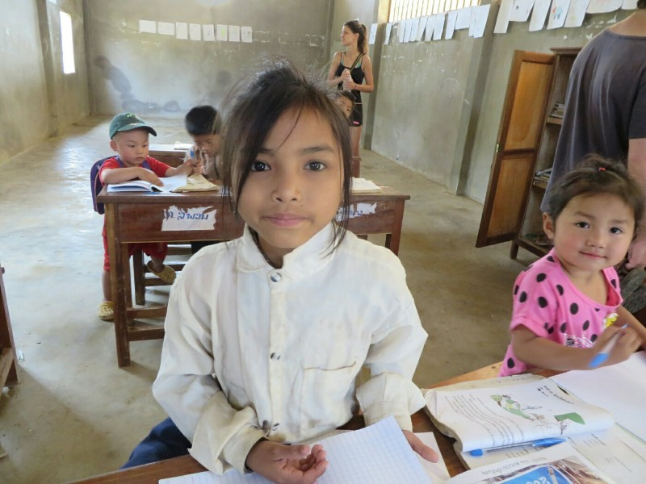

*Kate Continues to Disrupt Class to take Photos*

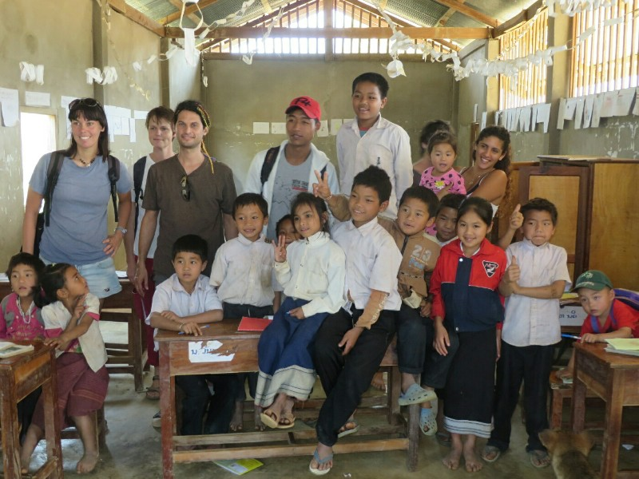

*Group Shot!*

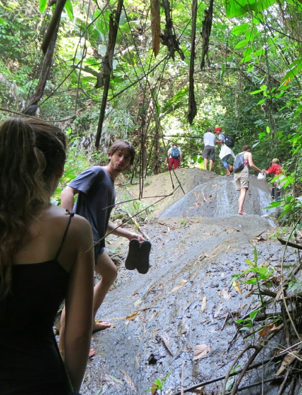

*Trekking up Some Falls*

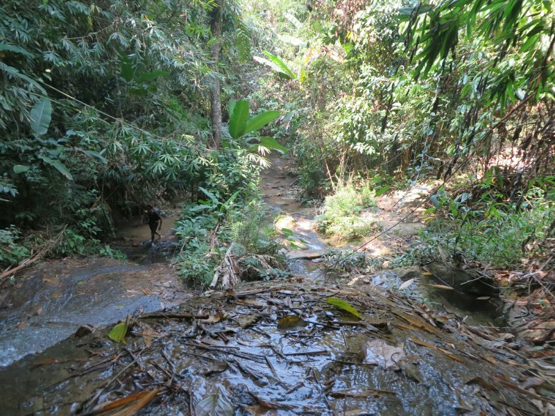

*Looking Back*
