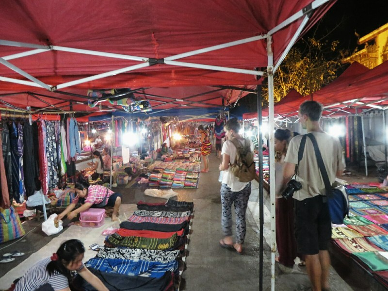
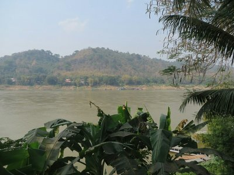
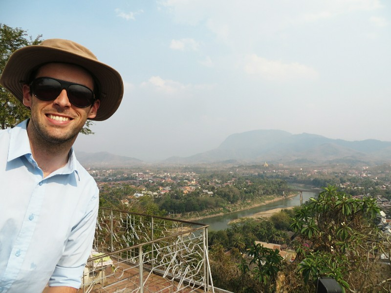
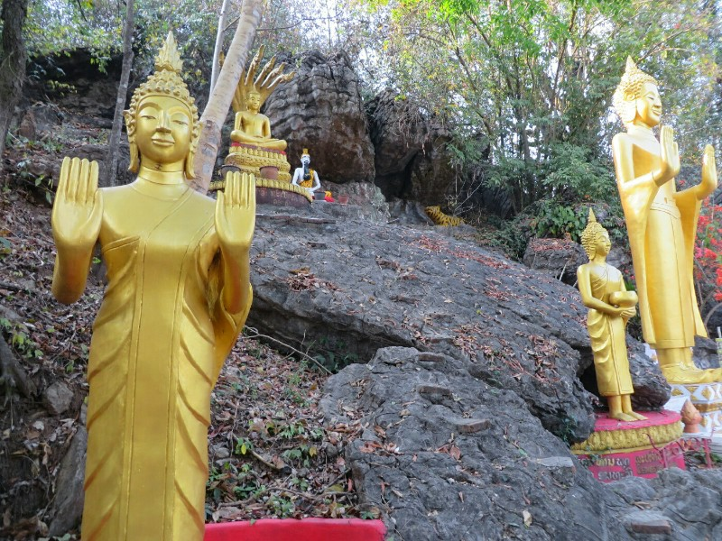
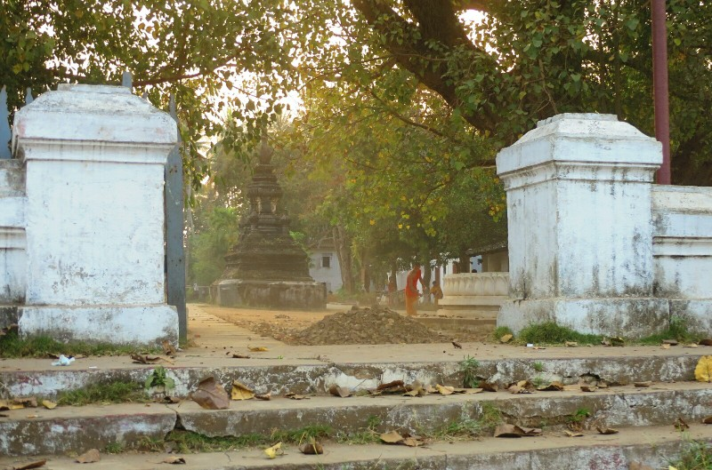
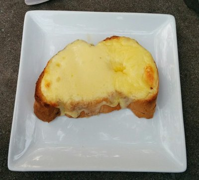
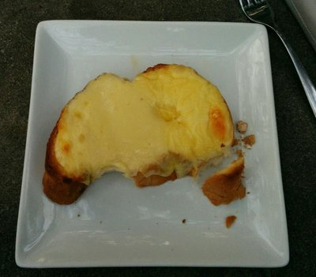
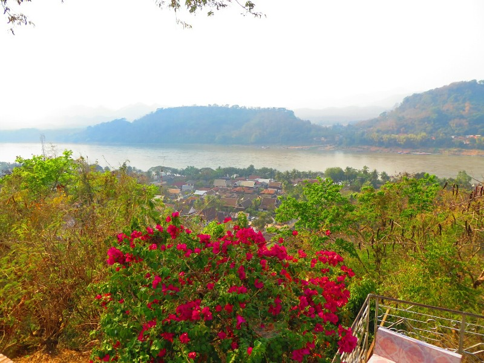
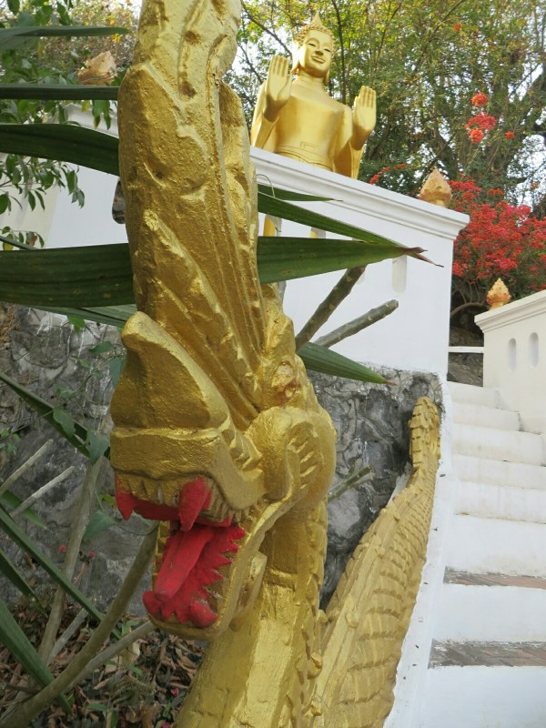
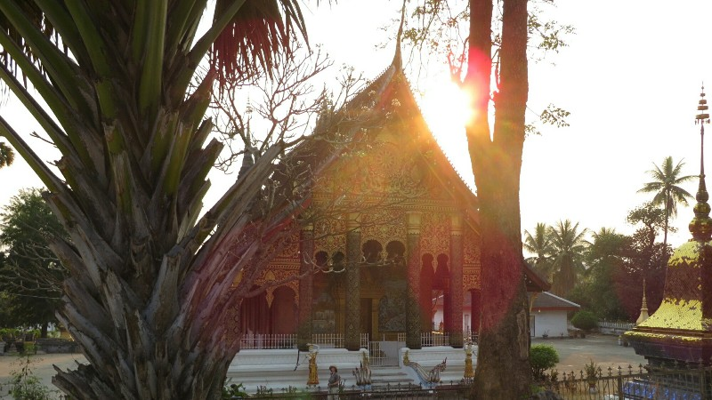

Another travel day. After we rebandaged Kate's toe we went to book a bus ticket from Nong Khiaw to Luang Prabang. The travel agent called the bus station and said the local bus we were planning to take was just going to be a pick up truck today. No roof or sides. Hmm. We asked if there was anything else, she said a van at 11am for 55,000 kip each. Opted for that.

Pat went to a cafe to pick up a couple baguettes and some fruit for the drive. When he arrived, a hippie had got a hold of an acoustic guitar in the attached travel agency and was singing a song about reefer, attempting to woo two fellow female travelers. Of course he was also wearing pyjamas. Why not.

This bus ride was significantly more comfortable than the last one. The driver drove fast, but managed to not drive like a maniac. Hot, hot ride with very little leg room, but manageable. At some point we saw a man riding an elephant up the road when we got close to town.

*Limping Through The Night Markets*

After we checked into our hotel we went to the night markets. They had lots of tapestries, jewelry, shirts, aluminum spoons made from bomb casings, and all sorts of other nick nacks. Standard Asian street market I suppose. No electronics though, so that's different to Thailand. As always, we didn't buy anything, "just looking" might as well be our motto for this trip. Luang Prabang was tons more tourist oriented than when Kate was here last (there are few locals in old Town now, just travel agents/restaurants, and everything is in English), and there seems to be about a million elephant experiences now compared to the previous none. Possibly because how successful it is in Thailand? We're glad we didn't end up going in Chiang Mai.

*Overlooking the Mekong at Lunch*

After a wander through the night markets we got an awful crepe (super dense and overly sweet batter, undercooked, with some sort of "ham" and Kraft style plastic cheese) from a woman who kept insisting we sit down while she was cooking it. We politely declined. Might have to wait until Paris to get a good crepe, sigh. Both feeling a bit wrecked, we head back to the hotel for a snooze.

Our first full day in Luang Prabang was a bit slow as limpy Kate was struggling with walking for long. We had lunch at a restaurant nearby overlooking the Mekong. Had some yummy laab, tom yum soup and fried river weed (the same stuff we helped sort in Luang Namtha).

One thing we really wanted to do while we're here is a hike through a few small villages up to the local waterfalls (we can't get enough!), but we're not really sure that's a possibility anymore now Kate has broken herself. We decide to try a test run going up to a temple on the hill in Old Town. There are only a couple of hundred steps up to the top. A few dozen steps up we determine that Kate's toe won't be up for a full on trek. It's doable, but painful and she's not sure enough to risk damaging it further. She is very disappointed.

*Pat Lording Over Luang Prabang*

We make it up to the top of Mount Phousi taking it one stair at a time. From the top there are very nice views of the town and rivers. After a few photos we walk down the back side past a Buddha park with several statues. We pass a bunch of Chinese tourists who walked out of a sports clothing catalogue, dressed in fancy high tech running gear. Despite all the exercise technology dripping off them they are sitting down every 20 steps for a breather. We snarkily comment to one another, then immediately feel like jerks. At least they're doing something to improve their fitness!

*Buddhas Hanging on the Hill*

We wander along the Mekong looking at all the nice restaurants. Some look like they're about to fall off the cliff and we opt not to eat there. The restaurants get less and less tourist oriented as we go, eventually the English menus stop. We loop back towards town and wandered through another Wat full of cats. We are noticing Luang Prabang seems to be more of a cat town than a dog town in contrast to most places we've been. We wonder why. Maybe the monks here like cats better and feed them preferentially?

*Monks Cleaning the Temple Grounds*

Eventually we settle on a place for dinner that advertises how they have the best bacon in Laos, how could Pat resist??

*Our Cheesy Garlic Bread Arrived Looking Very Australian*

*Pat Added In The Finishing Touches- Freeing Tasmania And Taking A Great Australian Bite.*

They have breakdancing locals on a stage in the backyard. Most are average, one is really good. Makes you appreciate how hard it actually is. Dinner came and it was actually really good for Western food in Asia. After our bacon cheese burgers and fries we decide we have a sweet tooth and leave on search of pastries.

We find a baked goods stand and decide to give it a go. Horrible idea. Pat's cinnamon chocolate pastry is salty and nutty. Kate's choc chip brownie is stale and off. We will have to wait till Paris for crepes and pastries I think. Save up the calories for Paris.

*Looking down at the Mekong*

*Buddha Park*

*Wat Pha Mahathat*
