We were up early this morning to watch the procession of monks down the other end of Old Town at 6am.  Initially we couldn't get out of the hotel as the gate was conviently padlocked. Had to wake a guy sleeping under the reception desk for him to point us to side gate we could unlock from the inside. Odd system.

There were bundles of tourists out already with more and more arriving by the car and minibus load. As we wait a convoy of dirty cars arrived with hazard lights on carrying one Chinese tourist per car. Very discreet and non disruptive. There are also lots of locals with baskets of food trying to sell you items to give to the monk as alms. We had been warned about this so declined.

It's requested for tourists to stand respectfully on the other side of the road, silently, not touch or get close enough to touch the monks and only take photos without flash. Tourists seem to think by buying rice, bananas and cake to donate to the monks they are doing the monks a favour. From our limited understanding, the ceremony is about allowing the local people to 'make merit' by making an offering of rice they have spent the time preparing themselves. It's related to building a spiritual connection. I can say for sure there is information everywhere asking people not to take part in the ceremony unless they are Buddhist or have some spiritual reason to do so. I don't think these reasons include taking selfies while giving a cake to the monks to post on Facebook '#nofilter #goodkarma #threewishes #lolz!'

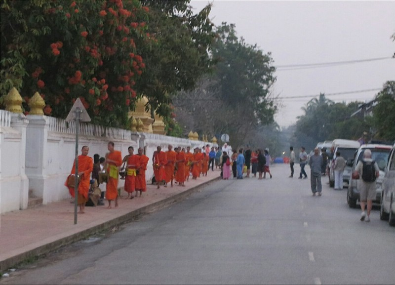

*Monks, Minivans and a Selection from the Hoards of Tourists*

While it's reasonably offensive for tourists to get involved in rituals they don't understand, you can almost forgive them due to the sheer number of  locals perpetuating it and trying to make money selling rice and fruit to them.

There were cushions set up along the street with white and Chinese tourists paying to sit there and buying alms to give to the monks. We heard one local explaining to a group of British tourists: "You pay 3000 kip for rice or 10000 kip for a banana, and you get to make a lucky wish before donating if you hold the donation above your head three times". I never knew monks became genies after retirement, but I suppose that's why we are traveling - to learn more about other cultures.

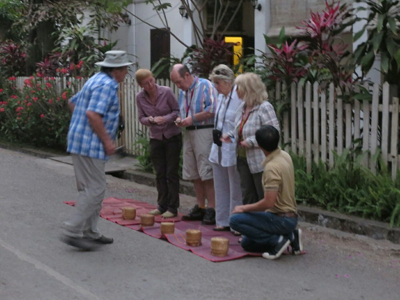

*British Tourists Plan Their Wishes*

When the monks came by many donated while standing (a big no no, and why do you pay for a cushion if you're going to stand anyway?), and a few even chased the monks down the street after they missed putting alms in one or two bowls because they were taking photos. The monks were swarmed and circled by tourists with their huge DSLR cameras right in their faces, and people set up tripods in their path causing disruption to the whole proceeding. The monks looked terribly uncomfortable, especially at the entrance to the temple where most tourists were congregated to get shots with the best background.

We felt guilty and culpable just for being there to watch this centuries old tradition turned into a charade for tourists and opportunistic locals.

We did see several monks tossing out rice and bananas from their bowls into baskets set up along the route near the very few local people. Initially, Pat thought this was them rejecting the offerings from the tourists who were standing or chasing them and laughed quielty to himself, but we later decided it was more than likely the monks giving an offering back to the people as a donation. The monks don't rely on the food they get from this procession - they get plenty of other donations at the temple, so it makes sense for them to give something back if they have too much. Maybe?

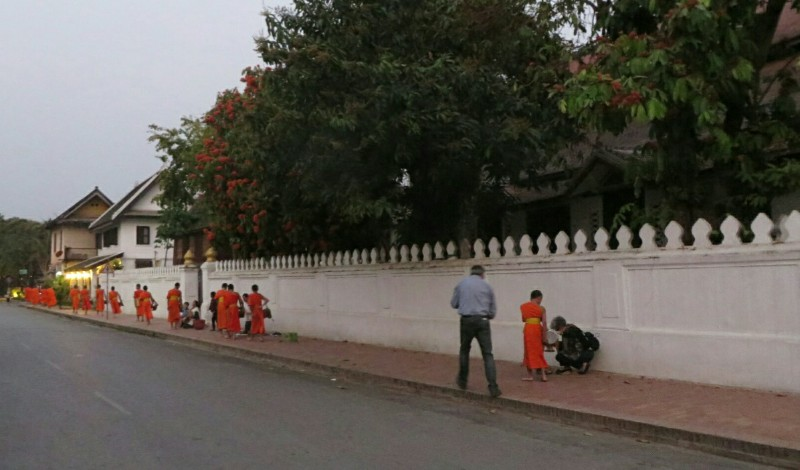

*Chasing Down a Monk*

After a short time we left the main drag to see if it would be any more genuine on a side road. Slightly fewer tourists and a few more locals, but still a bit contrived. We sat and watched the locals donate rice for a few minutes and caught an amusing exchange between an older woman and a very young monk. She spotted him from about 10m away and when he got closer they exchanged a few words and both laughed and smiled. Perhaps her grandson?

We later heard the lack of locals isn't a coincidence, many of the locals have stopped going in protest of the tourists making a mockery of their tradition. We also heard the monks considered stopping the procession for the same reasons, but the local government wasn't having any of it. They said if the monks stopped, the government would hire people to dress as monks and carry on the tradition for the tourists' benefit. The monks eventually capitulated. That, or what we saw this morning were a bunch of actors in orange robes.

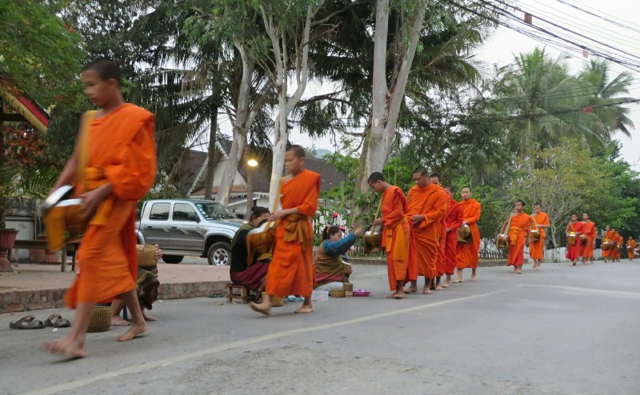

*Procession*

We also saw a mass of local dogs who clearly knew what was up. They were following the end of the procession waiting for either the monks to give them their extra rice or for the people to doll out whatever they didn't give to the monks. Must happen every morning. Kate tried to get a good photo, because dogs, but the lighting wasn't the best. Probably the last opportunity we'll have to photograph animals in South East Asia.

Once the last of the monks had passed, we walked back along the river to the guest house and tried to squeeze in another hour's sleep before heading out for the day.

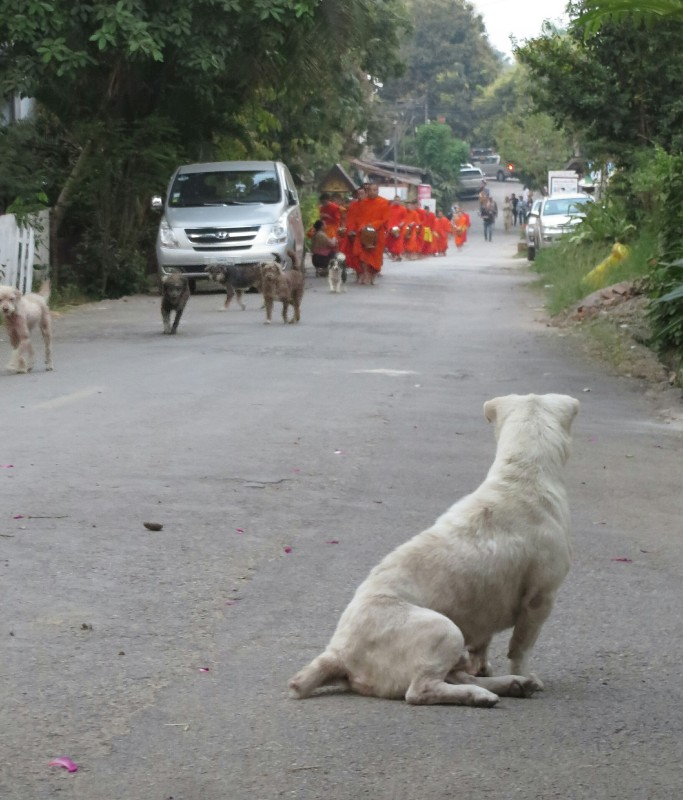

*The Dogs Know What's Up (Tourists Stalking Monks In The Background)*

After brekky we headed out to go to the waterfalls and pondered aloud how we would organise a tuk tuk to the base? As we were discussing this we hear a voice 'tuk tuk? Waterfalls?' Yes! We had agreed to barter the driver down to 200,000 or 250,000 absolute max. This man's starting point was 170,000. Score!

The drive to the waterfalls was quite nice despite being in the back of a tuk tuk. The open back let the nice cool breeze through, and we found the one sensible driver in South East Asia. He paid the toll to drive on the road to the waterfalls (which apparently most drivers just speed past, not bothering), he pulled over and let faster vans overtake, and he drove slowly and cautiously around schools children riding their bikes on the road. All very uncharacteristic of drivers here. Maybe he was drunk?

We arrive at the waterfalls and scope out the bear sanctuary first. It was started nearly a couple decades ago by a woman from Perth to rescue and rehabilitate bears that had been held in captivity to extract bile from them to use in Chinese medicine. Horrific. When Kate was here in 2008 she reckons they had just a few bears. Now they have dozens in several separate enclosures. We got there just before feeding time and watched all the keepers hide food all over the enclosures. When the bears were let back out, they very cleverly found all the good bits of food, making sure to ignore all the lettuce that was put there to distract them.

They are very human like, actually. Quite competent on their hind legs and very dexterous with their paws. Very entertaining to watch them deal with a banana.

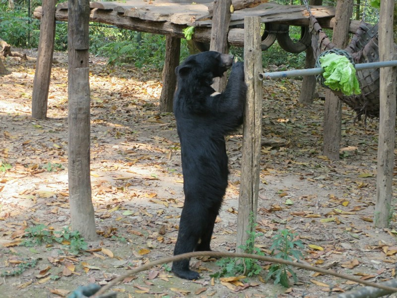

*As If This Isn't A Man In A Bear Suit*

After a quick lunch break we explored the waterfalls. They are absolutely stunning. Much prettier than Kate remembers, and she remembers them being pretty speccy. The water is super clear and blue and all of the small cascades look planned. It honestly looks like it was designed by Walt Disney for a theme park, it's hard to believe this kind of thing could develop naturally. The main changes Kate can see is the rope to swing over the pool and jump in has been removed, there are a few more tourists, and there's a scenic restaurant she didn't think existed.

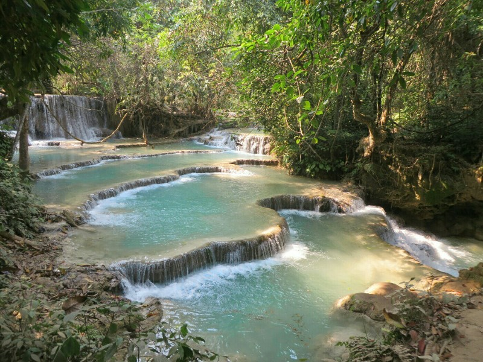

*Walt Disney Presents- Waterfalls*

We walked to the bottom of the biggest fall and lamented not being able to do the trek. As we were discussing this we ran into Ellen, Kate's physiotherapist saviour from Nong Khiaw! She and her friend had been on the trek today and said it was very nice and pretty easy but there were a lot of steep downhill bits, so we probably made the right decision to skip it.

We had a beer at the restaurant overlooking the falls then headed down to meet the tuk tuk driver. He had found another fare back to town in addition to us so he was pretty happy.

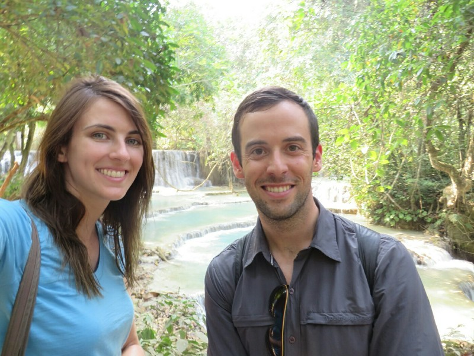

*At The Falls*

We wanted to go to the museum for unexploded ordinance that highlights the US' bombing campaigns in Laos during the Vietnam war but there was a breakdown in communication with the driver and he took us to the town center by mistake. Oh well, it was getting late anyways and we probably wouldn't have been able to stay long, if it was even open.

We pottered around town a bit, booked the bus from Luang Prabang to Vang Vieng (135,000 kip, apparently a nice VIP bus with a seat for everyone, but you never really know) then went to dinner at one of the restaurants overlooking the Mekong and called it a day.

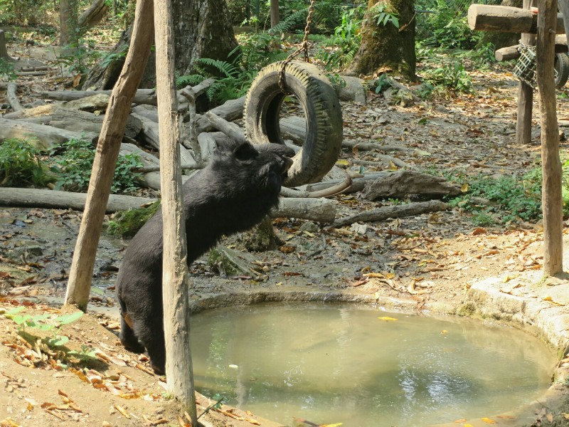

*The Water is Lava*

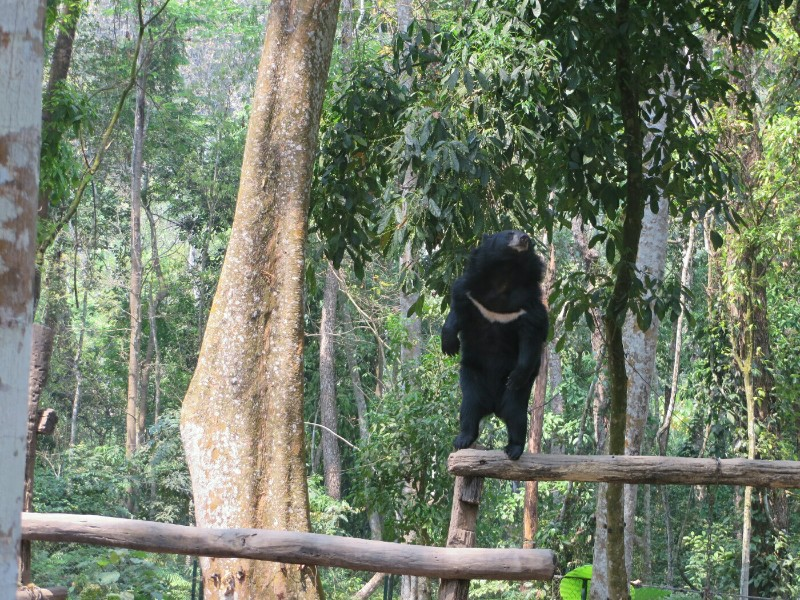

*Balancing Bear*

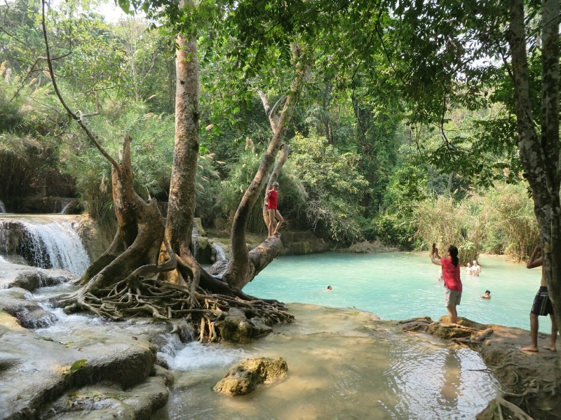

*Pre Jump Photo (He Almost Didn't Jump)*

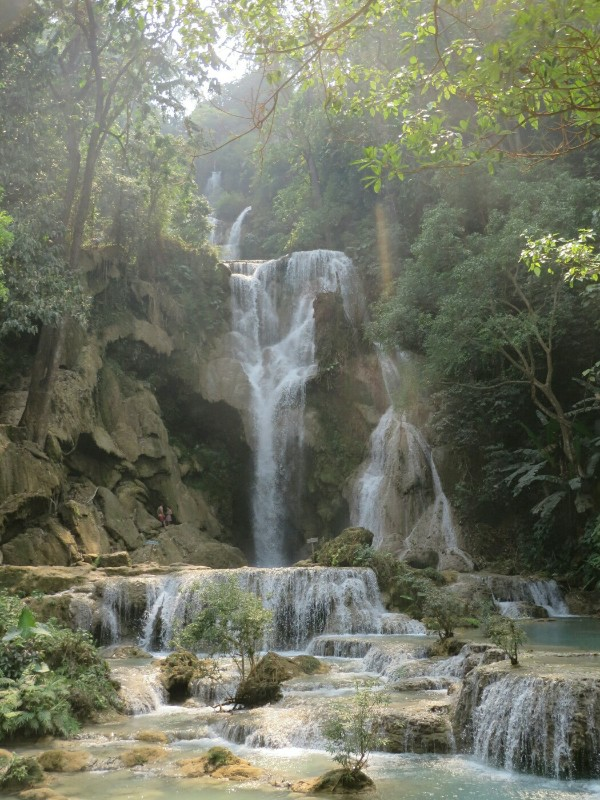

*People to the Left for Scale*
