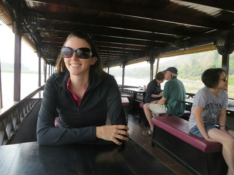
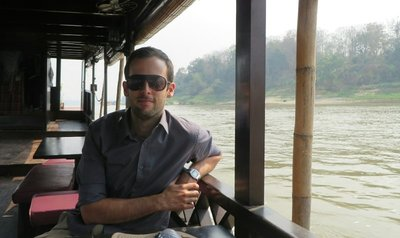
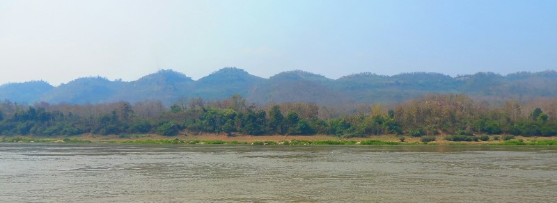
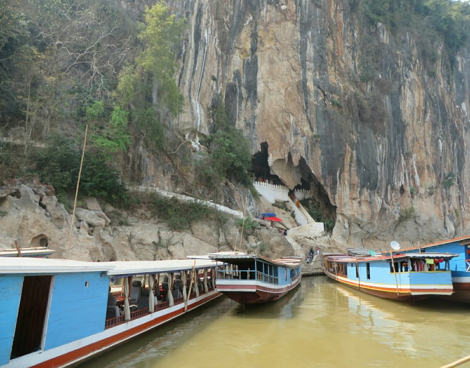
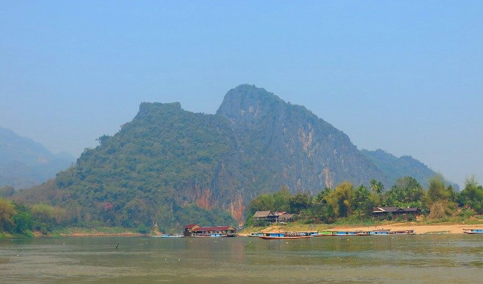
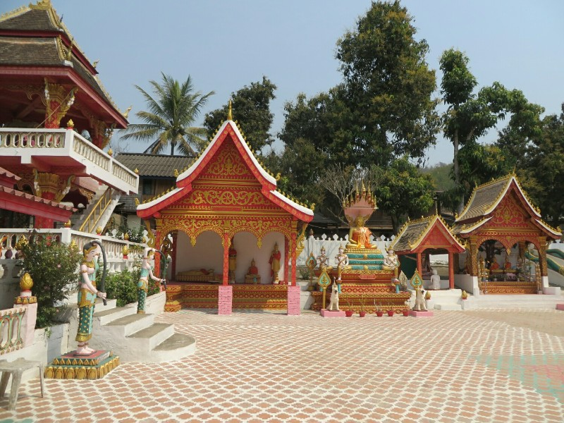
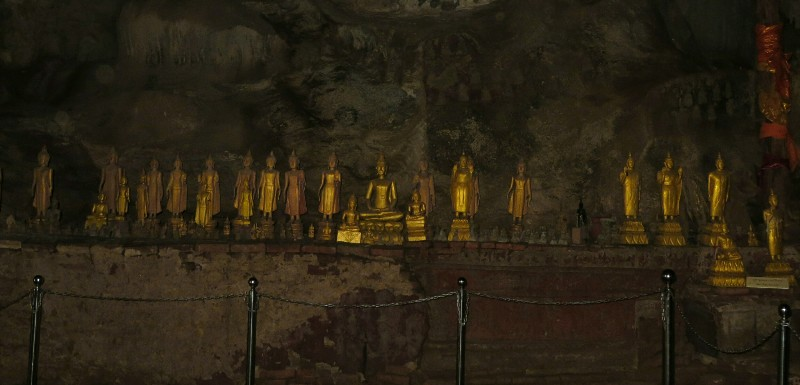
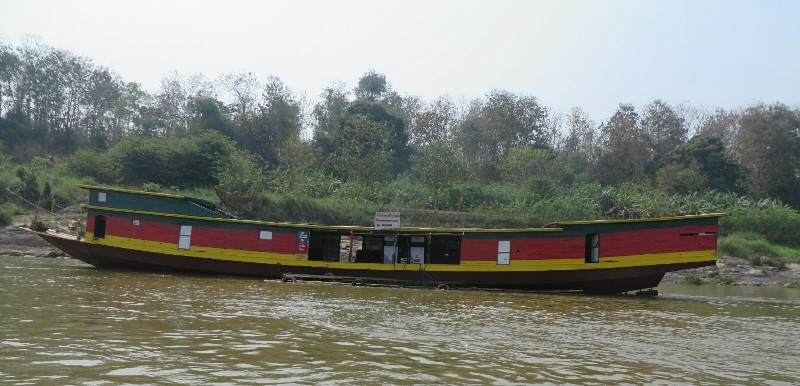
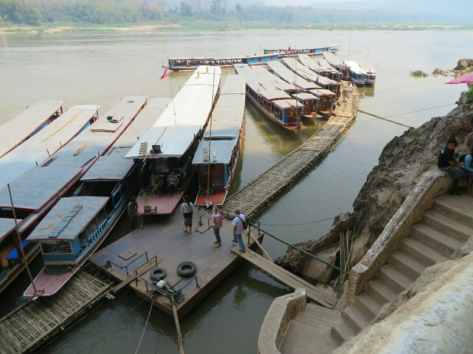

We got up not so early this morning and ran 10 mins late getting to the meeting point for the Mekong lunch cruise. As it turned out we spent about 20 mins driving around town to pick up other tourists, then got dropped off a 5 min walk from where we started.

We got onto the boat and met the boat manager, a Frenchman named Florian. He's here on an overseas working trip as a requirement for his degree. He said most his friends are in corporate jobs in Europe, he's loving being in sunny Laos on a cruise ship. Can't blame him. We spent the next hour and a half cruising down the Mekong. It was quite relaxing, but unfortunately Pat started to feel nauseous. Not sure whether it's from the fruit smoothie he recklessly had last night or seasickness.

*Kate Enjoying The Boat Ride, Pat Not So Much*

The first stop was a 'whiskey village', basically a village that makes Lao whiskey (Lao Lao). They also weave scarves but Florian warned us more than half (all the ones with pretty patterns, not just stripes) are made in China. You could certainly see the effect tourism has had on the village. No thatch huts here, all wooden or cement buildings which actually look comfortable to live in, and even a coffee shop.

After a wander around we got back on the boat and headed a half hour downsteam to the Pak Ou Caves, two caves in a limestone cliff on the Mekong full of old Buddha statutes. On the way we made friends with an older American couple on the boat. They both work in film and met making a film in Vietnam during the war (Hearts and Minds). They were nice, very chatty.

*Laos Got Lazy in Design Phase and Just Copy/Pasted These Mountains*

The Pak Ou Caves have changed a whole lot since Kate last came. Gone is the balancing act on the wobbly gang plank of tied together logs to get to shore, no longer do you have to climb through every other boat there to get to said gang plank, there's now a fairly sturdy pier all the boats can pull up to which leads to safe concrete steps up the mountain. The caves themselves were much the same- caves with statues of Buddha. Just a lot more Chinese tourists.

*Lower Pak Ou Cave*

Pat was feeling sicker and sicker, so maybe not boat related. After the caves we got back on the boat for quite a nice lunch. Chicken and coconut soup, a few canapes, pork and mushroom 'curry' (tasted more like stroganoff, but was nice), vegetables in oyster sauce and fresh fruit. Poor Pat didn't get to enjoy it much, so Kate generously helped him with his share.

We bought a couple of Sprites to have with lunch and we were a little amused with the terrible maths on the bill- 10% service charge plus 10% tax somehow add to make 21%. 121% of $4 is somehow $5, then $5 times 8,000 to convert to Lao kip is somehow 41,000. As all the bad maths still only lost us 40 cents we let it slide. We really are generous souls.

*Mekong Views from the Boat*

The rest of the afternoon was a write off, poor Pat was not doing well. He tried to come out to keep me company at dinner but had to go home as soon as food arrived as the smell wasn't doing it for him.

I sat alone and had a ponder about the changes to Laos. Last visit I absolutely adored it, it was so quiet, charming and the people were so genuine. You may have to wait a long time for your food, then get something other than what you ordered (or nothing), the roads and public transport may be terrible, there may be no safety measures anywhere, but that almost added to the charm. If you got fed, that was great whatever it may be. You were expected to share if someone in your party failed to get a meal. The bus was awful but it got everyone on board from A to B, whether you were an Aussie backpacker or a Lao shop owner. You were treated like the locals- you got the same service and paid at least a similar price.

Tourism has definitely well and truly arrived. All menus in English; the wait staff super attentive and quick; barriers, regulations, life vests in boats... No more Lao time, no more Lao PDR (Please Don't Rush). And with the changes, the attitude that if you're white, whatever the mark up, you can afford it. It's not so much the money I'm mourning the loss of as the loss of feeling part of the community? The loss of authenticity?

You can't fault them for wanting to improve their standard of living though, for wanting a house with walls made of something more mosquito proof than thatch, and obviously tourism is the most realistic industry to make money. And they're trying to give the tourists what they want- more, cleaner, easier, faster. It's not as though the people aren't still friendly, they still smile and say Sabaidee, there have been no beggars and you still feel safe on the street alone at night. I would be surprised even by petty theft. AND I'm here for the second time as a tourist so it's a bit rich to lament the effects of tourism!

Maybe I just have memories through rose coloured glasses and nothing could be as nice as my warped recollections. I am still enjoying Laos, but I'm not feeling the same... Tranquility?

Anyway. I turned off my contemplative inner monologue and headed back to check Pat hadn't died. Tune in tomorrow to find out if he had!

*Temple At The Whiskey Village*

*More Buddhas! This Time In A Cave.*

*Floating Patrol Station*

*Disappointingly Safe Pier*
