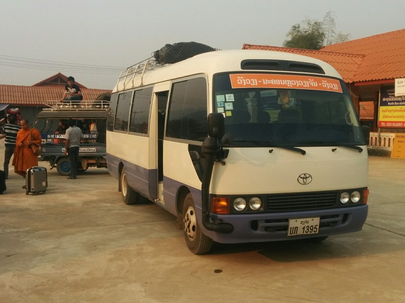
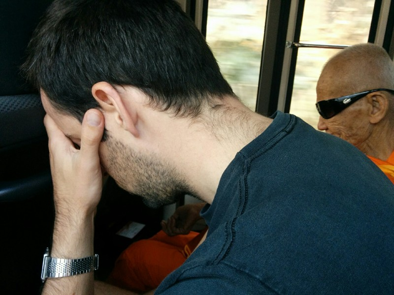
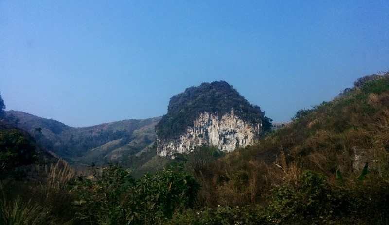
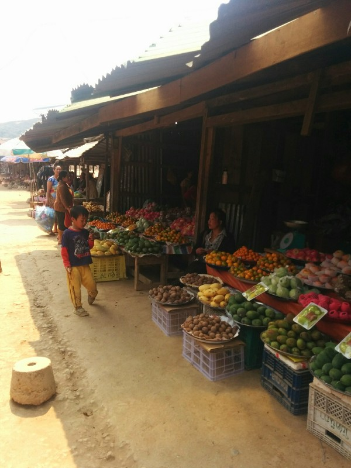
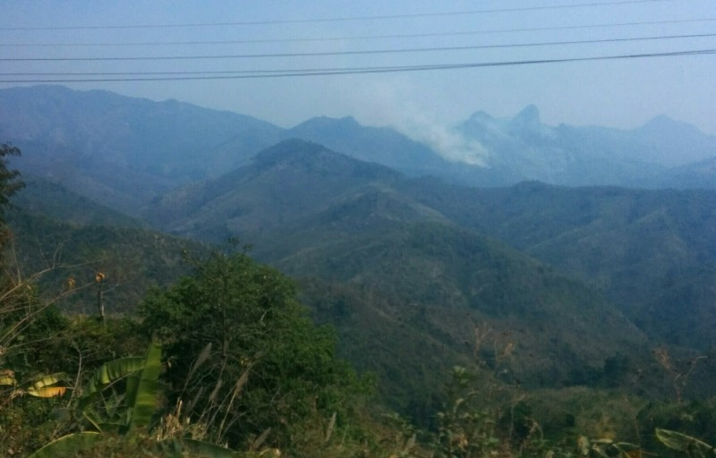
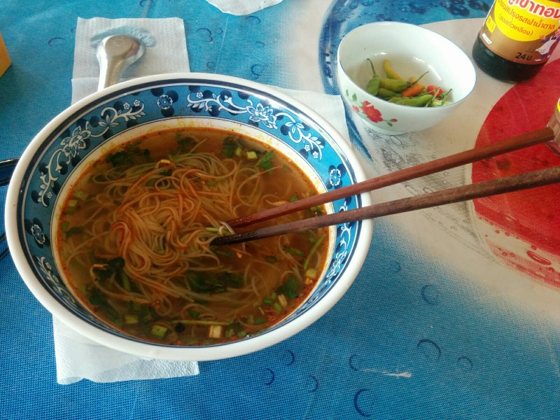
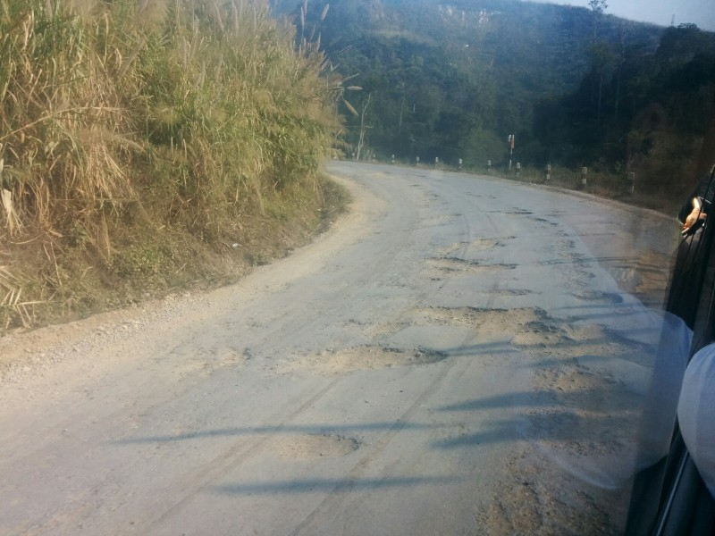

Pat was alive this morning but still not crash hot and it's transit day from Luang Prabang to Vang Vieng. Unfortunately this is an 8 hour drive along badly maintained, winding roads. Luckily we booked the VIP bus! We checked what that entailed when we booked and confirmed we would get reclining seats, air conditioning, no one extra squeezed in the aisle, water, a snack, a voucher for lunch and an onboard toilet. While we were expecting seats with a broken recline, air conditioning dripping condensation on us all trip, an out of order toilet and a snack we couldn't eat without getting food poisoning, we were comfortable in the knowledge we'd be in an actual, full sized bus.

*We got our tuk tuk to the bus station and met our 'VIP' bus.*

I don't know why I ever trust anyone's word in South East Asia. The bouncy minivan was about the worst possible thing for Pat's nausea, and he was even lucky enough to have a local monk squeezed in next to him sitting in the aisle. This will be a long 8 hours. At least we left punctually at 9.30. I think if we do this again we will buy our tickets direct from the bus station. It's cheaper and at least you can see what you'll get.

*Pat Felt The "Brace Position" Most Comfortable*

While Pat didn't move for 3.5 hours Kate enjoyed the scenery. The driver was in no rush so despite the shot suspension and squealing brakes we weren't thrown around too much. The mountains are pretty spectacular although that same foggy something they had in Nong Khiaw detracted from the view a little. Pollution? Actual fog? Smoke from the fires we can smell all day and night but rarely see?

*Kind of Scenic (Shame it Loses Scale on a Photo- Mountains Were Big!)*

We stopped at 1.00 pm for a toilet break (as there wasn't one on board). Got to pay to use the bathroom, then pay to buy some water and a snack because they ended up not providing those either. The driver also encouraged all to buy lunch at some local markets, however we still have lunch vouchers so we just get some peanuts and hold out hope!

*Fruit at the markets- unfortunately they only sell in bulk*

Another 90 mins of hilly driving. We start to pass a lot of burnt areas, then smokey areas are visible in the distance, then closer, then we're driving around corners with fires so close to the door the whole bus heats up as we pass. Guess that answers the smog question.

*Fire in the Distance*

At 3pm we stop again. Everyone in this town is living in huge, brick rendered houses. A step up from thatch. We stop at a restaurant! And we are told we can trade our vouchers for noodle soup. Yay! It's just broth with noodles and spring onions, but that suits Pat's unhappy belly, and Kate just tops it up with chilli. Delicious. Pat also buys a 50 gram packet of chips that say 20 baht on the front (60 cents for those playing at home). He is charged $1.50. It does get tedious being charged the same prices (or more) than we would be in Australia when we know they don't have the same taxes, wages, overheads or cost of living. Everything seems to cost more here than Thailand despite being less developed with far fewer conveniences. It feels dishonest and like we're being taken advantage of. That said, we still buy the chips.

*Delicious Noodle Soup*

On the road again.

Finally off the bus in Vang Vieng. Pat reckons the ride was horrible, which may be due to being sick the whole ride. That said, the seats were way to small for both of us and I don't think it would have been markedly better if I wasn't sick. Also the people in front of me were watching the final of Breaking Bad so I had to keep blocking my ears.

We caught a tuk tuk to our accommodation on the other end of town and were greeted by a very ocker Aussie man. Just about the last thing either of us expected. He showed us our choice of rooms and after we picked one, we unpacked and settled in for a while before heading off to dinner.

*This Was Still Like Floating Compared to Luang Namtha to Nong Khiaw*

The next bit might sound like a rehash of Kate's internal monologue from yesterday, but Pat wrote this having not read or discussed it with her much. We've been taking turns writing notes and we just happened to reach similar conclusions independently. Something about us being made for each other? Maybe we should get married. Then again that's probably a horrible idea.

At lunch while I was feeling sick and quietly enjoying my noodle soup I started to formalize some of my thoughts on Laos. Most likely heavily influenced by my current physical state and the awful bus ride. I suppose the best way I can put it is that I'm not wholly convinced by it yet. Compared to a country like Vanuatu, to me it doesn't have the same untouched charm that you would expect of a place so undeveloped. Some towns (Luang Prabang in particular) feel more like a tourist trap designed to take your money and spit you out the other end. In exchange for the horrible roads, unreliable public transport, and questionable food, you do get seemingly endless, beautiful scenery and locals who have all been genuinely friendly, but you still feel like you're being taken advantage of.

Prices everywhere are variable and you're always being overcharged because you're a tourist. And our experience with the bus today is just one of a number of examples: charged more than face value for a ticket to a bus that included nothing that was promised to us and no way for us to get any sort of compensation or avenue to make a complaint. While I don't mind this so much in theory and could forgive it happening once or twice especially since tourism is such a major part of their economy, it does get old after a while. Especially when there is such a big discrepancy between what you pay and what you end up getting.

As Kate pointed out earlier, everything here has been more expensive than Thailand and Myanmar despite it being a less developed country, which is an interesting thought and seems to supports the idea that all they're after is your money, not repeat visitors. You can certainly understand why it's like this, though. In a country that has only recently opened to tourism, it must seem like a golden opportunity for the Lao people to improve their standard of living, at least slightly. While it's a bit unfair that it's limited to the people in the tourism and hospitality industry, hopefully the benefits make their way to the rest of the population over time.
