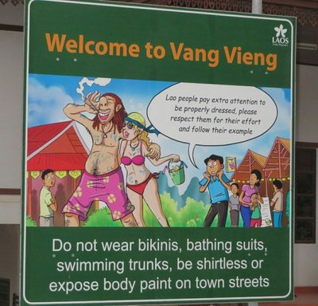
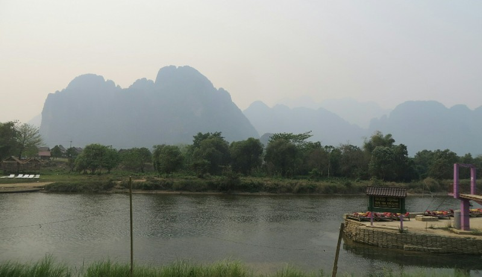
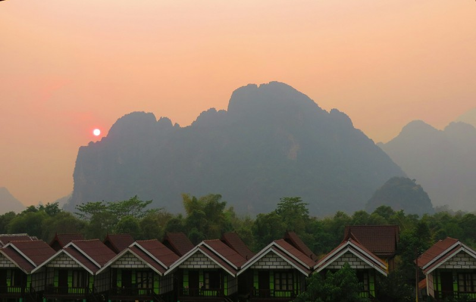
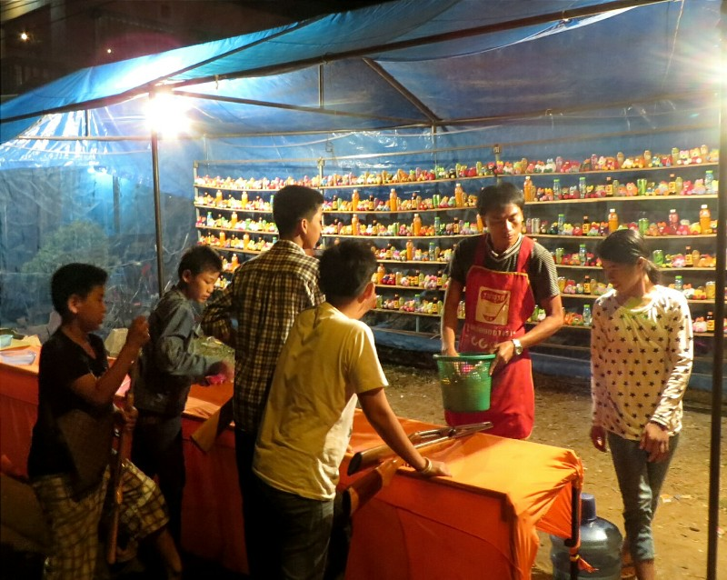

*These Guys Totally Stole Our Outfits! Awkward.*

Pat woke up feeling human, a significant improvement to the last couple days. We popped out to the dining area and had breakfast at the guest house. Pat, growing weary of plain eggs, had muesli and fruit. Kate had eggs, but spent the entire brekky coveting my muesli, even going so far as to steal a spoonful when she thought I wasn't looking. Sneaky Katie.

After some housekeeping and hotel booking we wandered down the road and found a place near the river boasting views of the mountains towering over the river below. Quite spectacular. Except for the smoke obscuring the view. Pat, not willing to risk his suspiciously calm stomach, played it safe with spaghetti, Kate thought she'd play it truly safe and order a local stirfry. Awful awful awful lunch for Kate. Is the person in the kitchen white? Not pork. Chopped, luke warm, but raw bacon chunks. Sickeningly salty and fatty. She still ate it. Why?? She feels quite ill. Pat's spaghetti was actually passable. Stomach still okay.

*Overlooking the River, Terrible Visibility with the Smoke*

Vang Vieng is completely unrecognizable from Kate's last visit. It's gone from a sleepy backpacker town where you have a look at the caves or a float down the river then sit in a cafe watching Friends (with the occasional goat wandering in) to a party haven. Bars everywhere, loud blasting music, Thai (?) Woo girls cheering at seemingly everything... The average age looks to be 17? We feel old!

*Although the Pollution Did Make For a Pretty Beautiful Sunset*

We had a few beers in a few river side bars (or Kate did, Pat didn't trust his stomach) then when the karaoke got to be too much we wandered to a slightly quieter street where there was a carnival going on for the locals (games all still rigged, some things never change) and managed to find a cafe similar to Kate's memories playing South Park. After that DVD ended Pat had them put on Friends. Aw.

*The Games Are Rigged In Laos Too*

We had a very strange waiter. He clearly understood some English, but answered all of our statements with "what?". The first couple times we just repeated ourselves, only for him to respond "what?", and smile and laugh at us. Eventually we caught on to his little ruse and started answering him back with "what?". Over the course of a few drinks and nibbles, it degenerated into exchanges that were as follows:

What?  
-What?  
What?  
-What?  
What?  
-Ahhhhhhh!

Strange. Called it a night and went home.
