Today is tubing day! A few years ago this was what Vang Vieng was known for- you hire a tube and spend a few hours leisurely floating down the river. As more and more young backpackers started coming, bars began to pop up on the side of the river serving beer and Lao Lao. It grew from there to include rope swings into the river and zip lines from one side to the other. Sounds like heaps of fun!

Unfortunately, some people took things too far. Kids started getting way too drunk, which doesn't mix well with anything having to do with water, even if it is only knee deep (or less) for most of way. After they started to average one death a month from various causes, the government stepped in and shut everything down. The bars were all closed and for a period you couldn't even rent a tube anymore. Over the last year things have started to ease up and you can go tubing again. They have allowed 3 bars to reopen (significantly fewer than there once was), but the rope swings and zip lines have all remained closed. Sensible compromise we thought.

In preparation for our day, we first went for a little walk across the river to see a set of limestone caves nearby. After seeing the caves in Oudtshoorn, South Africa, we both agree that we are officially limestone cave snobs. It takes a lot to impress us these days.

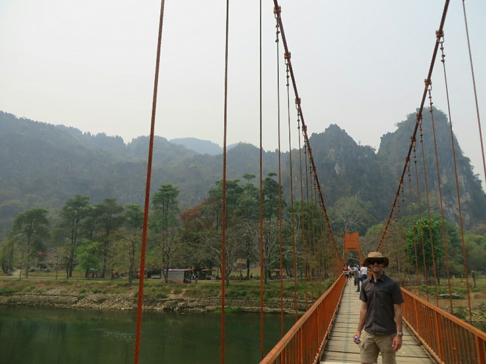

*Bridge Over To The Cave Entrance*

When we walked inside the cave the first thing we noticed is the air quality inside the cave is just as bad as the air outside. Lots of bits of dust and pollution that you can actually see in front of you. Makes you very conscious of your breathing. The caves were nice, but you couldn't help but feel that there have been significant changes made by the people visiting. Lots of formations on the ground instead of standing or hanging like they should be, concrete viewing platforms and stairs everywhere. And Buddhas, always Buddhas. I guess 100% preservation isn't their aim, but it definitely detracts from the natural beauty of something that formed over hundreds of thousands of years. Kinda sad.

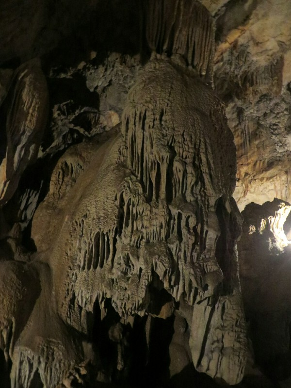

*Inside the Caves*

We went into town to rent our tubes and get the lazy part of the day underway. Paid our 55,000 kip rental and 60,000 kip deposit, hopped on a tuk tuk to drive us up river to the drop off point, jumped in the river and started our slow journey back to Vang Vieng. Within about 30 seconds we came across the first bar, comically close to where we started. They are really keen to get you out of the river here - throwing ropes at the passers by trying to fish them in to the bar. Decided to give that one a miss and keep floating for a while before stopping.

The next bar came up quickly once again, maybe 5 minutes after the first. Since there were only three bars total, we started to think maybe the 3 hour estimate to float down the river included three generous pit stops with how close the bars were to each other. We grabbed on to one of the ropes and let them pull us ashore.

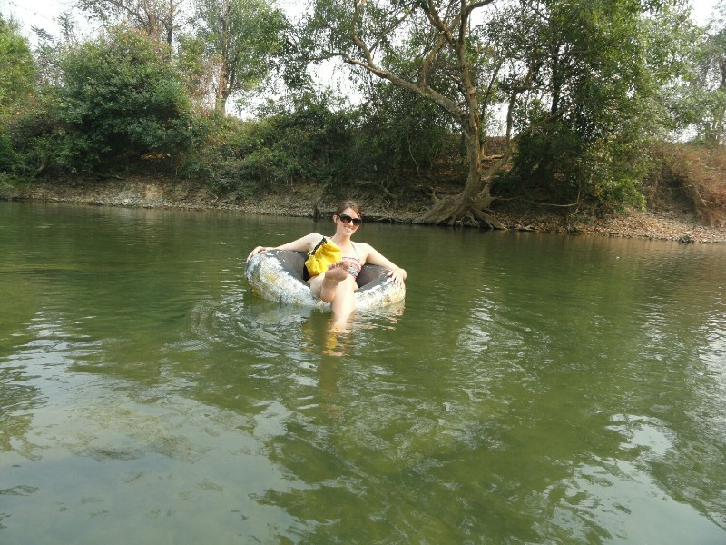

*Katie Hiding Her Toe*

The bar here would be every college student's wet dream: drinks, food, beer pong, basketball court with a water shower spraying over it, beach volleyball court, and of course, thumping music. What more would you want?? While we felt about 10 years above the average age at the bar, the music seemed to be targeted at our generation - the songs blasting through several huge speakers around the area were all songs Kate and I recognised from high school . We sat back with our beers and enjoyed the show, watching drunken guys flirt with drunken girls, uncoordinated people playing ball sports, and several brave souls at the bar having free shots of lao lao. Eventually, we hopped back on our tubes and floated on down the river.

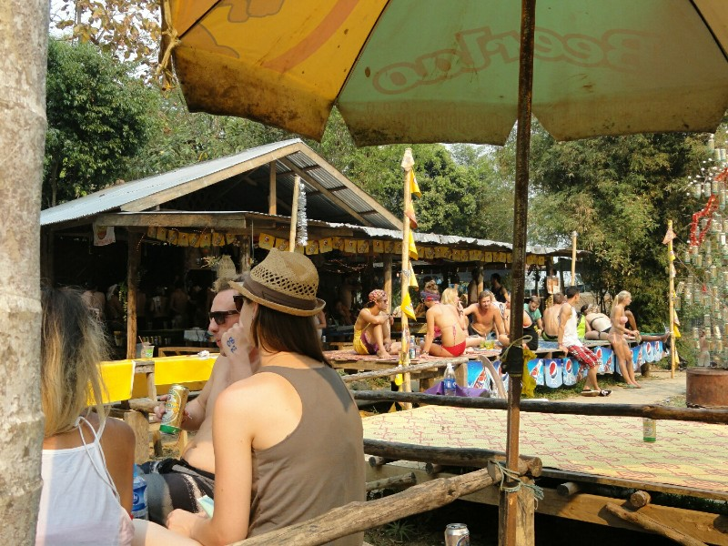

*American College Bar in Laos*

We met an Aussie girl and an Irish guy shortly after leaving and formed a little floating village. One fun thing about traveling is that everyone is keen to chat and make new friends, just waiting to tell their life story and the tales of their trip to anyone who will listen. The Irish guy was a recently unemployed 32 year old insurance broker. Maybe we aren't too old after all!

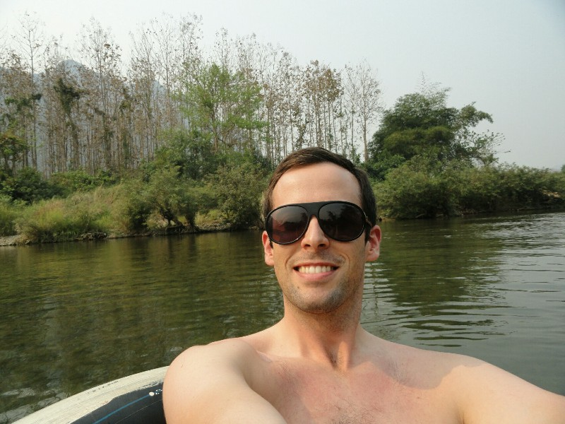

*Best Photo of Me I Could Manage*

The scenery along the river was just incredible. Towering limestone mountains ran the length of the river covered with jungle brush. It was a bit of a shame the air pollution completely blocked your view of the mountains even 200 meters downstream. We knew they were there, we drove past them on the way up, but absolutely no chance of making them out through the smog.

When we arrived at bar number 3 we were literally the only ones there. The guy saw us coming and ran to the basketball court to turn the water on hoping to lure us in. Being the good little Aussies we are, we thought we'd shout the first round. Apparently it's every man for himself once you get out of western civilisation - neither the Aussie girl or the Irish guy ever reciprocated. However unlike Australia, the beers here were dirt cheap so we didn't mind so much.

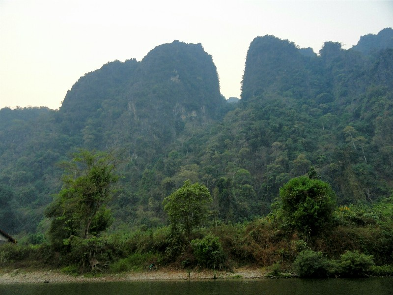

*Cliffs Floating By*

At some point a Spaniard named Paco wandered over to our table with a feather in his hair and a small pumpkin carved like a jack-o-lantern. Probably best not to ask questions. After a brief chat he wandered off. By the time we left the bar, it was completely packed. All the people from bar 2 have made their way to bar 3.

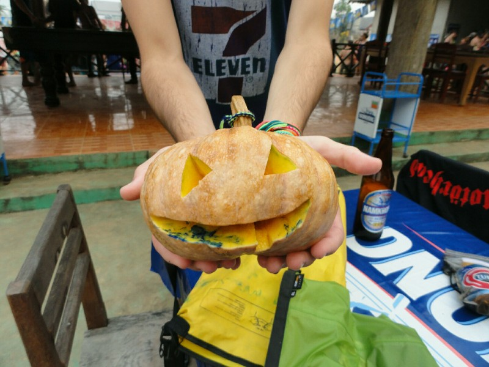

*Paco's Pumpkin*

On we floated. At some point along the way we randomly ran into Paco again! Sans pumpkin and feather. We added him to our little floating village. Little did we know that most people opt to get picked up from bar 3 by a tuk tuk and driven back to town. Why bother tubing if you're only going to float for 30 minutes? The answer is because its another 2 hours to float down to Vang Vieng and it was getting dark quickly.

We found a local Lao bar after a short while and after fishing us to shore they organised to have a boat take us back to Vang Vieng. Excellent! Or so we thought. Turns out he only took Pat, Kate and Paco saying his friend would bring the others. Then he didn't take us to Vang Vieng at all, he just dropped us closer to town, forcing us to take a tuk tuk the rest of the way for more money. Then poor Paco fell getting out of the boat and was bleeding from the leg!

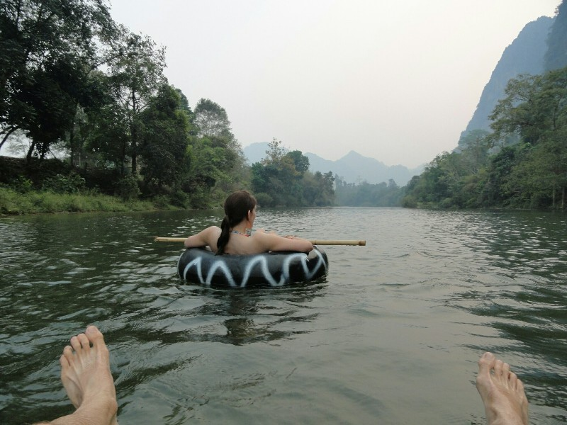

*Katie Floating By*

Kate walked him up from the bank to find somewhere to wash it and see how bad it was. Not too bad luckily, and there was a Chinese hotel nearby with a lot of worried Chinese tourists running out with a chair, iodine and Band-Aids.

Meanwhile Pat was waiting for our other two friends and arguing about where the boat driver dropped us. After much back and forth and him refusing to take us any further, we reluctantly paid him, although less than he wanted. He must have still gotten a good deal because he didn't protest at all. The other two never showed up. The boat man called his friend and said they'd gone on a motorcycle. With their tubes? From the wrong side of the river? We were dubious and waited an hour, but in the end we had to give up and leave because it was getting too dark.

We found a tuk tuk to take us into town, lost 20,000 kip of our the deposit for getting back so late and headed to a few bars to end the night. Pat played a couple rounds of beer pong with other backpackers, both of which he won (I've still got it), met a Texan named Donovan who actually seriously called Kate 'mam' (I thought that was just a cliche!), ate a questionable pizza, went looking for our Irish friend at the Irish bar and actually found him (!)(they did get a motorcycle back so there you go), talked a lot of garbage with Irish people, met up with the strange 'Whatwhat' waiter and bought him a drink, and eventually went home. All and all it was a very fun last day in Vang Vieng. Not sure if we'd be able to pull it off again as we are just on the cusp of being too old, but I reckon maybe!

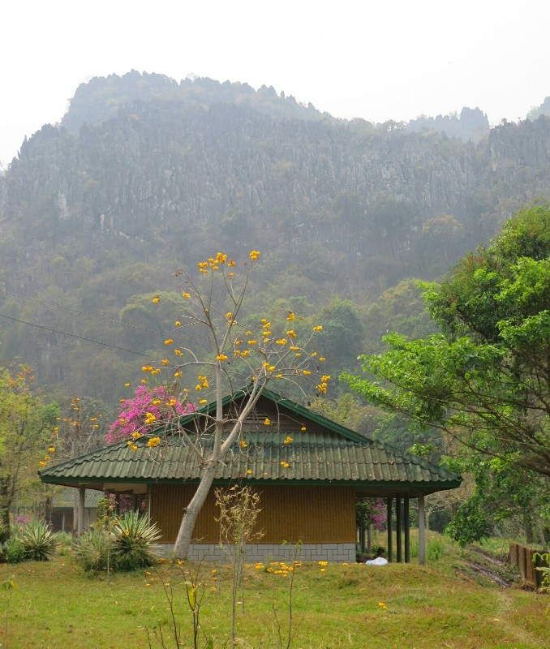

*Limestone Mountain the Cave Lives In*

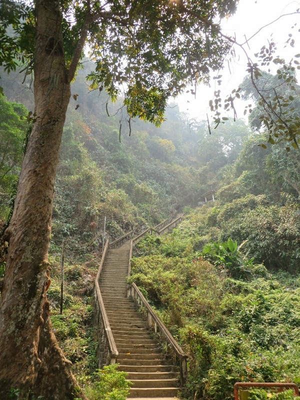

*Stairs. Always Stairs!*

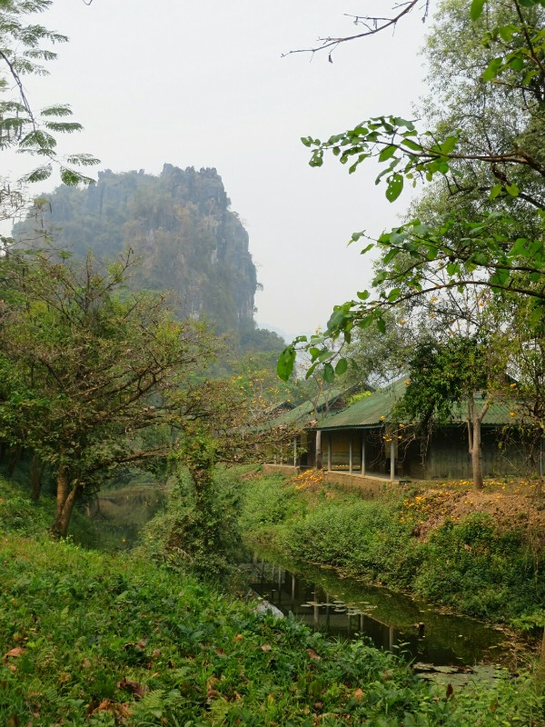

*More Mountains*
