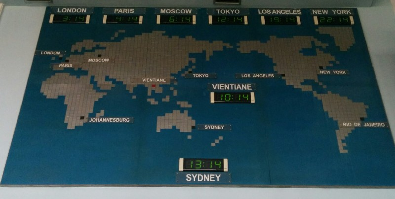
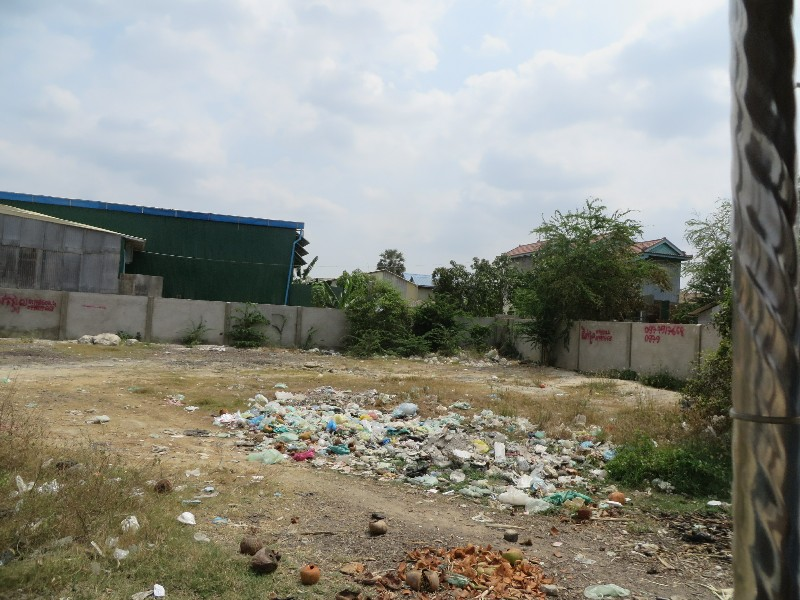
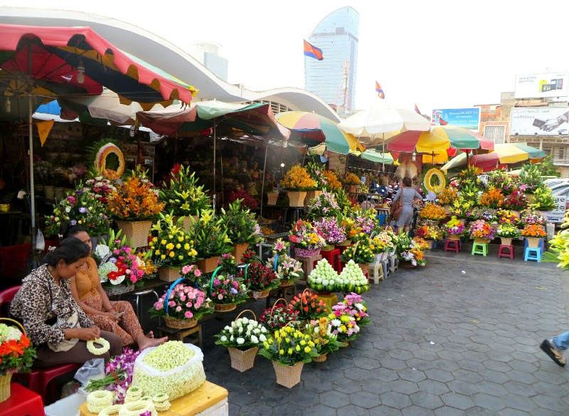
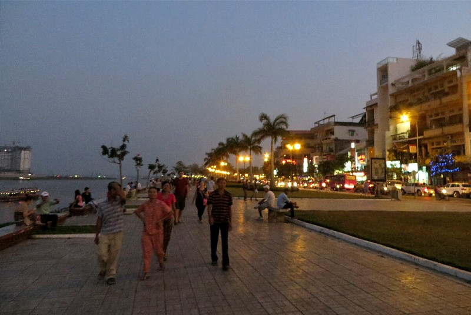
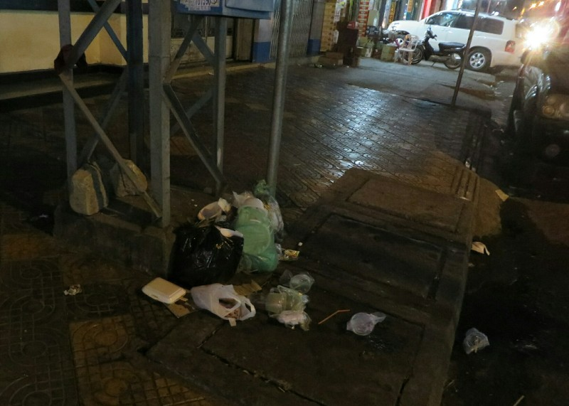

We woke up feeling a little worse for wear. Kate's toe nail finally gave up (probably because we used a bandaid not a bandage yesterday) and painfully half came off. Pat realised he'd lost his ID so after checking out and booking our 'VIP' bus for 50,000 kip we went to look for it. It was a million degrees and Kate did not see the point. As if we would find it. It's hot. I want to find air-conditioning and sit down. She complained the whole walk into town. Pat asked at our first stop, the Irish bar, if they had his ID. They did. Kate was still miserable.

After the morning adventure we arrived at the bus station - actual real life VIP bus waiting. 4 hours with leg room and air con. Lovely.

In Vientiane 14 people from our bus plus their luggage were crammed into a tuk tuk because tuk tuk drivers wouldn't leave with less than 5 people or something. At 20,000 kip per person, I think he did pretty well. We got to the hotel quite late because of dramas with two girls on our tuk tuk. They wanted to go to a specific hospital for a test of some sort, but the driver took them to one more on his way instead. They had a big argument and ended up getting off. Checking in the receptionist mentioned in casual conversation he still thinks women are inferior to men. Sexism is alive and well in South East Asia!

*Pat loved this map's design, Kate loved that it told the time accurately (the only clock in the airport to do so)*

Headed to bed to prepare for our next day of transit. When we woke up we went straight to the airport. Checked in, headed through immigration and through security. At security they pulled Kate aside and asked if she has a knife in her carry on! A knife! She does actually fly fairly frequently, she is aware you can't take weapons in carry on, this is ridiculous. Go ahead and look through the bag! Why on earth would she have a knife?? Oh... Wait... There is in fact a swiss army knife in the bag that we've been using to cut bandages and tape for Kate's toe. Luckily we're in Laos, not the US. The man was very nice and we were allowed to go backwards through immigration to check the bag rather than tossing the knife. Ended well.

The actual flight was uneventful. We were served a bizarre, inedible inflight meal of extremely processed 'meat', 'cheese' and 'veggies' (we think).

On arrival in Phnom Penh airport we notice airport staff wearing face masks. We also need to get a visa. No problems, we are prepared and have our passport photos ready. In Kate's carry on. Which we checked. And is now on a carousel just on the other side of immigration, within sight but out of reach. Bugger. Luckily like most things in South East Asia, money fixes the problem. We have some extra US dollars on hand (gifted to us by Pat Stott) and for a bit of extra cash they let us have a visa without a photo. Phew. We head out of the airport.

Hot hot hot. The taxi driver tells us it's 38 degrees. And it is seriously humid. There is rubbish everywhere (literally everywhere, just in piles on the road, footpath, gutter, in shops, everywhere). And it smells like you'd expect garbage in the sun to smell. There are numerous dentists on every street like in Thailand but they all advertise with the same awful smile photo. I mean, if we met her in real life she'd look very pretty, but I wouldn't pick her for a tooth model.

*Garbage Everywhere*

On the plus side- seatbelts! The motorcyclists are wearing helmets! The roads are properly paved and are fairly well designed! And we're in an air conditioned taxi for the same cost as a shared tuk tuk in Laos! It also feels more Western (neither a good nor bad thing). The ATMs dispense only US dollars, we pass Caltex Star Marts, ANZs, Burger Kings and Dairy Queens.

On arrival at the hotel we're greeted with delicious passionfruit juice. Why don't we drink this in Australia? We head out to explore. Pass the palace, walk along the river bank (quite a nice area, cleaner than the other streets) and end up settling on the place with the cheapest fried rice for a late lunch. We realize when we join the Wi-Fi network it's called 'Happy Herb Pizza'. Because they put weed on the pizzas and in the shakes. A lot of tourists have been busted in these pizza joints recently. We're glad we just got rice.

After lunch we made a mad dash to catch the markets before they closed. They were housed in a rather large one story building which was packed from wall to wall with stalls selling everything from fake smartphones to bras. Talk about selection! We browsed the stalls for a few minutes before we noticed everyone packing up and locking their cabinets- must be closing time. We spotted an exit, hurried towards a gate and made it through just before it was padlocked closed. They don't screw around here, 5pm closing time means 5pm you better be on the right side of the doors unless you want to sleep inside.

*Flowers at the markets*

Earlier in the day Kate found out about a local community cinema that plays Hollywood movies for a couple bucks a showing. After looking up the time table and going so far as to book our tickets online, we thought we had timed the evening rather well and strolled up to grab our tickets for the 6:30 showing of The Killing Fields. Except that the online calendar cleverly skipped a day and the time table was for yesterday. Luckily the movie we wanted to see was still playing today, just not till 8:30.

We killed a couple hours having a walk, looking at the night markets and at their rooftop bar and made our way back to the theater in time to order some freshly popped pop corn (yum) and grab our seats.

*Walking Along the River in the Evening*

The Killing Fields is a movie (based on real people and a true story) made in the 80s about an American reporter and his Cambodian partner in Phnom Penh in the weeks leading up to the American retreat and the Khmer Rouge taking power. Basically it presented some back story on Cambodia's recent history.

From the movie and our little bit of reading before coming, here is our understanding of what's happened... Once upon a time Cambodia was a French colony. In 1953 for a variety of reasons the French relinquished control over Cambodia and they had their first democratic election in forever. Unfortunately the former Cambodian Prince formed a political party and basically completely rigged the election with a combination of intimidation and straight up vote fixing. He was a pretty dreadful tyrant, calling leaders of the opposition for a 'debate' then instead publically beating them with rifle butts, running such severe smear campaigns other opponents withdrew, and a number of opponents were unceremoniously tortured and murdered.

In 1970 there was a coup when the Prince was out of the country and the former prime minister Lon Nol took power. (Lon Nol turned out to be fairly awful and corrupt too). A lot of Cambodians were unhappy with the coup because for whatever reason, the Prince did have a lot of support. North Vietnam, supported by the Prince as well as the Cambodian communist faction, the Khmer Rouge, invaded. The US decided to send in some troops to combat them as a show of strength against Vietnam (without telling Lon Nol initially, he found out second hand from someone who heard it on the radio). The Vietnamese took much of the North East of Cambodia, handed it over to the Khmer Rouge and skedaddled.

Meanwhile the US with the support of the Cambodian government was carpet bombing large areas of Cambodia (540,000 tonnes ordinance) targeting the Ho Chi Minh trail and the Khmer Rouge in the countryside, killing a lot of civilians and unfortunately encouraging more people, especially in rural areas to join the Khmer Rouge. The Khmer Rouge became strong enough to cut ties with the Prince and Vietnam and had all supporters of either killed. Then they kept advancing.

In 1975, seeing the fight was hopeless, the US evacuated their embassy and left Cambodia. Around the same time the Khmer Rouge captured Phnom Penh and took control.

The movie carried on a little showing the treatment of the Cambodian man under the Khmer Rouge and his escape from Cambodia so it had a happy ending. Then we headed home to sleep!

*To Wrap Up The Day- More Rubbish. There Were Piles Like This All Along The Footpath.*
