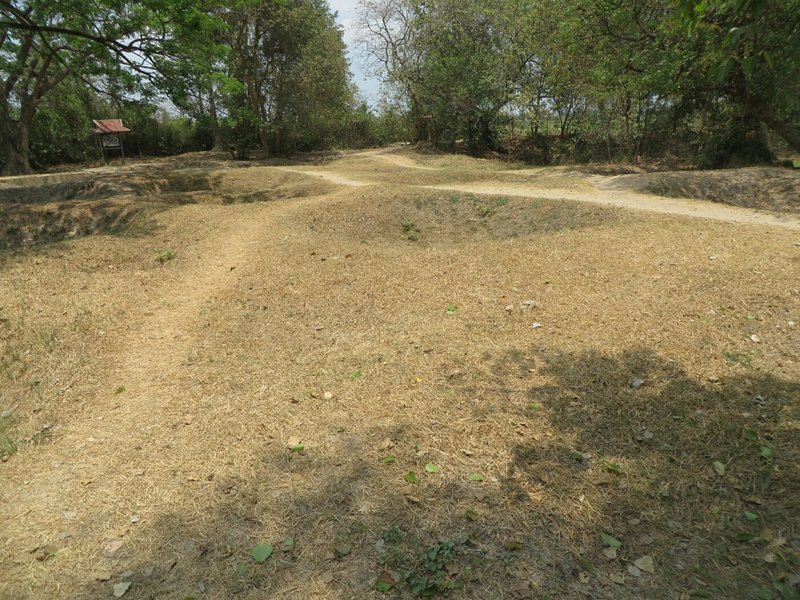
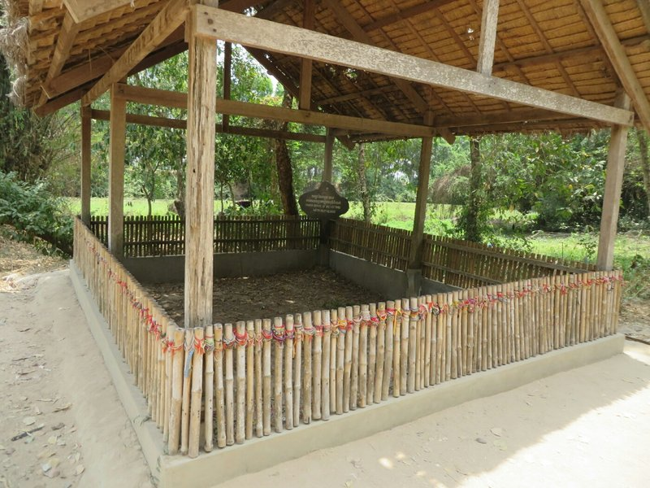
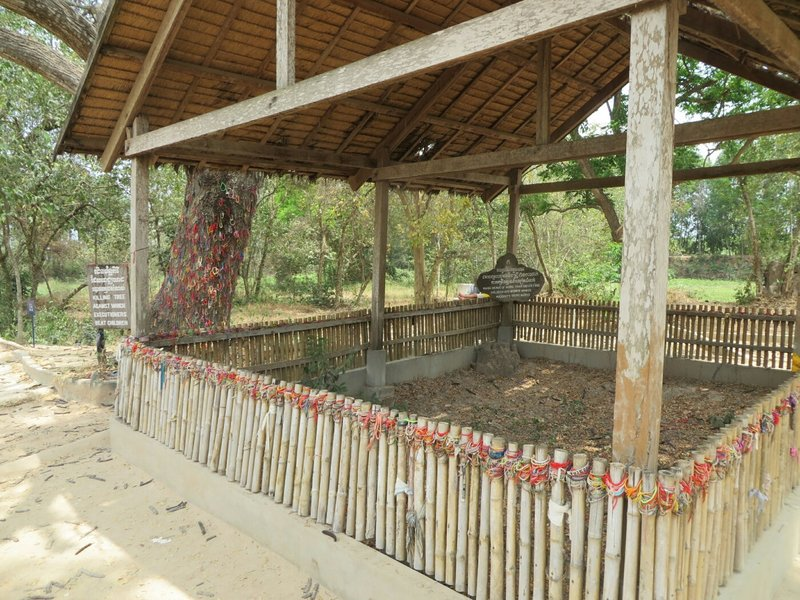
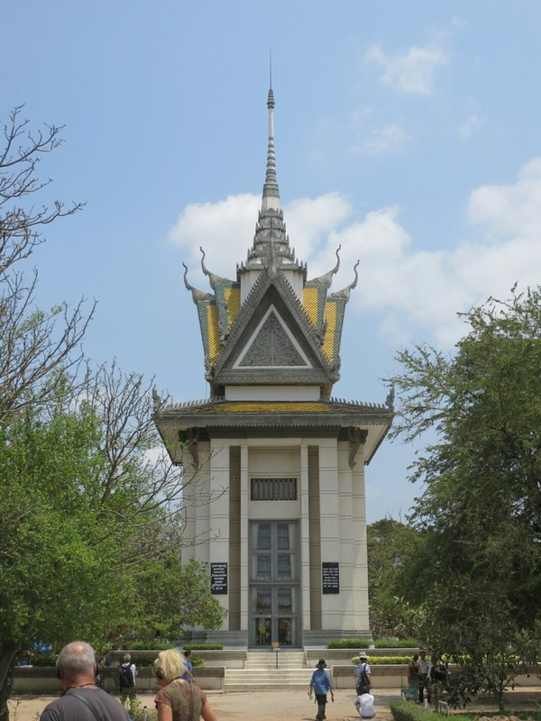
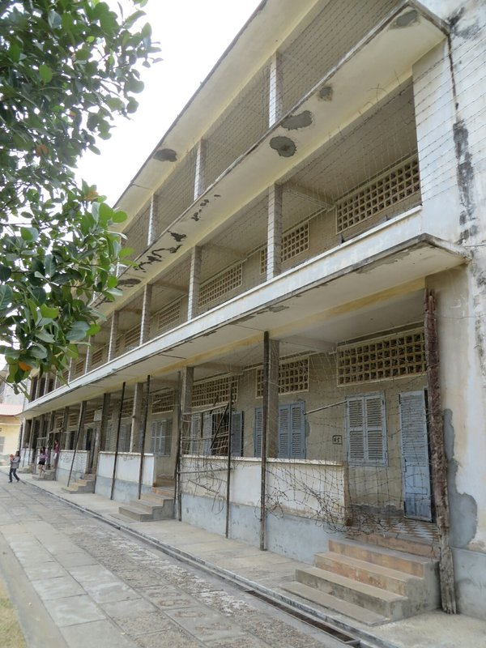
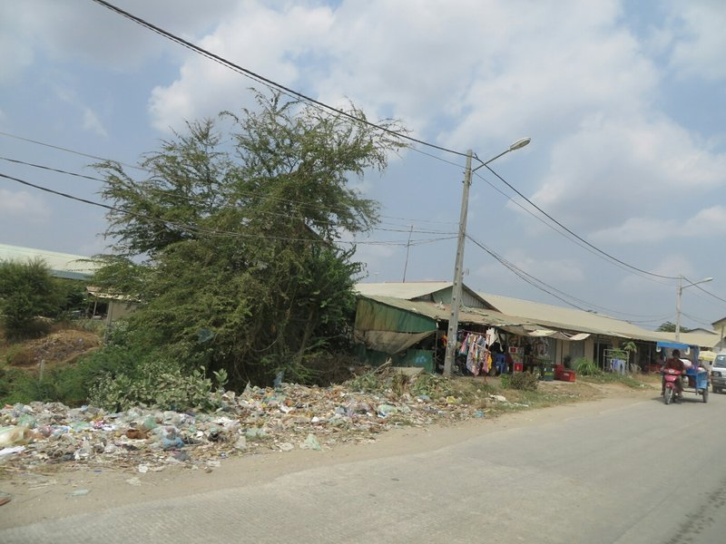

Today was a heavy day. We struggled with whether or not to write this entry. In the end we decided that these things happened and us not writing about them doesn't make it better or less true. As uncomfortable as it might be, these are things people need to see and learn about, regardless of where they are from in the world. That said, if you're squeamish or don't want to be depressed, skip this one.

First we went to the Genocide Memorial at the Killing Fields outside of Phnom Penh. While watching the film The Killing Fields last night helped to provide background for the day, it didn't prepare us for how intense the experience would be. Like visiting Auschwitz and Birkenau in Poland, it was a wholly overwhelming and draining visit.

*Exhumed Mass Graves*

Within three days of overthrowing the government and taking control of the capital, the Khmer Rouge had emptied Phnom Penh, a city of over 2 million people, and forced them to relocate to the country in forced labour camps. Under the direction of their leader, Pol Pot, the next three years saw the massacre of over 1/4 of the country's population (nearly 3,000,000 Cambodians) in a effort to achieve his own twisted idea of a perfect, self sufficient, Communist country.

In Pol Pot's mind, and by extension in Khmer Rouge doctrine, farmers were considered the heroes of the country. Anyone who wasnt a farmer didn't fit into their plan. These people included teachers, medical professionals, former government employees, anyone who spoke a foreign language, lawyers, anyone with glasses, and (eventually) anyone with soft hands (indicating they'd lived a'soft life') - essentially anyone who had any semblance of an education. If you fit one of those categories, you were systematically weeded out and either worked to death in the forced labour camps or sent to one of dozens of killing fields where you would be executed.

The memorial we went to was the site of the murder of over 20,000 Cambodians. Trucks would arrive at night packed with people who were told they were being relocated to new homes. Upon arrival there would be revolutionary music blaring over the loudspeaker to mask the screams of the victims on the other side of the camp. Soldiers would bind the hands of the prisoners, blindfold them, and lead them to freshly dug mass graves. They would be made to kneel and would be brutally killed using whatever weapons were available, usually hatchets, farming equipment, or machetes. No guns as bullets were worth too much to 'waste' on this. Women, children, babies, and even other members of the Khmer Rouge were not spared from this brutal treatment.

In 1979 the Khmer Rouge invaded Vietnam and in retaliation the Vietnamese (working with Cambodian resistance fighters) took control of Cambodia. While horrific stories had come from refugees who fled Cambodia between 1975-1979, it was only when the Vietnamese took control that the full of extent of the Khmer Rouge's brutality slowly became known. Unfortunately, the Khmer Rouge remained the officially recognized government of Cambodia by most of the Western world (including the UK, US, and Australia) until 1997, a full 18 years later, despite growing evidence of the genocide they had committed. They even maintained a representative in the UN.  China (who directly supported the Khmer Rouge after they lost control to the new Vietnamese backed government) and a majority of the Western world strongly opposed a growing Vietnaese and communist influence in the region. Pol Pot died of natural causes at 87 without any punishment or recompense.

Today, the killing field exists as a memorial to the people who lost their lives there. There was a very well narrated audio tour that guided us through the center and provided first hand accounts of what had happened there as well as the findings of the forensic experts who exhumed thousands of the bodies.. The details were truly horiffic:

*One mass grave of 160 Khmer Rouge soldiers who were accused of treason, working for the CIA or KGB and were buried headless.*

*They uncovered one mass grave of children and babies who were beaten against a nearby tree and then tossed into the grave with their mothers, who were often buried naked having been raped before they were killed.*

Bone fragments and teeth still surface through the soil and footpaths during rainy season along with remnants of cloth.

They have constructed a large memorial stupa in the middle of the gounds which houses the skulls and bone fragments of 9,000 of the victims, all categorized by gender and age so as to give them a peaceful resting place. Several of the mass graves were left untouched.

*Memorial Stupa at Killing Fields*

Its difficult to comprehend the brutality that humans are capable of, and it's certainly frightening to contemplate what otherwise normal people can do when put in a desperate situation. Some of these people were no different to you or me, and then someone pointed a rifle at their head, starved them, murdered their family, and started giving them orders. Some obeyed and acted as executioner at the killing fields in exchange for their life and slightly better treatment. We heard the story of one man who watched his wife get shot, and as they were reloading the rifle he escaped into the woods leaving his child behind. While it sounds awful, it is not easy to pass judgment on these people. Kate and I thought about it more and realised the only stories we hear are from the survivors. The people who don't turn executioner, the people who go back for their child, they sadly don't often live to tell their story.

After the Killing Fields we went to it's partner museum, Tuol Sleng Genocide Museum, a high school that was converted by the Khmer Rouge into a high security prison and torture chamber (code named S21). You could walk around through the old school corridors to see the converted cells. The barbed wire placed across balconies to stop prisoners committing suicide was still in place. People (initially Lon Nol supporters, doctors, teachers, foreigners etc) were brought here along with their entire families (even children) and tortured. They were kept shackled alone in tiny cells or in a large room shackled to a hundred other people, fed only 4 spoonfuls of rice a day. They were tortured with electric shocks, burns, having their nails pulled out, waterboarding, rape, cutting with knives and suffocation. They were forced to eat human excrement and to beat other prisoners. The school play equipment was converted into torture devices.

*Barbed Wire Still in Place*

Mostly the torture was not designed to kill people, only to 'convince' them to confess to whatever supposed crime they were accused of (most commonly working with the CIA or KGB) but some people had organs removed without an anaesthetic, were bled to death or even skinned alive as 'medical experiments'. They were tortured until they pointed fingers at friends and even their own family members, accusing them of being spies and traitors. Once these confessions were recorded, the people were shipped to the Killing Fields and murdered. Seeing the living conditions these people were in and hearing in detail about the torture they were made to endure emphasised that there is no way to know how we'd act or what we'd be capable of under those conditions.

Towards the end of the reign of the Khmer Rouge they became increasingly paranoid of members of their own ranks. They started to target people internally, factions started to split off and many people defected to the Vietnamese. S21 started to house mainly Khmer Rouge party members. At first this sounded almost like karma, but on reading some of their stories, the members included folk from the country who were recruited early on when they thought they were freeing Cambodia and people who were recruited and indoctrinated as child soldiers. They worked as mechanics or painters, not as torturers or murderers. They were often far removed from the forced labour camps and ignorant of the genocide taking place and their whole family was killed because of the extreme paranoia that flooded the organisation towards the end,

As well as documenting the atrocities committed at the prison, the museum covers the ongoing trials of Khmer Rouge leaders. A combination international/domestic court was set up as a joint effort of the Cambodian government and the UN. The first case was against the man who ran Tuol Sleng (S21 Prison) and was tried between 2009 and 2010. He was found guilty and sentenced to life in prison. The court has been active for 8 years at a cost of almost $200 million (mostly donated by the UN and foreign governments). However, other than that case they haven't had a single conviction. A number of international judges involved have resigned. It has been suggested current politicians including the PM were (possibly influential) members of the Khmer Rouge so the feeling is that they don't want more convictions or investigations as it might start to get close to them.

*More Trash on the Way Between Sites*

We can see that in some ways it's a difficult situation because a moderate proportion of the population who survived must have been Khmer Rouge members and you'd decimate the population all over again to convict all of them, but that the corruption runs so deep that they can't get more than one conviction is pathetic. The international community doesn't want to withdraw funding because these trials are important in bringing some closure to the millions of Cambodians who lived through the genocide and lost family members, but there is no point in continuing with the level of government interference and pressure. The money is probably just going to line the pockets of the very criminals who should be being brought to justice. It's sad and unfair that the people who committed these crimes go unpunished and the victims live in poverty.

This day showed in every way the worst of people. The most distressing aspect being how recently this has all occured. While the politicians today aren't committing murder, their extreme cowardice in their outright refusal to properly try and convict any of the former Khmer Rouge leaders at the risk of interfering with their comfortable lifestyle, or losing an election, or God forbid taking responsibility for their past actions, is particularly pathetic.

After this very heavy day that really left us questioning human kind and human nature we decided we needed a nice relaxing night out for dinner. We went along the riverfront and picked an Italian place. We had a few nice pastas and a good bottle of French white wine.
