Yesterday consisted of a completely uneventful 7 hour bus ride from Phnom Penh to Siem Reap on a new, nice bus that even had Wi-Fi. Literally not one interesting or noteworthy thing happened. When we got to Siem Reap we checked into our hotel and were put in a room with a window fronting straight onto a hugely loud wedding. On a Tuesday. Wtf. We ended up changing rooms close to 11pm but didn't sleep well and were pretty stuffed when we woke up at 6am for our tour of the temples. After the excellent experience in Bagan we decided to hire a guide for the Angkor Temples for the day. Temple entry care of Clem and Jack, guide care of Pat Stott! Thanks guys!

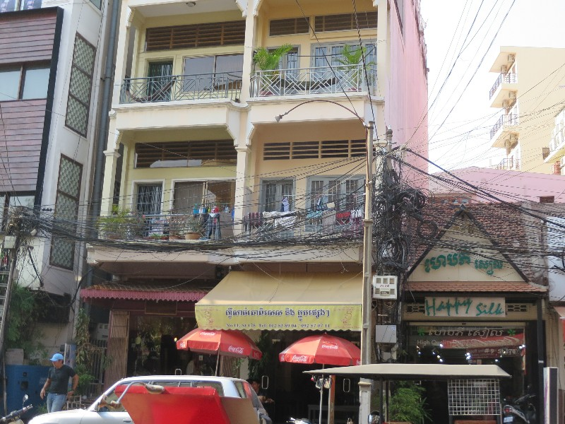

*Some More South East Asian Power Lines, Just In Case You Were Missing Them*

Lots more temple talk again today to help us remember what all the photos are of. Feel free to skip!

Our guide, Borey, met us at the hotel. He actually greeted Kate and made eye contact with her which was a nice change from everyone else in Cambodia who looks only at Pat and assumes as he is the man he will make all decisions for both of us. On arrival one of the first things Borey told us was that the Vietnamese are in control of ticketing for Angkor Wat and take the profits. He said it's because of the government installed by Vietnam after the war. He also expressed concerned about Vietnamese immigration as a precursor to invasion (get a majority Vietnamese population, then take over). He likened it to Crimea.

Now we found the fact about ticketing very surprising so we did a bit of research later. We're including this for anyone who has been to Angkor and heard this misinformation. It's hard to find reputable information on a country that's so corrupt, but it seems the claims came from a smear campaign run by the opposition. It was so successful many Cambodians took it as fact. However the actual fact is 85% of revenue from tickets goes to either preservation of the sites, or to the government. The remaining 15% goes to the company that manages ticketing, a Cambodian (petroleum) company run by a Cambodian man of Vietnamese heritage. Now he may very well be corrupt and underreporting revenue, but he is Cambodian. In addition ethnically Cambodia is 90% Khmer and only 5% Vietnamese so I think their immigration concerns are overblown.

There are hundreds of racist forums and even some news sites online savagely ripping into the Vietnamese and making grossly racist statements about the company that runs ticketing. Which surprised me, given the Vietnamese liberated them from the Khmer Rouge. I guess that was a rock and a hard place situation for them- ruled by genocidal maniacs, occupied by a foreign power, or bring back the slightly less genocidal but also corrupt Prince. They didn't get to have an actual election until 1993. At the moment the monarchy has been reinstated and the PM (Hun Sen, originally placed by the Vietnamese) has been in charge for 29 years and is widely believed to be a dictator who rigs the elections. I get the feeling this country is stuck in the dark ages in terms of sexism and xenophobia. I suppose if you destroy a whole generation of educated people and leave the remainder with PTSD, that's what happens.

Anyway. The Khmer empire was established in 802 by Jayavarman II. It was a big deal until 1432 and was ruled by about 26 Kings over this period. At it's peak, Angkor was home to over 1 million people. To give you an idea of scale, this is at a time when London only had 50,000. No one knows exactly what caused it's collapse- drought, war and overpopulation have all been suggested.

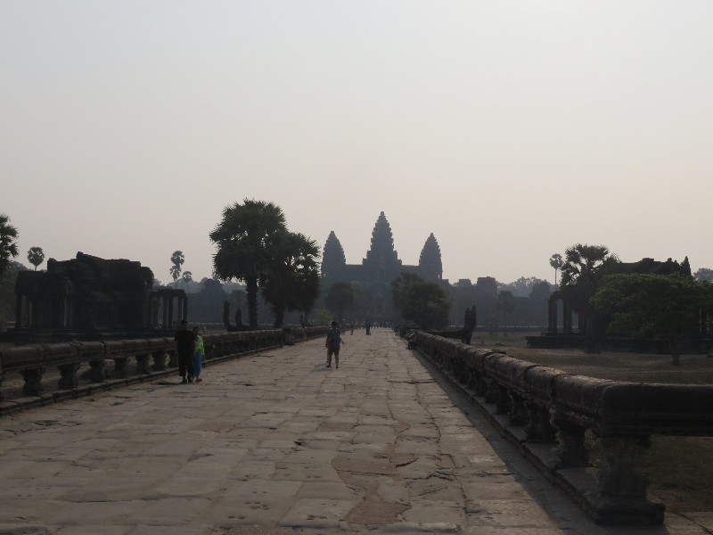

*Arriving at Angkor Wat- Fairly Quiet*

We started our day at Angkor Wat. It is the biggest religious monument in the world and was the last Hindu temple built in Angkor. It's dedicated to Vishnu (which we're told is unusual) and also faces West (which we're told is unusual again- they normally face East). It was built by a King Suryavarman II as the state temple over a few decades around 1120-1150. It's meant to represent Mount Meru, home of the Hindu Gods. Borey said "It's made big like mountain because Hindu gods live high up. The temple is a symbol of Hindu mythology: high mountain (for God) surrounded by land (for people), surrounded by ring of mountains (the wall), surrounded by the sea (the moat)".

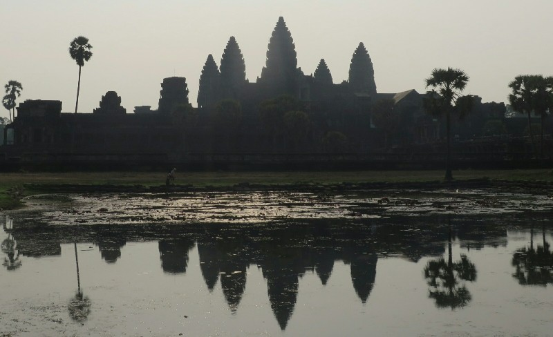

*Reflecting Pool*

Despite it being just after 7am there were a few tourist buses out already - Chinese, Russian, Koreans dominate. We wander along the bridge across the moat and through the gates (which have a few bullet holes in them from the Khmer Rouge times). We walk across the massive grounds, past the frequently photographed reflecting pond and around the outside of Angkor Wat. It's a good way to get a sense of scale- the temple is truly massive.

Once we got to the East face (the back) of the temple complex we entered and started to do a lap around the outer corridor looking at the wall carvings. There are lots of intricate carvings around the first level telling stories of heaven and hell, ancient battles between gods and demons, and the conquests of the King. The first one we saw was The Churning of the Sea of Milk- a story from Hindu mythology about the gods and demons working together to try to recover The Nectar of Eternal Life. They wrapped a snake around a mountain (which sits on a turtle's back) and alternate pulling on either end of the snake to rotate the mountain and churn the sea of milk (The Milky Way). First a poison strong enough to destroy the Sea of Milk (the Universe) comes up which Shiva, one of the three major Gods, eats to save everyone. Another God Parvati chokes him to stop him swallowing all the way and he lives. Eventually the Nectar comes up and after some fighting the demons convince Vishnu (major Hindu God number 2) to give it to them. So he does. Then there seems to be no particular recompense from the demons winning, the story just ends. So there you go- good doesn't always win in Hinduism.

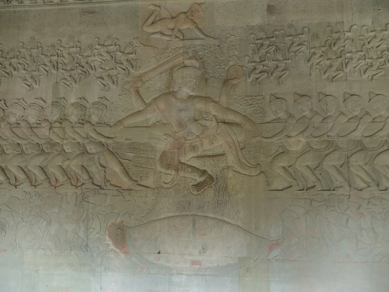

*Churning the Sea of Milk*

As well as stories of Hindu mythology there is a carving with the story of King Suryavarman II. Basically he's riding an elephant killing people. They had one showing the 37 levels of heaven and 32 levels of hell depicting some lovely torture scenes. We're told the number one thing that will send you to hell as a Hindu is disrespecting your parents. We might raise our kids Hindi... There were carvings of the story of Rama and Siti (the same story that was depicted at the Grand Palace in Bangkok). It tells the story of Rama trying to recover his kidnapped wife Sita from Ravana, apparently it's a looong story. In normal version when Rama rescues Sita he tests her to see if she was faithful despite living with Ravana for years. She was and they live happily ever after. Borey tells us in the Cambodian version he tests her a second time and she fails so they break up. Less happy.

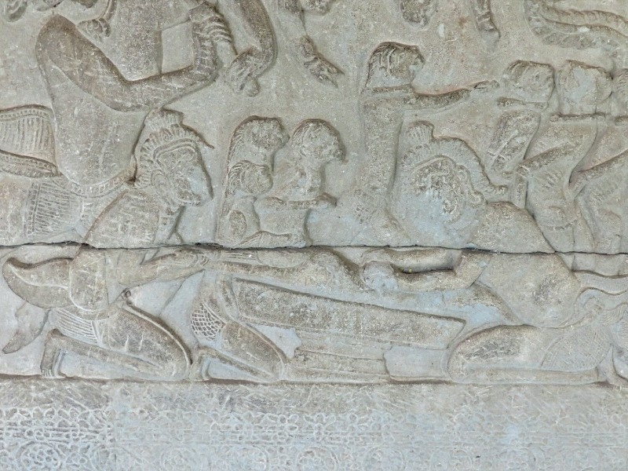

*Two Demons Holding A Man Down In Hell And Rolling Him Out*

After admiring the carvings we walked into the temple and climbed to the top. The temple was huge and impressive, but really the carvings were (to us) the most noteworthy thing.

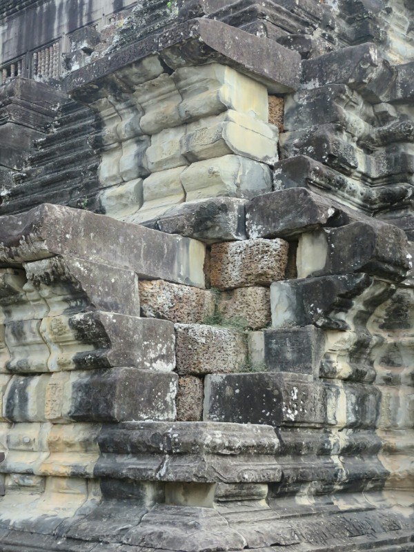

*The Temple Was Built Of A Stone Called Lacerite Then Overlayed With Sandstone- We Forget Why*

On the way out a group of Cambodian tourists stopped us and asked for a photo with us. We obliged. Our fame has spread from Yangon. There were a lot more buses arriving as we left with floods of people going in as we exited. Glad we woke up early. Also because it's already over 30 degrees and super humid and it's only 10am.

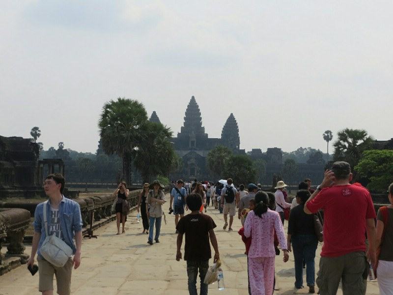

*Some Of The Tourists At Angkor Wat As We Left*

We moved onto the second temple, Banteay Kdei. This was a Buddhist temple built in 1186 by Jayavarman VII (J7), a very important King of the Khmer empire and only the second Buddhist to reign. He came to the throne after defeating the invading Chams (a neighboring empire). He went on a building spree when he was ruler. As a Buddhist his first order of business was hospitals, roads and other infrastructure to alleviate the suffering of his people. Then- temples. I think at least half the temples we visited were constructed by him.

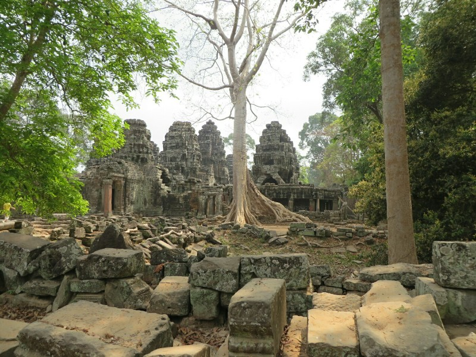

*Banteay Kdei*

Banteay Kdei was the first temple J7 built and much of it was destroyed after his reign when the next King reinstated Hinduism as the official religion. We saw a lot of scratched out Buddhas. While it was newer than Angkor Wat it was in a much worse state, lots of decay and stones that had fallen down. We're told J7 valued quantity over quality when it came to his temples.

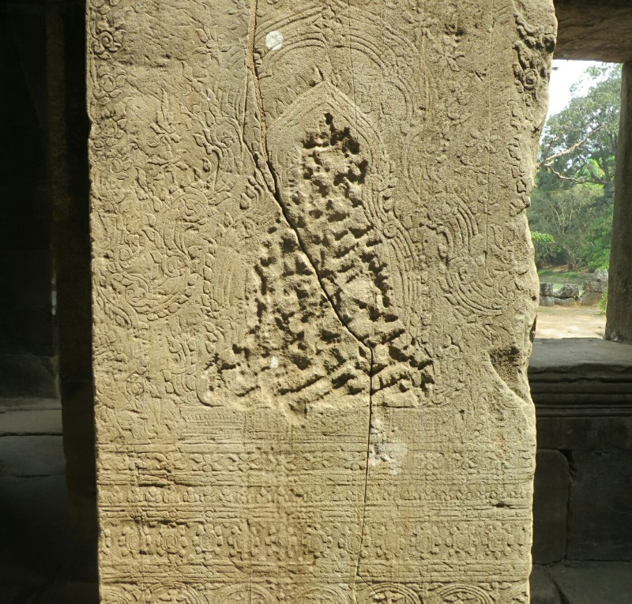

*A Buddha Scratched Out of the Wall*

The third temple was Ta Prohm, also built by J7 in 1186. This temple was for his Mom. Aw. Again we could see places Buddhas were cut out, but interestingly J7 surrounded them with Hindu Gods so these were left untouched. This was the temple featured in Tomb Raider, The Jungle Temple. It lives up to its name; lots of trees are growing around, on, and through the temple complex. It's pretty spectacular how these trees just get a foothold anywhere and go for it! It's super loud here with birds and cicadas making all sorts of noise. Apparently when the French started restoring the temples in Angkor back in the day they left this temple unrestored because it was "one of the most imposing temples and the one which had best merged with the jungle". However India is now restoring parts of it before it collapses altogether.

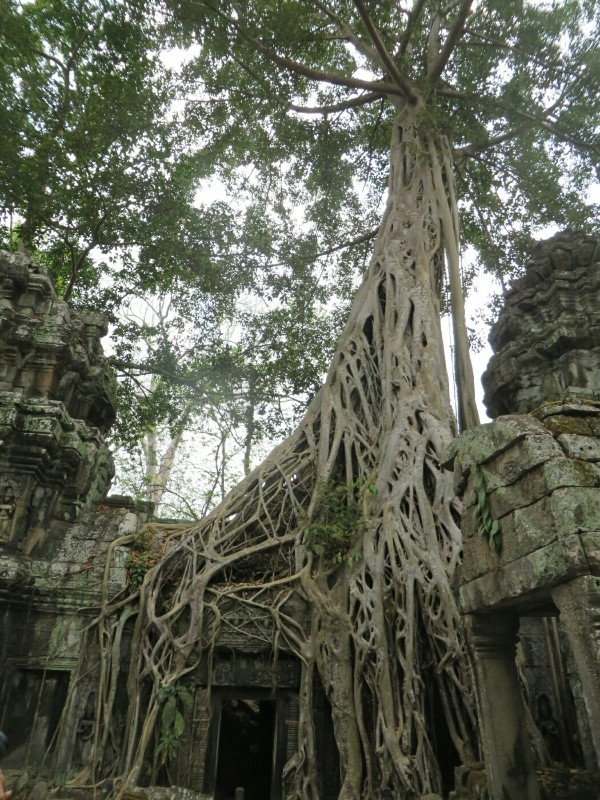

*Tree Devouring Temple*

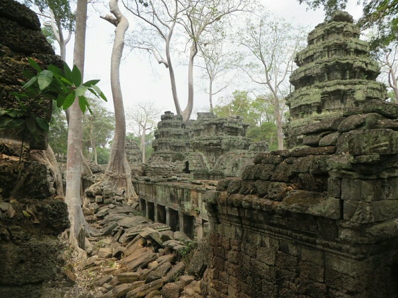

*Little Tree in the Foreground is Making Plans*

Next was a much needed lunch break. Unfortunately at a prohibitively expensive restaurant four times the price of anywhere we have been to (with the exception of the fancy dinner in Phnom Penh). We ordered vegetarian fried rice to share for more than a meal for two and drinks usually cost. I don't think the staff were impressed. At least the place was air conditioned.

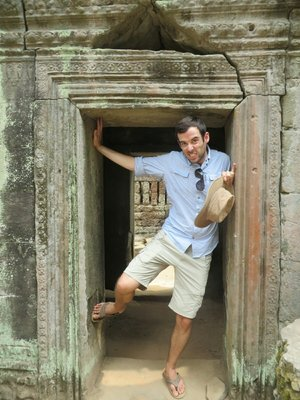

*Patrick Knocking the Temple Down, Katie Stuck in a Picture Frame*

On the way out we were inundated by tiny kids trying to sell bracelets. Some of them couldn't have been older than 5! I want them to go to school, but apparently they do this in the lunch break to try to help their parents get some extra money for food etc. We don't buy things from young kids generally because we don't want to encourage them to work. But then it's better than starving or being sold (lots of kids get sold in Cambodia so the parents can afford to look after their other children). Difficult to know what to do in these situations.

After lunch we visited Angkor Thom, a huge walled city built by J7 to be the new capital. Somewhere between 80,000 - 150,000 people lived there. We first visited the Terrace of the Elephants, a big terrace in front of the Royal Palace grounds. Apparently the King would come to the terrace to view his army, or from time to time to settle disputes of the people. From the terrace you could see 12 small buildings (called Prasat Suor Prat). J7 would put people who had a dispute he couldn't settle into the little room with no food or water. Whoever passed out or got sick first, lost. His logic: an innocent man wouldn't pass out. Air tight if you ask me.

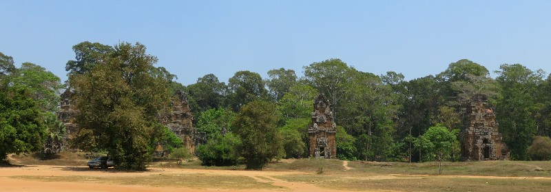

*Kingie Said- "Sit in Here and Think About What You've Done"*

We walked North past another terrace, The Terrace of the Leper King. At some point someone built a replica terrace a few meters in front of the original, so there are now two walls. You can walk between the two to see the original terrace carvings. Areas of the original carvings are missing because they were reused building the new wall. There are also areas on the back of the new wall which are carved- it's thought they used bits of other temples that were in disrepair to build the new wall to save money, just faced the stones the other way around and carved the back side!

We kept walking North and came to Tep Pranam, I think the oldest temple we visited. It is a Buddhist Temple which was built in the 9th century. The city of Angkor Thom was built around it. We turned West and walked past another temple with a tree growing out of it, Preah Palilay. They're not sure how old it is as it has Buddhist and Hindu elements. From there we turned back South and wandered through some trees towards the palace. Borey pointed out a poision fruit that the locals use to cure malaria. I'll stick to doxy.

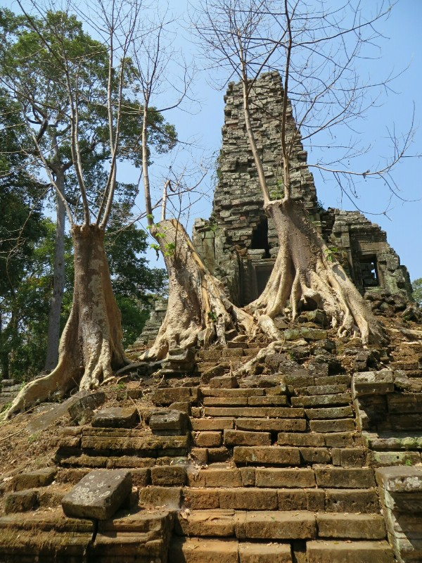

*Preah Palilay- They Cut Down the Trees Because they were Undermining the Temple too Badly. The New Stalks Growing From the Trunks Were Each 30cm Diameter! Can't Keep These Things Down!*

We had a walk through the Royal Palace grounds. Inside there are two pools; one big, one small. Borey thinks the small one was for the men in the King's service and the big one was for all his concubines. Pat thinks he needs to become a King. In the middle of the palace grounds was a temple, Phimeanakas. This was again present before Angkor Thom city. Apparently the King had to climb the temple every night to sleep with a snake woman (Naga) and no one, even the Queen was allowed to interrupt. Because if he failed, Naga would destroy Cambodia. Good to be king.

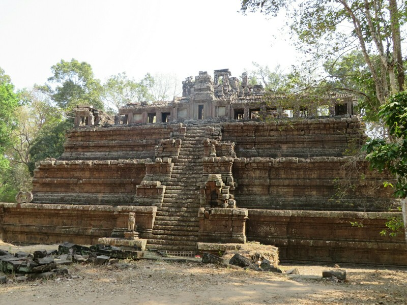

*Naga's House- We Climbed Up but No One Was Home (Except More Tourists)*

Second last stop for the day was Bayon Temple, a Buddhist temple built by J7 to replace Angkor Wat as state temple. Lots of faces, which apparently bear a striking resemblance to J7, but are supposed to represent Buddha. There are carvings all around the outside of day to day life in Angkor- the markets, cock fighting, acrobats, the army, fishermen etc. The temple itself was packed with tourists and local ladies trying to sell incense to everyone. Lots of tourists were posing pretending to smooch the Buddha faces. Borey asked if we wanted to smooch one; we said no. He said we would have good karma now. Score!

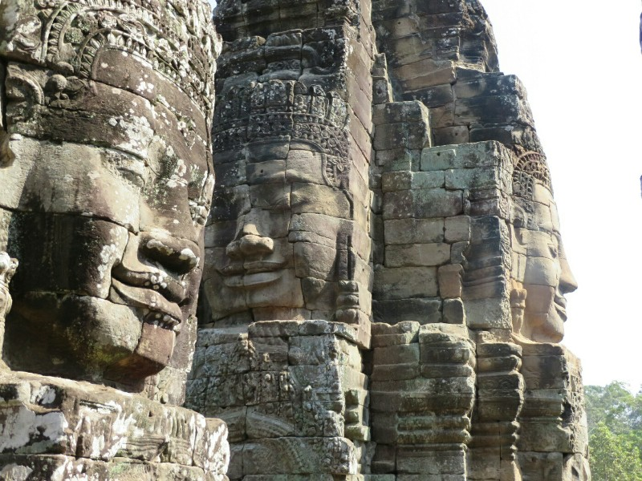

*Buddhas at Bayon*

The last stop was Baphuon, another state temple for another King (this was around 1050 so predating Angkor Wat and Angkor Thom). You could climb up. Pat was hot, hungry, exhausted and said maybe not. Kate said too bad, we're not likely to come back in the forseeable future, climb it. Kate won. Got to the top of 3 steep staircases, proud, high fived, happy we finished our day with a win (I'm sure Pat agreed, he was just too overwhelmed with victory to say anything or smile or whatever...). Then headed back down.

We asked Borey about sunset and he said there were three places that stayed open: two are always heaps crowded with people, the other is Angkor Wat. He recommended Angkor Wat.

We went back to the hotel briefly to cool off, Pat had a swim and Kate laid in the air con cause her toe is still sad and she can't swim. However we both ended up refreshed all around. We got a tuk tuk back to Angkor Wat. While waiting for the sunset we met two kids in school uniform trying to sell postcards for $1. We said we didn't need any, but we'd sell them a postcard for $10. The older kid played along and said "deal!" then gave us two one dollar bills claiming each was a $5. Tricky! After a while they got bored of us and wandered off.

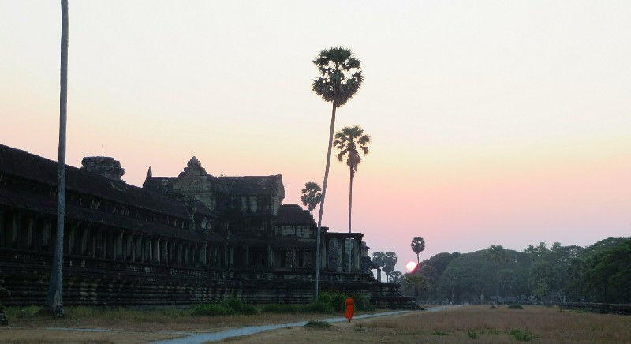

*This Monk Had The Same Idea As Us*

We circled the temple until we found a nice spot to watch the sunset. Soon after an overweight man in tuk tuk pulled up taking pictures. His driver asked if he wanted to get out for a better view. He said no and they parked right in front of us. Are you for realsies? They left eventually, before the sun went down.

We enjoyed the beautiful sunset, went to town and got some Mexican for dinner then headed back for much much needed sleep for our overloaded brains.

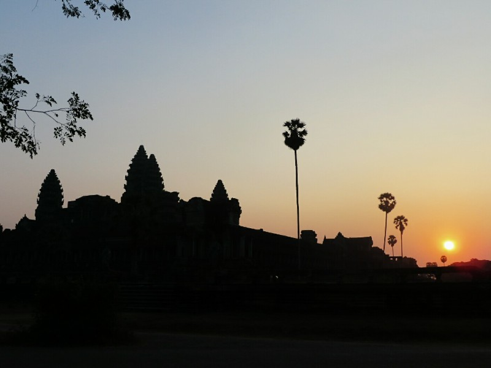

*Sunset*

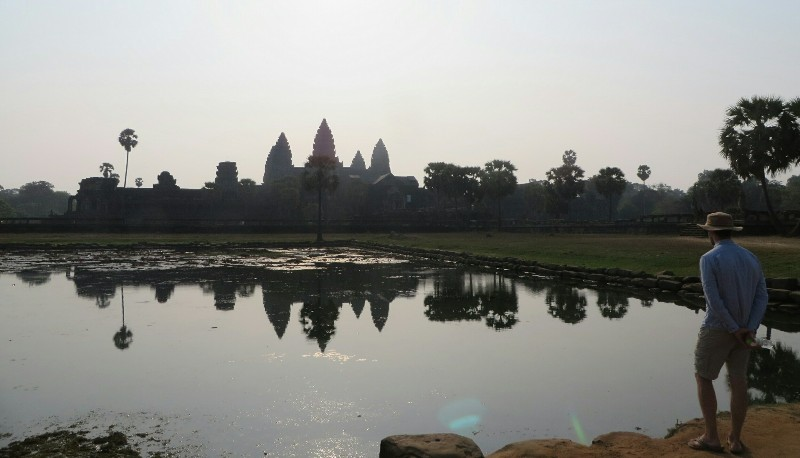

*Pat at the Reflecting Pond*

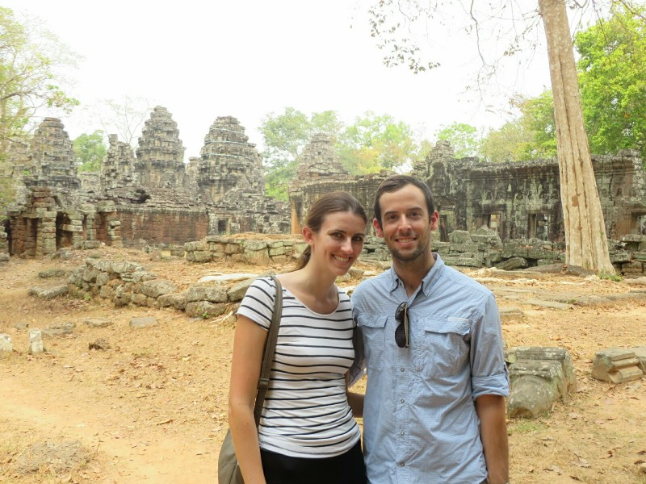

*Katie and Pat at Banteay Kdei*

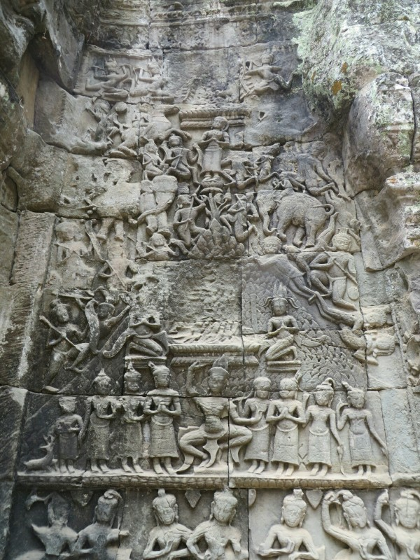

*Hindu Gods Still Kicking On, Buddha Didn't Make the Cut*

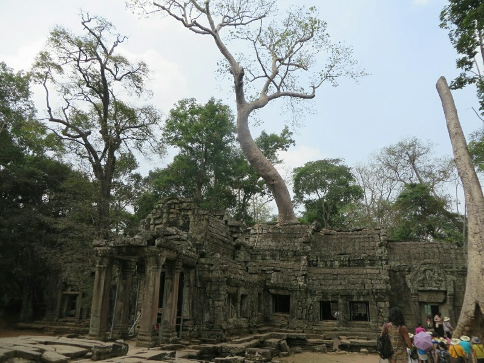

*The front of Ta Prohm (plus tourists)*

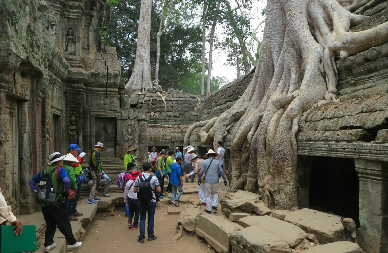

*Some of the People we were Trying to Keep Out of the Frame At Ta Prohm*

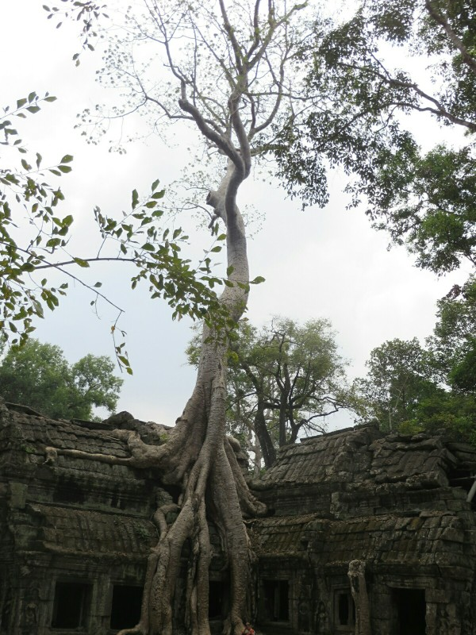

*You Can See Why They Call it the Jungle Temple*

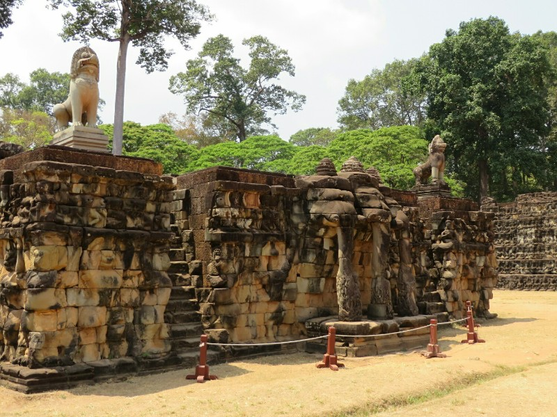

*Terrace of the Elephants with Original Rope Barricade*

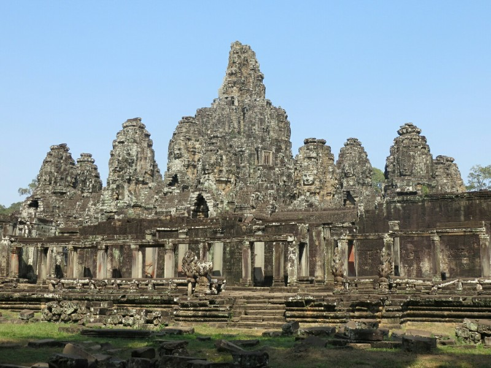

*Bayon (if you look closely you can see all the faces)*

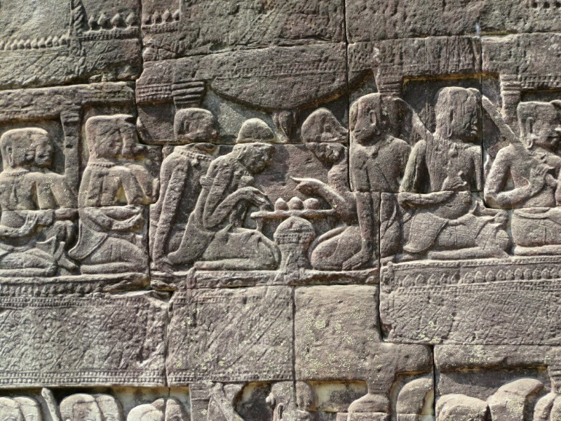

*Scenes of Local Life on the Wall at Bayon- Playing Khmer Chess, We Think*
