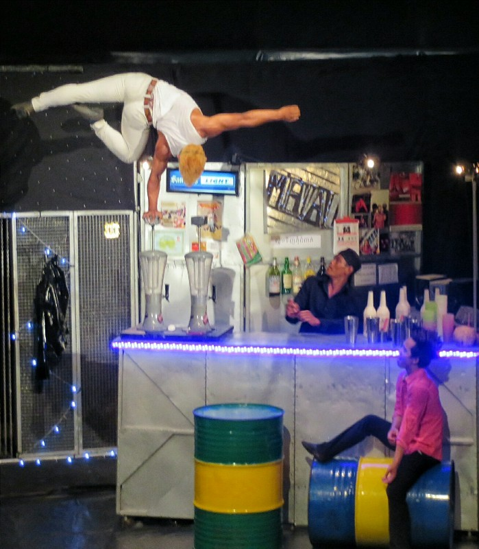
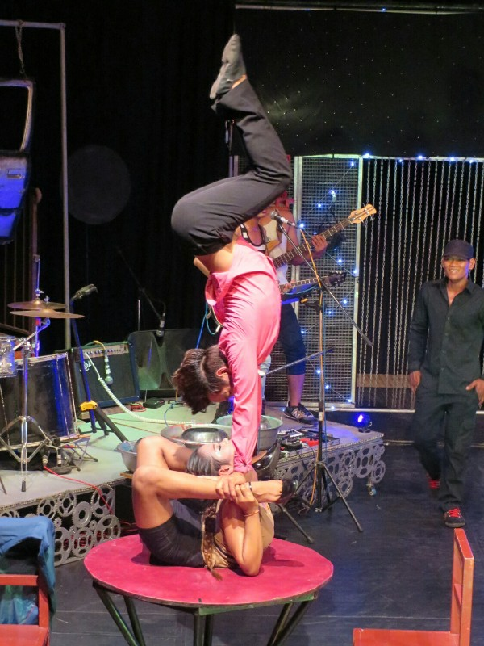
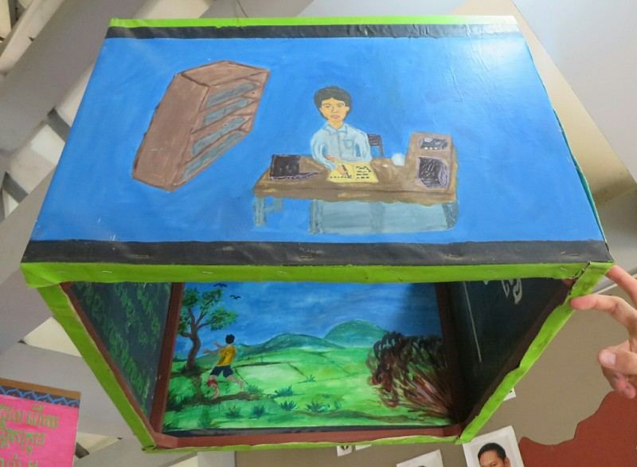
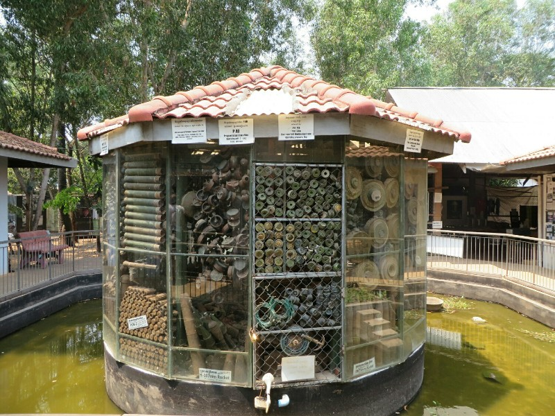
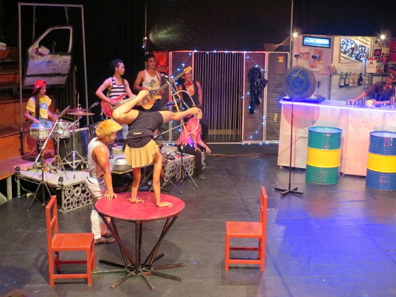

Our next two days in Siem Reap were slightly less action packed, especially the day after the tour when we had a nice sleep in. We had a walk and went to lunch at a local Cambodian restaurant. They didn't speak any English so communication was hard, but in the end we got fed and the food was OK. We are finding Cambodian food to be the worst in South East Asia. Kinda looking forward to Vietnamese.

We decided to visit the Siem Reap circus. It's run by an organization that offers free education to kids from a disadvantaged backgrounds. As well as normal, formal education they offer painting, music, drama and circus classes. Money raised through ticket sales go back to funding the school. Tickets secured, we wandered into town in search of food. We grabbed a really nice dinner at an Indian restaurant. Absolutely massive servings though, we actually left curry and naan behind! Very out of character.

*Balancing on a Blender*

Absolutely stuffed, we walked to circus. It was a lot of fun although it was slow to get started. It started like a stage show, set in a bar with staff and customers arriving. But when it got going, some performers were pretty amazing. Very strong and one girl I thought would break her spine with her bendiness. At one point a performer came into the audience and sat with Kate and had a chat. She spent the rest of the show petrified she'd be called on stage. Didn't happen. Phew!

*I Don't Think People Are Designed To Bend That Way*

On the walk home a dog barked at us and followed us along the road for a bit which was quite scary. He gave up eventually- 36 days rabies free and counting.

On our last day we only have the morning to explore. We decided that we wanted to head out of the city into Angkor Park again to visit the landmine museum, so we bargained with a tuk tuk driver and hired him for the day.

When we arrived, the museum was very modest. Not at all what I was expecting. The whole complex is only a few rooms, but contains heaps of information. They also house up to 50 children who are victims of landmines, orphaned, or otherwise disadvantaged. They give them an education as well as rehabilitation for those who need it.

*The Kids at the Center Who Have Lost Limbs to UXOs Completed Art Projects. They show how they were injured and what they want to do when they grow up. This one wanted to be an accountant- Pat doesn't understand why*

The man who established the museum, Aki Ra, is a local who used to be a child soldier in the Khmer Rouge. During his time with them, before he defected to the Vietnamese, he set thousands of landmines all over Cambodia. Now he has dedicated his life to clearing them. Initially, he cleared landmines using nothing more than a stick and a pair of pliers. Seriously. He would go around with a stick, prodding for mines, and when he found one he would disarm it by hand with no protective equipment, just in shorts and a T-shirt. Didn't even wear closed toed shoes! Using this method, he cleared over 50,000 mines.

Eventually the government got wind of his actions and put a stop to it in 2007. They said, quite fairly, that there were regulations and training standards that people had to adhere to if they wanted to engage in clearing mines. So after jumping through the appropriate hoops, he started his own NGO with the help of several donors and in 2008 started up again, focusing on "low priority" communities that have been waiting to have their farms and land cleared for over 25 years.

We learned a lot more about the last 40 years of history in Cambodia and all of the movements that lead to their home being littered with landmines. Experts estimate that there are still 2 to 3 million unexploded landmines and other active ordinances in the country left by a number of parties: the Khmer Rouge, the Cambodian army, the Vietnamese, and the USA (responsible for most of the unexploded bombs). We also learned that the USA is in great company among the 12 countries who have not signed the international agreement to stop using landmines: India, China, Russia, Cuba, and Iran. Made me a bit ashamed. We later learned that the US' objection is due to their support of South Korea and they claim that landmines are a critical deterrent to the North Koreans invading. To the US' credit, they are one of the biggest donors of funds to help Cambodia clear the ordinances, but it seems a bit backwards to continue using them while also funding their removal.

*A Selection of Disarmed Ordinances*

It's interesting to learn the other side of the story following a war or an armed conflict. For the US, their involvement ended in 1975 when they pulled their troops out and evacuated the embassy in Phnom Penh. But some 40 years later, people in Cambodia are still dealing with the remnants of a war that happened before many of them were even born.

Kate and I are both mindful of being preachy on any particular issue and we've tried our best to present information about situations as we've encountered them without too much bias. In this instance, we both felt so strongly about the work that Aki Ra is doing that we want to encourage you to visit their site to learn a bit more and consider making a contribution.

Museum website: [www.cambodialandminemuseum.org](https://www.travellerspoint.com/guide/www.cambodialandminemuseum.org/)

US Charity: [www.landmine-relief-fund.com](https://www.travellerspoint.com/guide/www.landmine-relief-fund.com/)

After the museum we went into town for a cheap lunch. It was between 1pm and 4pm so we were also dying from heat. We had a little look at the local markets, then realised we had left ourselves with only $2 and couldn't afford to buy anything. Instead, back to the hotel to shower and pack. On the way out the tuk tuk drivers were fighting to take us to airport (must be a good fare). The one who took us to landmine museum seemed to make a bet with the others then asked if we remembered him. We did, so apparently he won and got to take us.

The airport was chaotic- way too small for volume of flights. A few minutes before ours was due to board it disappeared from the screens altogether. Our gate opened, but boarding a different flight. Absolutely no staff to help or explain the deal. We panicked and ran to all the gates to try to find where our flight was to no avail. Eventually it reappeared, 10 minutes after boarding was due to start. Apparently just not enough room on the screen for all the flights?

At the hotel in Hanoi we were greeted by a very friendly concierge who proceeded to explain every aspect of the hotel in detail down to demonstrating how to use an in room safe and showing us the on button for our English language air con controller. We were secretly relieved when he left and we could get to bed!

*Missed the action shot, but she fired a bow and arrow with her feet, popping a balloon*
