Breakfast at the hotel was pretty good, except the coffee. I don't know what that brown sludge is, but it ain't coffee.

We had planned to take a cooking class in Hanoi (a wedding present from my sister and Siang) and spent the first part of the morning researching the options to pick the best one. What we actually found is none of them seem to be like the one we took in Chiang Mai. You don't get your own work station and stove at any of the schools. At some a few people share a stove, but most you just observe a chef cook. I can do that on YouTube for free! It didn't sound like what we wanted to do so we looked at alternatives. We found a few companies offering Street Food Tours, 4 hours walking around being fed the best local food Hanoi has to offer (with slightly less risk of food poisoning than doing it yourself). We decide this is the way to go and head out to book it in some time while we're here.

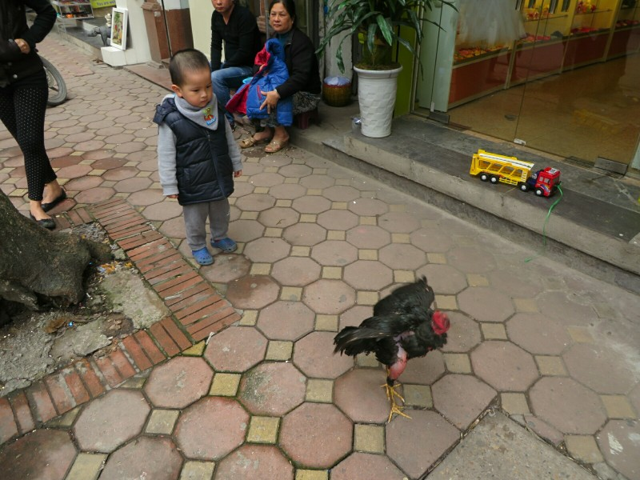

Waking through town in the morning we notice many more people wearing face masks. It wasn't uncommon in Cambodia, maybe 1/10 people? Here it's more like 1/3, especially those riding motorbikes. We're staying in Old Town so there's a lot of colonial architecture, narrow streets with store fronts opening onto the footpath selling everything you can imagine. The atmosphere is great, there's food being sold everywhere and it smells amazing. We are excited! We try another coffee on the walk and get another mug of sludge, this time with 3 tablespoons of sugar! Kate pours hers down a drain.

We arrive at Happy Moon Travel Agent and meet Ms Moon herself at the desk. We enquire when the next food tour is going, she asks when we'd like to go. We say we're in town 3 days and we don't have any plans yet, so whenever suits them. She suggests we leave now! We weren't expecting that! But we have nothing going on, so sure! Off we trundle, she leaves the store with a friend.

Then, we ate.

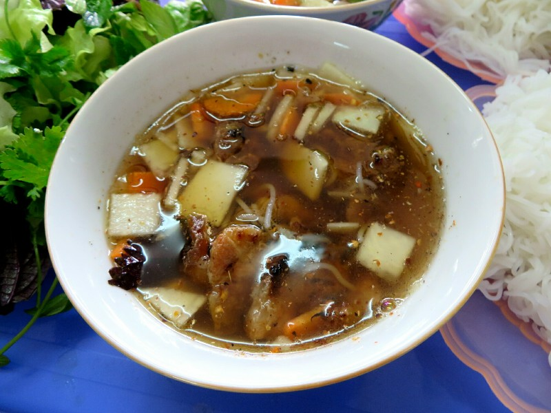

First was a very local soup shop for Bun Cha (noodle soup with pork and beef). Apparently a very Hanoi dish, it was a little sweet but very yum. Pat loved it especially.

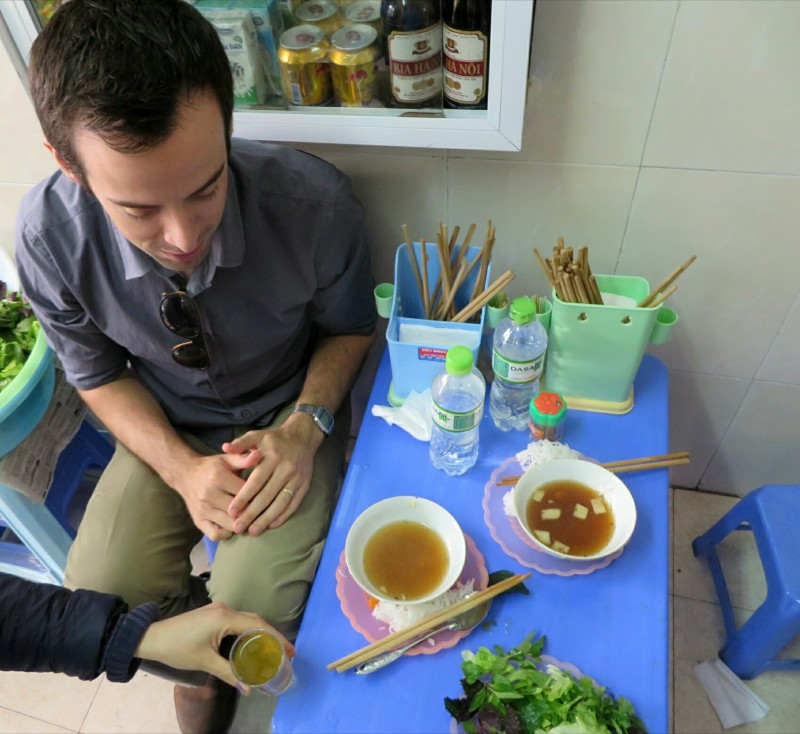

The tiny plastic seats look like they're designed for oompa loompas and we knock the other tables around trying to squeeze in.

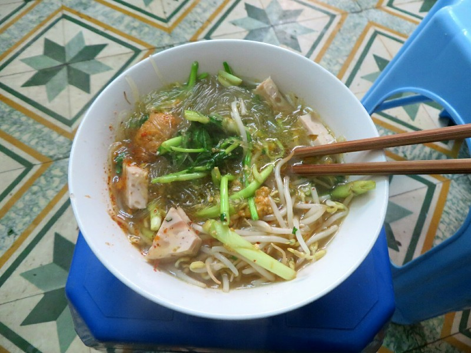

Next we walked down a small alley and into the front room of someone's house. We could see their daughter watching TV in the next room. We had Mien Tron (glass noodle soup with pork and squid). Kate really liked this one, and it was fun to be fed in such a local atmosphere!

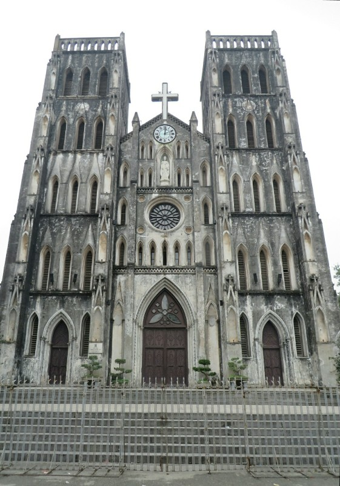

We passed St Joseph's Cathedral, the oldest church in Hanoi built by the French in 1886 and had a 'real' Vietnamese coffee- coffee, condensed milk and yogurt.

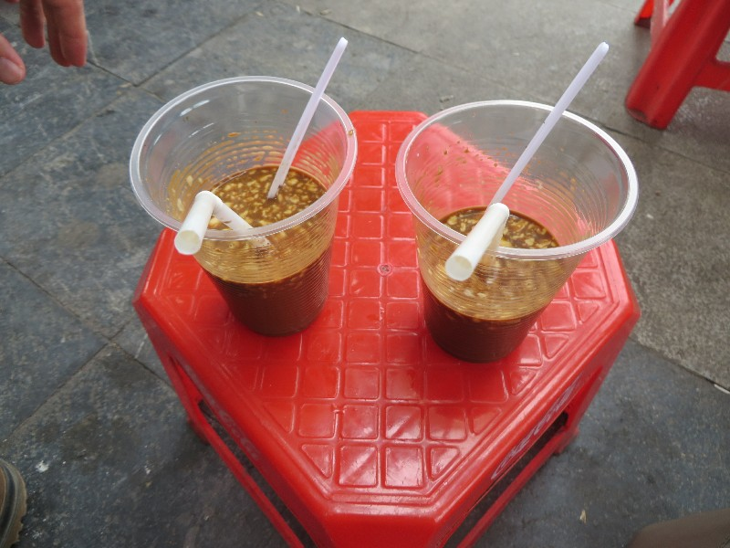

*We could tell the base coffee was the same awful sludge, but with the yogurt it was actually pretty darn good!*

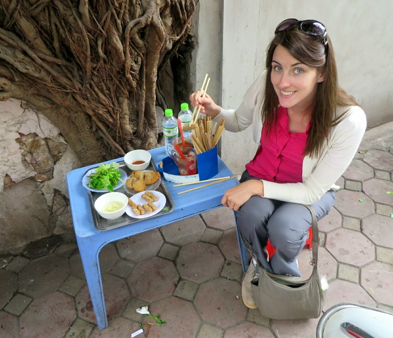

Next stop, spring rolls. We had 4 types- Nem Chua Ran (another Hanoi specialty; crunchy, deep fried, cured pork spring roll thing), two types of Bahn Goi (deep fried pillow cake filled with marinated minced pork, mushrooms and glass noodles) and Sea Crab spring rolls (we missed the Vietnamese name). All with these amazing, fresh sauces and veggies. Mmmm.

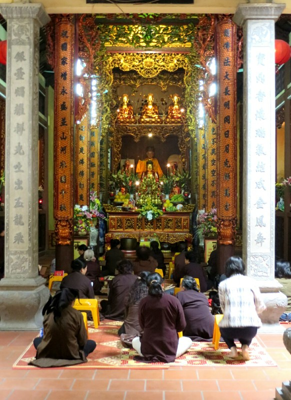

We poked our noses into the Ly Quoc Su Pagoda, a Buddhist Pagoda, on the way past. The style is completely different to anything we've seen anywhere else in South East Asia, much more Chinese. Apparently locals come to worship on the 1st and 15th of every month so it's packed.

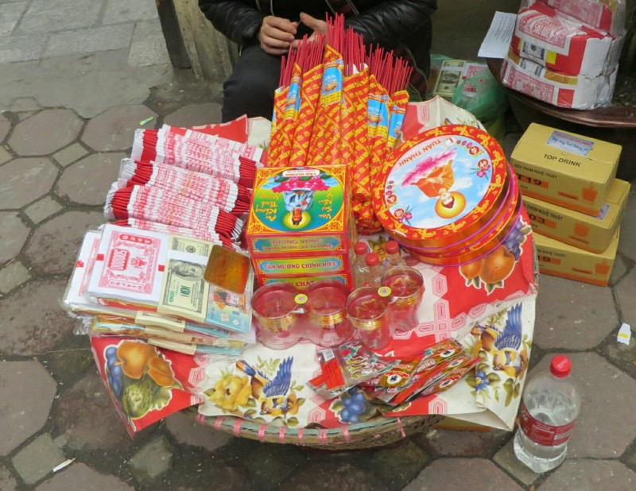

There seems to be a bit of a mix of religions here with both Buddhas and the Mother Goddess from the traditional indigenous religion (Đạo Mẫu I think). There are a lot of people burning fake hundred dollar US bills (being sold on the left of the tray in the picture), apparently to send to their ancestors. Doesn't matter if you're dead or alive, still got bills to pay, and I guess they're less picky about forgeries in the after life.

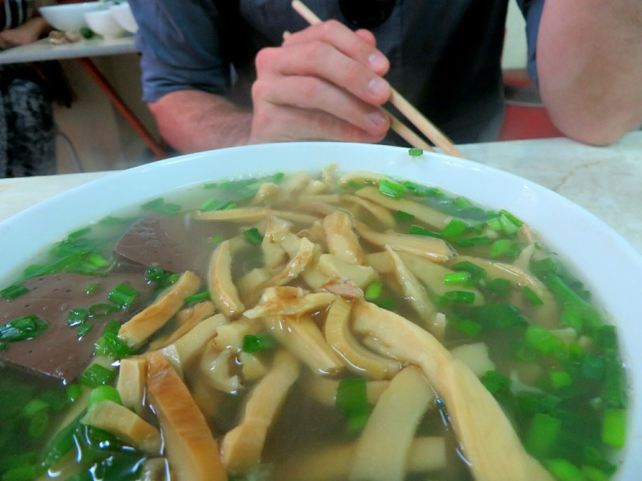

Next, another soup, Bun Mien Ngan (goose soup with bamboo shoots, glass noodles and black pudding). Kate is not a fan at all, but it comes with a delicious chilli, garlic, fish sauce, vinegar and coriander sauce which she eats instead.

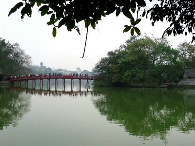

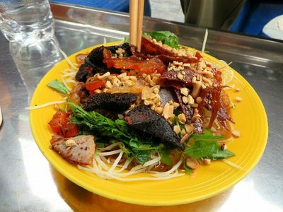

We walk past Hoan Kiem Lake, apparently full of endangered turtles. There's a story that an emperor was boating on the lake when a turtle God asked him for his magic sword, which he handed over. They built tower on the lake called Turtle Tower to commemorate the occasion. Sounds to me like the emperor saw a turtle, got a shock, dropped his expensive sword into the water and came up with a very bad excuse for why he lost it. Either way- more food. Nom That Bo Kho (a fresh salady thing with papaya and dried meat- absolutely killer and wonderfully fresh after the fried rolls)).

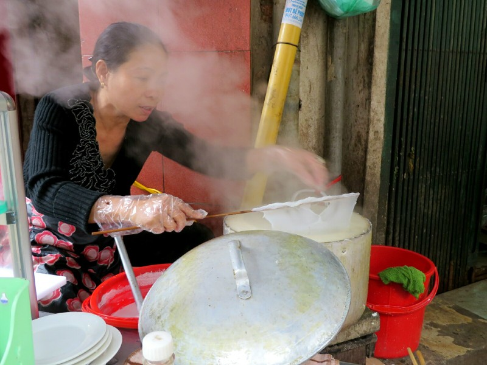

A bit of a longer walk before our next stop, sitting on the only 2 chairs a tiny stall for Banh Cuon Nong (rice pancake with pork- normally a breakfast food). The lady cooked the rice on a crepe hot plate in front of us and it came with delicious sauce, fried shallots and peanuts. Mmmmmmmm.

We're really loving that they write with Latin script here, it makes it easier to follow what we're eating than other South East Asian countries where we can't recognise the alphabet. We're told it was introduced by French and Portuguese missionaries to replace their Chinese style characters in the 1500s, then enforced during the colonial period.

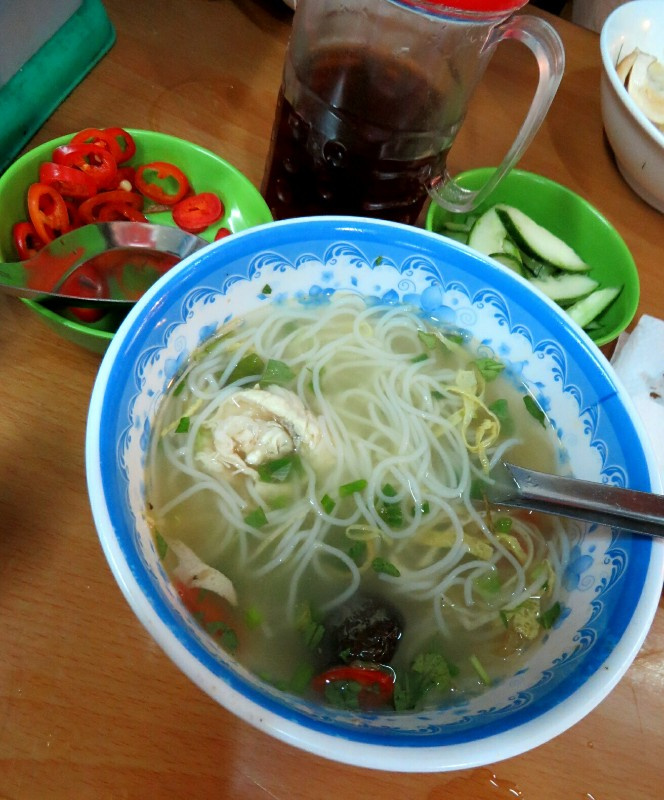

The next shop (you can see why we're gaining weight in this trip) was bigger with seating inside for 30-40 people. Most shops have only sold one or two dishes because making them well is time consuming, this place made maybe 8 dishes and there were quite a few tourists there. We had Bun Thang (a hot rice noodle soup with chicken) with a side of sticky rice, also with chicken. Again, yum. So many different ways to make soup!

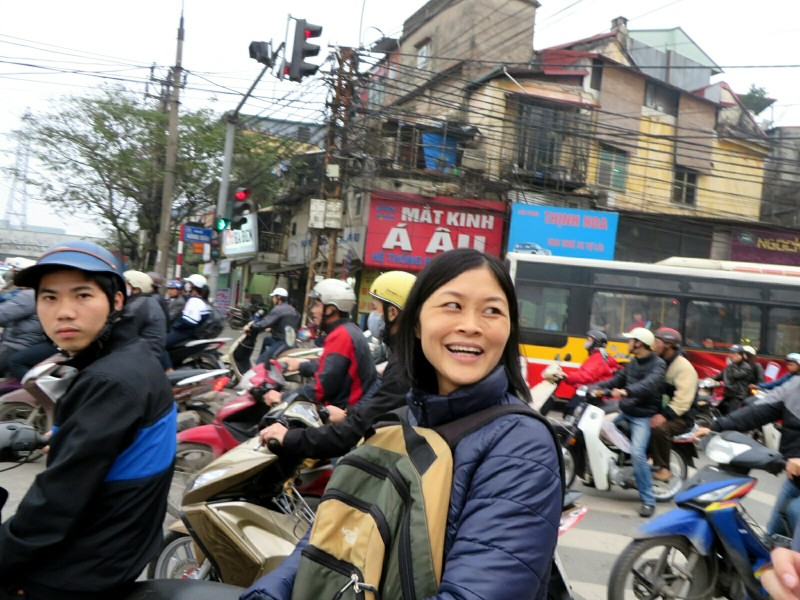

On we went. We got to a big intersection/round about with a lot of traffic as we are approaching rush hour. Looks like it will be a nightmare to cross, but no worries! Ms Moon hops onto the road, nestled in amongst the motorcycles and we walk around the round about in the middle of the pack like we belong there. Very efficient!

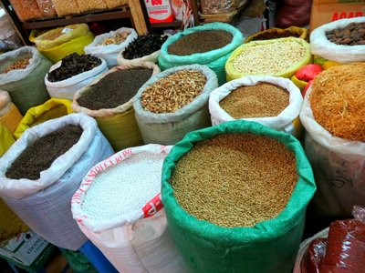

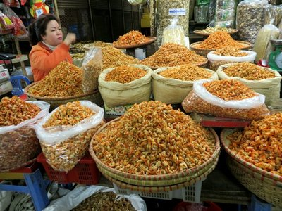

The next stop isn't for eating food, it's for looking at food at Dong Xuan Markets, the biggest market in Hanoi. It's a big colonial style building built by the French. They sell all kinds of produce, meat, clothing, electronic, household goods etc. We avoid the area selling dog meat. Don't think we'd cope well seeing that...

We pop in to Bach Ma Temple, The Temple Of The White Horse, so Ms Moon can say a prayer. No photos allowed inside. Apparently in 1010 the emperor was trying to build a new citadel but it kept sinking in the marsh. When the emperor was meditating he was visited by a white horse (an incarnation of a river God) who showed him a good place to build his new citadel. When the new site worked (it's still standing today), the emperor built a temple in honour of the horse. Maybe the horse should have paid the guy planning Venice a visit...

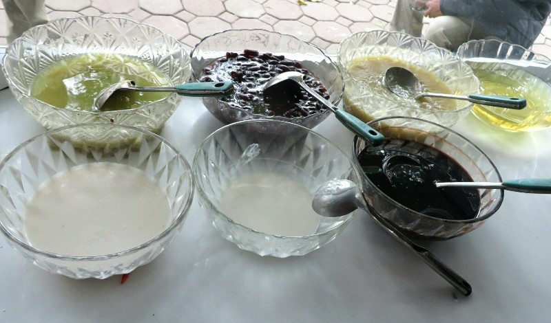

We stopped soon after for Che Hue Nom Bo (a bean tea with sugar syrup and coconut). You ate it with a spoon, so tea may be a misnomer, but it was absolutely delicious. Kate could eat 10.

While eating we found out more about Ms Moon (real name: Hang). She's been married 3 years, she has a 13 month old baby, her husband is an engineer. He plays badminton after work (although she thinks he might really be sitting around drinking beer- she doesn't mind as she does the same). Her Mum looks after bub during the day. Her family lives in the country, she and her husband moved to Hanoi for work (like a lot of young couples). She used to work in a hotel, then as a guide. She has had her own business for a few years now. She likes to travel- most Vietnamese people just want to work to make money to buy a house and a motorcycle, but she wants to see the world. We're on board with that goal!

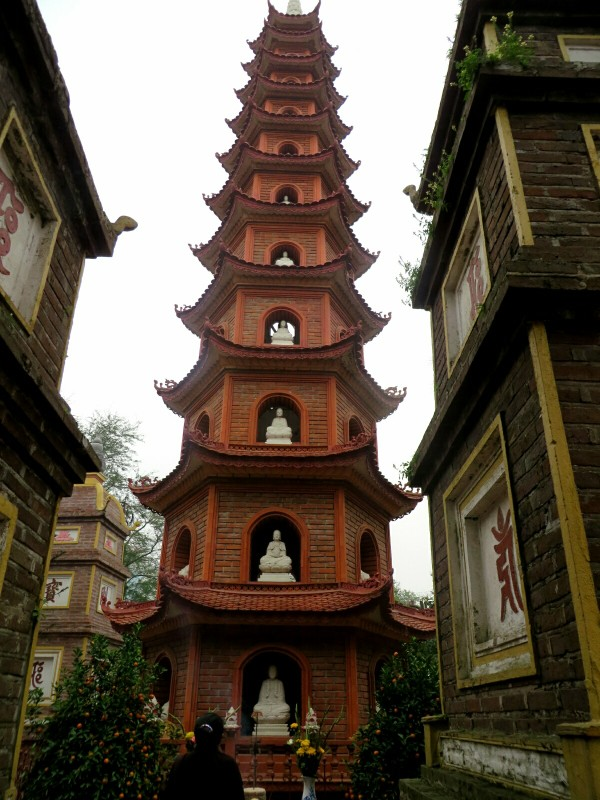

We continue on to West Lake, it's been about 4 hours now so we think we must be finishing soon. We visit a temple on the lake, Trấn Quốc Pagoda. It's the oldest pagoda in Hanoi, built in the 500s. It was originally on the river bank but was relocated in 1615. How do you relocate a temple?

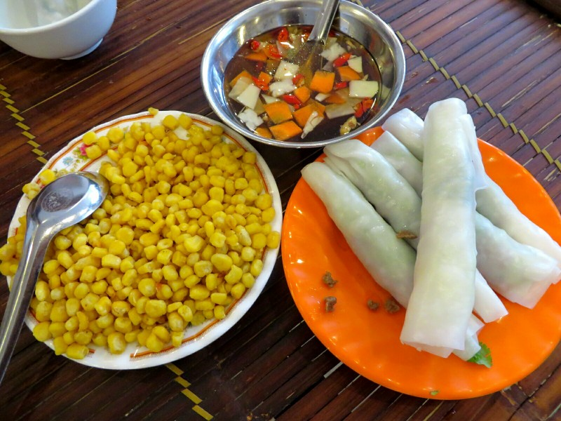

*More importantly, the specialty of the West Lake area is Pho Cuon (fresh beef rice paper rolls). Mmm.*

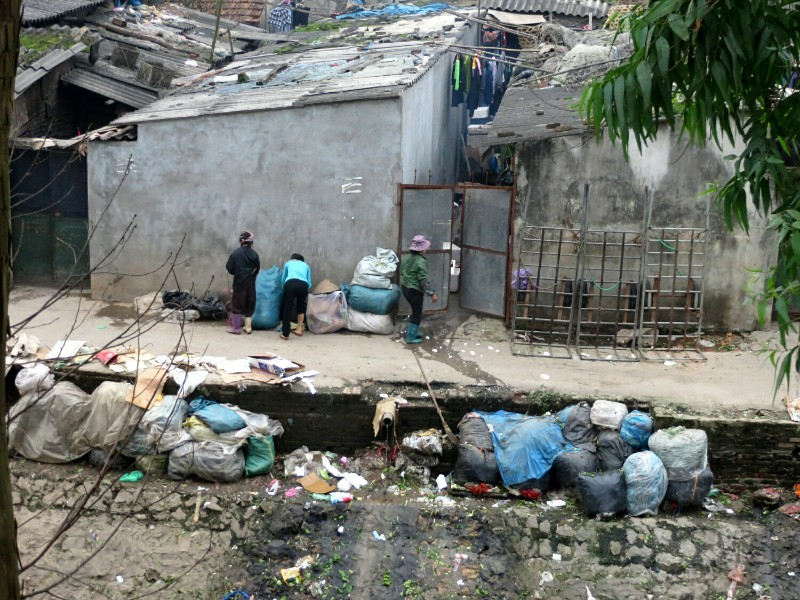

We start walking back to Old Town, then we take a detour. We walk over the local night markets- open at 10pm, get going properly at midnight, peak at 3am. Farmers bring their produce here and sell in bulk to street vendors/market stalls etc. Adjacent to the markets are what look like slums. This is where the farmers stay when they're in town- tiny tin shacks with 10 people to a room. Looks awful, but I suppose country people are poor and they can't afford much on accommodation while they're trying to sell stuff to make a living.

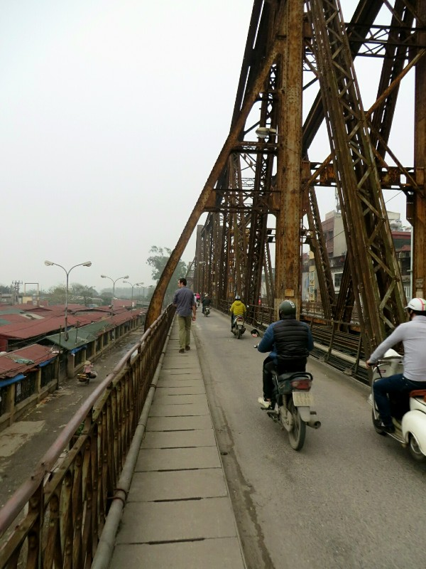

Next we start walking across a long bridge, aptly named Long Biên Bridge. It was built by (you guessed it) the French in 1899-1902, designed by the guy who designed the Eiffel Tower. The US bombed it a lot in the Vietnam War thinking taking it out would cripple the Vietnamese as it was the main bridge across the Red River. As it turns out, after much bombing, they manage to sever it and it didn't cause too much disruption. Oops.

Walking across the bridge is bloody terrifying! It's only for motorcycles and pedestrians but the motorbikes impinge on foot traffic space every now and then leaving you feeling you'll topple off the side. When you're not thinking about that, you're looking at the very haphazard, deteriorating sidewalk beneath your feet- cement pavers stuck to the bridge on either side but no support in the middle where you're putting your weight, loose ones every now and then where the fixing to the bridge on the left or right has come away, and below a long long drop.

We walk over the Red River, there are people living in shacks on the shore (poor country folk again), people farming the little bit of land that hadn't been built on and people dumping rubbish in the river. On the other side of the bridge we feel we're well and truly out of tourist central. It's, so far, a 6 hour tour. We wonder if Ms Moon needs to get home! We walk around a little, then catch a taxi back to town.  We're headed towards her office, so we think this must be it.

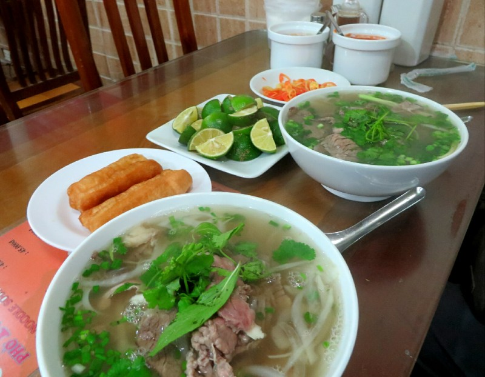

But no, another stop! Good old fashioned Pho Bo (beef noodle soup). So yummy, so many condiments, but we are so full we can only manage a few spoonfuls each!

We leave the restaurant, now we're done? Ms Moon says 'Now for Eel Soup! Then a special egg dish!' We're out, can't fit anymore food in. We apologise and cut the tour short. Almost 7 hours of eating! Ms Moon encourages us to come back tomorrow to finish off. A full day and a full Kate and Pat.
