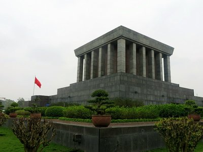
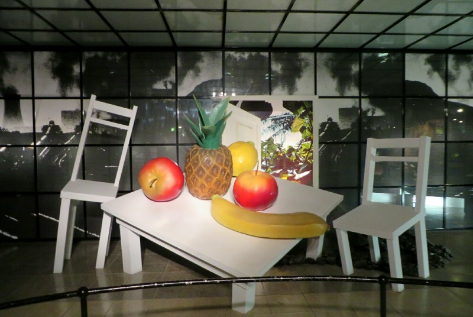
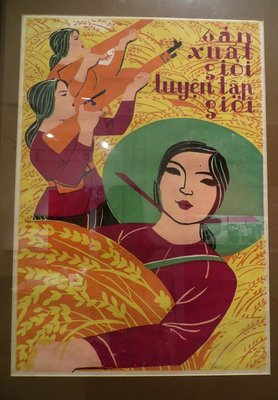
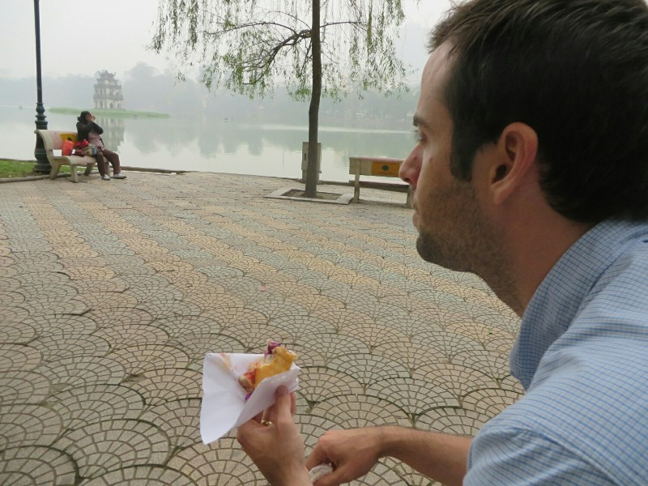
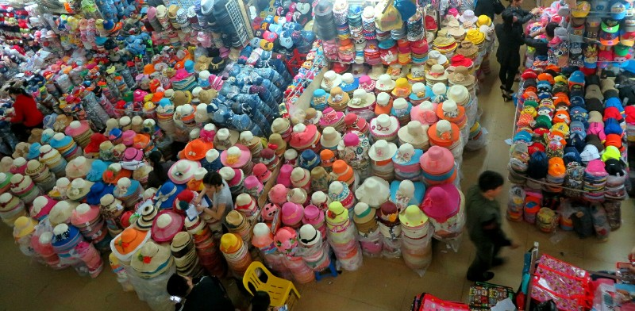
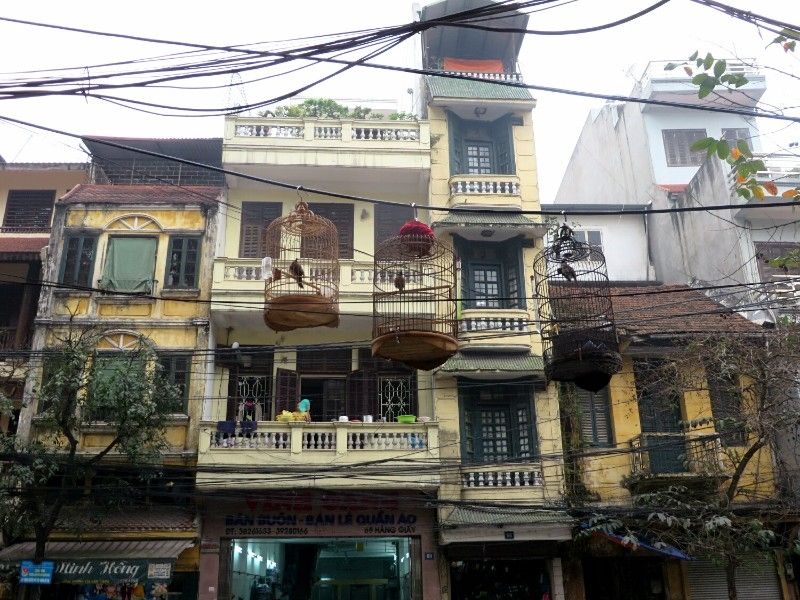
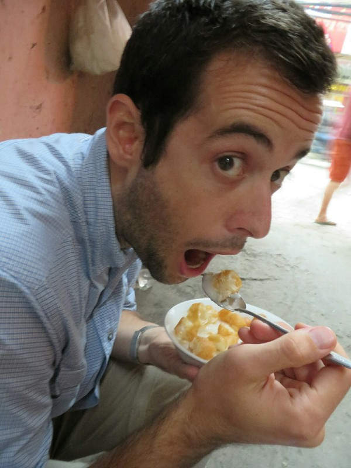
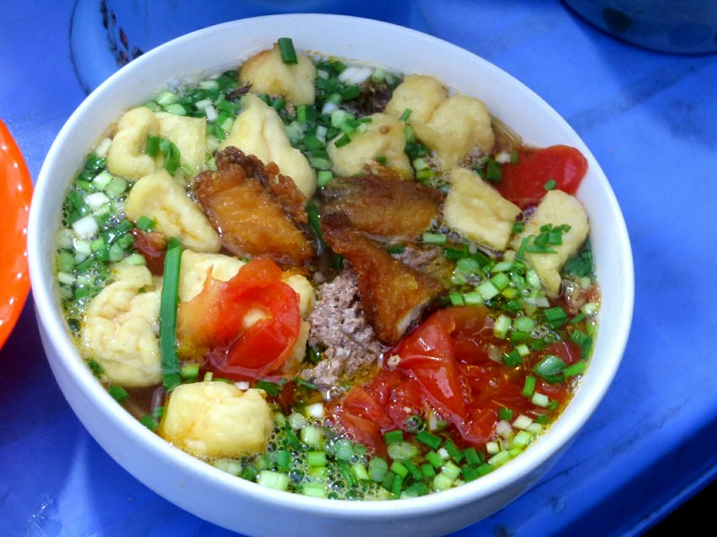
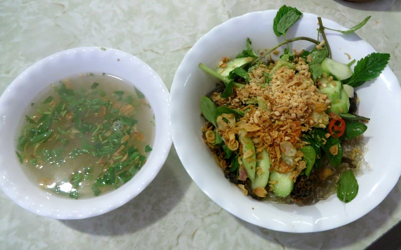
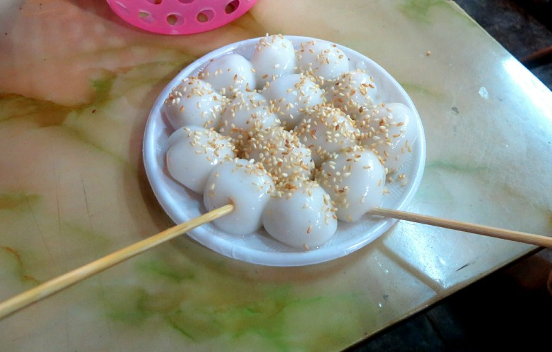

Pat woke up with a head cold. At least we're getting all the illnesses out of the way in the first couple of months?

*Uncle Ho's Mausoleum*

We headed over to the Ho Chi Minh mausoleum. Ho Chi Minh was the communist president of North Vietnam during the war with America. Prior to that he was also a leading figure in freeing Vietnam from French colonial rule, and freeing Vietnam from Japanese occupation during World War 2. He is hugely popular here- he's on all the notes, statues of him everywhere, still mentioned regularly. After a long walk trying to figure out how to get into the complex, then a wait in a queue and a few metal detectors, we filed into the building. Very creepy actually. There was a big central rectangular room with a ramp to walk around the edge and in the middle the dead, embalmed, remarkably well preserved body of President Ho Chi Minh (or Uncle Ho as the locals fondly refer to him).

After visiting the body of the man we went to the museum to try to get a better idea of who he was and what he meant to the Vietnamese people. Unfortunately, it was more like a modern art museum than a history museum. There was no real information, just a bunch of displays and sculptures trying to express the feeling or sentiment of Ho Chi Minh or Vietnam during different periods in history. Without knowing much about these historical periods, you don't get a lot out of a giant bowl of fruit.

*Display Titled 'Ho Chi Mihn and Young People'*

We gave up and did the long walk back towards town. One thing we love about Hanoi is that each street has historically focused on one item- we pass the shoe district, the silk district, the industrial kitchen district... Reminds us of the Simpsons joke about the hammock district on 3rd.

Next stop was the Women's Museum. Again probably an over specific choice when we know so little about Vietnamese history broadly. Despite our limited historical repertoire it was quite interesting. The opening exhibit was about marriage which Pat found very ironic- the museum dedicated to women's empowerment starts with their marriage to a man.

*Propaganda Poster for Women During the War- "Work Well, Train Well"*

They had a documentary about women who sell produce and flowers on the streets of Hanoi. They come from farms in the country where they can only produce enough rice for half the year. A lot of the women are the sole supporters of their family because their husbands have died or been injured at work. They come to Hanoi, buy produce from the more prosperous farmers at the markets then work 16+ hours a day to sell it and earn $30-$60 per month. They live in tiny shared accommodation, rarely seeing their family or children. Their attitude was amazing, not complaining about their situation, just explaining this is what they have to do to get their kids through school.

There was a section on women in the army (40% of the soldiers in the Vietnam War were women which surprised me) and a section on the country's second religion, the Goddess religion. I wish I'd taken more photos there because I can find no information on the religion online and it was quite interesting. The last bit (which Pat skipped) was on fashion. The techniques they use to make their clothing is very interesting, but my favorite but was learning how in small villages they lacquer their teeth. Literally paint black lacquer on their teeth and reapply every few days. Ick!

We headed out and grabbed a Vietnamese Pork Roll (Bahn Mi) from a take away cafe. It wasn't really that good to be honest. We both prefer the ones in Australia. They seem to use processed sausage meat here rather than the nice pork you get at home, and no fresh chili at all. We decided to go on a mission to find a good bahn mi. We researched on Google where the best ones are then went on a long tasting trundle around town. After another two (this time from local street vendors)- still not impressed. Apparently they also make them with doner kebab meat so we'll try that tomorrow. For now, a few fried spring rolls and bed.

The next day we continued our mission for bahn mi starting at a real restaurant; a nice place. We got a delicious baguette with pork, but no real Asian flavor. No pate, no coriander, no chilli... Just a good sandwich. Still not satisfied with our search, we went looking for a doner bahn mi,which should be like a bahn mi but with kebab style meat cooked on a rotisserie. Eventually we stumbled on a cafe that had a rotisserie in the window. The meat looked a little suspect, but so does all the other street food to be honest. We take a gamble and order two. They arrive on a style of Turkish bread, not the baguette that the other have come on so we are immediately a little let down. We wandered to the lake to try them out. Again, very little Vietnamese flavour, but still tasty. We decide we aren't going to find ones as good (to us) as the ones from Adelaide.

*Pat Contemplating the Doner*

Next up- Dong Xuan Markets to look for nice shoes for Pat (in case we want to go out to nice places in Japan), shorts for Kate because she's been wearing Pat's and they don't fit, and a light jumper for Pat now it's getting cold. Struck out on all three! We're too big to shop in Vietnam. Back on the road, back to incessant beeping. Each driver doesn't beep more often here than in other countries in South East Asia, there are just so many more vehicles it's an almost constant nerve wracking drone. There are 9 million people in Hanoi, Ms Moon said there is almost one motorbike per person. Definitely sounds like it.

*Hat District in the Market*

We track down a bakery recommended to us by Ms Moon and gorge on delicious pastries. I've said it before and I'll say it again, the best thing the French have done for the world is to teach their colonies how to bake. Perfect flaky croissant, crunchy baguette, delicious chocolate tart... I'm making myself hungry writing about it. Maybe we won't have to wait until Paris after all!

*Pet Birds Hang from Electric Wires Everywhere*

Once we had our fill of baked goods, we thought we might head home and rest up before dinner. Except that we walked past a beer house and quite rightly decided that it was a much better idea to stop in for a Belgian beer instead. Expensive by Vietnamese standards, but at $5 a beer it's still cheap compared to Aus. Over the beer, Pat decides that he's been all wrong about Asian drivers. After watching them throughout South East Asia, yes they drive a bit spastically, but it works! Everyone gives way, everyone knows how traffic is flowing, and everyone just goes with it. I can't fathom how I would deal driving in this kind of traffic. I can barely be a pedestrian here without fearing for my life.

While walking home we passed Ms Moon's office. Her assistant spotted us and ran out to call us over. Ms Moon insisted on taking us out to finish the tour.

*We started with Chao Suon, a savory rice pudding. Not so good by itself, but yum once we added the sauces.*

*Then! Bun Rieu Ca (crab, fish and tofu soup). Mmmmmm. Sour, best soup so far. Yum yum yum.*

*Then finally Mien Luon (an eel, noodle and vegetable mix plus or minus soup). Fried eel is a bit like fried chicken, actually pretty good.*

*Ms Moon said she wanted to finish off the tour with a beer at a local street bar. On the way she spotted a Banh Troi shop (little sticky rice balls with a lump of brown sugar in the middle). It's Ms Moon's favourite so she treated us to some too.*

![We finished off with draught beer, brewed locally. Ms Moon and Kate were the only females there. Apparently it's rare for women to drink beer or smoke cigarettes here; it's looked down on. Ms Moon laughed and said she likes beer anyway and her husband doesn't mind! There were chickens and a rooster pottering around pecking at the footpath. A man stopped by for a beer on the way home, kids in toe. His cute little girl sat down at the table next to us with her sister. They got out a cake and sang her Happy Birthday. Cute cute cute!](./images/large_IMG_20140330_215144.jpg)

*We finished off with draught beer, brewed locally. Ms Moon and Kate were the only females there. Apparently it's rare for women to drink beer or smoke cigarettes here; it's looked down on. Ms Moon laughed and said she likes beer anyway and her husband doesn't mind! There were chickens and a rooster pottering around pecking at the footpath. A man stopped by for a beer on the way home, kids in toe. His cute little girl sat down at the table next to us with her sister. They got out a cake and sang her Happy Birthday. Cute cute cute!*

While we drink Ms Moon tells us a little more about Hanoi. We asked about how they can eat dogs as well as having them as pets. She says not everyone eats dogs but those who do usually have pet dogs and when the bitch has a litter they pick the two smartest to keep, raise the others to a few months old then eat them. We asked about Vietnamese weddings. Mostly people pick their own partner these days unless they live out in a hill tribe or occasionally in the city if their family is very rich. They still have giant weddings, but at the end brides have to do the dishes. Many brides break down and cry because there's too many!

After our second beer we say our thank yous and goodbyes and head to bed. Ms Moon! What a champ!
