Today we leave Hanoi on a comfy, not packed minibus to Halong Bay. If only we had mini busses like this one all through Laos we would have had an amazing experience! This part of the trip was partially financed by Pat's Uncle Jerry, Aunt Paula and cousins Brandon, Ryan and Ashley. Thanks guys!

We arrive at the boat terminal and the guide passed around a menu with choices for our lunch. Uncomfortable looks all around as the only options were:

1) Dog  
2) Cat

He finally cracked and started laughing at everyone and passed around the real menu. This one looked a bit better, but it still included jellyfish. Should prove to be an interesting few days!

On the tender as were crusing towards the boat Kate and I came to the realisiation that we have potentially made a big mistake. While we don't "hate people" persay, we certainly don't normally go out of our way to engage in conversations with strangers, and an unfortunate necessary part of cruises is sitting at tables with strangers over every meal making conversation. Eek!

The main draw for Halong Bay is meant to be the spectacular scenery - nearly 2,000 islands jut sharply out of the sea and provide a great backdrop for kayaking, swimming, and just lounging on the sun deck. Unfortunately, visibility today is about 50m with a very very thick fog. We can barely see beyond the edge of the boat and can only faintly make out some of the islands when we come close enough to touch them. The sun deck is saturated from condensation from the air.

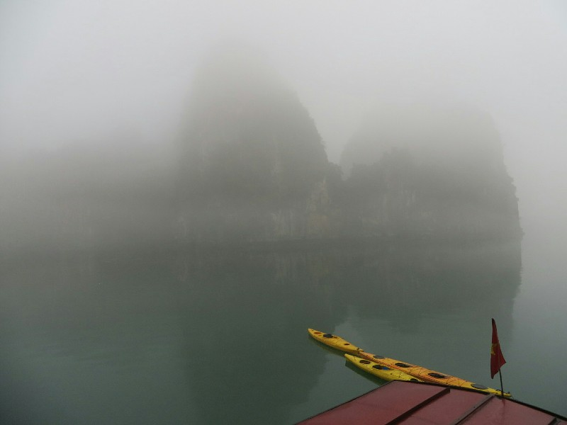

*Eerie Fog*

Our first meal on the boat was seafood city, much to Kate's dismay. She politely picked at a few things, but it's no Ko Ye. Pat found the food quite nice (as much as he could taste through the congestion anyways). We sat next to another young couple Matias and Kate, also on an extended honeymoon (they're in month four). They're from America and it sounds like they're going to be away for a year or more total. Kate (our Kate) also enjoyed that despite sitting next to us, they avoided engaging us in conversation until conversion was necessary to work out what we were eating. I think kindred spirits...

A few brave souls go out kayaking at our first mooring, but Kate and I decide that with me still sick and the weather cold and foggy, we might hold off. Here's hoping it clears tomorrow! Instead we pottered around the boat and enjoyed a couple of cocktails care of Sarah, Cain, Karla and Eddie.

At dinner we sat with the young couple again and a middle aged German couple, but a different seating arrangement which sparked new conversation. Matias is originally from Argentina, so he ended up spending a good portion of the evening reminiscing about all the beautiful places he's been in Argentina. By the end of the meal, we were convinced and had all but booked our flights to Patagonia. Not won over by the $60 price tags on all the wine from the boat's drink list, we went back to the cabin after dinner to try our Vietnamese bargain bottle. About what you would expect for a $2.50 bottle: not great. Saved the second half to struggle through tomorrow night and turned in.

Having taken a couple night time cold and flu tablets before bed, Pat slept like a rock until about 6am. Kate was a bit less lucky and tossed and turned a bit, and woke up a little grumpy. Not at all like her usual chipper morning self.

We arrived for breakfast at the appointed hour only to find two empty seats in the middle of different tables. Kate asked the waiter if he could pull up a chair to one of the tables so we could sit together, and he instead started asking people to move that were already eating. Not at all what we had in mind! We said never mind and made our ways to our separate seats. You'd think after 6 straight weeks being together we would welcome a brief reprieve from each other's company, but neither of us being morning people, we tend to enjoy our shared morning silence. Somehow, we survived.

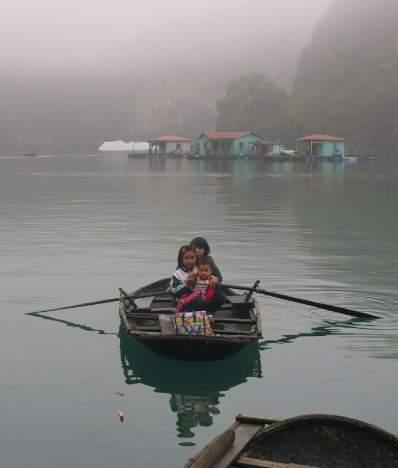

*Halong Bay School Bus*

Our first excursion for the day was to a local fishing village where all the residents live on floating houses. They used to keep the houses bouyant with bamboo, then when that started to rot they moved to large styrofoam cubes. Unfortunately this caused big issues with pollution (styrofoam degrading and little balls floating out into the water) so about 3 years ago the German government donated a bunch of big plastic drums to float the houses on. Looks like about 60% have upgraded, then they ran out of money. Pollution used to be a huge problem, but as the village learned that cleaner water lead to more tourists, which in turn lead to more money, they've tried to clean up their act. We hopped on little 3 and 4 person boats rowed by locals and had a look around. First off we went to the local primary school and saw all the kids rowing home for lunch, then we rowed over to the oyster farm where they create pearls. It was pretty interesting to see, especially when they shucked an oyster and popped out a pearl in front of us. There was a slick of pollution on the surface of the water, quite a few small dead fish (went overboard on the styrofoam?) and a small amount of floating rubbish. Looks like they have a little way to go yet.

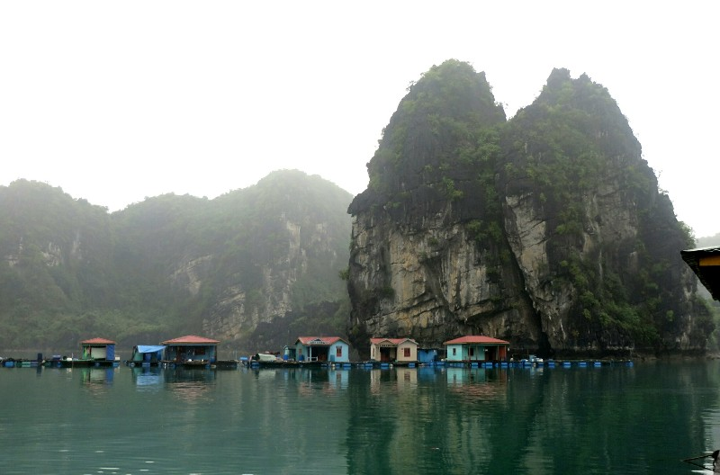

*Who Needs A Solid Foundation?*

After that - back to the boat for lunch. Another 5 course deal (we are getting little potbellies :-/) and we sat with the German couple again. They're very nice, big travellers, divers and trekkers. The afternoon excursion was a kayaking trip to a 'remote beach' where we could swim, play soccer and apparently play with puppies. Sounds too good to be true... We set out on our kayak. We are still not very good, but having a real kayak instead of a blow up one means it's a lot more comfortable, no broken nails and significantly easier to handle.

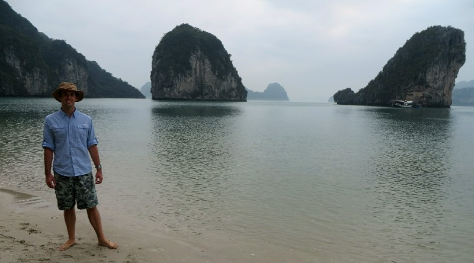

*Pretty Scenic When We Could See It*

Arrived at our 'remote beach', which was in fact the same beach every boat with this company takes their passengers to, so it was well equipped with deck chairs, rubbish bins, a shelter, and at least one boat load of other tourists in addition to ourselves. Oh well, still ridiculously scenic! The fog started to lift a little and the sun even made a guest appearance for a few minutes. Everyone 'ohh'd and ahh'd' and took pictures. The crew played a game of soccer against the passengers. I guess this is the only chance they get for a real run around working on the small ship all the time. One of the local dogs had just given birth to a litter of 8 puppies 2 weeks ago, so they were all happily trotting around the beach and soaking up the adoration of all the tourists. They had their fill of cuddles and then formed a puppy pile and all took a nap. Cute. (Don't worry Mum, we didn't touch them.)

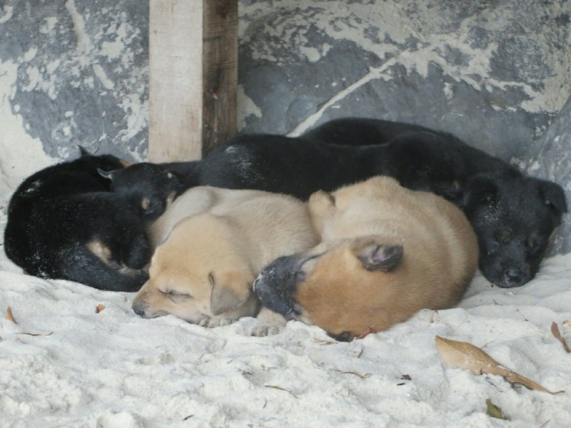

*We Have Seriously Amazing Self Control*

We had a bit of time on the boat to shower, then we are off to dinner in a cave and a special surprise. Oooh. The cave is up on the cliff face on the same island that held the beach. We walked up almost 100 steps, all lit with tiki torches, from the tender to the entrance to the cave. Inside the cave was a long dining table with candles and roses set up. It was very picturesque, very romantic. Our guide told us the owner of the cruise company we went with (Indochina Junk) has a 50 year lease on the island. He created the beach and convinced some villagers living in the cave to move out so they could use it for these dinners. Not sure how I feel about any of that- kicking out villagers and altering the island so substantially when it's a UNESCO World Heritage Site, but decide to not think about it too deeply and just enjoy dinner.

It was another 5 course fare, but this time with every course they brought out these amazing food carving creations made by the head chef. Unfortunately we forgot the real camera, but you can get an idea from the camera phone photos.

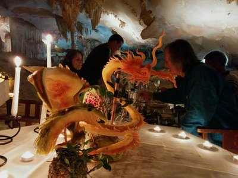

*Pat Carved These Between Courses*

After all the delicious food the guide singled Kaitlyn and Mr James out and made us close our eyes... We did so but it was pretty nerve wracking! Kept expecting to open our eyes and have someone right in my face or something. Eventually we were told we could open in 3... 2... 1....... And they had a big chocolate cake between us and all sang 'Happy Honeymoon to you" to the tune of the birthday song. We got a very pretty carved shell as a gift and the whole crew wished as a long and happy marriage. It was really nice!

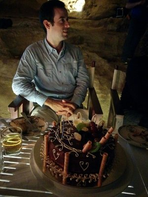

*Our Honeymoon Cake*

After that we all ate cake (devastated we had to share it) and the guide had us all sing a national song. To be honest, the 9 Aussies sucked compared to the German and English couples. We spent 5 minutes trying to agree on a song and the guide ended up instructing us to sing 'If You're Happy And You Know It'. Very Aussie. On the way back to the boat the moon poked out from behind the clouds a few times and we admired the islands lit by moonlight before turning in.

After breakfast on the last morning, the ship's chef did a cooking demonstration, which involved very little actual cooking. None, in fact. What he did show us was how to carve two intricate swans out of vegetables using only a sharp knife and some super glue.

Then the cruise was over and we were transferred back to shore to await our transfer to Hanoi. Despite the unfortunate visibility the first day and a half we had a great time! As we left the boat at 11.30 the staff remade the rooms and set up for the next group embarking in an hour. They must never get a break! Meanwhile we were waiting for our minibus back for quite a while... Eventually we found all cruises today had been canceled because of storms, so the minibuses that would normally be empty to take us were full of the next lot being returned. We were really relieved it wasn't us getting bumped! Apparently they still charge you for a day, even if the day is just driving from and back to Hanoi!

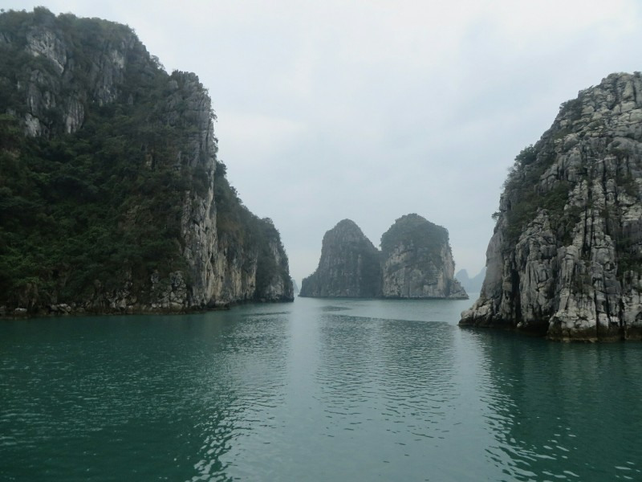

*As We Sail For Shore, The Fog is Clearing*

We ended up on the fancy, decked out minibus with big leather seats and for some reason a suede ceiling. We stopped part way back for a traditional Water Puppet Show. I'm glad we went for the experience, but honestly not that exciting. In fact I think the most interesting part of the drive was exiting a 4 lane highway on a 2 lane offramp that curved in a wide circle back on itself- in the middle of the circle was a mini rice paddy with two Vietnamese women in triangle hats working the field and a man with a buffalo plowing! Not what you expect in such a small space, surrounded by highways

In Hanoi we said goodbye to Matias and Kate and headed back to our hotel in the drizzle to wait 3 hours before our airport transfer. Guess how we killed time?

After our Bahn Mi and Pho we were picked up by our dodgy driver, who didn't help us with our bags (until Pat insisted he did, on principle) and picked a mate up on the drive too. But at the end of it, we arrived at Hanoi airport.

Despite the disorganization, bad weather and difficulty getting a bahn mi how we want it, we've both really enjoyed this taster of Vietnam. We hope we can come back for a bit longer in the future and do a trip north to south to explore (and eat) more!

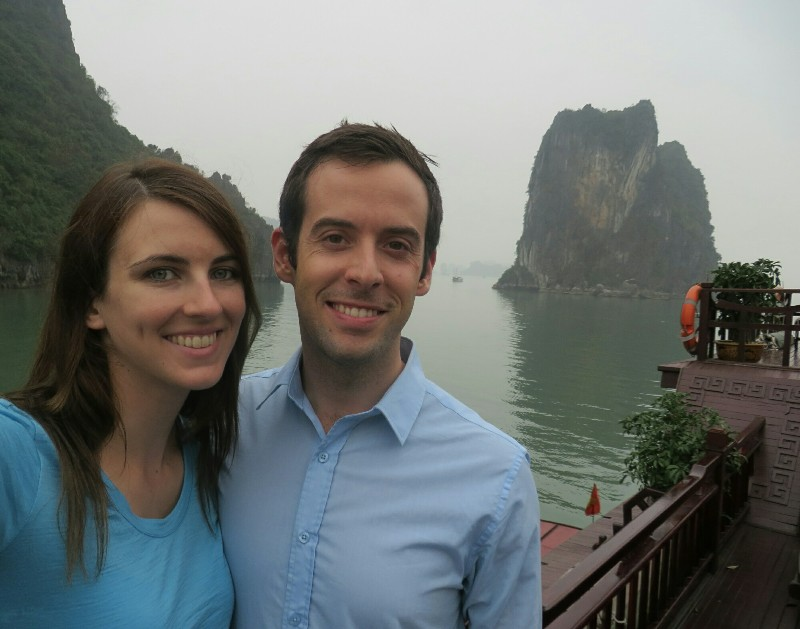

*Awww*

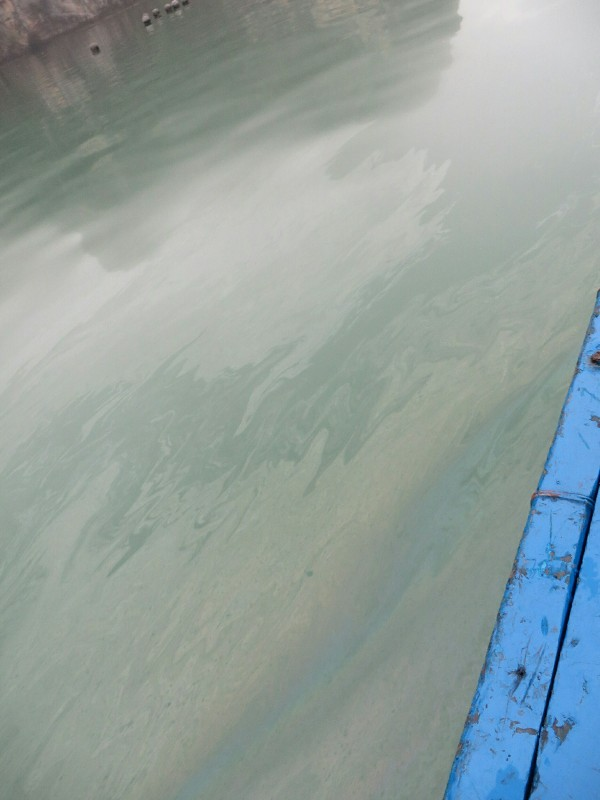

*Lovely, Clean Water At The Village*

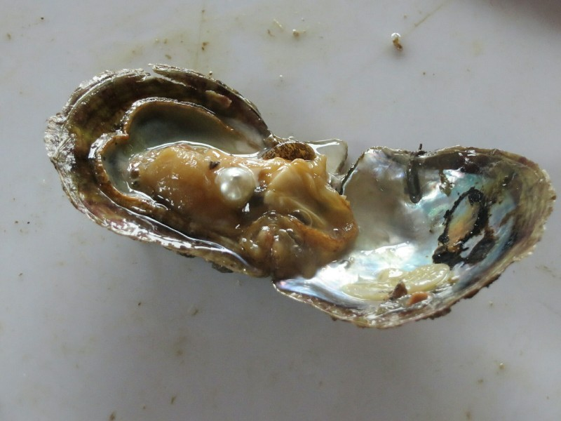

*Oyster With Fresh Pearl*

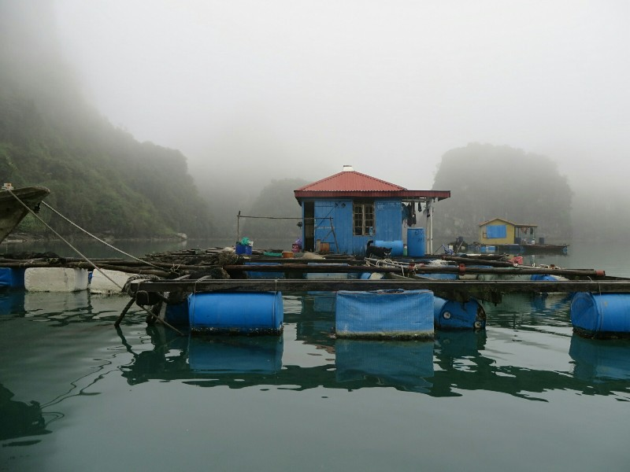

*Floating House With Pet Dog*

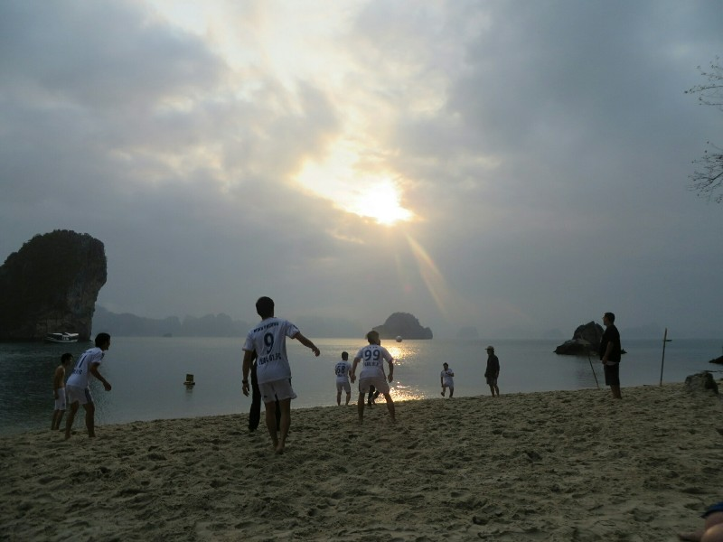

*The Crew Had Their Own Soccer Uniform*
