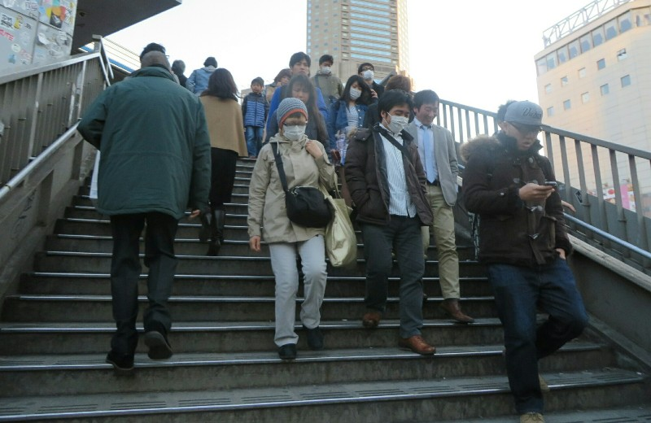
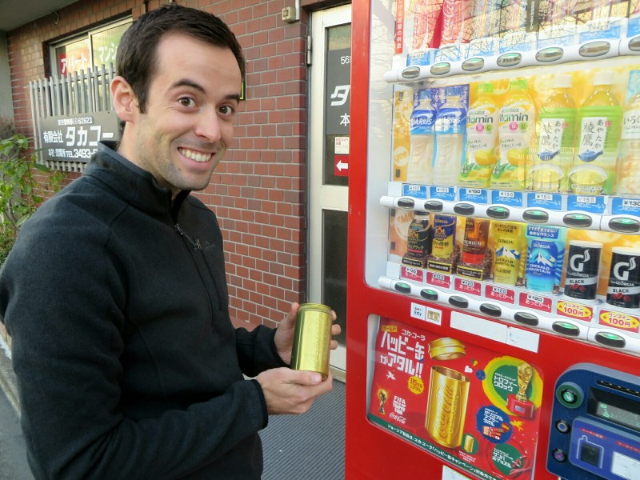
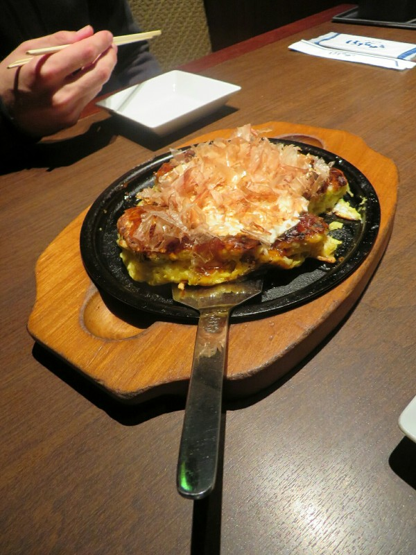
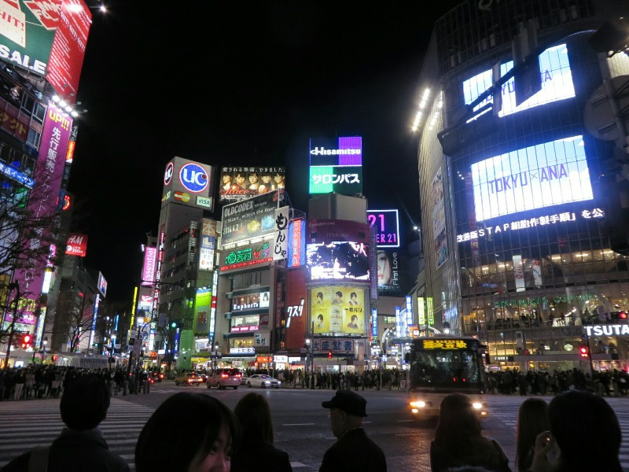

Our flight departed Hanoi just after midnight. It seems the entire airport was designed to assault the senses in every way imaginable. The temperature was uncomfortable and humid, the florescent lights were half dimmed and flickered constantly, the crowds of people were nearly unbearable at every stage of the process (check in, immigration, security) with people constantly trying to jump the queue or just unhelpfully milling around the area where others needed to queue for no apparent reason. There were seeming eldless, crackly, unintelligible announcements over the PA system with bursts of static so severe they sounded like gunshots. Kate, unsurprisingly, developed a migraine.

Eventually we made it though and boarded our flight, utilising the full 2.5 hours before our flight was scheduled to depart just to get through security and to the gate. The flight itself was comfortable and uneventful and we both got a few hours of much needed sleep. Still no luck on an upgrade to business with the honeymoon ploy, but Vietnam Airlines did give us exit row seats!

Arriving at Narita airport in Tokyo was like stepping into an alternate dimension. Immigration and customs were orderly and painless, the staff were all fluent in English and genuinely friendly, we cleared both in under 20 minutes. The arrivals hall was tranquil and quiet, with only a handful of people milling about and classical music softly playing in the background. Once we figured out what train we were meant to be on (a train with the clearest and most timely PA announcements we've heard anywhere in the world), we saw an old friend that was absent for 90% of our time in Vietnam: the sun! While it is a chilly day, it is absolutely gorgeous outside with perfectly clear skies.

*People Are So Well Organised- One Side Up, One Down*

First impressions of Japan are great. We've asked for help a few times already and everyone has been extremely accommodating, speaking to us in English and pointing us where we need to go. Things have been clean and well signed (in English which is a surprise), and the toilets appear more intelligent than you or I. I'm sure we will have a full post on them soon enough. Bryan, our local host via Airbnb, sent us very detailed instructions on how to get to the apartment and also let us know that we can check in early if we need to. Don't want to jynx it, but so far so good in Tokyo!

We arrived at the apartment a bit early and could hear a vacuum cleaner inside, Bryan was still cleaning and said we should come back in 30 min. We dropped our bags and went for a wander exploring our local mini marts, of which there were approximately 7 million, give or take. They all seem to have an amazing selection from normal groceries to business shirts to porno mags to fresh fried chicken, steaming dumplings and beautifully presented bento boxes. They have high quality coffee machines that give you better coffee than you get in some cafes in Australia for $1.50... Awesome. Kate and I were fascinated by the vending machines that dispensed both hot and cold drinks (what a technological marvel, we thought) and were literally everywhere, including minor residential streets. So we put one to the test and bought a canned hot chocolate. Much to our satisfaction, it was actually quite good, and definitely hot! This is one thing we certainly wouldn't mind catching on in western countries.

*Bonus Gold Can Pat Got With a Hot Chocolate. Had a Whistle Inside! Best Day Ever*

We looped back to our apartment and saw where we would be living in for the next few days. It was surprisingly big, or at least bigger than we were expecting for central Tokyo. It had a teeny tiny kitchen, a  "cosy" bathroom, and a main room that was big enough for a semi double bed and a table with two chairs. Perfect! After we had a little nap and did some laundry at the laundromat on the ground floor, we bundled up and made our way into the city in search of food. Always food!

Our journey took us to Shibuya, the center of the CBD similar in many ways to Times Square, but you know, in Tokyo not New York. We wandered into the food court of a shopping mall and into a little 10 seat restaurant and ordered something similar to an egg omlete (okonomiyaki) with cheese, bacon, mayonnaise, some kind of Asian BBQ sauce, wafer thin fish flakes, and pickled ginger. Sounds weird, and it was, kind of, but also delicious.

*Super Rich Okonomiyaki*

On we went, wandering down the pedestrian malls, still not used to the 25 degree difference in temperature between here and most of South East Asia. It is very cold. There are people everywhere, massive video screens on the buildings, signs and lights beckon you into every shop - its exactly how I imagined Tokyo would be and I love it. The organisation is also top notch: people walk on one side of the footpath, cars stop for pedestrians, pedestrians obey the red and green walking man, on stairs one side is up and the other down, people stand precisely, single file on one side of the escalator to let people walk up the other side. It's all just natural to them and it really makes wandering around a pleasure.

Feeling a bit cold and tired, we catch the train back to our end of the city and call it a day.

*Tokyo Lights*
