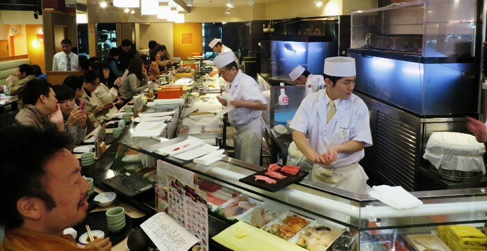
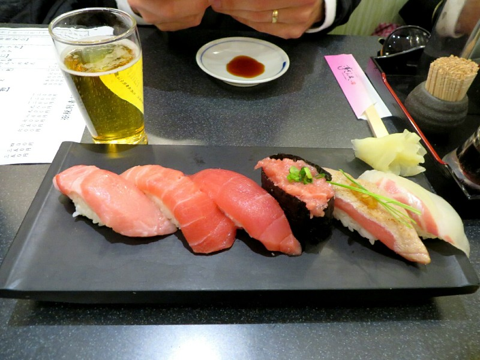
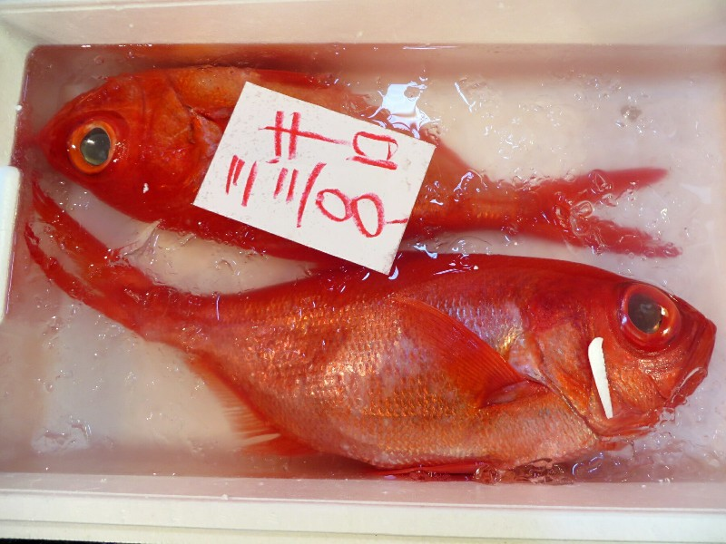
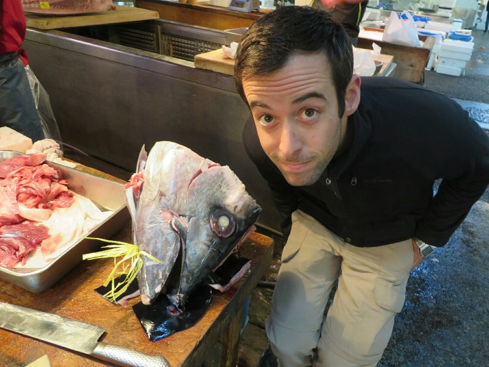
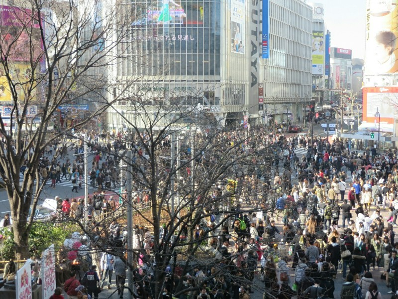
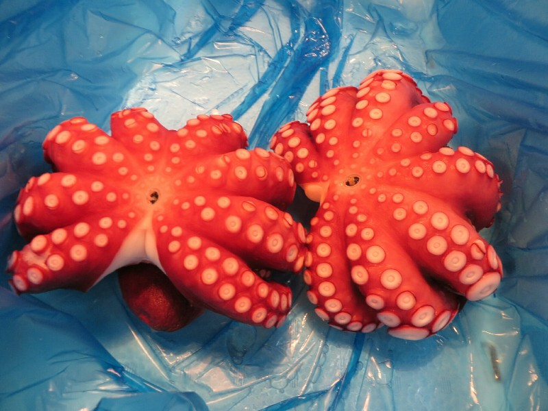
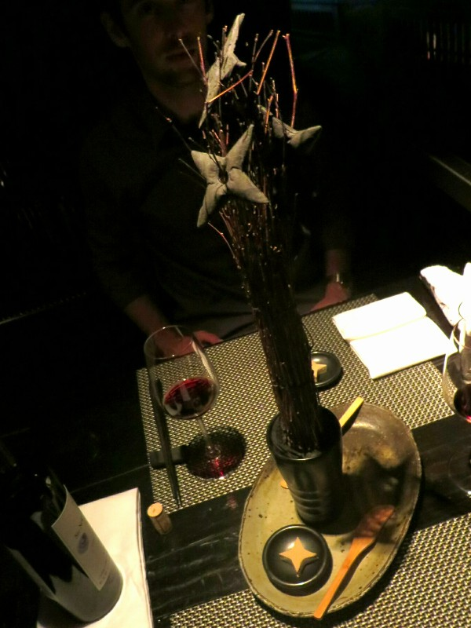
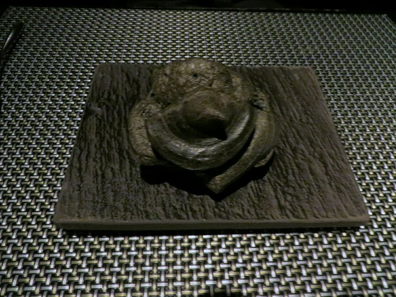
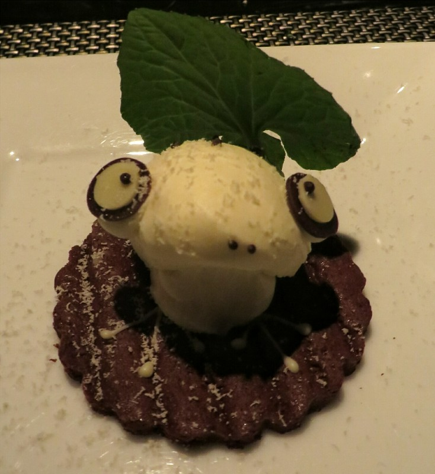

We wake up bright and early (for us, anyways) and hustle to the train station to head towards the Tokyo fish market (Tsukiji). Google maps is so impressive here that not only does it have the whole, to-the-minute timetable for every train company (of which there are several), it calculates the fare for you, including any transfers between companies. And we thought we had it good in Adelaide with "estimates" of the bus schedule available on Google.

We arrived near the outer fish market and looked at a map posted near the metro station. Apparently we didn't exactly exude confidence because a helpful man approached us and proceeded to tell us all about the fish market, where to go, and when things would be open to the public. This would become a theme every time we seemed confused. The people here are very generous! (Or at least the ones who want to practice their English are)!

We walked over to the outer market to start with. They sell everything fish related here- Japanese super sharp chef's knives, pots and pans, actual fish (fresh or marinated), fish market T-shirts, giant fish hooks, gumboots, all the way to sushi shaped erasers. There are also a lot of restaurants selling sashimi made from fish purchased this morning. Even when we arrived just after 7 some restaurants were full (including a line out the door) of people starting their day with sushi and a beer or two.

*Sushi Zanmai Kitchen*

We joined the longest queue (assuming this will get us the best food) and waited. And waited. Man it was cold. After 30 minutes not one person in the line had been let in and Kate was thinking about going elsewhere. Thankfully within 5 minutes of this thought a large crowd left and everyone up to us was let in! We were led to a seat! Which was apparently the end of the inside queue.... Bummer. At least it's warm inside and we can watch the chefs. The inside line also moves faster so after 10 minutes and moving seat a couple of times we are shown to a table. Everyone cheers when you are seated: all the waitstaff, the door staff, the chefs. It does make you feel pretty special. We got a tuna sushi nigiri tasting platter- a broiled tuna, a minced tuna, a normal tuna, a semi fatty tuna and a fatty tuna. And a beer, you know... to fit in.

Oh my God.

Neither of us have ever had fish this good. This is one of the best things we've ever eaten. The normal tuna is so fresh and delicious. But then you try the semi fatty tuna and it's so much better, so soft with just a hint of spice from the wasabi. Then the fatty tuna. This is the most scrumptious thing ever. I can see how they get away with charging $4 per piece. It's unbelievable, you want to savour how amazing this tastes but it just melts away in your mouth and before you know it, it's gone. And your wallet's out to buy another one.

*Quite seriously- come to Japan just to eat this fish. Just fly in, have breakfast, go home. It's worth it.*

Once we had our fill of sushi (we may have ordered a second tasting plate) we began wandering through the stalls towards the inner fish market. Kate was leading the way through the crowds and Pat was flowing close behind when he felt a tap on his shoulder. He looked around to see a smiling middle-aged Japanese man and his wife looking at him and asking where he was from. They were excited when he said we had traveled from Australia and proceeded to rattle off all of the Australian cities they had been to and how much they loved the country. I suspect they were just looking for an excuse to practice their English, but they still seemed genuinely happy to stop and have a chat with a random stranger. We are both finding the Japanese people very friendly, helpful, and welcoming so far.

After we regrouped we head over to the inner market. Inside there are over a dozen smaller restaurants, several with queues holding well over 150 people waiting to get in. Maybe we peaked too early? Either way, we are glad to not be waiting in a queue that long. We wondered if these people paid attention to the auction results from earlier in the morning and went to the restaurant that got the best fish, or if it's the same restaurants each day that have the big crowds.

*Radioactive Glowing Fish*

We made our way to the intermediate wholesalers area, now this is a fish market! Every fish and sea dwelling creature imaginable seemed to be on sale here. Stall after stall had large tanks filled with assorted sea creatures, some still alive and swimming. After a while of aimless wandering, and again probably looking a bit lost, a random man pointed us towards a stall where an extremely large chunk of tuna (at least 1.5m long and 50cm in diameter) is being prepared for shipping.  Only having a vague idea of how expensive tuna is, we can only guess at how costly that chunk would have been. One thing is for sure though, we know how delicious it is.

*Some Fairly Big Fish*

As all the stalls started to close up for the day, we started walking towards Ninja Akasaka to confirm our dinner reservation for the night. We pass lots of joggers, people walking and carrying their fully dressed dogs (down to shoes), big buildings, and not a single piece of rubbish on the ground. Quite literally, we could count on two hands the pieces of trash we have seen on the ground while walking through the city. The cleanliness doesn't stop there. Every car we have seen, including commercial trucks and large recycling trucks have been sparkling. Buildings are scrubbed clean with clear, streak-free windows. Trains have also been spotless: every carriage has been impossibly clean and almost looks brand new. No windows are scratched, no gunk on the floors, no graffiti in stations (or anywhere else for that matter) It's amazing - nothing has been missed. Neither of us have ever seen an entire city so clean. It's almost frightening...

After confirming the booking, we grabbed a quick bite from a convenience store near the train station: freshly made salmon, prawn and roe sushi, asparagus wrapped with bacon, and a few pork dumplings. Amazing the quality of food you can get in mini marts here. Next- Kate wants a dress to wear to dinner. Unlike Australian shopping districts where the majority of shops are for clothing, most shops here are for food, cameras or DVDs. We try a couple of places and strike out, then end up in a 5 storey, massive H&M. Within 5 minutes we lose each other. It took what felt like forever (but was probably a half hour) to find each other. Kate was imagining Pat had been kidnapped by the Japanese Triads or something. It's much harder to spot each other here than it was in South East Asia. The people are a lot taller (we don't tower over everyone here) and they wear the same clothing as we do. Pat kept seeing tall dark haired girls in clean jackets from behind, going up to say 'where have you been!' then realizing they were actually a Japanese girl.

*Trying to Emulate The Intersection At Rundle Mall?*

Reunited at last, Kate decided on a dress and we hustled to the train station to make our reservation, a gift courtesy of Lap and Em (Lapily? Lem?). We showed up at the restaurant's matte black facade with only a nondescript black sliding door inviting (?) us inside. The reception area was dark and cramped, the whole of it covered with black paint. Our ninja was summoned by a firm rap on a hidden door by the maitre d'. He emerged in full ninja regalia, cloaked in black with a mask covering his face, slightly hunched over as if eveading the keen eyes of a nearby enemy watchtower. He hurried us through the door and lead us through a complex maze of corridors, past waterfalls, and stopped at a large gap in the floor where we could see down one level and a wall blocking our passage on the other side. "Secret passage", he whispered, and waved his hands in a decidedly ninja-like fashion. The wall opposite us started to lower like a drawbridge and we continuted on our journey through the labyrinth.

The layout of the restaurant is very unusual, sectioned off into small enclaves spread over several half levels connected by small staircases and narrow passageways with a soundtrack of forest noises playing throughout. Tables are mostly isolated so your experience is very private. An incredibly well put together theme restaurant!

Our menu was presented to us on a scroll and we opted for a 10 course tasting menu so we didn't have to make any decisions. We also took a gamble on a local Japanese Cab Sav which turned out to be very nice. All of the courses were ninja themed in some way and were all very dark, so they didn't photograph well, much to Kate's dismay. Each course was incredibly tasty, though. Lots of seafood with some pork mixed in for good measure. Kate's tolerance for various types of seafood has improved significantly on this trip so far and she's actually enjoying some things she previously avoided. About two thirds of the way through dinner, a ninja came over to demonstrate special 'ninja magic'. This involved some rope and ribbon tricks, some card tricks and some cup and ball tricks. The early ones were usually pretty easy to follow but some of the later ones were really good! Even Pat was impressed!

After stuffing our faces we called it a night and headed home.

*Poor Octopuses... Octopi?*

*Ninja Star Crackers*

*This Could Probably Have Looked More Appetizing...*

*We Felt Pretty Bad Eating This Guy... Not That it Stopped Us*
