Slow morning after a late night. Had a sleep in, then eventually got moving. As soon as we exited onto the street we ran into a harajuku girl. Excellent start!

Plan for today was to try a ramen place recommended by Em Loh, then take a walk recommended by Matias (from our cruise in Halong Bay). We headed to the station- the streets and trains are a lot busier today. Guess Sunday is outing day in Tokyo. In Tokyo when the train arrives at the platform a little upbeat jingle plays. At the end of the song, the doors close and the trains go. On the trains they have screens displaying information about any delayed trains or lines and the reason for the delay. One line was delayed because of 'person delay in doors' and another was closed because of 'person injury'. Gives a very morbid mental image- cheerful tune reaches an end as a person gets squished in a door...

We got off at our stop and went in search of Mutekiya Ramen shop. There's a lot less English out here and we're not sure where we're going... Until we spot a 40 person queue in front of a shop with a lot of Japanese characters and one distinguishable word- Ramen. Must be it. We settle in for an hour and a bit wait. Maybe Sunday lunch wasn't the wisest time to come. But we have faith this will be delicious enough to be worth it.

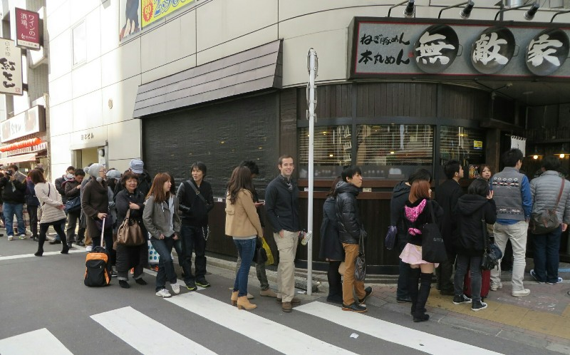

*Queueing for Ramen at Mutekiya*

While we wait we watch the Tokyo locals pass us by. A lady in a kimono, lots of people with little dogs in their handbags, trucks covered in anime cartoons blasting cheerful music, lots of people on bikes and not as much traffic as either of us expected. There have been cars, yes, but we liken it to "congestion" in Adelaide, not bumper to bumper, streets packed full of cars, big city style traffic. We know it's not, but it looks almost pleasant to drive through downtown.

As a quick aside, we've also been extremely impressed with the train system and think it is a great example of what happens when private companies invest and compete against each other. There is an intricate system built and maintained by several different companies operating on different lines, yet they somehow manage to all run on time, to the minute, and handle transfers between lines seamlessly. And its 1/3 of the price of a bus ride in Adelaide (assuming the bus shows up). Had the government tried to build a comparable system, we can only imagine it would have blow significantly over budget, taken much longer to complete, would have fewer stations, and tickets that were unaffordable. Sorta like Adelaide...

And we're in! We're treated to the most delicious bowl of ramen you can imagine. The broth apparently simmers for 16 hours and is super rich and full of flavour. The noodles have the exact right consistency, slightly resistant to bite but not undercooked. And slow cooked pork that melts in your mouth. And some fresh green veggies to stop it being too heavy. They even have fresh garlic for you to crush in to taste. Heaven. So rich though neither of us manages to finish the bowl.

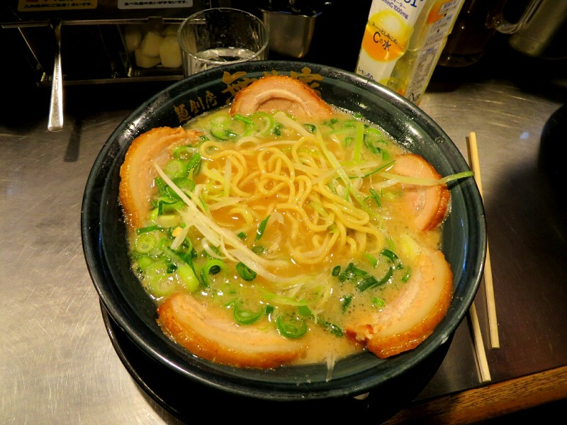

*The Most Amazing Ramen of All Time*

It's quite a bit later than we were expecting now due to the queue. Not that we regret that ramen for a second! We head to Harajuku to start our walk.

First stop is Meiji Shrine, a Shinto shrine housing the spirits of Emperor Meiji and his wife, Empress Shōken. They were the rulers in the 1920s and introduced Western culture to Japan. The path to the temple is lined by massive trees, it's extremely picturesque and hard to believe we are still in the most populous metropolitan area in the world. All the locals and tourists follow a custom of hand washing, mouth washing, bowing and clapping to make a prayer. Pat goes through the whole thing but forgot the prayer part. Oh well.

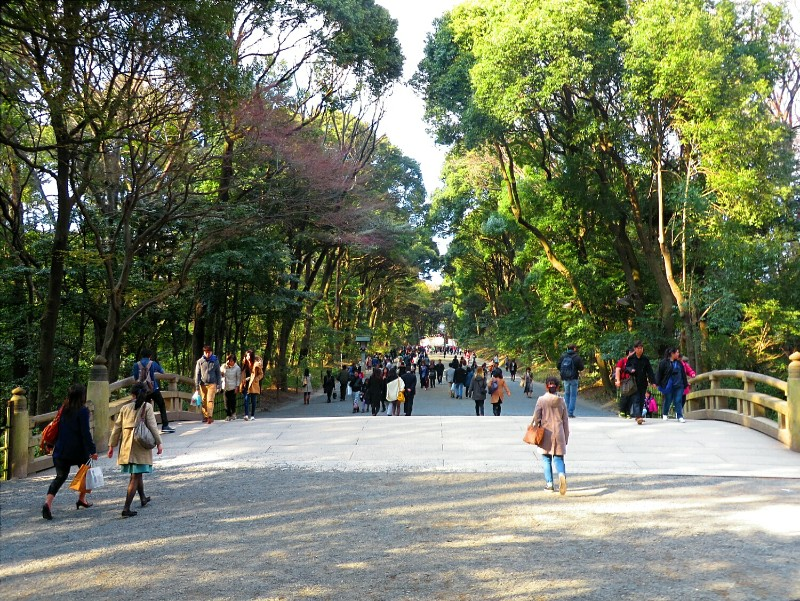

*Path to the Meiji Shrine*

Next we head to Harajuku proper- the teenager haven of Tokyo. It is packed! Locals, a lot of tourists, definitely a varied group of people.  We stroll down a pedestrian mall,  well,  perhaps stroll isn't the right word -  we float with the massive crowd of people, shoulder to shoulder. One thing Harajuku is particularly famous for is 'Harajuku girls', teenagers who dress in outrageous, colorful outfits and look like anime characters. We were under the impression that these girls dressed up like that as a fashion statement, and perhaps that's what it used to be. Today, most of the people we saw dressed in "Harajuku style" seemed to be there just to pose for pictures for tourists. And much to our surprise the practice is not limited to teenage girls,  middle age men seem to get in on the action as well. Oh well, to each their own!

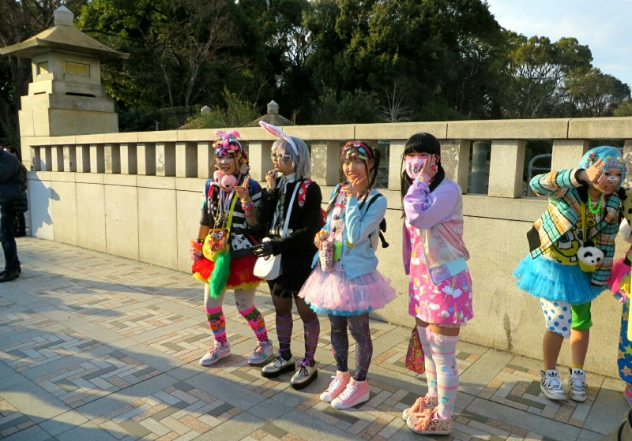

*Posing for Tourists*

After we wolfed down a ridiculous crepe (Pat's had a slice of chocolate cheesecake, chocolate ice cream, the sweetest cream ever, and chocolate sauce wrapped inside), we attempted to follow the second half of the walking tour that was recommended to us by Matias. As it turned out, this part was more of a walking tour of upscale, vintage or quirky shops, something which didn't appeal to either of us very much. So we went rogue and found a nearby park (Yoyogi Park) and went for a bit of a stroll at sunset.

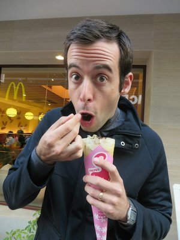

*Mmm... Crêpe*

There were all sorts of people in the park going about a variety of activities: picnics, frisbee, baseball, bands practicing,  rockabilly dancing complete with 50's style hair straight out of Grease, skating, dog in boots and onesies going for walks, and some weird things we didn't recognize or understand. Perhaps for the best. We also saw about 40 people sitting under the two cherry blossom trees that were in bloom having a picnic. Looked like fun!

We people watched til it got too cold, then headed home with plans to finish our trip to Tokyo with one more visit to the fish market in the morning.

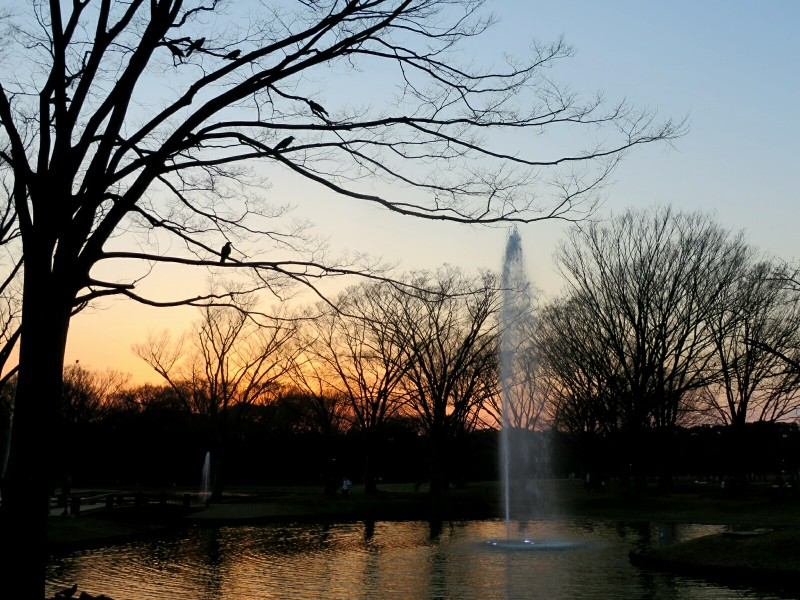

*Sunset in Yoyogi*

In the morning we got out just after 7am and head for the fish market. It's quite busy out with people on their work commute. On the train, almost every passenger is male. They're all dressed very tidily, hair looks freshly cut, suits pressed, standing and sitting in four prefectly neat rows. A few are sleeping sitting up.

When we arrive at the fish market we try a different restaurant, one in the inner market which had a huge queue last time we came. We have found the longer the queue, the better the food. It was probably a 90 minute wait? At the front we found it was a teeny tiny sashimi restaurant. We had to get the fatty tuna again, of course, and we got some salmon and yellowtail (on the orders of Tim McCormack). Sashimi is definitely different to sushi. Significantly larger portions of the fish and a bit more expensive. Sadly the fish wasn't quite as good, I guess with a larger cut it's harder to get as high quality. Anyway, still very good, especially the salmon. Mmm.

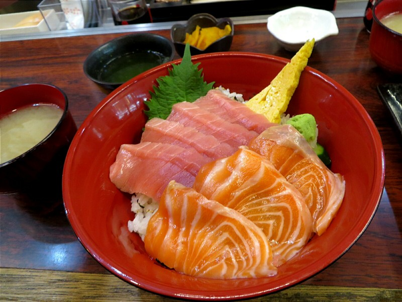

*More Tuna and Some Salmon Sashimi*

We were meant to check out by 11, 12 at the latest. We got on the train to head back to the apartment at 10.30. It seems we're getting overconfident, we didn't check Google we just jumped on the 'right line'... and we got lost. We realised one stop too late we were on an express train and ended up out in the sticks of Tokyo. Next station we got off at no one spoke English and we had some trouble finding the right train. With some sign language we were pointed in the right direction. At 11.30 we walked in the door to the apartment and run around like chickens with their heads cut off showering, cleaning, packing and we get out just on time.

After checking out we caught the amazing bullet train to Kyoto, enjoying some very overpriced station food for lunch on the way. We sat on the right of the bullet train (another Matias suggestion), and a half hour later we watch Mt Fuji go by. Pretty impressive! In Kyoto we have a kitchen so we spend the end of the day grocery shopping and cooking a veggie pasta. Food here is great, but sometimes you just need a home cooked meal.

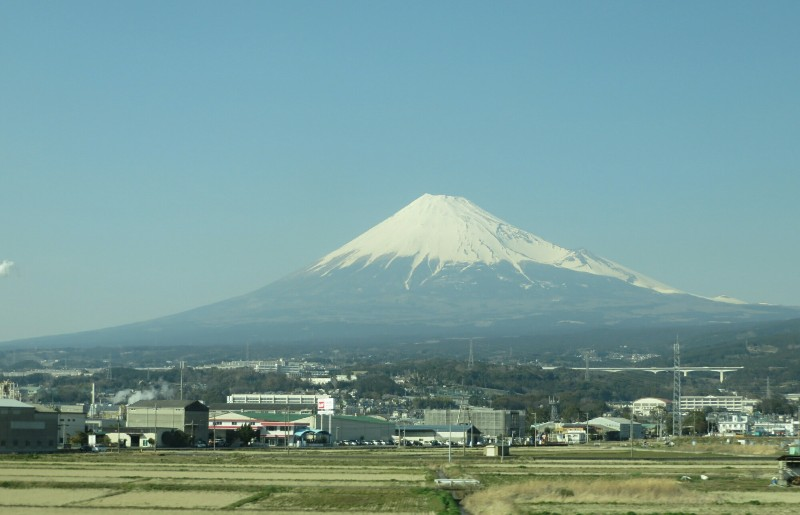

*Passing Mt Fuji*

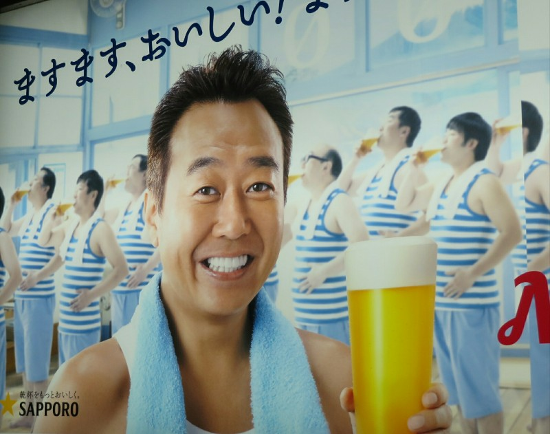

*Pat saw this poster and said 'God! His veneers are so fake and awful!'. I've never been more proud...*

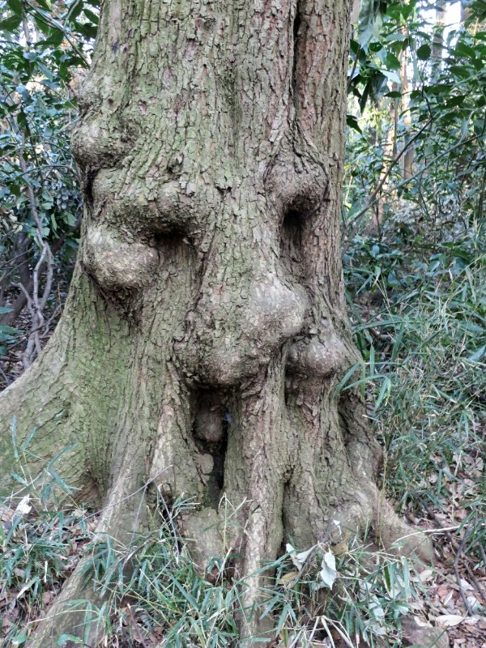

*Deku Tree at the Shrine*

*More Harajuku Girls*

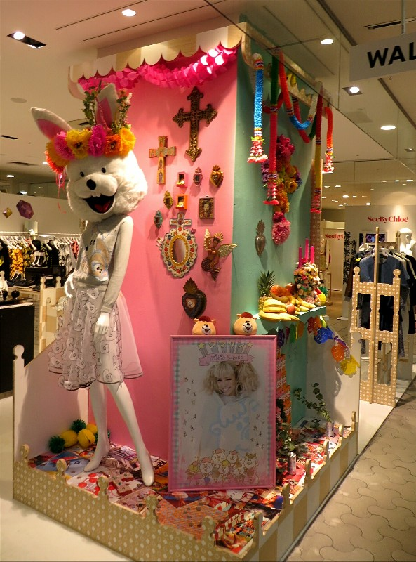

*Even the Store Displays Have Serious Style*

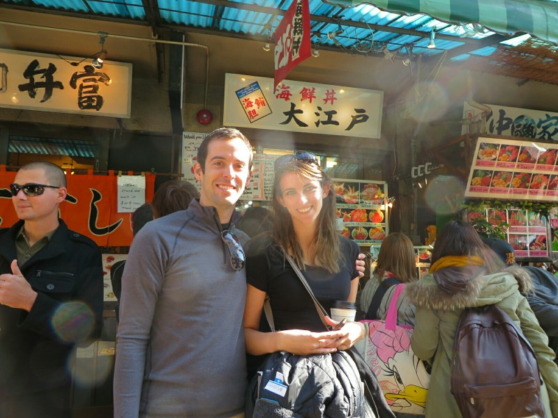

*Front of Another Enormous Queue*
