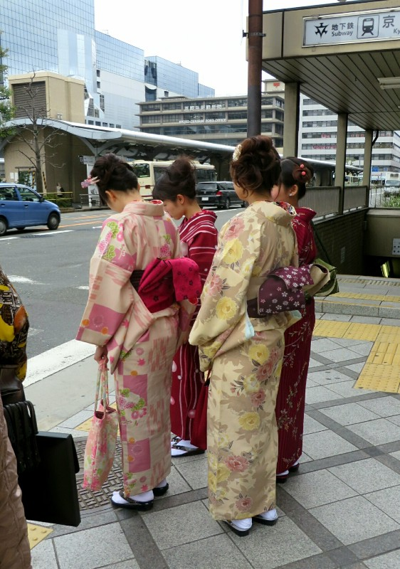
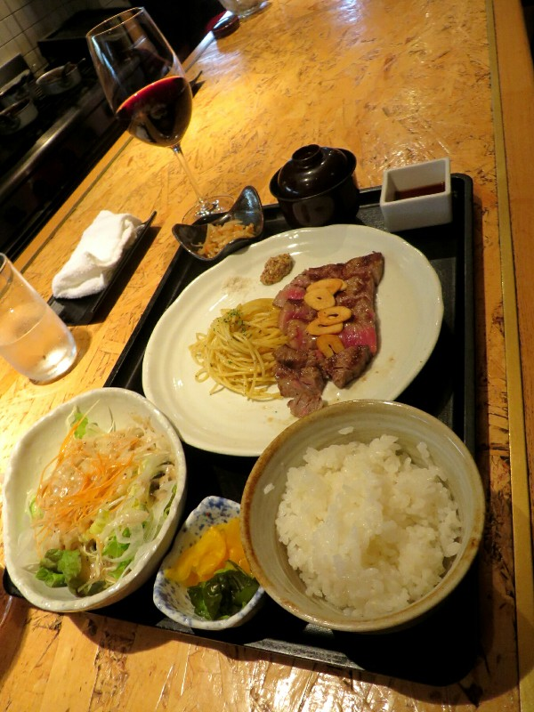
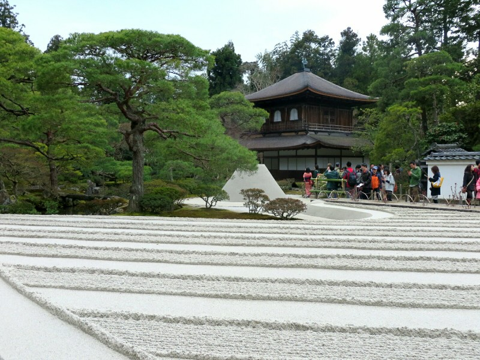
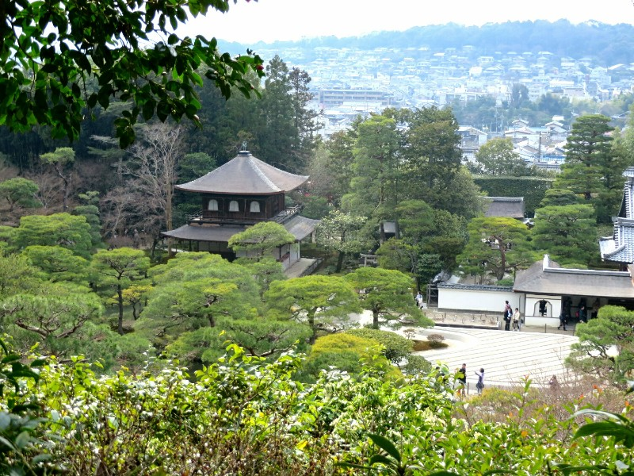
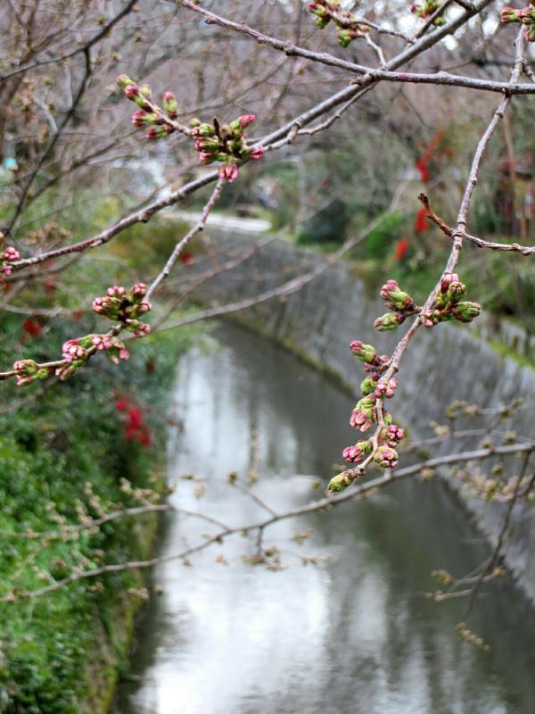
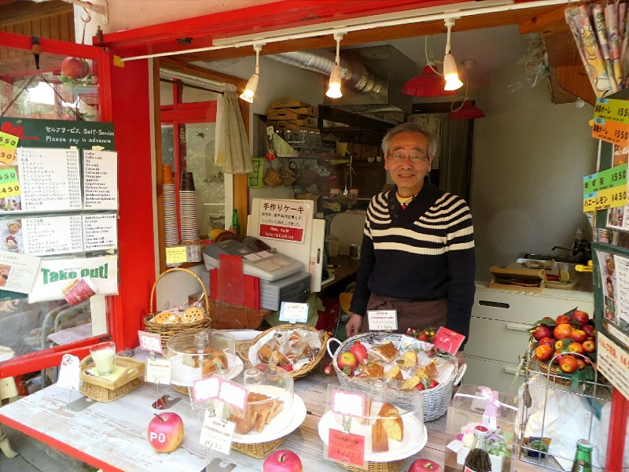
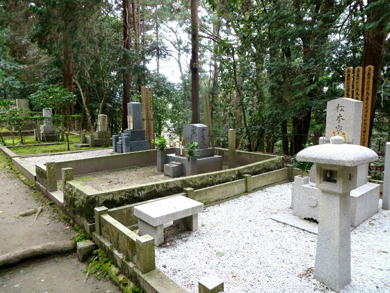
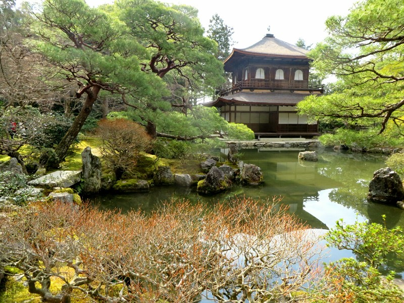
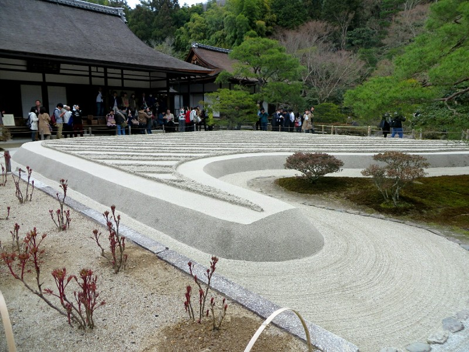

After getting our bearings in the city, the first order of the day was to seek out a steakhouse that was very well reviewed to see if we could get a lunch booking some time this week. Like most things in Japan, it was small, and we read that it fills up quickly so we were prepared to be turned away.

Wandering through the city, it feels vaguely familiar. The atmosphere is decidedly more relaxed compared to Tokyo: people aren't in as much of a rush and the dress is slightly more casual. The buildings aren't very tall (15ish stories might be the average) and there are some beautiful looking hills bordering the city, quite close to downtown.  It reminds Pat of Adelaide in a lot of ways. Much bigger, obviously, but there were many similarities that made it feel  quite comfortable. Kate sort of misses the hustle bustle and fast walkers of Tokyo.

On our walk we see many cyclists (apparently the preferred way to get around here) and significantly more girls in kimonos that in Tokyo. Kinda fun. We arrive at the street where the restaurant's website says they're located only to find no restaurant. It's a narrow one-way residential street with the occasional wooden furniture shop. Thinking we made a wrong turn, we seek out a street sign and confirm were in the right place. We wander up and down the length of the street with no luck and no helpful strangers to come to our rescue this time.

*Kate Took A Lot Of Creepy Photos Whenever We Saw Girls In Kimonos*

As we are about to give up, Kate remembers that she took a screenshot on my phone of the Google maps location of the restaurant. Eureka! Google says they are hiding down a side street, not the street we were on like their website said. We eventually found the door: a narrow building nestled between two townhouses with several coloured pieces of fabric draped over the entrance concealing the door. Sneaky. We go in and try our luck.

Before we could say a word, a woman from the back of the long narrow building rushes to the front and motions us to two seats at the bar. Success!! No tables here, just one long bar that separates you from the kitchen. The chefs' prep stations are right in front of you so they're facing you when they put your meal together. The grills and ovens are behind them so you can keep an eye on you food as it's cooking away. The menu looks amazing from top to bottom, but we decide that if you want to evaluate a steakhouse, you really only have one option. Pat orders a sirloin and Kate orders a filet.

The steaks come out with a range of accompaniments: small serve of pasta with olive oil and herbs, miso soup, an Asian salad, a small pile of salt, seeded mustard, soy sauce, a bowl of white rice, and picked ginger to cleanse the palate. The steak was presliced to accommodate eating with chopsticks- convenient, we thought.

*Delicious Steak - Chopstick Size!*

To say these steaks were amazing would be an insult to the steaks. An adjective to properly describe how tender, delicious, and melt-in-your-mouth good they were does not exist in English. If the fish market in Tokyo redefined what Kate and I think of tuna, then this restaurant has redefined how we think of steak. Japan in general has shown we previously did not understand the descriptor 'melt in your mouth', the meat here melts away with no effort like a fruit tingle! Minus the fizz. We are saddened by each bite knowing that we are one bite closer to finishing. If only there was a way to capture this taste forever. Sigh...

The chef was very nice and helped Pat in his attempts to ask for the bill and compliment the food in Japanese.

Unfortunately we eventually had to finish our meal, not in the least because the restaurant was closing and everyone else had left. They don't seem to mind here like they would in Australia or the US, I guess it's the different work ethic? Work is something to take pride in, not a chore.

We had plans to do a longish walk to 7 or 8 temples on the East of town, but ended up starting late again because of how long we took to find and eat lunch! We grabbed a bus to the first temple and got our journey underway. The walk up to the first temple was very pretty- a narrowish alleyway lined with cafes and gift shops yet somehow not tacky. As soon as we walked though the front gate we saw an impeccably maintained sand garden complete with a sculpture meant to represent Mt Fuji. Everything about the garden was precise, it seemed as if no grain of sand was out of place.

*Immaculate Sand Garden- God I Wanted To Jump On It...*

The temple and the surrounding gardens were also very beautiful. We walked along a path that took us to a viewpoint overlooking the grounds then wandered around to the back of the temple. Everything was just perfectly maintained and planned.

*View From The Hill*

Once we had soaked up the scenery, we left to walk to the next temple. Running between several temples on the East side of town is a trail called the Philosophers Path which follows a small creek. The river is flanked on both sides by cherry blossom trees which are all on the verge of blooming. It looks like we have missed the main event by a week or two! Either way, the walk is very tranquil.

*Almost Blooming!*

We stopped along the way to the next temple at a small cafe called Pomme, and had a couple pieces of cake. We originally had no intention of stopping, but a very nice old man enticed us in by saying everything was homemade by his wife, how could we resist?! The cakes lived up to expectations and we continued on our way.

*Cute Cake Store*

The next temple we wanted to go to was closed, but the nearby cemetery was open so we decided to wander though. Someone was striking a rather large gong nearby every 15 seconds or so, which provided an interesting atmosphere. The tombstones were all quite interesting, nothing like we have in western countries.  Some graves have what appear to be letterboxes in front of them, perhaps for offerings from family of friends? Either way, one of them clearly had piece of  junk mail. I guess there's no escaping it...

*Need That Money The Vietnamese Are Burning To Pay The Bills Still Coming In After Death*

As it was now getting late,  it's no surprise that the other temples we wanted to see were closed. We decided that we would pick up where we left off later in the week to try and catch the cherry blossoms.

*Silver Pagoda- Couldn't Take a Bad Photo*

*Not a Grain of Sand Out of Place*
