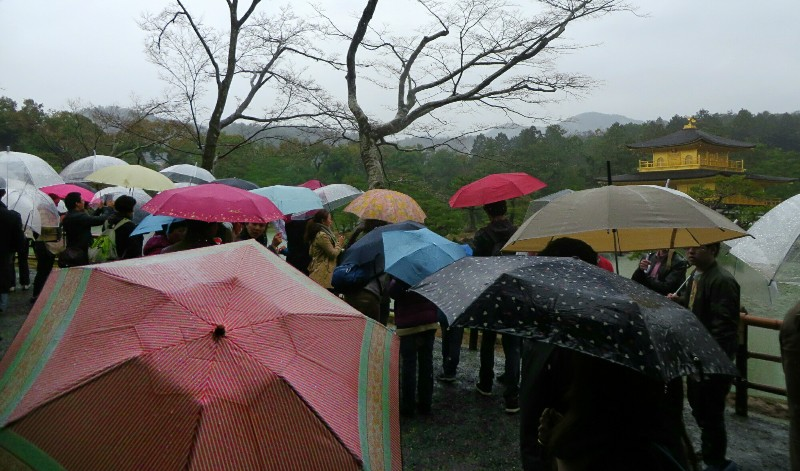
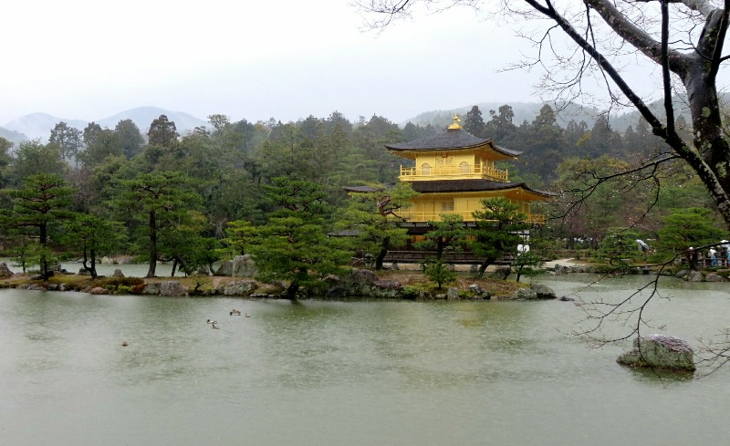
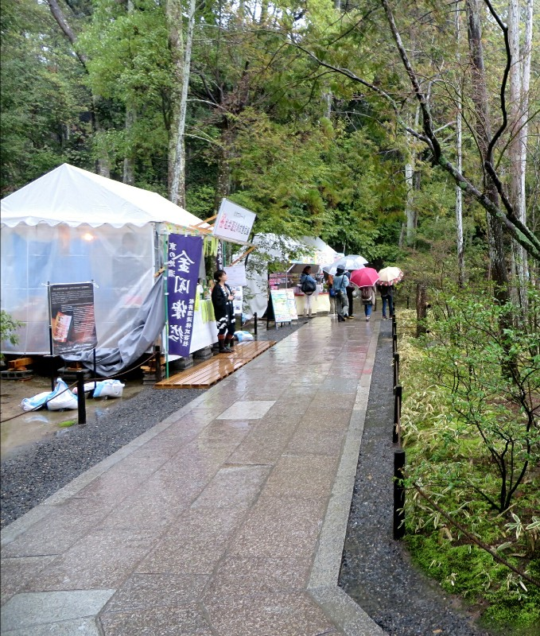
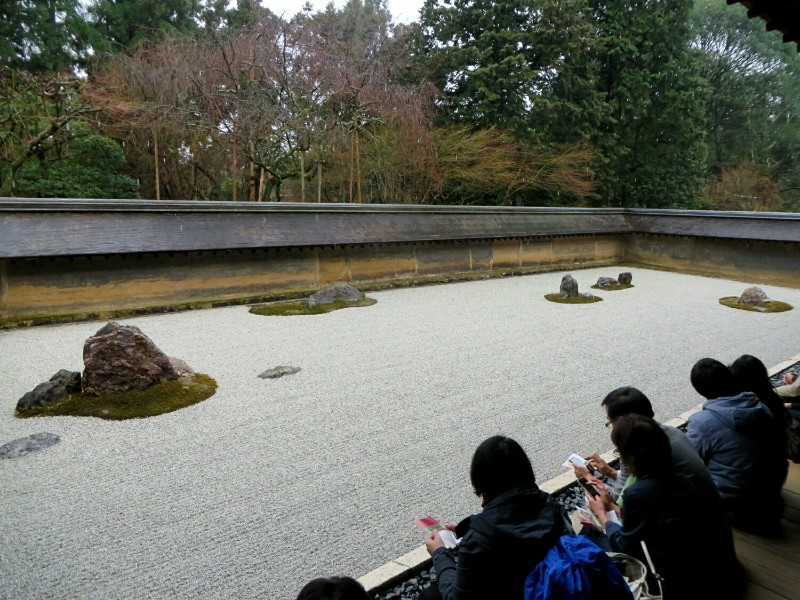
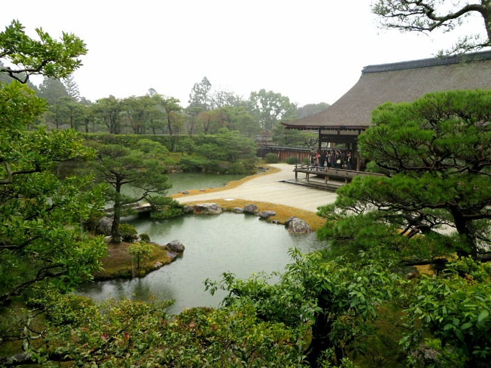
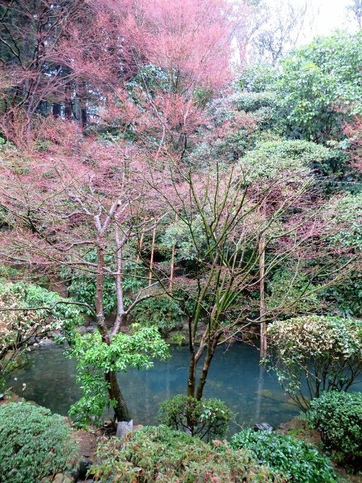
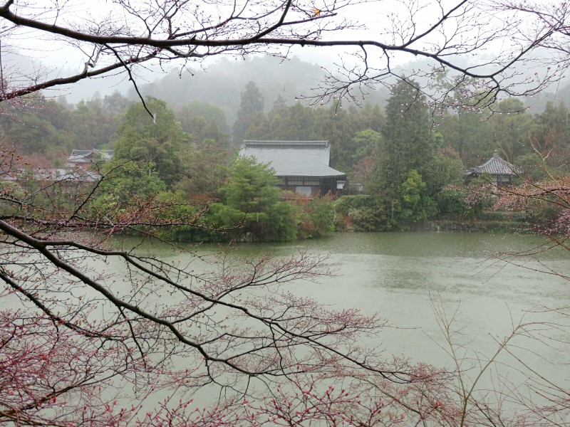
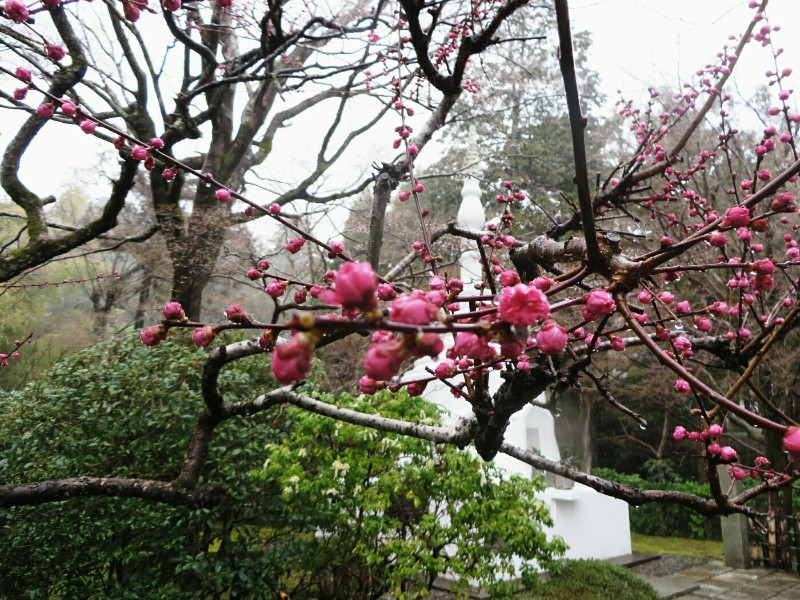

Woke up for an early start to the day only to find it pouring rain outside.  This is somewhat inconvenient given our plans for the day consisted exclusively of walking outside. We fought the urge to sit inside and watch movies and drink hot chocolate all day and decided to be brave. We busted out our rain jackets and bundled up for the day.

Bad decision.

Because of the rain (we think) traffic is horrible and the busses are running very late. So unlike Japan! We stood at a bus stop for around 40 minutes, luckily under a shelter so we had some protection. When our bus finally arrived it was full and we had to squeeze ourselves through the door into the humid interior - it was going to be a cosy ride. Oh well, could be worse. And then it was. The next stop another 4 people somehow crammed in. The next several stops saw more and more people get on the bus and very few people get off. Just when we thought the bus couldn't possibly fit anymore people, 10 people got on at the next stop. It would have been comical if it wasn't so uncomfortable. Another phrase I thought I understood, but Japan has shown me the real meaning of- packed like sardines. Touching that many damp strangers that intimately is not an experience I wish to repeat.

About an hour later we arrived at the Golden Temple. We were so excited to be out of the bus we walked straight past shops selling umbrellas and went straight to the temple entrance. We quickly realized if we wanted to take any pictures we would need an umbrella to keep the camera dry,  so we popped back to one of the convenience stores and bought a couple cheap ones. As the journey there had taken close to 2 hours we also got lunch. Udon noodles- Kate thought delicious,  Pat unconvinced, definitely prefers ramen.

*Completely Unobstructed View of the Golden Pavillion*

The Golden Pavilion (Rokun-ji Temple) itself is relatively new, built in the 1950s as an exact replica of the original which burned to the ground several years prior. A bit of a bummer to not see the original, but it still looked pretty impressive.  Sitting on the edge of a large lake and nestled in a beautiful garden setting, the top two levels of the temple are covered in gold leaf and we imagined that on a sunny day it would be brilliant. Kate wasn't having a great time, the cold and rain don't agree with her at all. Good thing we are moving to Canada...

The area was originally the site of a villa owned by a statesman and then later acquired by a shogun in 1397. The buildings and the grounds of the Pavilion were said to represent the Pure Land of Buddha in this world. Had it not been a miserable rainy day, I would believe that. The villa also functioned as an official guest house, once welcoming the Emperor and other members of the nobility. After the shogun's death, the villa was converted into a temple in keeping with his will.

*Actually Quite Pretty Sans Umbrellas*

With Kate feeling a bit miserable and not at all impressed by the GOLD(!) temple and beautiful gardens we were looking at we thought we might try and raise her spirits (and her body temperature) so we found a vending machine that dispensed a half decent hot chocolate. It seemed to do the trick as she perked up a bit.

*Tents Reverently Lining the Temple Paths, Selling Tourists Souvenir Shot Glasses*

Next on the list was Ryoanji Temple. Built in the 1400s and originally used as a Zen training temple, it was destroyed during the Onin War and completely rebuilt in 1499. The main attraction here is the Hojo Garden, a traditional dry landscape rock garden. It consists of 15 rocks that are arranged on a surface of white pebbles and are supposed to symbolically represent nature, although I must admit neither of us got it. Apparently it's also known as "baby tiger crossing" because it resembles a tiger crossing a mountain stream with its cub. We didn't see that either. What we did see was 15 rocks on a bed of pebbles. That isn't to say it wasn't pretty, perhaps just a bit too abstract for us. Again, surrounded by a beautiful garden we meandered through. One interesting find was a monument honouring soldiers who died in World War II- would never see that in Germany!

*Locals Meditating On The Rocks' Deep Meaning... Definitely not Playing Angry Birds*

Last temple of the day was Ninnaji  Temple, which was built from the late 700s and finished in 888. More sand and pebble gardens, all raked and maintained perfectly, even in the pouring rain. After Emperor Uda, the emperor responsible for naming the temple, abdicated the throne he became a Buddhist priest and devoted himself to religious training for 30 years at the temple. Would have been a very pleasant place to study.

Walking around looking at the gardens was very serene, at least Pat thought so. Kate still wasn't having any of this weather and as it was getting late anyways we finished up at the temple and went to a bus stop, prepared for another ordeal. When the bus arrived we were relieved that it was only half full and there were still seats! And it was so toasty warm that we both decided to take a little nap. We woke up one stop before ours, just in time to realise where we were and hit the "next stop" button.

*Every Garden Needs a Little Lake*

After the feeling returned to Kate's extremities, we ventured out of the hotel in search of a local style of ramen where they intentionally burn the noodles before putting them in the broth. Sounds interesting and from what we've read, highly recommended. When we arrived we were seated by a man with near perfect English, not even a hint of a Japanese accent! We watched (another bar fronting up to the kitchen) as they dropped the noodles into a scorching hot and smoking wok that sent smoke pouring through the kitchen. While we were waiting  for the Ramen to arrive, we were served the obligatory gyoza. Surprisingly better than the ones we had at the Ramen place in Tokyo, we now have high hopes for this place!

The soup arrived with a dark broth and smelled vaguely of smoke. We dove straight in and both thought it tasted really good, you could taste that something was burnt,  but it didn't detract from the flavour at all and it may have made it even better.  Still, it was nowhere close to the heavenly ramen we had in Tokyo. We have officially been spoiled. At least we know exactly what and where we're eating when we come back to Japan!

After going to 7 convenience stores on the walk home in search of WeetBix (they do exist, we found them in Tokyo!) we eventually gave up and went home. Hopefully tomorrow will be a bit less wet.

*Blossoms at Ryoanji Temple So Close to Blooming They Have a Distinct Pink Tinge*

*Rock Temple Through The Rain*

*Blooming!!*
