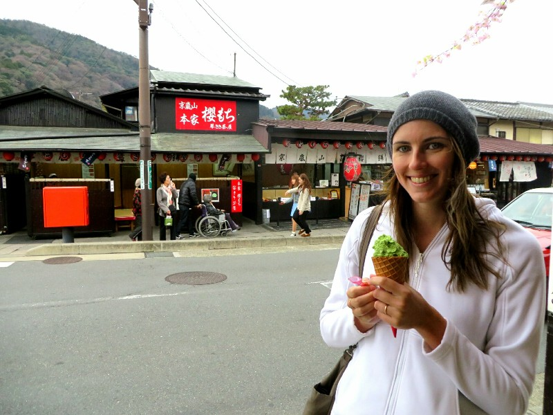
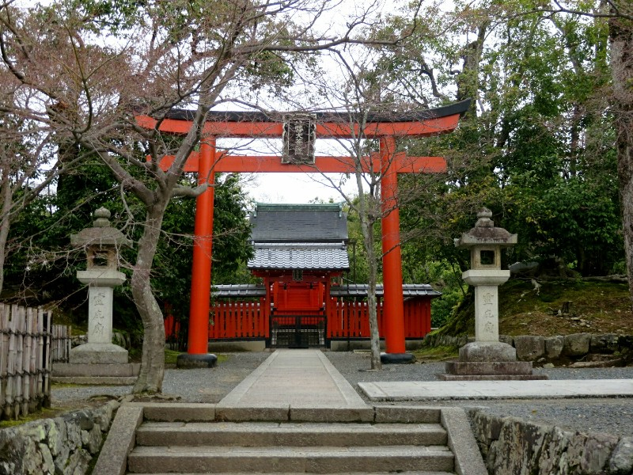
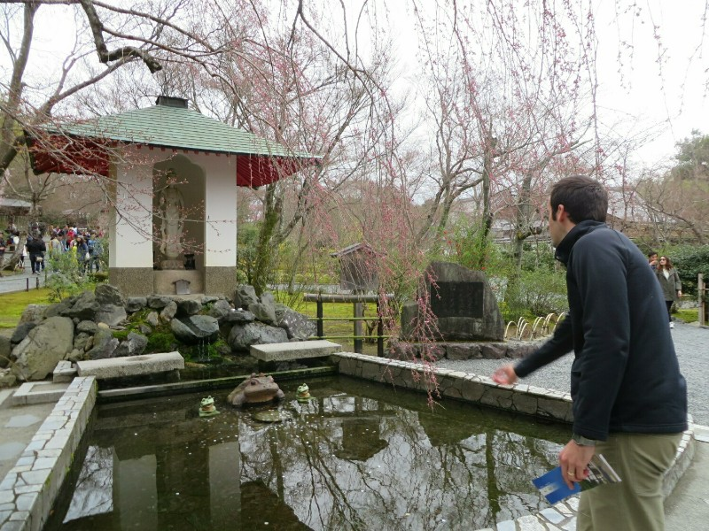
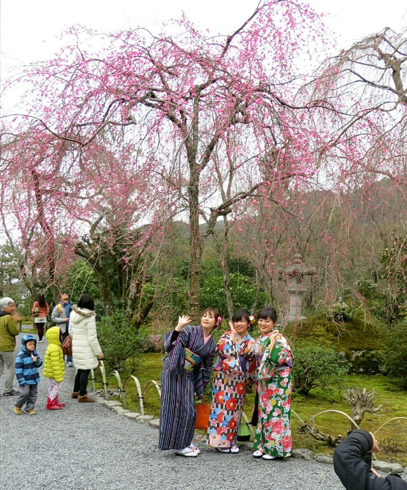
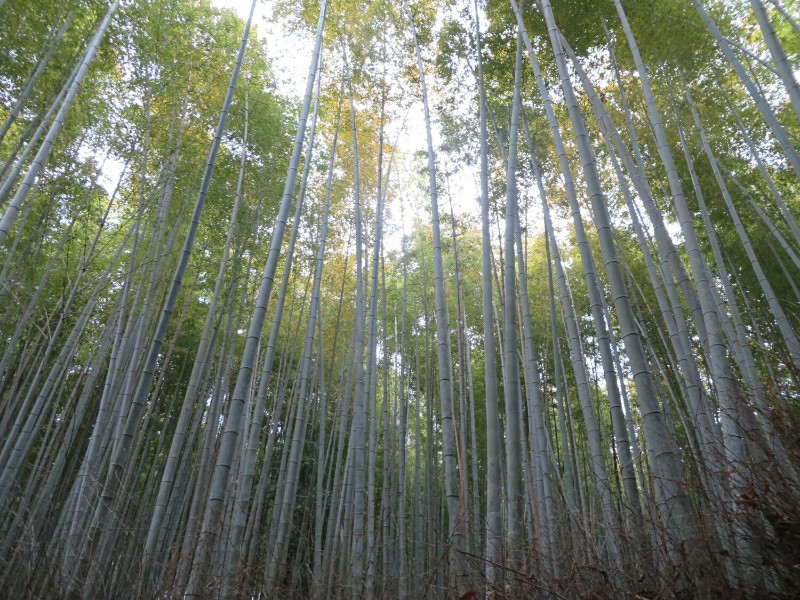
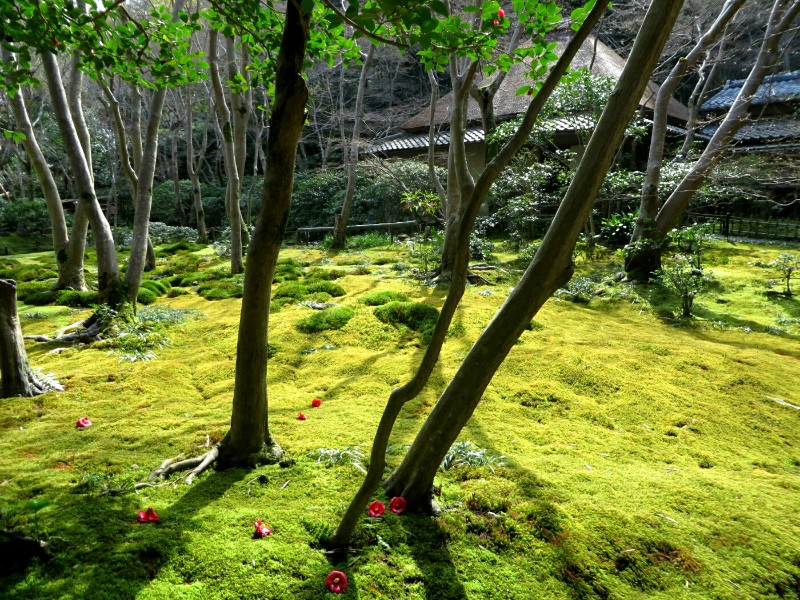
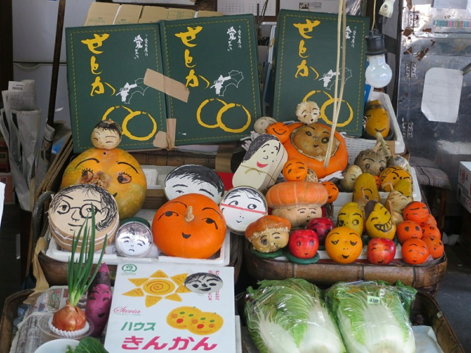
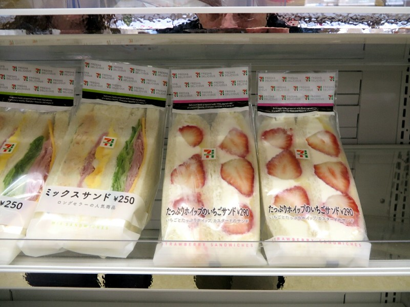
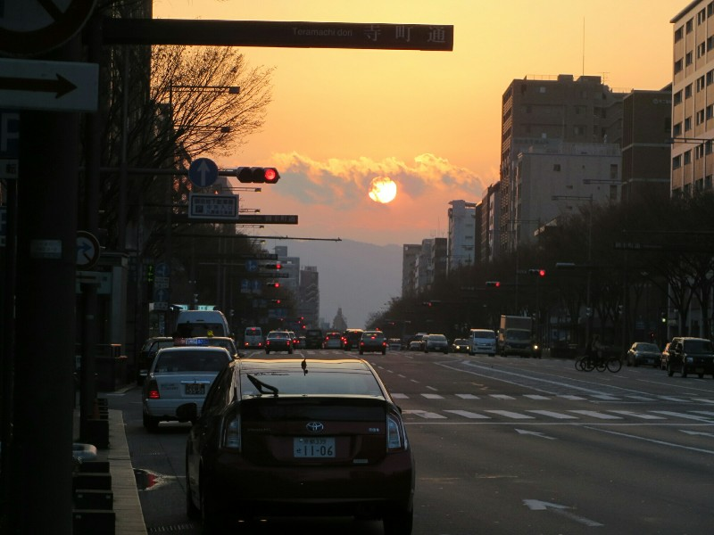

Slow getting started, but eventually got moving and headed on a train to the area west of town, Arashiyama. The plans for today were very non specific. The area came recommended by our cruise companion Matias and Em Loh and our instructions were to simply go there and check out the sights.

Like most of the other things we've done in Kyoto that involved being outside, Arashiyama would have been absolutely stunning if it were two weeks later and all of the cherry blossoms were open. As it was, the trees were still right on the cusp of blossoming (a few renegade trees actually had!) so most of the hillsides were still a mass of twigs and branches instead of a vibrant display of colour. Not that we were going to let that stop us! We've already decided that since we missed the blossoms this time, we're just going to have to come back. This decision has nothing to do with the tuna, ramen, or steak we've had in Japan. No sir. It's purely about the blossoms...

When we arrived we followed the crowd out of the train and started walking down the main street towards the river. The bridge across the river is supposed to have a great panoramic view of the hillside with all of the blossoming trees. Which aren't blooming, but it's still a place to start! Along the way we passed several ice cream shops selling green tea ice cream, which is apparently the thing to eat here. The weather outside was decidedly not ice cream weather - maybe 15 degrees, overcast, and windy. This didn't stop every second person from having and ice cream or a soft serve in their hand. Who are we to argue?

*It Was Pretty Delicious*

The view from the bridge was nice, but you could see how much better it would be with some sunlight and everything blossoming. As it was, we spotted a few trees in the distance that had opened early and tried in vein to get a picture. Everyone else was doing the same thing: every blossoming tree had a bunch of people in front of it taking selfies and posed shots. We walked along the opposite side of the river for a while as we kept seeing signs that promised a temple with "great views" ahead. The temple never showed and we got bored, so we did an about face and waked back across the river.

Next stop was the Tenryu-ji Temple, aka Temple of the Heavenly Dragon. In the centuries since it's founding in 1339 the temple has been ravaged by fire a total of 8 times. You'd think that after the second or third of fourth time a beautiful temple is destroyed by fire they might rebuild it with something other than wood. But you would be wrong. They are quite meticulous with their reconstructions however. Every temple we have seen that's been rebuilt still has that weathered look that you would expect from a very old building. Luckily, the landscape garden behind the main building survived all of the fires and is now one of the oldest in Japan, retaining the same form as when it was designed in the 14th century. It is fittingly listed as a World Cultural Heritage site (along with many of the other temples we've been to in Kyoto).

*Temple Entrance*

Like the hills surrounding the town, this garden would be at its best with everything blossoming, but it still looked stunning in its present form. You get the sense that the artists who laid out these gardens planned them so that no matter what the season, the garden always had something to present to the visitor. Behind the main hall is a large lake filled with what we assume to be giant goldfish. We amble along a few paths that take you up and around the garden, which gives us great views of the temple framed with flowers and trees. Unlike the temples in Thailand and Myanmar which are works of art in their own right, or Christan churches where a large focus is the interior, the focus in Japan seems to be on the gardens surrounding the temple rather than the temple itself. It's quite refreshing!

*If You Get a Coin in The Pot in Front of the Frog... Umm... We Assume Something Good Happens...?*

We have unintentionally (?) been following a group of three girls in traditional kimonos. Kate "sneakily" took a picture of then when we entered the temple, and they have been just ahead of us for most of the time we were there. We notice lots of other people (tourists and locals) taking pictures of them as well, so at least we aren't the only ones fascinated by them. We wonder what clique then fit in to: are they punks like the Harajuku girls, or very conservative / traditional religious girls, or somewhere in between?

*Kimono Girls*

Exiting the temple grounds we head into the nearby bamboo grove. The bamboo here is so tall and dense that as the wind passes through the forest you feel like you're underwater watching plants move with the current. It was quite hypnotic. That is, until a scooter comes up from behind you and breaks your concentration.

*Beautiful Bamboo*

Our last stop in Arashiyama is Gio-ji Temple, a significantly smaller temple consisting of only one modest building, a small graveyard, and a nice garden with a stream ambling through it. Again designed with four seasons in mind, we see pictures of the temple grounds in summer,  autumn, winter, and spring and it looks stunning in each. We have an ongoing battle with the sun today, but it makes a few brief appearances to help highlight the garden. It was a refreshing change seeing a smaller temple, especially since for a while we were the only people there.

*Beautiful Garden (When We Get Sunshine)*

After we trained it back to the city, our focus unsurprisingly turned to food, ramen in particular. We hunt down a restaurant called Ippudo Ramen and order two bowls (Pat's with extra pork) and some gyoza. Since our ramen rating system was skewed in Tokyo, our initial reaction was: "It's good, but...". After a while we decide that it's actually pretty damn tasty and we should stop being such ramen snobs. We leave two empty bowls behind and walk to the Nishiki Markets for a wander.

The markets were interesting, packed with all sorts of seafood, gifts, sweets, and a whole variety of odds and ends mostly aimed at tourists. We stumbled upon a small temple in the middle of the market which Kate took a particular liking to. After a while, despite not being particularly hungry, we made our way to Donguri for another go at okonomiyaki, a savory Japanese pancake with noodles, cheese, cabbage, pork, eggs, and all sorts of other goodies. It comes out looking particularly unimpressive, but it's really tasty! And it's placed on a large hotplate in front of you so it doesn't get cold while you eat. Clever!

Feeling fat and contented, we walk along a small river through the red light (lantern?) district apparently back to the hotel and turn in for the night.

*Makes The Fruit Look More Appealing! But As A Pet, Not To Eat*

*Strawberry Cream Sandwiches!*

*The Sun Was Massive!*
