Today we wanted to finish the walk we started on the East of town. We decided to work from the other end towards the point we gave up last time. This was not the best idea because we weren't familiar with where we were headed and got a bit lost on our way to the start point. A lot less signs in English because we weren't in the tourist area anymore. Eventually we spotted a temple and walked that way. Sure enough there were crowds of Japanese and foreign tourists. We followed the crowd and they eventually led us to our start point, Kodai-ji Temple.

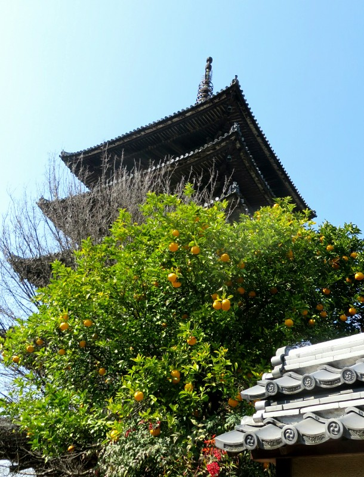

*Spotted This Temple From Afar, Helped Us Get Un-Lost*

Another beautiful temple with amazing gardens. We actually saw some gardeners at work - plucking weeds with tweezers. Serious precision required to keep them so immaculate! Again this temple had burnt down a number of times, but there were a few original buildings remaining. They had very ornate, carved awnings we hadn't seen anywhere else - I guess after your temple burns down a certain number of times you don't bother with those things in the rebuild. What we really liked about this temple was the way the buildings complimented the gardens; the complex was structured in such a way that the gardens highlighted the beauty of the buildings rather than having them as two separate destinations.

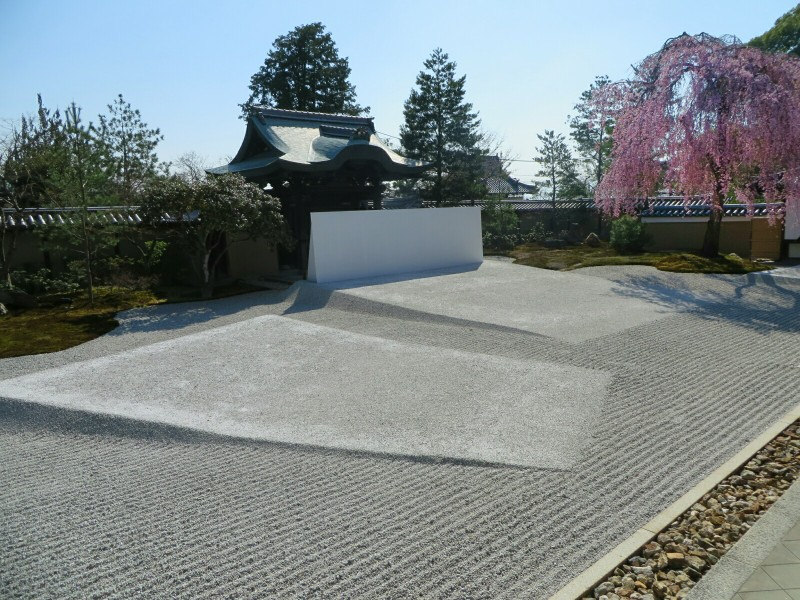

*Another Beautiful Sand Garden*

Once we'd done the loop we headed towards the next temple. This was another really nice area of town, very pretty buildings lining neat and tidy streets, lots of shops selling ice cream, and lots of tourists. There were tons of girls in kimonos out today, tons of Japanese tourists in general. We are surprised how anywhere we go, any time of day, any day of the week, there are Japanese tourists. It conflicts with the stereotype that Japanese people work 12 hour days, 6 days a week and never holiday. They do fit stereotypes in other ways though, million photos, so many selfies, lots of peace signs, girls in schools uniform even on the weekends, girls wearing miniskirts high heels and with long socks, all the elderly people are hunched over like in a Miyazaki film... It is a fun place to people watch. They don't smile at you in the streets though which has been a stark contrast to South East Asia where everyone is so warm.

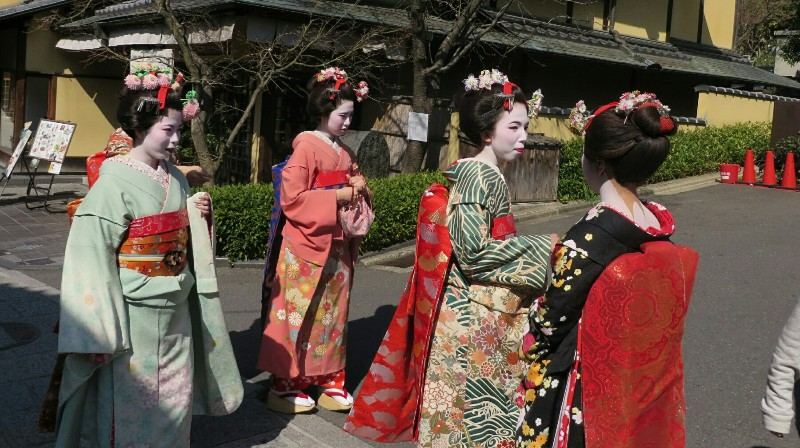

*Faces Painted As Well Today!*

The next place we stopped was the Yasaka Shrine, which backs onto a big public park. Lots of locals out taking photos with the cherry blossoms that have bloomed early, lots of carnival style stalls set up but they're all closed.

We wander through the park and exit at the next temple, Chion-In. It's being renovated, a project that will take another 8 years. Pat is very impressed with the temporary structure that they have built around the temple - it looks better than a lot of permanent structures in Australia. The site office has an actual foundation (not a portable office) and has stained pine framework and decorative tile shingles on the roof to make it blend in with the temples around it. The main structure is massive and has framed windows, proper gutters and downspouts, and generally looks built to last. A lot of money and effort went into something that's only going to come down in a few years time.

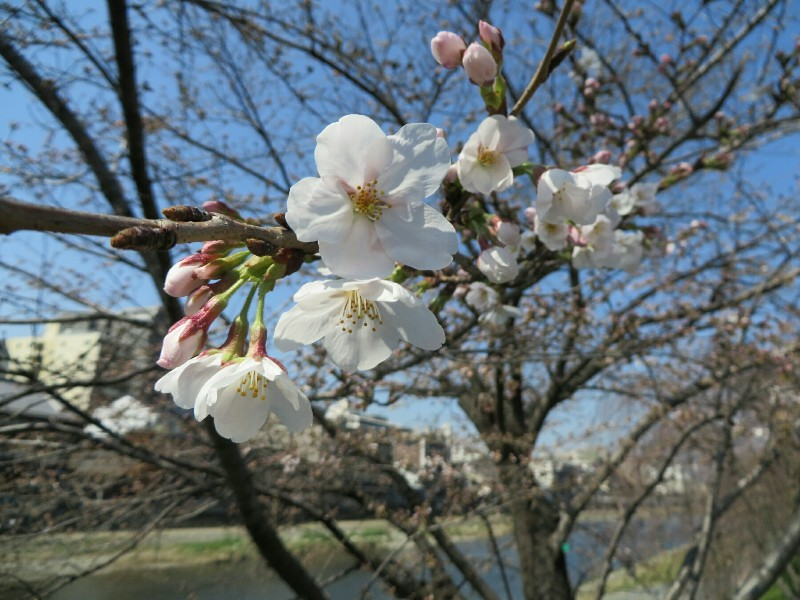

*Early Blooms- We're Turning Into Japanese People Taking Photos Every Time We See One*

Once we finished admiring the construction zone, we wandered towards the last temple for the day. This temple was quite different to all of the other ones we have seen so far. It has a massive inner courtyard covered with the small white pebbles that have been used in other temples for their rock garden. The main draw here, unsurprisingly, is the landscaped garden. We pay our entry fee and make our way inside. Again, we really have missed the best scenery by about a week. The majority of the cherry trees are all still bare, with only a few having a handful of blossoms open. The lack of blossoms does make the other flowers really stand out, however. If you take the time to find to stand in one spot and look around, you'll notice lots of smaller bushes and trees that are in bloom, things that you would most surely miss if all of the cherry trees were blossoming.

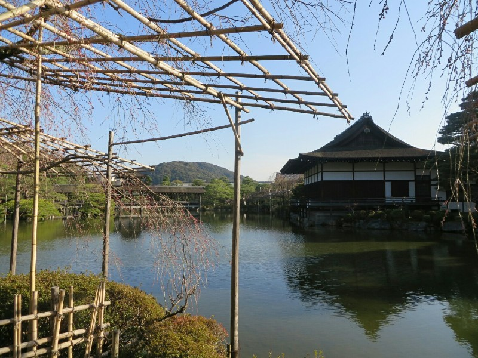

*Gardens at Heian Shrine*

We havea very nice dinner planned tonight, many thanks to Tommy and Mai. If we hadn't looked up the very specific directions on how to find the restaurant, we would have been looking all night. From a reasonably main street, we had to look for a Starbucks on the opposite side of the road, this is our cue to turn down a narrow, unmarked alleyway less than 1.5 metres wide. As we walk down, there is a sliding door on our right side mostly covered with a few sheets of fabric and unmarked aside from a small lantern with Japanese characters on it. This is Gion Nanba, a cosy little restaurant serving traditional multi course meals that change seasonally (and even daily) depending on what is fresh at the market.

We take our seats at the bar with four other people facing the kitchen and the two chefs. Since all the menus are in Japanese the waitress brings us the four different red wine bottles they have to choose from with the prices jotted down on a scrap of paper. They're all way out of our budget, but we throw caution (and our bank account balance) to the wind and order a bottle of French red.

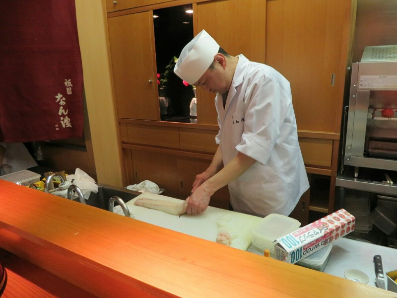

*We Love Watching The Chefs Prepare The Food Here, Wish We Had Such Open Kitchens in Aus*

For the rest of the night we are on auto pilot, having chosen our number of courses few nights ago all we had to do now was sit back and watch the chefs prepare our food. We get a total of 8 courses and they are all delicious. There was definitely a focus on seafood which is unsurprising. By the time the dessert was served we were both stuffed. We managed a small chat with the head chef and owner, Nanba. He apparently works seven days week, taking only two days a month off and one five day holiday a year. That's some serious dedication, it's no wonder he's held a Michellin Star for the last five years. He was very friendly and personable and obliged the couple at the bar with us when they asked for a photo with him. Since he was already next to us, we ask for one as well.

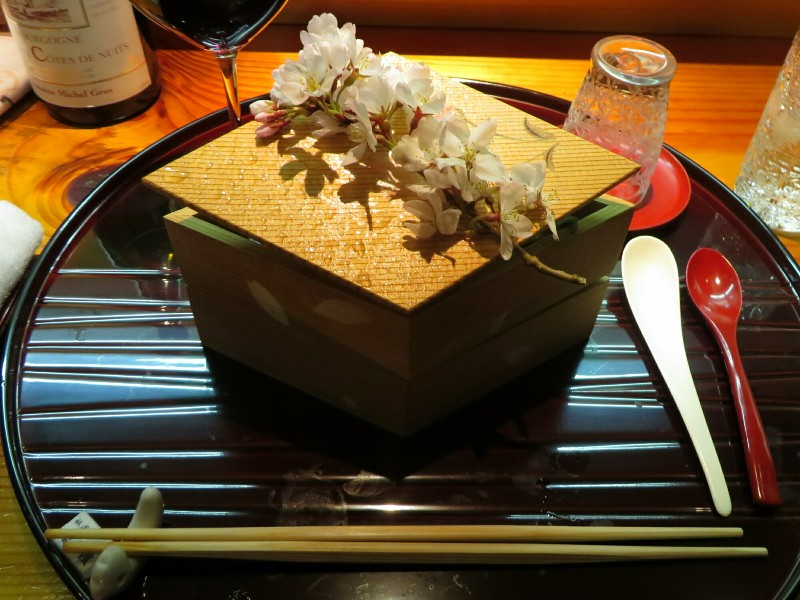

*Two Tier Box With Cherry Blossoms Hiding One Of The Courses*

We left the restaurant feeling satisfied, or at least Pat did. Apparently the dessert prepared by a Michellin Star chef didn't cut it for Kate so we wandered into a convenience store for her to get a Snickers bar. Sigh. Not wanting to be left out, Pat got a candy bar as well. It seems no matter how hard we try to be cultured, we're still a little bit bogan underneath it all.

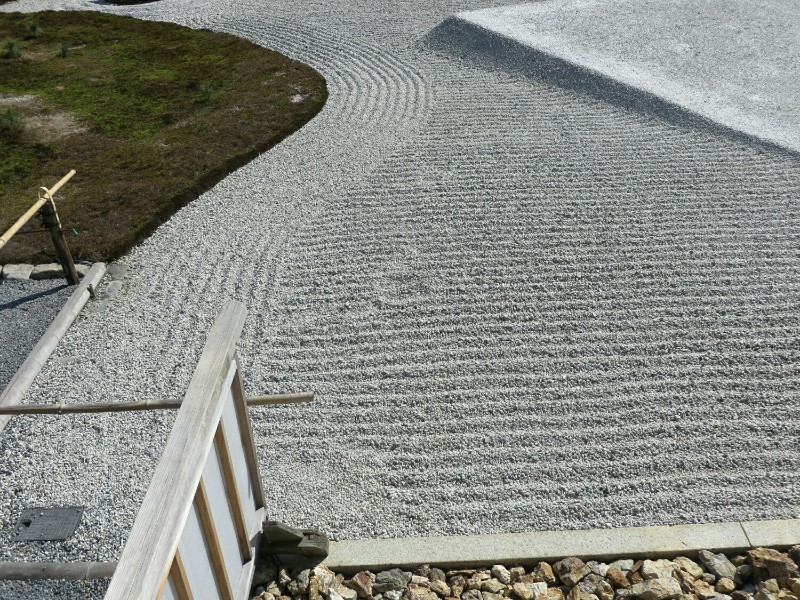

*Unacceptable! Someone Get Over Here with Tweezers and Fix This!*

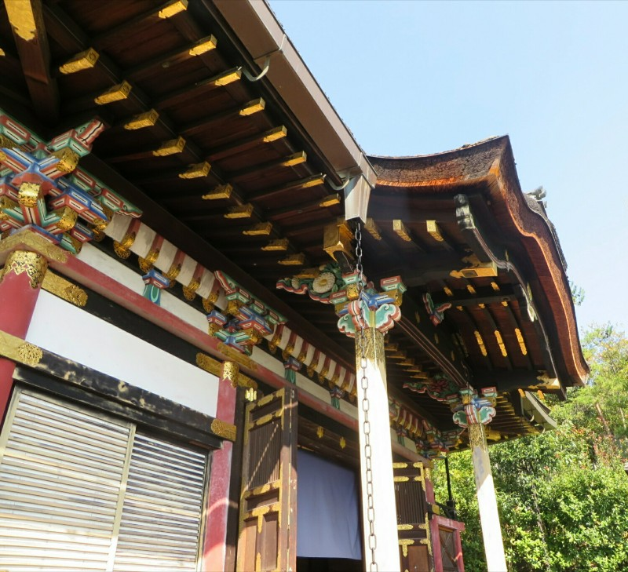

*Original Carvings*

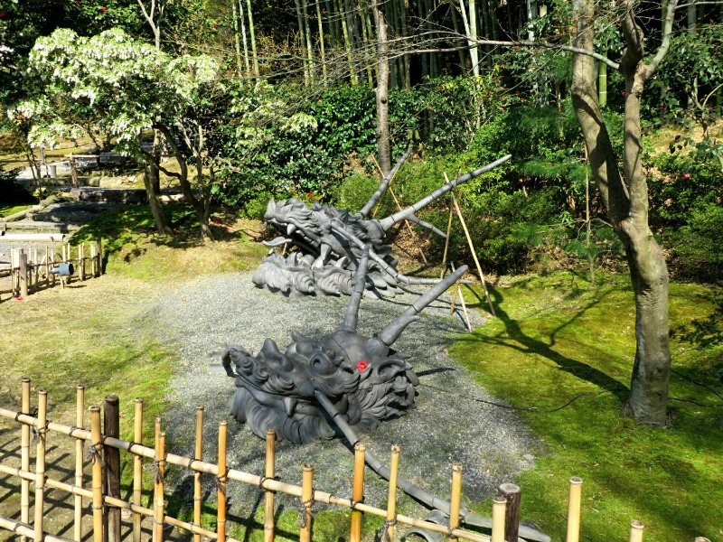

*Perfect Landing Spot For That Flower*

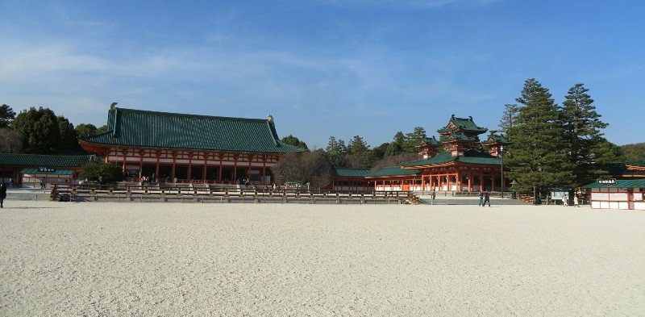

*Heian-junju Shrine*

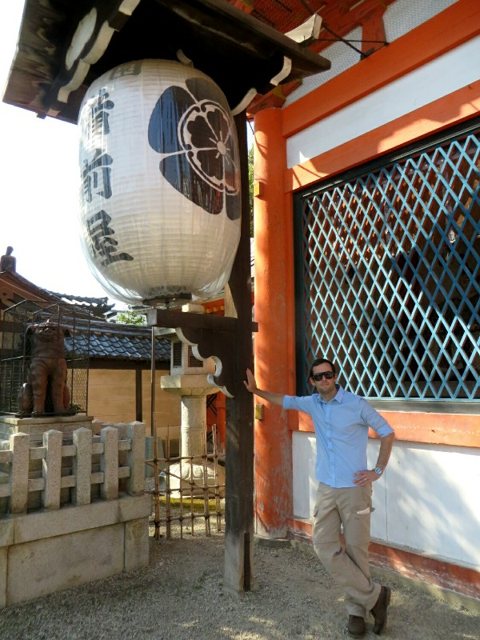

*Life Size Lanterns!*
