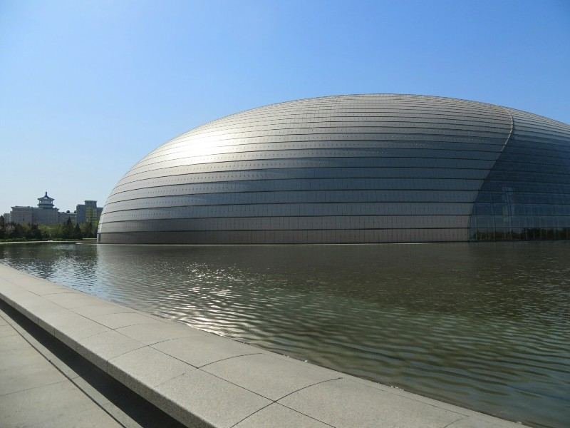
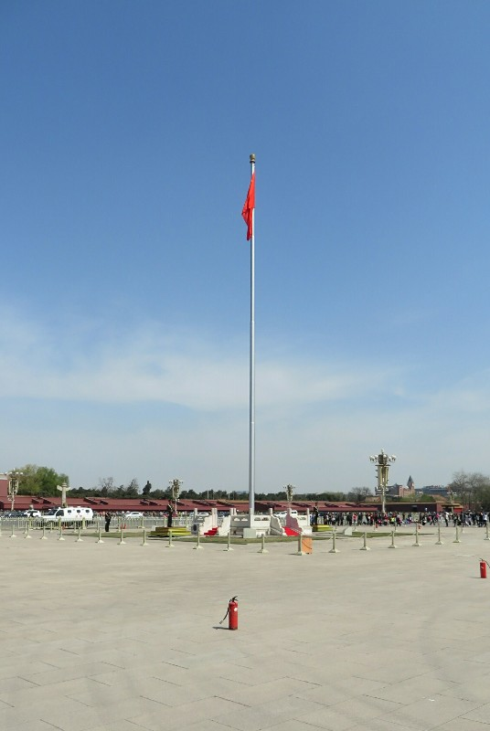
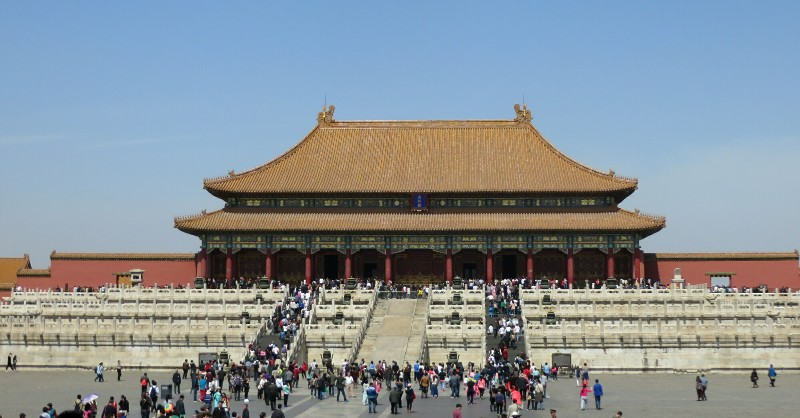
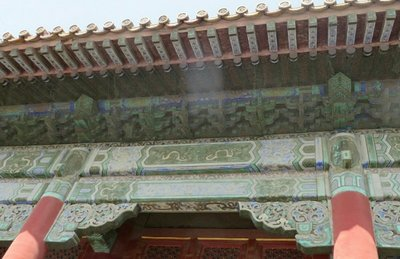
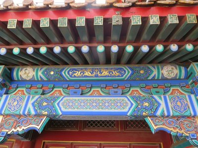
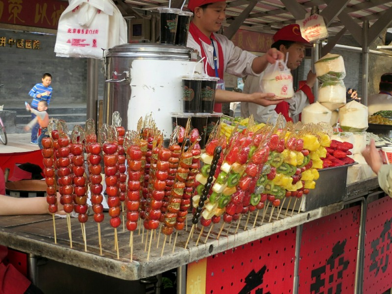
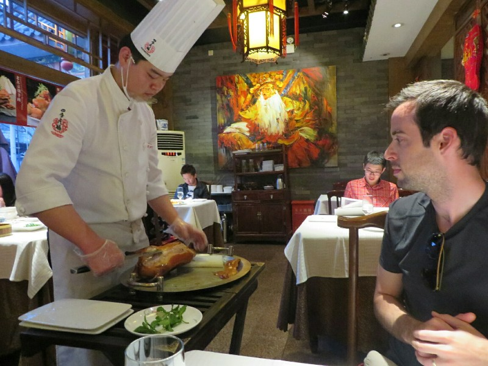
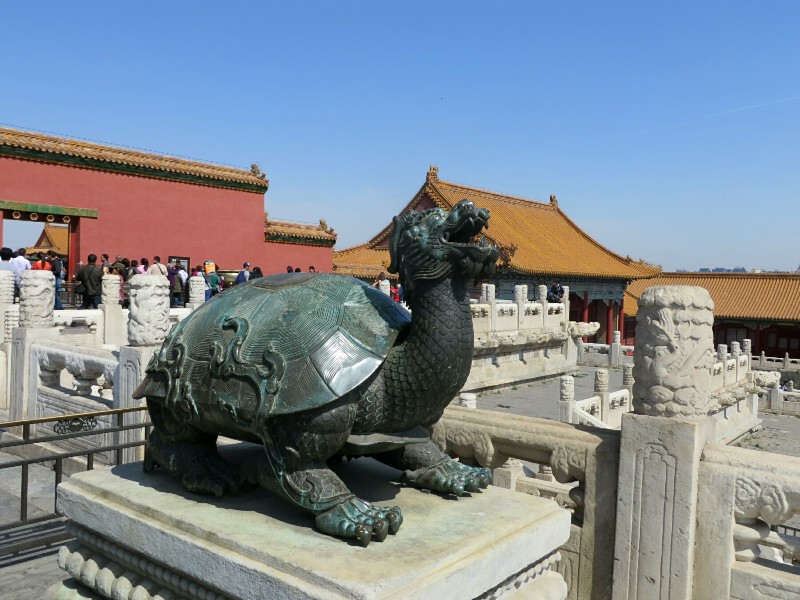
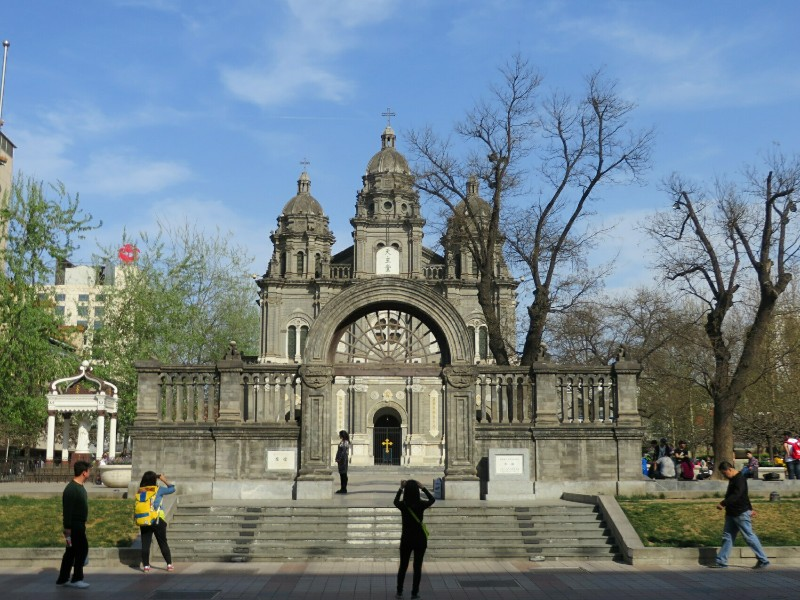
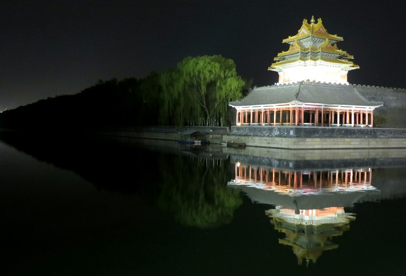

We fly out today at 4pm from Osaka. A couple of days ago we worked out how to get there from Kyoto and how much time we'd have this morning. Looked very simple! Catch a single bus from the Kyoto station, buy the ticket on board, relatively cheap and only an hour ride. Means we don't have to leave til 1pm! All morning to finish exploring, maybe buy some souviners. Untrusting Pat decided to review Kate's research over breakfast to make sure we were going the best way. How annoying. But thank God he did. As it turns out 'Osaka International Airport' is the domestic airport. Not at all misleading, right? To get to the airport we depart from we have to get a train for twice the cost that takes 2 hours and runs less often.

So sadly instead of the relaxing morning Kate had in mind we were running to the station, finding a Japan Rail office, waiting in a queue only to find out it was the wrong Japan Rail office, running up two stories to a different office, being told we need printed boarding passes from the information desk, climbing another flight of stairs up to queue to do that, back to the Japan Rail office, queueing to pay, then having just enough time to grab our bags, check out and get back to the station to leave. Phew!

Luckily, like all things Japan, once we get to the airport it's seamless. Check in is painless and quick, immigration and security are efficient and well run and we're through in about 20 minutes. We have time for ramen and an ice cream. How we will miss Japan!!

No dramas getting to Beijing. We have researched how to get a taxi into town because there are always scams in the airports- in Hanoi there were information stands in the arrivals hall that were actually companies making you pay twice as much for your taxi. In Beijing we're told to go to the official taxi line out the front and only get in an official taxi- it will be yellow and blue and have a number plate starting with 'B'. We go through the queue, talk to the man at the front, get in a cab fitting the criteria, are told the trip will be $100... This is not correct, it should be $20. Try to bargain, he's having none of it. Get our bags out of the boot, rejoin the queue and try again. At least he was upfront about his dodginess so we could get out unscathed?

Next taxi was stressful because we don't know where we are and the driver doesn't speak English. He drops us off at the entrance to a dark alley and says to go down there.... We oblige. Around two random corners, lighting getting poorer and poorer... And suddenly a sign for our hotel! Phew!

We start the next day, our first proper day in China with dumplings for breakfast. Yum. Then a walk to Tienanmen square, on the way taking in Beijing. Everyone's English is very poor, much worse than in Japan. There are barriers everywhere, between footpaths and gardens, between the footpaths and the road, in the middle of the road separating traffic going different directions... It's like a maze. Trying to cross the road involves walking up and down finding gaps that don't line up in 3 separate barriers. There are armed military personal all over the place. Kate uses a public toilet- all the doors are broken, wet floors and no toilet paper (like, ever. Back to a country that doesn't use it).

*Some Dome We Passed*

We get to the Square and have to go through Xray machines to enter. There are fire extinguishers and riot gear strategically placed all throughout the Square at regular intervals (to quell any potential demonstrations early?). Between the barriers (physical and language), the military personnel and the riot gear you feel a bit trapped everywhere. The square itself was what it looks like in photos- a big concrete square full of tourists with nothing much going on.

*Fire Extinguishers At Tiananmen Square*

We do a lap then cross the road for the Forbidden City, the site that served as the Imperial Palace during the Qing and Ming Dynasties 1406-1912. Huge buildings, some beautifully restored with vibrant paintings and fascinating artifacts (including some of the oldest examples of written history in the world and hundreds of old British, French, Swiss, American and Chinese clocks). Here we experience more Chinese culture (it's a Sunday so local tourists are out in force)- people spitting everywhere, a guy was done with his coffee so he just poured the excess on the carpet in a museum, everyone's talking loudly, pushing and shoving. A lot of people really smell like they haven't showered in weeks. The glass protecting the exhibits everywhere was filthy preventing us from seeing a lot of details on artifacts. We saw the cleaner walk past wiping the glass, or at least wiping the glass at her eye level if the stains weren't too hard to remove.

*Crowds At The Forbidden City*

All in all, Beijing is exceeding our expectations! The above issues aside- the roads are wide, the sky is clear (today at least), the streets aren't too crowded, it's relatively clean (compared to South East Asia), they have western toilets, people don't speak English but most are willing to try to understand our sign language and know numbers to tell us costs. We aren't being knocked around generally, just in the packed tourist areas. There are malls, western shops and chain restaurants everywhere. It's much more developed than we pictured. And they eat dumplings for breakfast! We may have had low expectations.

Observing the people, they don't look as fashionable or well put together as people did in Japan. In particular women's makeup looks pretty ghastly. But they all look much better looked after than anyone in South East Asia. All the Western restaurants seem to have done their work- obesity is definitely an issue here. Again they take millions of photos of everything, we see an under one year old flash the peace sign as soon as the camera points his way.

*Unrestored vs Restored Buildings in the Forbidden City*

After a few hours in the Forbidden City we needed some food. We tried to find a Peking duck restaurant that came highly recommended and failed. Instead we found a church and a big pedestrian mall. We went to Maccas to use free wifi to find the restaurant, maybe for dinner instead at this point. While we were investigating they had African and burlesque dancers randomly come out in the mall and put on a show. There was a mall DJ down the other end cranking out some heavy dance music. In another area they were playing Christmas music. In March... We wonder if they even know, given the lyrics are in English.

After the mall we went back out to explore the streets. We found the night markets setting up selling everything on a stick. Lamb, beef, dumplings, fish, whole squid, fruit, starfish, potato, mushroom, donut, tofu... Also places selling delicious looking sandwiches, doner meat, noddles with veg, other dumplings. Mmm. We each had a dumpling on a stick and some frozen yogurt then headed for our duck.

*Fruit On A Stick*

We arrived just before 6pm and were seated to wait for a table. The place is full of Chinese people- good sign. After a 20 minute wait we get a table and we order (although we're a bit unsure what we've ordered as we can't speak Chinese and they can't speak English). We think we ordered one serving of duck and two veggie dishes, but we've got no idea how much that is.

A lot apparently! The chef comes out with a whole duck to the table and carves it up in front of us onto 3 plates. A waitress shows us how to eat it. Plate one is the best bits - you dip the skin in sugar and have the breast meat with garlic paste. The next plate is the OK meat - you coat a pancake in garlic paste, dip the duck in plum sauce and add it on top, put on some pickled ginger and crushed mushroom, add sliced cucumber and spring onion and finally some beetroot if you want some sweetness. She wraps the pancakes with chopsticks- we're not that dexterous. The final plate is the icky bits including the duck head. We leave that plate alone. As well as the whole duck we get a massive plate of delicious garlic butter asparagus and a huge serving of kale. We may have overdone it.

*Pat Drooling At The Carving Duck*

We are now disgustingly stuffed though. We walk home through parks with lots of people walking their dogs, kids roller skating and having water fights, cyclists, people playing basketball... Lots of activity. Then as soon as we get home we enter a food coma.

*Statue at the Forbidden City that Reminds Me of a Lion-Turtle in Avatar*

*Lots of Skateboarders Were Hanging Out at this Church*

*Forbidden City At Night*
