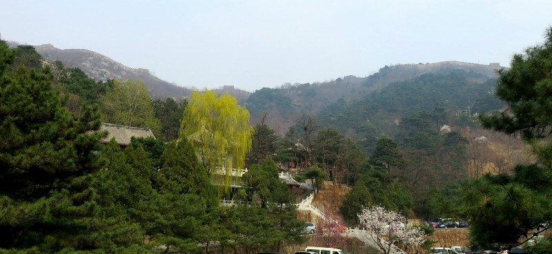
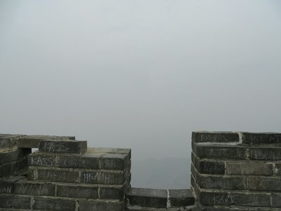
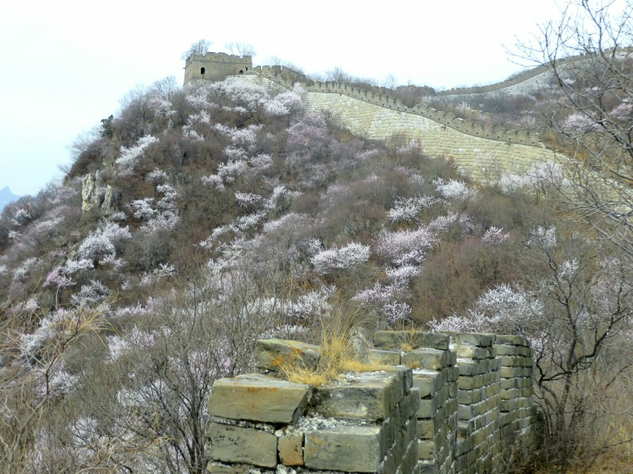
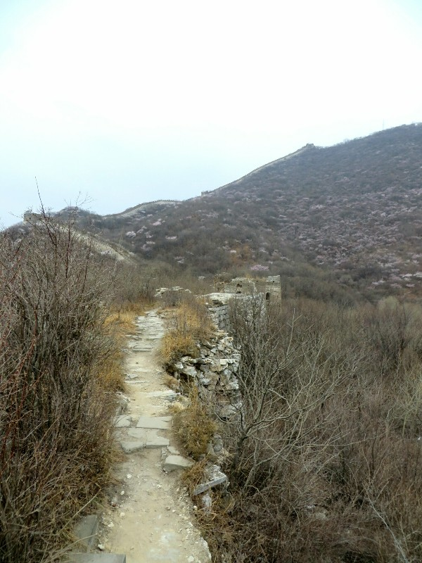
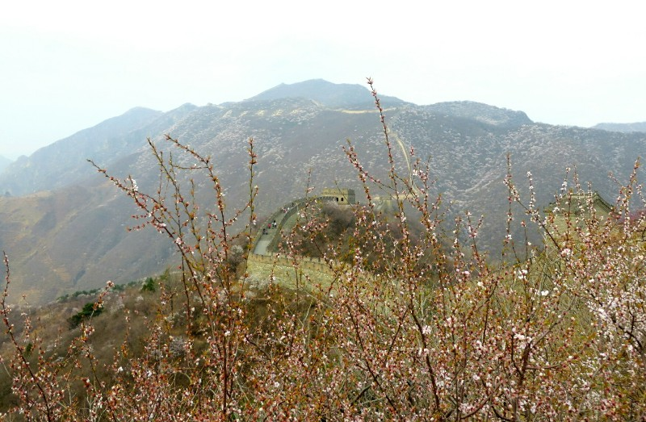
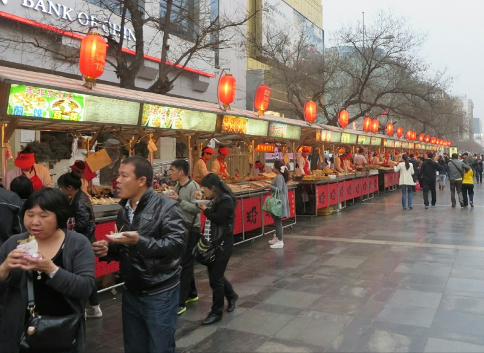
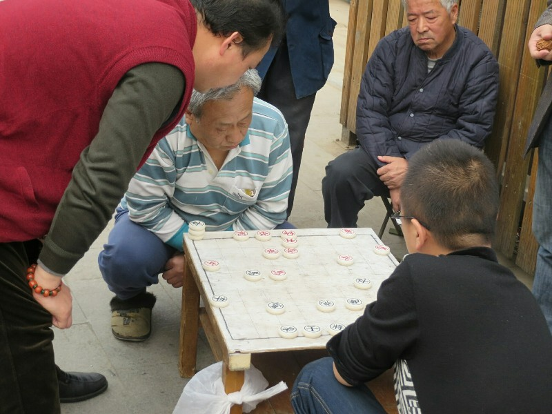
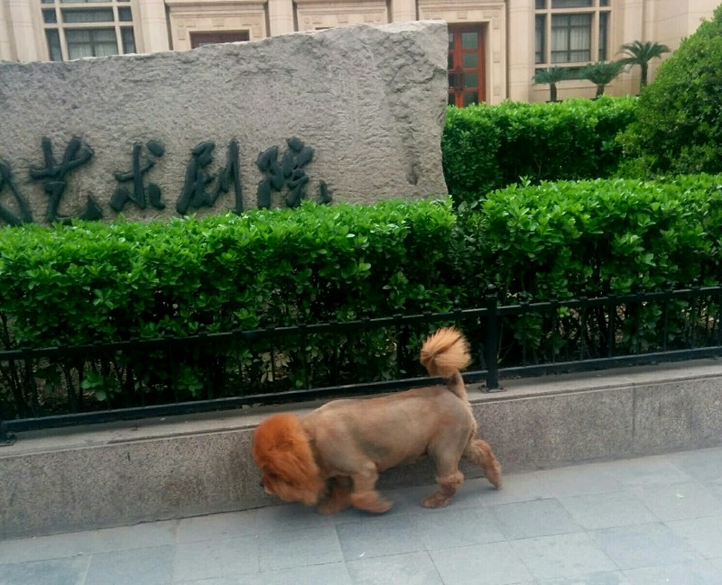
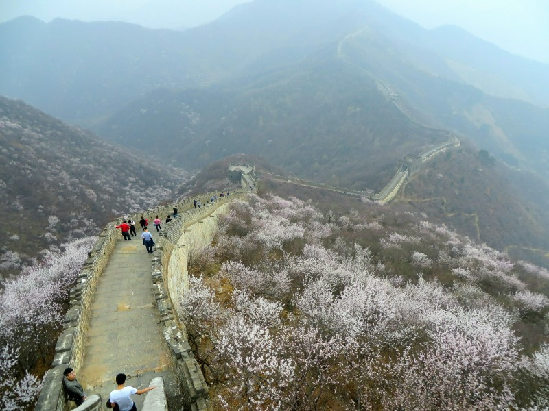

Up bright and early this morning to be picked up at 7.30 to head to the Great Wall- many thanks to Jess Lambert for this one. We wait at the meeting point. There's definitely Beijing smog today, our view of the end of the block we're standing on is obscured. A bit disappointing, should have gone to the wall yesterday. 7.45 rolls around and still no driver. We go back to the hotel and ask the receptionist to call him. Apparently he is lost. Didn't bother to call and let us know! She gives him directions (over two phone calls because he's still lost after the first) and just after 8 he shows up. So much for an early start to miss rush hour traffic! The next 2 hours is spent in traffic then driving to the wall, the air quality getting worse and worse as we head out. We were really hoping it'd improve further away from the city!

*When We Arrive We Use The Bathroom- Pretty Average View (That's The Great Wall On Top Of The Mountain)*

The driver asks if we want to get the gondola up and back or the chair lift up and toboggan back. We kinda want to walk up? He says that's not the best idea, we should conserve our strength for the hike on the wall. He suggests the gondola because if you go that way along the wall you can continue beyond the restored section. We reluctantly agree, thinking we're not 80 and could probably handle a walk up a hill and a wander along a wall.

*What Incredible Visibility!*

A quick gondola ride later and we're at the top. There is not much of a view... A whole lot of smog and a whole lot of tourists. We're starting between towers 13 and 14, heading to 23. Off we trot. It starts off fairly easy going, although the path is very uneven and a bit awkward. Within 30 minutes we're at tower 20- how is this a 1.5 hour walk? The answer soon presents itself. It gets steep. Steps and steps, all uneven height, seemingly never ending. You get to the top, then realize more are ahead. We reach tower 21 just to see the climb to tower 22 looming. On the plus side, the tourists are thinning out and the smog is clearing. We can see all the way back to where we started!

*Cherry Blossoms Along the Wall*

We make it to number 23 after just over an hour, celebrate briefly with some fruit and water (a guy selling wine and beer at this tower is surrounded by empty bottles from people who celebrated slightly differently) then continue on the unrestored wall. The difference is pretty obvious- all the towers are half fallen down, bushes and trees have grown on the walking path, and we saw only 3 other people on this section of the wall. After a couple of towers there's another steep climb and we decide not to risk it in our non-hiking shoes.

*A Better Section of the Unrestored Wall (The Bushes On The Left Are The Middle Of The Path)*

The walk back is much prettier now the fog has lifted. Less tourists too. We stop for many photo ops. We also stop to encourage people making the slog up the hill.

*Clear By The Time We Left*

After our walk (and a nap on the drive home) we head to the night markets for something tasty. Preferably on a stick. I know everyone's sick of hearing about food they can't taste, but mmmm. Fresh cooked lamb kebabs, fresh cooked and chopped beef with herbs in an English muffin with delicious sauce, fried and steamed dumplings, Peking duck pancakes, noodles with veggies, deep fried ice cream, candied fruit skewers.... Then another round for seconds. Kate also had a Beijing yoghurt - a tub of pot set yoghurt they drink with a straw like a soda. Also really good!

*Night Markets*

We waddled home, bellies very fat again. We attempted a short cut but were sent packing by a serious looking guy in a uniform. There are lots of police cars around with flashing lights and night vision cameras mounted to the light posts. We have a look on the map to see what we've been rejected from- apparently the Chinese version of the White House. How we are not on the list I do not understand! Bet our faces are on some record now as potential Western insurgent terrorist suspects...

Tried to put up a blog post when we got back but the internet is terrible. Aside from being slow, everything is blocked here. Snapchat, imgur, Facebook, Google translate... No wonder the Chinese are so grumpy- it must be exhausting stalking people the old fashioned way.

*Lots of Men Sat in Groups on Footpaths Watching Games of Xiangqi (Chinese Chess)*

*Wild Lion Loose in Beijing! Probably Why They Need All That Riot Gear*

*Better Visibility! Of Many Stairs. I'd Rather Not Know...*
