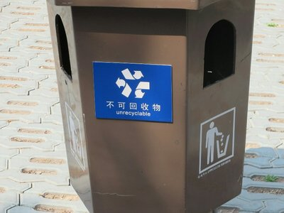
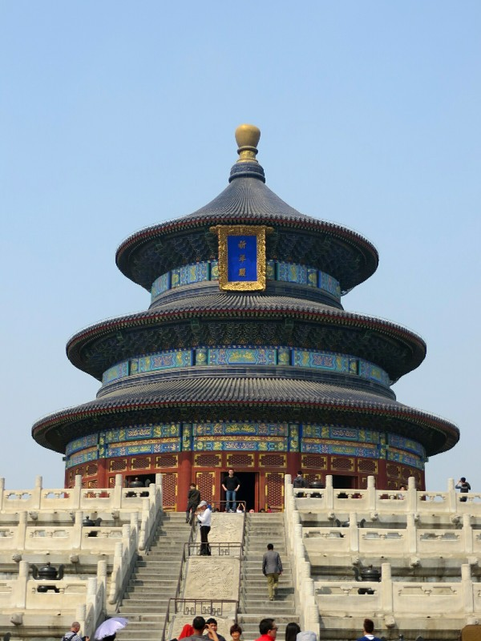
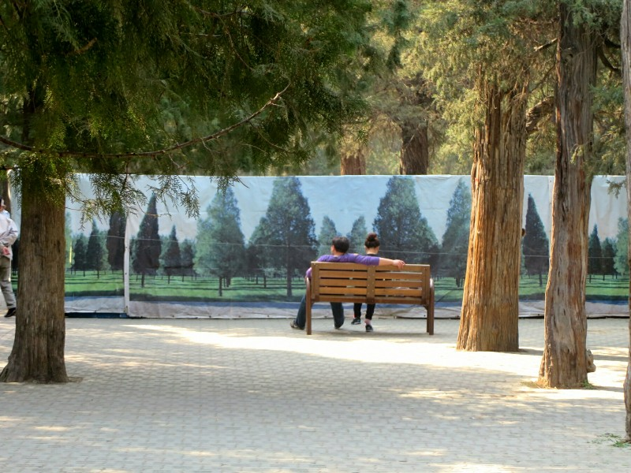
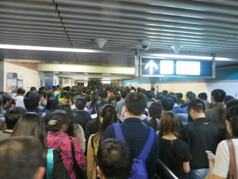
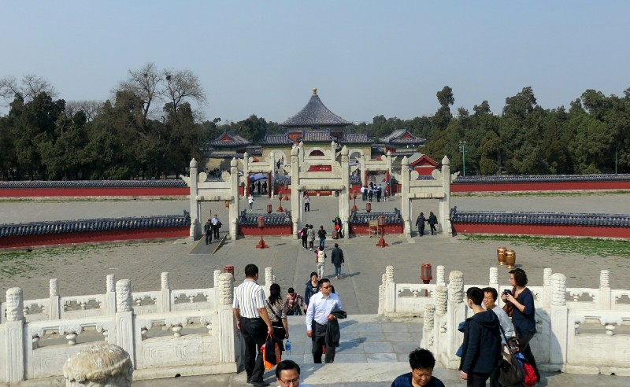

After more delicious breakfast dumplings, we think we'll start the day at the Summer Palace and Temple of Heaven. 90% of the way there we change our minds and decided to grab our tickets for tonight's sleeper train first and head to Beijing Railway Station.

*Love This Symbol on The Local Bins!*

Talk about chaos! The Japanese would never stand for this. We join an enormous line out front of the station. People push in if there's an almost human sized space between you and the person in front. When we reach the counter the lady shakes her head and points to the left. We go that way, find a big building that says 'tickets' (sounds good), enter and join one of the mega queues. Get to the front and are pointed to counter 5. A big LED screen up front has seconds long English translations of its messages- one is directing English speakers to counter 16. Surely that doesn't need to be in Chinese 95% of the time? We leave queue 5 and join that queue. First we're approached by a very aggressive beggar who pulls at Kate's arm until Pat stands in between them, then an old lady tries to cut in line because there's a small gap between us and the next guy and curses angrily when we step forward to prevent her. Then a man in the queue next door takes an interest in Kate and stares and stares for the next 20 minutes.

Not a great experience, but once at the front picking up the tickets is painless.

Next, back onto the subway. Apparently there are no ticket machines, despite being one of the busiest subway lines in the city. There are two counters selling passes each with massive queues. People are scalping the $0.40 subway tickets outside the ticket booth because the lines are so long. Insane.

We head to the Temple of Heaven and spend a couple hours wandering around. There are lots of open concrete areas surrounding all of the buildings in this complex, similar to the Forbidden City. We guess they must have had thousands of people present at the celebrations or imperial addresses to warrant such expansive pavilions. From what we piece together, these temples were/are used to pray for good crops during the growing season, good luck in general, and for other special events (imperial weddings, lunar celebrations, etc). As in the Forbidden City, the emperor had several buildings dedicated to a whole manner of seemingly mundane tasks: one large temple for him to change into ceremonial clothes, a fasting temple where he would fast for one day before a particular event, and an abstinence temple because apparently emperors don't have self control and need to be separated from their concubines. Rough life.

*Temple of Heaven*

Each detail of the grounds and construction of the temples had meaning in one way or another. Stones were laid on the walkways in particular numbers and groupings to represent heaven and demonstrate its supreme importance. Blocks laid a certain way on a large bridge were exclusively for the emperors to walk on while blocks laid a different way were for other important people,  and blocks laid still another way were for the plebs. We made a point to walk on the Imperial stones, cause you know, we deserve it. One of the buildings was surrounded by a circular echo wall- a sign said if one person stood at the Eastern side of the wall and another at the Western side then you both face North you can hold a conversion despite the distance and not being able to see each other. We gave it a go and it did work, but the Chinese tourists who didn't read the instructions and just stood facing the wall at random intervals yelling blocked the sound waves somewhat. There were also hundreds of (up to) 900 year old cypress trees all throughout the temple complex. Pretty impressive to see trees that predate all of the temples that were built around them.

*Why Enjoy the Hundred Year Old Forest Around You When You Can Look at an Almost Lifesize Colour Photo!*

Once we had our fill of the temple, we made our way back to night markets from last night for some more food. Despite a relatively expansive subway network, it seems to take a long time to get from point A to point B, and it usually involves at least two transfers. In Tokyo this wouldn't be a problem - the stations would all be laid out efficiently and people would move quickly and politely from one train to the next. Not here. Pulling up to a station starts a shoving match which appears to be everyone versus everyone else. The concept of letting people off before you get on doesn't exist, it's all about getting where you want to be right bloody now and anyone in your way be damned. And no one seems to mind this behaviour, it's just the way everyone moves around and that's just how it is. That doesn't stop it from infuriating Kate and I when we have to shove our way out of a train.

*The Crowd In Front of Us And The Crowd Behind*

Bellies once again full of food and running slightly late, we hurried back to the hotel, grabbed our bags, and went back to the subway to get to the train station. We put our bags through the xray machine at the subway entrance and the security girl stops Pat and starts speaking to him in Mandarin. The security team consists of 4 girls who wouldn't have been older than 25, and are now all laughing at her attempt to explain what she saw in his bag and Pat's continued inability to understand her, no matter how slowly or loudly she spoke.

We both know she's asking about our Swiss army knife, but we aren't prepared to have it seized by the subway security team, especially after our near miss in the Laos airport. That aside, how else are we supposed to get our luggage around the city...? Pat plays dumb, using his best sign language to convey "Face razor? Nail clippers?". He eventually opens his bag and starts pawing through his dirty socks and undies and this is enough for the girls - they start laughing again and just motion for us to go through.

Finally at the train station, we navigate through ticket check, security, and find our waiting lounge, which was designed to hold about 1/4 as many people that were currently there. It's hot and humid but luckily we don't have to wait too long. They let us on the train and we find our small sleeper cabin. Of course there were people talking loudly and smoking in the corridor of our non smoking carriage, it is China. But the cabin is nice! Cosy bunk beds, small table, chair awkwardly squished in the corner, and our own private toilet, score!  We didn't sleep very well, but better than we both expected. Enough to at least get us through the next day for our tour of the Terracotta Warriors.

*More Temple- Looks Like Disneyland!*
