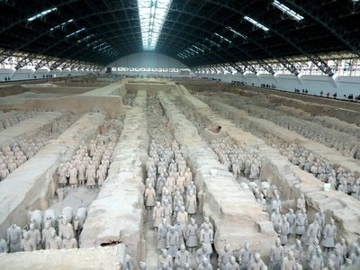
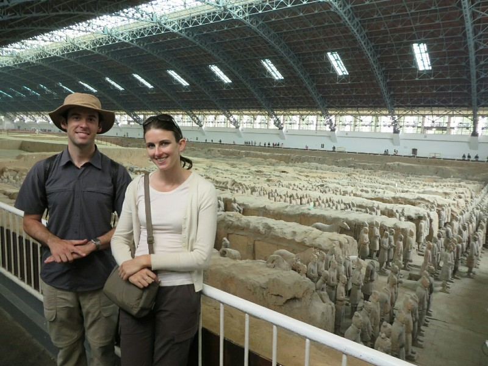
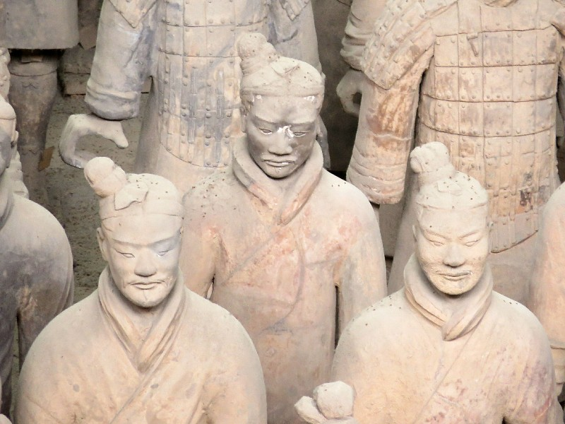
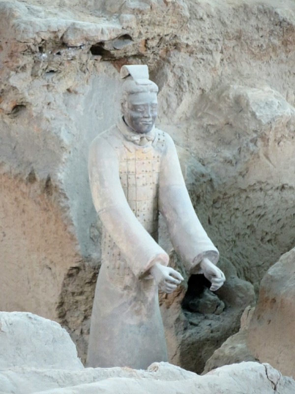
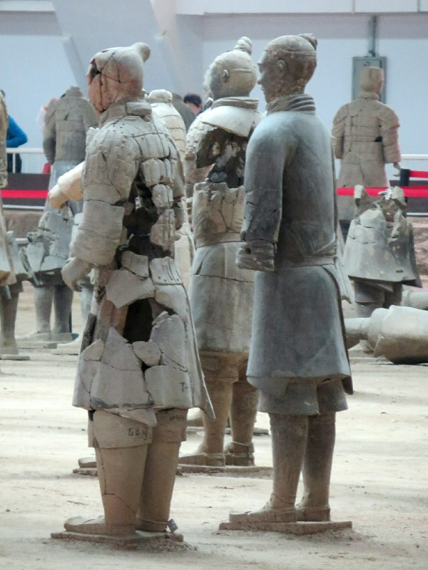
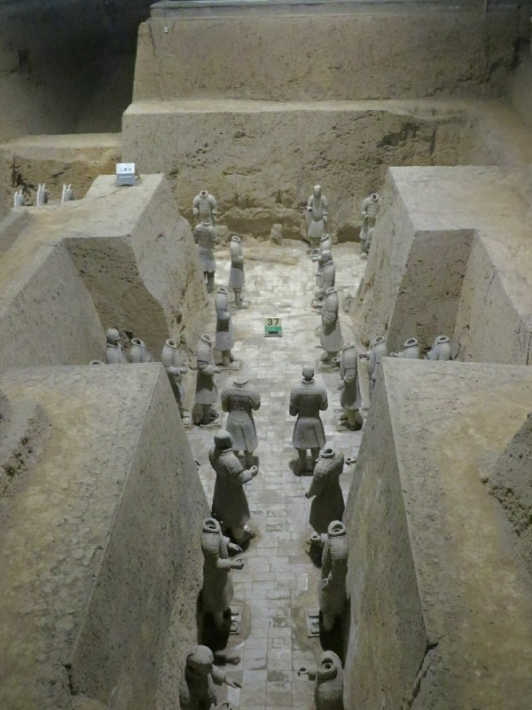
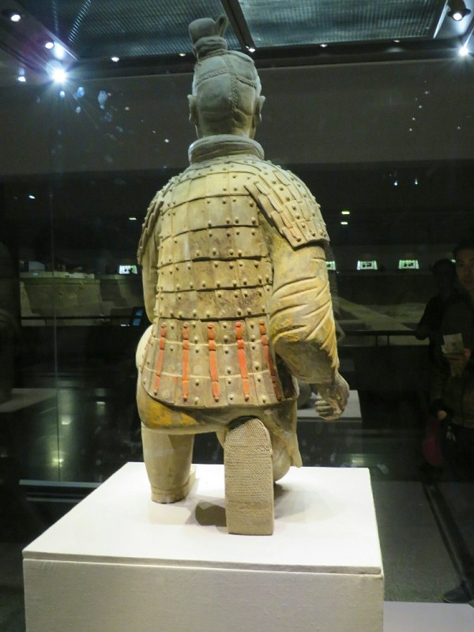
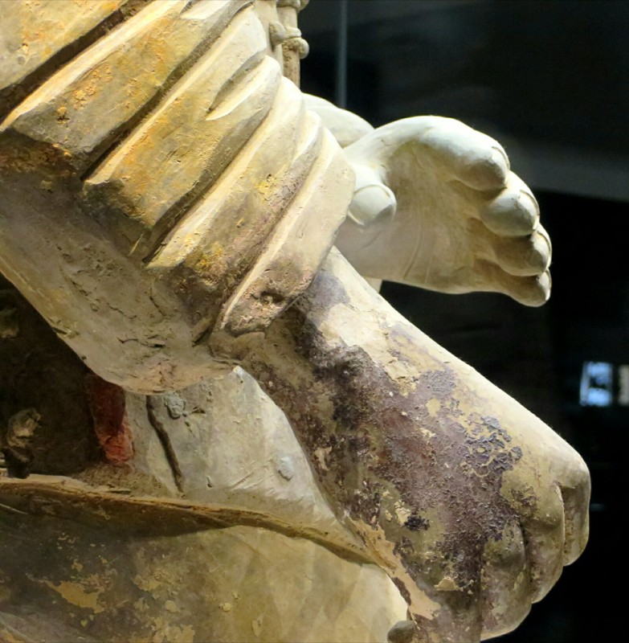
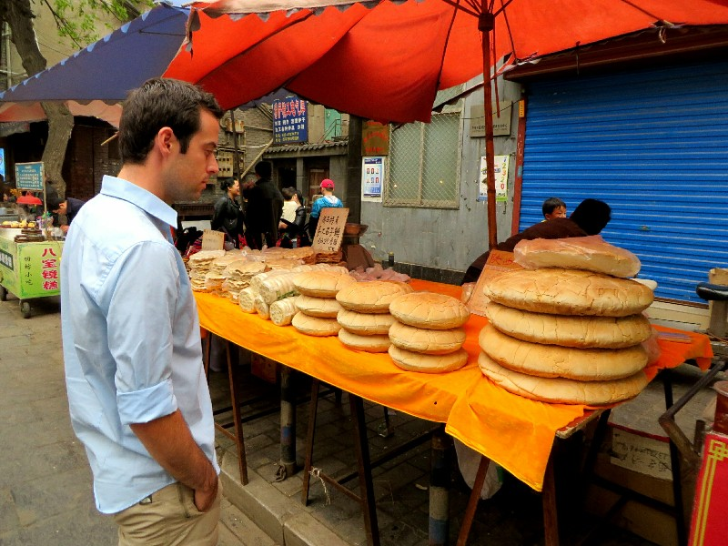

After a poor night's sleep we were fully awoken at 6.30 by someone's kids screaming in the hall. At about 7am a bossy woman comes and unlocks our door trying to barge in while we're still tucked in our bunks in sleepwear (ie. not much). We keep relocking it as fast as she unlocks it. After playing this game for a while and her not giving up, Pat lets her in. She takes a metal tray from the table and leaves. Couldn't have waited???

The smog is worse here than Beijing. When we got off the train we find no tour guide waiting to pick us up at station despite what we thought was a confirmation email we sent regarding price, time, and pickup location yesterday.

Waiting for the guide to show we experience the worst harassment we have anywhere so far. Taxi drivers and vendors won't take no for an answer. They ask and ask, they chase us down the street, we get harsher and harsher with 'No! Go away!' to no avail. After a half hour we walk to the hotel to use the Wi-Fi to see what's happening with the guide. We get lost and wander into a Hilton. Always so helpful! Anywhere in the world we get lost, the staff at the Hilton speak great English and point us in the right direction. When we find our hotel (tucked in a Sofitel complex) we discover we've been upgraded to a one bedroom suite for our one night stay. Score!

*Pit One*

We have the front desk call the tour company and they said because we didn't pay a deposit via PayPal (what deposit??) that they didn't think we wanted their services anymore. Turns out they sent another email after we checked out yesterday requesting a deposit. Couldn't have mentioned it in the other two confirmation emails?

Anyway. We give up and decide we don't need a private driver and we will just hire a guide at the museum. We set out for the bus station and hop on the tourist bus. A horrendous wave of sickening BO washes over us as soon as we get on the bus. The air is thick with the scent of unwashed, sweaty bodies and stale cigarettes. It makes both of us nearly vomit. We sit near the front for the fresh air when the door opens for our hour long ride.

Once we get to the site we hire a guide from the group milling out the front, a kind gift from Aunt Patty. They all work for the museum so we pick one at random. Lee Lee, very nice but seemingly struggling to cope with life. She loses her ticket and forgets what she's doing a few times. Eventually she gets organised, uses our Aussie IDs to get us discounted tickets and takes us through.

We start, as always, with a bit of backstory. The terracotta warriors were built between 246BC and 210BC by Emperor Qin Shi Huang, the first emperor of China. He ascended to the throne at 13 and started building his future mausoleum- a big burial hill protected by Xi'An to the West, mountains to the South, a river to the North and the thousands of terracotta warriors to the East, all facing East to protect his body from any enemies. He was considered the first emperor after he unified the six kingdoms of China at age 39. When the he died he was buried in his mausoleum along with half of his two thousand concubines. It took 720,000 slaves to build the warriors many of whom were killed when it was complete to keep its location and existence secret.

*They Look Like Miniatures In Photos- Should've Saved A Trip to China and Gone To Cockington Green Instead*

It was only rediscovered in 1974 by a farmer digging a well, looking for water during a drought. Since then a lot of excavation and building work has gone on to turn the area into an attractive area for tourists. A very nice entrance garden was built in honour of Bill Clinton when he visited in the 1990s. Michelle Obama visited recently too, Lee Lee says the Chinese aren't as keen on the Obamas. No new garden for her!

Three pits were open to visit. We went to Pit 1 first, the biggest pit. It contains figures standing in rows of four (which was considered auspicious at the time, but is considered unlucky now). Each one has a different face, a different height, weight and figure. Details are carved right down to individual hairs, wrinkled foreheads and lines on their palms.

*Every Face Is Different*

The guide told us there are four different types of figures, identifiable by a few features. At the top of the social pile are the generals, all done up in armour with special moustaches pointing up! Next, officers. They have a flat head (special hairdo) and moustaches that point down. By far the most common are the soldiers, they get a beard AND a moustache AND a little hair bun! Finally, slaves. They get no armour and no lifeline on hands (because their lives are worthless). Also horses. Gotta have horses. A little research on the Internet later on indicates she may have made some of that up. The moustaches are apparently completely unrelated to rank, they're just moustaches. It's mainly uniform that differentiate the different ranks, so there you go.

*Terracotta Warrior Discovers Simple Secret to Weight Loss -Dieticians Hate Him!*

Many of the figures have been damaged over the last two thousand years, major damage was done by looters early on who didn't like the emperor much and set fire to the outer tomb after his death. There have also been multiple earthquakes in the region which may have damaged the figures too. It takes 2 years to rebuild each damaged warrior. Time consuming, but looking at the tiny pieces they're working with, all muddled up from hundreds of different warrior puzzles it's a miracle they can put them back together at all!

*Reassembling Warriors*

Next up, Pit 3. This pit is for officers, buried deeper than the soldiers and slaves as they're more important. Rather than facing East, they're in conference, facing one another. Many are headless, again the suspected work of looters or possibly because they weren't finished when the emperor died. Bit of a mystery.

*Officers in Conference*

Finally Pit 2. This was another massive area, largely unexcavated. In the parts that have been excavated they uncovered kneeling archers and chariots. Apparently the incomplete excavation is partially to give people a feel for how it looked when it was first discovered, and partially because they want to wait and see what technology is developed to preserve the figures from damage before they unearth them. The major damage that's been done to the figures previously was loss of the coloured paint that used to decorate the warriors on exposure to air. Apparently they're in the process of a third excavation of the first pit with new fancy German technology to try to solve this problem.

*You Can Still See Some On Colour On This Guy (And The Tread On His Shoe)*

They had a little exhibition displaying some of the weapons found with the warriors. They survived so long because they're chromium plated; until recently it was thought this technology was 'invented' in WWII. It now seems it existed here 2000 years prior, but as everyone involved was killed no record of how to produce the weapons was left behind. Good job setting the world back 2000 years for your ego first emperor!

Finally, to the gift shop where you can buy photos with Clinton and Putin's faces photoshopped onto the warriors. Great gift for the whole family for Christmas!

*His Lifeline Indicates He'll Be Burried Alive With an Emperor at Age 27...*

The last thing the guide told us about was the new discovery of acrobats in another pit, Pit 7. She said they were only found in February this year and an exhibition dislpaying them would open next year. As it turns out, when we get home and looked this up, it was a complete fabrication. The acrobats were discovered in 1999 by chance when local villagers were digging graves.

All in all this was a really fascinating visit of an amazing historical site, but we both found the misinformation from the guide utterly bizarre. Did she tell us the acrobats were new to try to trick us into coming back again next year? Does she just have no idea what she's on about? Is it about giving an answer, any answer to save face from admitting she doesn't know? Surely if it took us a half hour to research online it'd take her less time to just read the information signs all over the museum, or one of the books...? Just peculiar. She still did give us a lot of useful information definitely, it was just the random fabrications that make no sense to us at all.

Kate snoozes on the ride back. At the hotel Pat has a shower, then we head for the Muslim Quarter. Xi'an was once the eastern terminus of the Silk Road and it's said that many Muslim diplomats, traders, and merchants took up residence in this particular neighbourhood. After many generations of people marrying, having kids, their kids living in the same area, their kids marrying other people's kids from the neighbourhood and having kids themselves, etc, the neighbourhood grew to be a very tight knit community where everyone knows everyone else. In addition to several impressive mosques, the main draw is all of the local food that is on offer here. It's no accident we found this place.

Again- the smell is amazing. And again, we go overboard on food. Aside from a couple of the standard lamb kebabs we try some local specialties. Fried tofu with spices, lamb soup soaking thick bread, an English muffin full of spiced beef and dukha, little sweet cakes made with crushed walnut flour and we bought a loaf of chilli bread to take home. Savoury bread! That's a real find in Asia! Blessing the Muslims we head to bed.

*Delicious Bread as Big as Pat's Head!*
