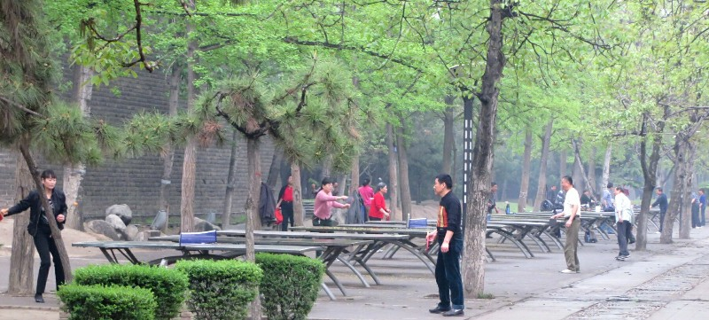
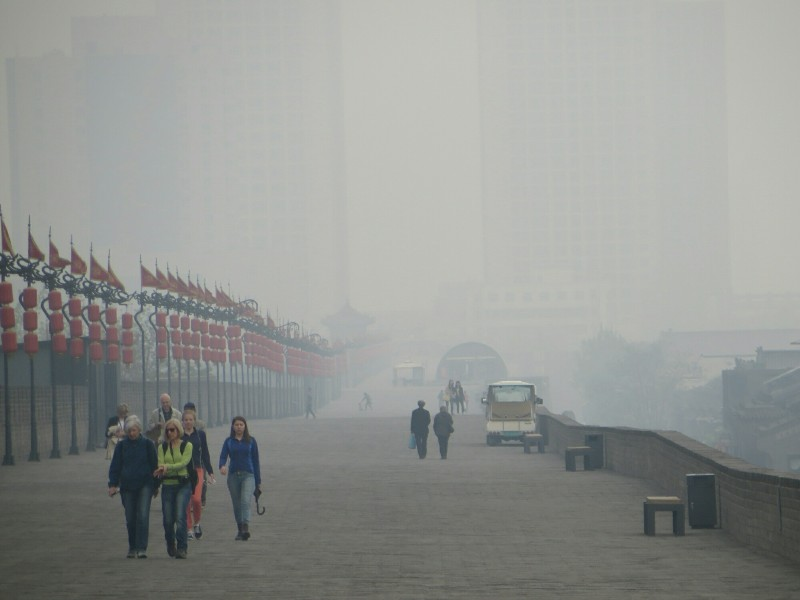
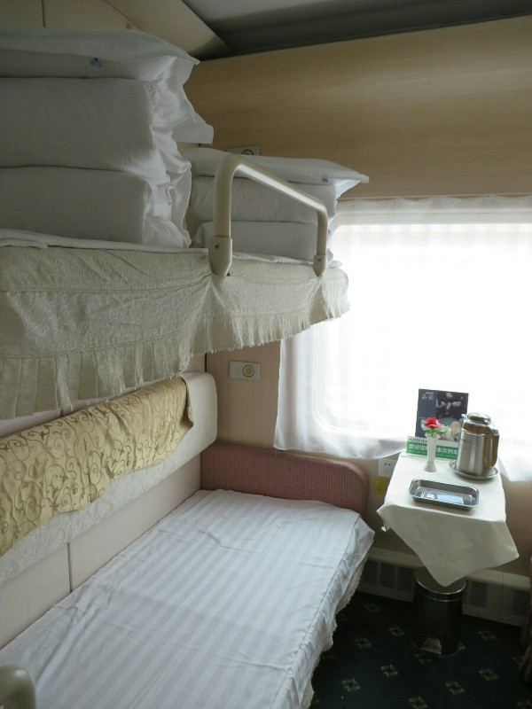
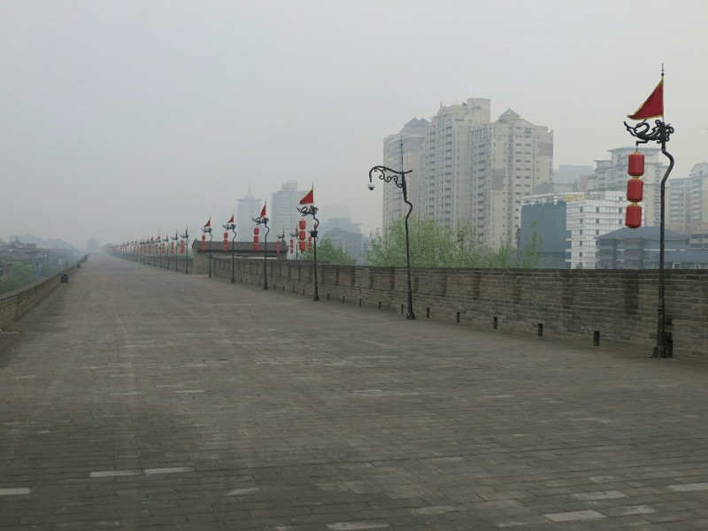

We wake up to a rainy day. We only have a morning left and planned to ride bikes around the city wall then visit the Big Wild Goose Pagoda. With the rain, bike riding was out- too slippery. Little spanner in the works but we thought we'd walk a section instead. We caught a bus to the South Gate to start. It's all fenced off with construction work going on around the full circumference. Well. Spanner number two. We get on another bus to go to the Giant Goose Pagoda instead. The floor of the bus is wet from rain and all the people spitting on it (actively going on the whole time we're in the bus). For some reason the seats here are all made without grip. If we got a seat on the Beijing subway when it stopped we'd go flying sideways with intertia into the person next to us. On the buses where we face forward, we just slide forward and off the seat.

The bus went the opposite direction to what we expected. We gave it a little time to right itself, then decided this excursion was a fail too. We got off at the south west corner of the city wall and walked towards the west gate through a nice park. There are women exercising (like Tai Chi?), people playing table tennis, men playing cards and board games with big groups around them watching. It was actually quite pleasant. We grabbed breakfast at a fast food place rated 'ok' for food hygiene; a little yellow smile. Good is a wide green smile, bad is a red face that looks deadpan unimpressed. Hopefully no food poisoning. Kate had a half a yoghurt then realised it was off. So food poisoning? Probably.

*I Wonder if they Bring Their Own Balls?*

We went up the West Gate and walked the 3kms around to the South Gate. There are information signs everywhere! About the wall, the gates, the ramparts, the surrounding streets, the gutters, the path beneath our feet. All in Engrish and with the occasional spelling mistake. Surely if you're paying to make the metal signs you can afford a spell check? From the South Gate visibility is about 2km. It's so smoggy we can't see the sun or the skyscrapers behind the South West turret we just walked from. Today is definitely the worst day so far in terms of pollution.

It's now a bit late to go to the Big Goose Pagoda, so instead we walk North to the Bell Tower (surrounded by beautiful blooming tulips) then past the Drum Tower to the Great Mosque. We could either go in, or eat. We choose food. We got a tray of steamed dumplings, some dumpling soup (one of the regional specialties- very nice, I'm starting to understand why people love Dumpling King) and Kate got another nut flour cake thing.

*Less Than 2km Away. Makes You Uncomfortable Breathing*

Time is just about up so we head to the station. Having not learned his lesson from the subway, Pat's bag got pulled aside again for the pocket knife. This time there was no playing dumb, we decided we'd just put it though as freight and be done with it. Pat ventured back through security and managed to convey (in sign language as no one spoke any English): "This is a pocket knife that I can't take on the train. I'm leaving for Shanghai on the overnight train. Please put it in a box and send it as fright."

The knife was boxed up quite thoroughly, forms were filled out in triplicate, signed, stamped, money was exchanged, and then he was led tonother room where more forms were filled out, signed, stamped (but this time in quintuplicate - seriously, 5 copies. We fill out less forms to ship a dog on a plane interstate in Australia) and more money was exchanged. The whole ordeal ended up costing a bit over $5 so worth it to keep the knife, but lesson well learned: if you're going to take any dangerous items on a train in China, just keep it in your pocket.

Inside the station there's a big departure board. Unfortunately, aside from the train numbers, it's all in Chinese characters (the station details, the waiting room, the platform etc). After a trundle around the station we manage to find the right waiting room and go through to the platform. The signs for the waiting room and platform numbers are all in Latin characters. Having them in English there isn't much use when they're only in Chinese on the main board! These random incomplete translations are common. Information stands are helpfully marked in English, but the staff maning them don't speak English. Seemingly random words on a page are translated ('About Us'), then the rest is in Chinese. Seems like they haven't quite thought things through?

On the train, much the same as last time, except the bathroom in this one stinks like stale urine and has distressing wet floors to match. We keep that door shut. We settle in for a 15 hour ride, watch some Breaking Bad and eat some instant noodles.

*Our Nice Little Train Cabin!*

We are finding the longer we're in China, the less we like it and the more stressful and oppressive it feels. People seem to be actively unfriendly and unwilling to help, the only people who speak to us are in the service industry (admittedly, these people are sometimes friendly) or they're trying to scam us. Lost on the street? Too bad! Want to know what that food is? Take a guess, I'll nod along and sell it to you! Want a taxi? Taxi? Taxi? TAXI?? HELLO... TAXI?!

Pat feels saturated by the people here... The smell of body odor and unwashed hair consumes you in every confined public space, the sounds of people yelling often at no one in particular are inescapable both indoors and out, the incessant honking and attempts to run pedestrians over by motorists, the constant hocking of phlegm and spitting regardless of location (bus, train, sidewalk, nowhere is off limits), people smoking everywhere despite omnipresent no smoking signs (all of our hotel rooms, despite being non smoking, have all reaked of smoke and as I write this there is someone outside our cabin on the train smoking, filling our room with a lovely odor). And people stare at us. Not in a friendly way; lingering, accusatory glares as if our existence in their country (washed no less!) is straight up offensive. There is just no escaping it and it makes you feel physically uneasy at times just to be here.

The contrast to Japan is particularly sharp. In Japan they had so much pride in everything- in personal presentation, in their work, in their food, in their cars, their jobs, their cities, their temples, their culture... Everything. In contrast, the people here seem to have no respect for anything. They have the poorest personal hygiene we've experienced anywhere (much worse than South East Asia where they live in thatch huts in the dirt and would have an excuse). The idea of taking pride in their work is seemingly rare as demonstrated by the cleaner at the museum, the girls at the X ray machine at the subway station giving up on the knife (although I'm glad they did) and the guide giving us easily disproven misinformation. There is no respect for cultural sites and temples; there are people spitting on the ground, yelling and pushing to try and get a better vantage point. They have no respect for the environment, the air here is unbelievable. And the worst thing to deal with is their complete lack of respect for other human beings. The way drivers speed up when pedestrians start to cross to scare them out of trying, everyone knocking people over because "me first!" is the country mantra, pushing to get into the train forcing people trying to get out back in... The longer we're here, seeing this 20 times an hour, every hour of every day, over and over, the less we think China is worth bothering with. The Great Wall and Terracotta Warriors were really spectacular, but if we come back we'll probably do an organised tour for the exact reasons we don't want to anywhere else- to reduce exposure to the culture, the local transport and the less touristy areas.

To balance a little... The food is amazing. So good. In Xi'An we were never ripped off on food or water costs, we paid the same as the locals. The public transit is cheap and reliable (although difficult to navigate). There are trees and gardens throughout the cities... The fat babies are some of the cutest we've seen anywhere... And again, good food. Worth a double mention. Dumplings for breakfast is hard to beat.

*Spot the Spy Camera!*
