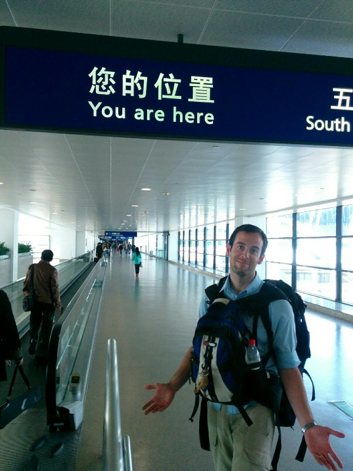
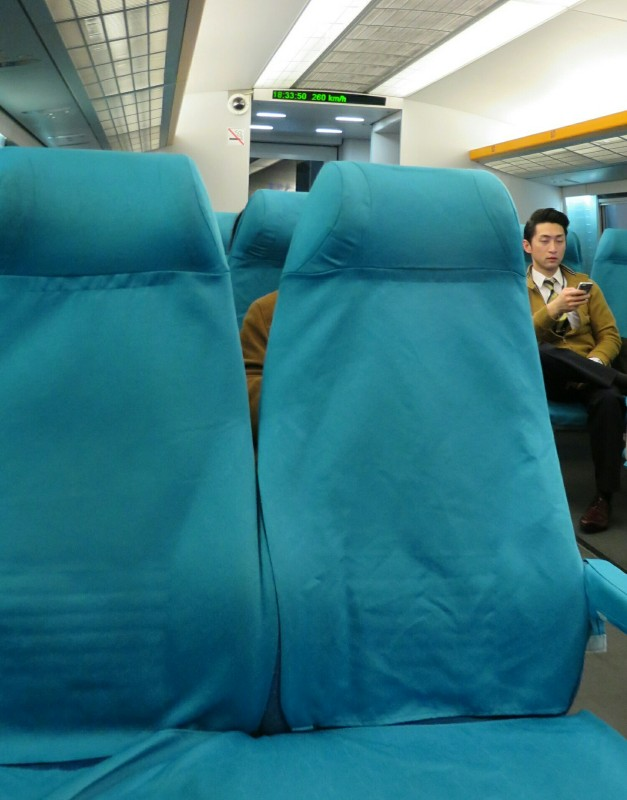
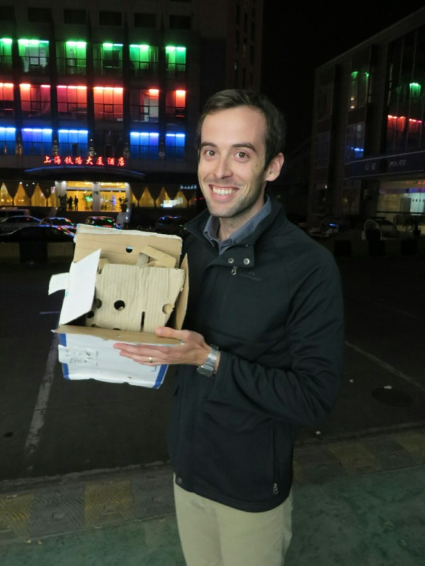
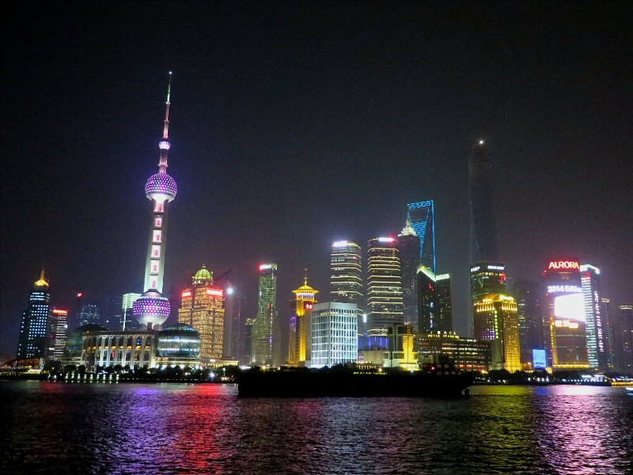
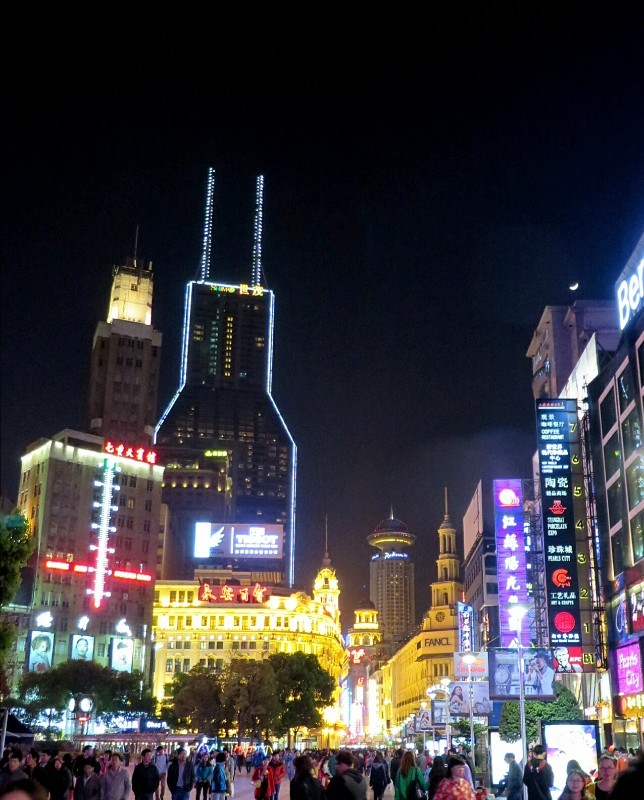

Kate slept much better on this night train, although it stopped quite a bit throwing us into the wall at irregular intervals, so couldn't call us well rested on waking.

Now in Shanghai, we went to pick up Pat's knife. No English at the freight company of course (although the man really did TRY to be helpful, going to far as to write English words in a random order in sentences that made no sense to try to explain). We establish it didn't come on the train. There are no luggage lockers in the stations. We decided we would go to the airport hotel and see whether they could take our luggage and sort this knife thing out.

The metro here is well signed in English, but is still bizarre. The first 'interchange' requires us to walk 2km or so from one line to the other. I think at that point it's two separate stations, not an interchange? Then the next line, which claims to go to all the way to the airport, requires everyone to get off the train, cross the platform and get on a new one halfway there. All the people coming from the airport to the city are getting off the train we're transferring onto so there's mayhem with hundreds of people, luggage in toe, try to simultaneously squeeze into and out of the tiny doors before they close and you get stuck in them. Two stops before the airport we're all kicked out again and have to wait on the same side of the same platform for the next train to go the final 2 stops. The only way I can fathom it was made this way was that someone saw a crayon drawing by a five year old and turned it into a subway system.

When we get to the airport we find an information screen, 'Intelligent Information System'. Unfortunately aside from the name, none of its intelligent information is in English. So. We go to find an information stand! All closed and locked. No Wi-Fi. No one will help us find the airport shuttle for our hotel, the staff all tell us it doesn't exist, we need to hire a private driver, and hey! They know one! And we can pay by credit card, sweet deal! Argh. So we get a taxi and finally arrive. This excursion took over two hours and was just mentally and emotionally exhausting. Nothing is ever easy, no one is ever nice.

*Oooohhh!!! I Thought I Was Over There! Thanks Airport Sign!*

The reception staff at the hotel don't speak English despite working for an international airport hotel. We give them the freight receipt and number for the knife and ask them to call. They cough on it, call, say it's not there, can't say where it is or when it will arrive, cough on us, and are no help. We can't stand the thought of another 4+ hours back and forth to the city just to find the knife was never shipped. We go buy dumplings (the specialty here is dumplings full of soup with a crunchy fried bottom- delicious but messy), wine and chocolate chip cookies and decide to spend the day in the hotel.

During our afternoon gluttony session, the internet in the hotel finally decided to start working again. As a last ditch effort, Pat emailed the travel agency that helped us book the train tickets figuring that at least they spoke English and would perhaps understand and convey what was going on. Much to our surprise, we received a reply rather quickly saying that the knife had arrived and was ready to be picked up. Since we didn't have anything else to do, we caught the shuttle back to the airport and (unwilling to sit on the metro for another hour) bought a ticket for the maglev train into the city.

Despite the fact that it's among the most advanced trains in the world, floating above the track on magnets with an operating speed of 431 kph (268 mph), the interior looks like it's fitted out with secondhand melamine office furniture and sad little chairs covered loosely with fabric. While we only got up to 300 kph and took a whole 50 seconds longer to make the trip than normal, it was still a hell of a fun ride.

*High Tech Train With State Of The Art 1980s Office Furniture*

Back at the railway station, we walked to the freight area and were disappointed to see all the windows closed up. Unwilling to give up yet, Pat walked around to an open loading bay and handed the receipt to someone who looked like they worked there. Success! We had to give them more money because why not, but after a few minutes the package emerged from the back. We tore the box open with glee and found the knife intact, still wrapped thoroughly in packing tape which was apparently a necessary part of the shipping process, as if it's going to spontaneously spring open in transit and start stabbing people under its own volition. You can't be too careful.

Lesson learned, we go back to the subway to make one final tourist stop while we were back in the city and, with the knife safely in Pat's pocket, walk straight through security. Airtight.

*Safely Packed Knife!*

Our last stop was The Bund. Walking along the riverfront with all of the old colonial buildings from France, the UK, the US, Italy, Germany, and many other countries, provided an interesting contrast to the ultra modern buildings on the opposite bank of the river which were littered with bright electronic signs and video screens dozens of stories tall advertising mobile phones and dating websites. There were hundreds of tourists and locals all lined up taking photos, coughing, spitting, and shoving. Satisfied that we had seen enough of China for one trip, we walked back to the subway and started the long journey back to the hotel.

*The Bund*

Up in the morning, to the airport on the shuttle, head to check in. For the first time ever there is no queue waiting. Disappointing because we get priority check  in with Virgin Atlantic. We take the priority lane anyway. After a few hours in the airport it's onto the plane! Our seat is actually pretty awesome- exit row seats with more leg room than business has and as we are meant to stay awake for the flight we don't need supine recline anyway. The air hostess even gives us champagne on take off to celebrate our honeymoon. The flight was surprisingly good!

Arrived in London 7pm local time, about 3am by our internal clocks, through immigration at Heathrow in a serious record breaking half hour (took over 2 last time, and that was with a fast pass), went to the hotel, slept soundly knowing when we woke up, it wouldn't be in China!

*Bye Bye Shanghai!*
