Now begins our five days out of five months in a country that speaks English as the national language. Hooray!

To welcome us, the credit card stopped working. Apparently 2 months of charges all throughout South East Asia, Japan, and China didn't set off any alarms, but one withdrawal at Heathrow and they shut down the card. Sigh. We had them reactivate it.

In London we notice many things that make us happy. We have milk and weetabix for breakfast, and it's real milk. All you get in Asia is the long life stuff. We can rinse our toothbrushes under the tap again. No more having to to ration bottled water. Our course of taking doxycycline with breakfast is conincidentally over as well. Not really London's doing, but were thankful just the same. The toilet roll holder is in a place that you can actually reach it, then you can flush the paper! The idea of toilet paper is so new in much of Asia that on the rare occasions it's available, you can't reach it from the toilet, then you have to put it in a bin after using it because the plumbing system isn't designed to cope with it. On the way out of the hotel, people make eye contact with Kate. Nowhere was as bad as Cambodia where people ignored her asking direct questions but eye contact wasn't even common in Japan. She feels like a person! Walking down the street we overhear snippets of conversions, and understand them! Not that that's always a good thing staying in a poor area of London..

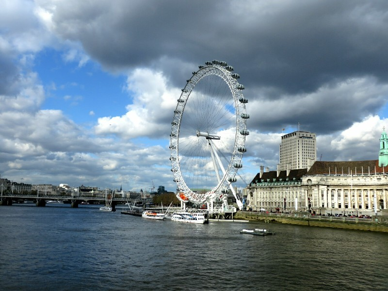

*Wandering Along the Thames*

Asia was a lot of fun, the natural beauty is truly spectacular, the history is fascinating, the people were (especially in South East Asia) much nicer than in Western countries and we hope to go back... But it's sure nice to not be there right now!

We spend much of our time in London in museums. First - the Museum of London. It is utterly overrun by children, ranging from a few years old to teenagers, from well behaved to disinterested to touching the exhibitions to screaming tantrums. We conclude it's school holidays. Ugh. We persevere. Learning about six thousand or more years of local history really emphasises how recently London became the huge metropolis it is today. Not long ago the Thames was full of pollution, there wasn't a sewerage system and children frequently died of curable diseases. There are photos of people selling dodgy food at street stalls and dragging big blocks of ice along the dirty street to put in people's drinks. There's definitely hope for Asia yet. 100 years behind, but if they could get some less corrupt governments representing them who knows where they'll be in a century.

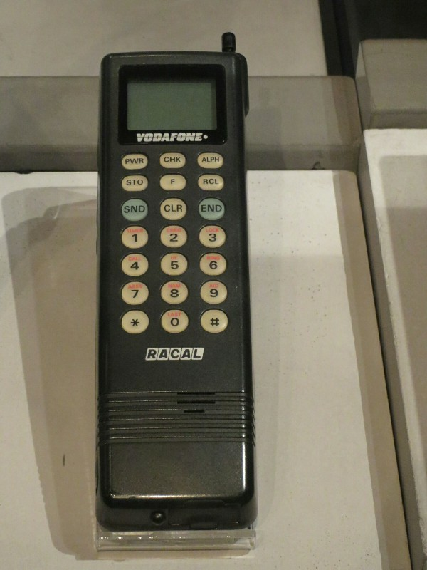

*Voda's new handset at the London Museum, only $15 p/m on the $99 Cap!*

After quite a few hours expanding our knowledge, we decided we needed to make space for tomorrow by jettisoning some brain cells. We headed off on a historic pub crawl to 10 of the oldest establishments in London. We visited places established in the 1200s, popular before Australia or the US were 'discovered'. We had a pint in places frequented by Dickens, Shakespeare, Mark Twain, Theodore Roosevelt, and apparently one where Queen Elizabeth I danced around a cherry tree out front. We tried a variety of local English ales and ciders, and a lot of pub food. Wedges, sausage roll (served cold with hot English mustard), ham and cheese toastie, a cheese platter (should have waited for France- not very good), a scotch egg and a packet of pork crackling. And after all that still got home before midnight. A regular pair of Cinderellas!

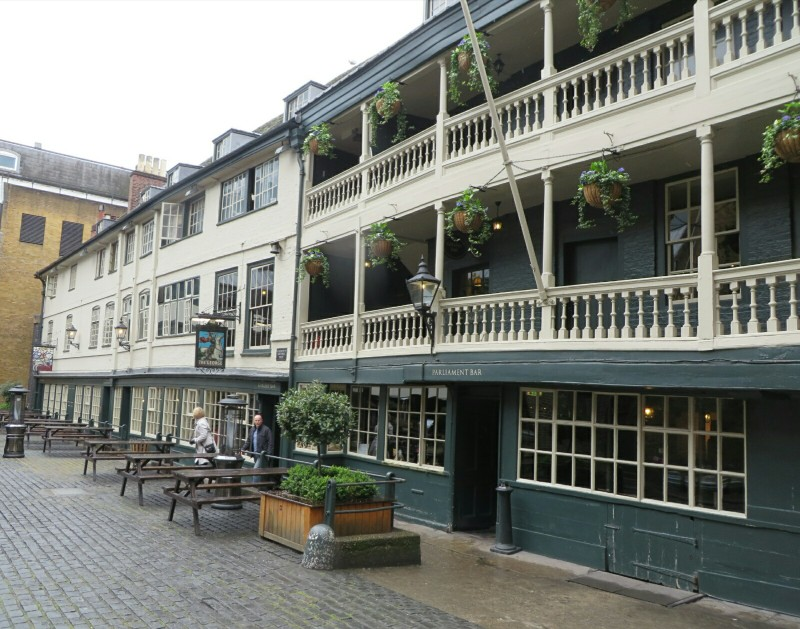

*Ye Olde English Pub*

Next museum was The Tate Modern. More school kids, lots of French kids for some reason. In the first section there are quite a few Dali paintings- I just love Dali, his paintings are so vibrant and emotive. We also saw a painting by Turner, which Kate was very taken with. As a modern art museum there were a lot of works we absolutely loved, and a lot we absolutely didn't get. One of the best things provided was a free audio guide explaining some of the pieces. The explanations of current events when it was created, the artist's life and the process used to create the pieces really took them from being a lump of metal, or car paint splashed on a canvas to an emotive and fascinating well... work of art!

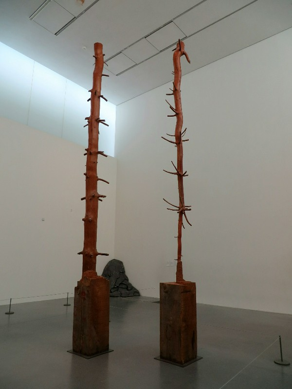

*Modern Art At The Tate - Layers Of A Log Carved Back To Reveal The Tree It Came From Decades Ago. Pat's Favourite!*

We went on a guided tour of one of the most modern sections and the lady gave a fairly good explanation of why a ripped canvas or a piece of hanging cloth is art- basically the feeling is painting has been mastered already, it can't be improved on, so the artists are trying to deconstruct and expand the definition of 'art'. The pieces are defined as much by what they don't do and what's missing from the piece as what is there. They're hoping to find a new way to evoke an emotional response from the viewer. Pat still feels seven panes of glass resting against the wall was a cop out.

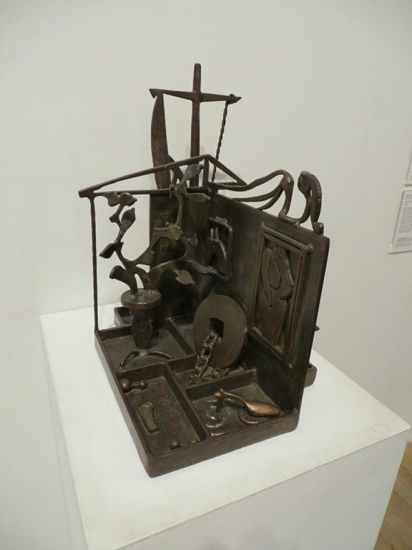

*When Asked About The Plant On The Table In His Steel Sculpture, The Artist Replied, "You Mean The Tit Tree?"*

We tried another classic English snack- a kebab from a local Indian take away. It was like a Turkish/Indian fusion food, chicken tikka in a kebab. Yum.

For an evening activity we saw Wicked on the West End. Tickets were a gift from Charlotte, Ian, Karla and Eddie. Once we got past all the bloody school kids (argh) we took our seats- close to the stage and center! The female leads were phenomenal. Absolutely amazing from the first second they came on stage. Kate very much enjoyed the story (a retelling of The Wizard of Oz from another perspective) and wanted to discuss with Pat afterwards. At this point it became apparent Pat had never seen The Wizard of Oz (that he can remember)!!!!!!!!!

I'm as shocked as you are.

So... We'll have to find a time for him to watch it, then see Wicked again. Darn!

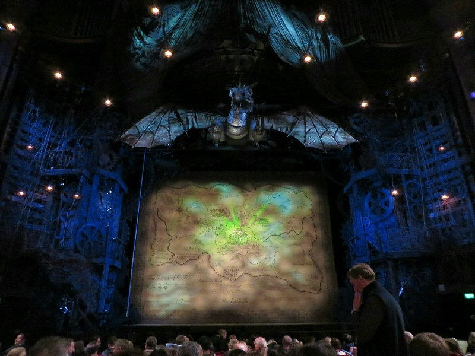

*Super Close to The Front at Wicked*

Our last full day we had our eyes peeled for a good pub that would serve up a suitable burger to satisfy Pat's craving. We would wander up to a pub, check the menu, look at each other dissatisfied and quietly make our way to the next in line. At some point in this process we were distracted by a shiny "bahn mi" sign over a restaurant with a queue out the door. Unable to resist the opportunity to eat another bahn mi, we joined the queue and hoped for the best. Good, probably better than anything we had in Vietnam, but still not up to scratch. Apparently we have high standards.

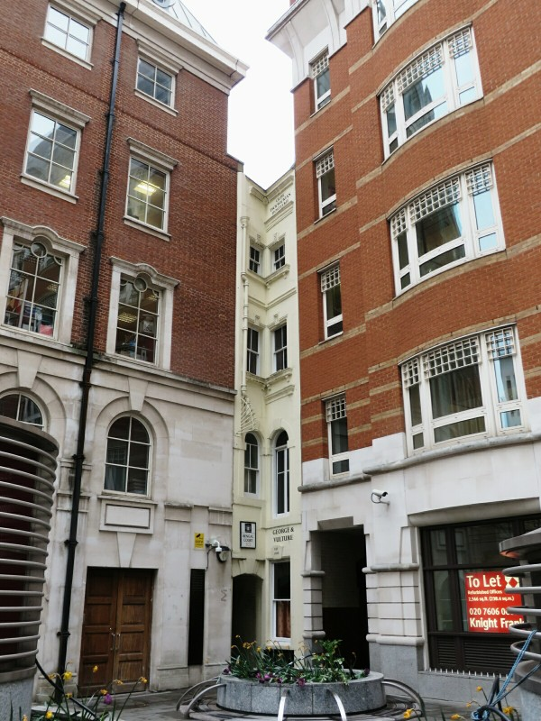

*"No room for a building? Hah! I'll show them!" - Some Architect*

We soldiered on and found an Argentinian restaurant that had a lunch special which included a burger. We ordered two and as Kate looked at the menu to order some dipping sauce for the chips, the waiter chimed in with, "Madam, the burgers are quite big. You won't need any more food". Clearly the man had never met us before. Some people have hollow legs for drinking beer; Kate and I have second stomachs we hold in reserve for emergencies (something that's never going to come back and bite us in the arse...). Once we finished we agreed the burgers were good but they weren't anything special.

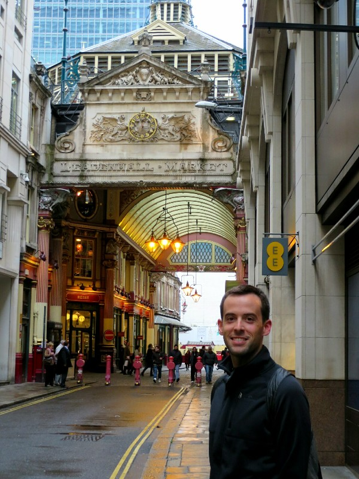

*Happy Pat in London*

Next- The British Museum. So. Many. Children. Had we known this week was going to be school holidays we probably would have gone back to Japan after China and waited for them to end (I say that only half jokingly, we really miss Japan). The museum was packed and loud making it difficult to take anything in. We managed to get a good look at the Rosetta Stone and contemplate the incredible value its given the world, take in few galleries about Messopotamia, the invention of farming and its impact on civilization, and a bit of the ancient Egyptian section before we gave up completely and left.

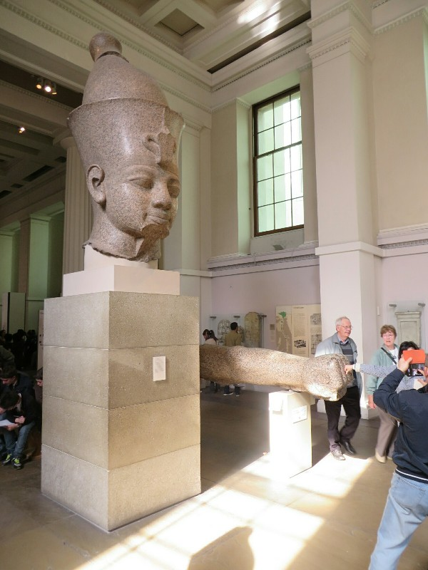

*Every Chinese Tourist Wanted A Photo Fist Bumping Giant Ramses*

A bit defeated, we meander aimlessly through Soho and Covent Gardens to Leicester Square. Thinking we might catch a movie, we're immediately discouraged by the £15 price tag, more than $25 a ticket. For that price we figure we might as well see another stage show instead of a movie we could see anywhere. We decide on a show called Jeeves and Wooster being held in a smallish playhouse called the Duke of York's Theatre. We buy our tickets,  planning to camp out for the hour before the show knowing they typically have a bar and some nibbles on offer. To our disappointment they don't serve popcorn, which is simply unacceptable. Pat asks one of the ushers what the deal is and finds out they used to sell it but it was too much effort to clean up after. Asked if we could bring in our own he replied, "If no one sees it, I can't see how it would be a problem". That was enough of an endorsement for Pat, so we walked to a cinema, bought a large tub of popcorn and stuffed it in our backpack. Subtle.

The show itself was really amusing and completely absurd. Very English. The stage itself created an impromptu, haphazard mood - it started with no set at all, then bit by bit the characters themselves brought in walls, doors, furniture and eventually they even dropped in a ceiling as the show progressed. It was performed by three actors (one of whom we recognized from the British comedy Peep Show) who played a range of characters during the performance with the changes getting more and more off the wall as the need for additional characters grew. It culminated with one actor having a conversation with himself, half of him dressed as a dapper English gentlemen complete with a mustache and a pipe, the other half a sophisticated lady in a formal poofy dress. Standing in profile, it was actually hard to tell his costume was split down the middle. Many giggles were had.

Throughout the whole show the actors constantly involved the audience and made you feel a party to the absurdity, as if you were personally invited along on this zany ride. They would address members of the audience directly and even tossed a policeman's helmet to one woman to keep it out of sight from the officer to whom it belonged. It ended with all three actors dancing a jig after their final bow as their curtain call. A fairly perfect way to to off our trip to London.

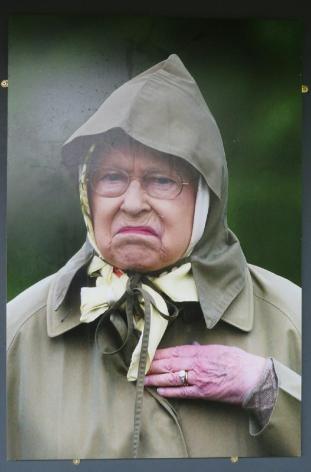

*Winner of an Excellent Photo Exhibit at the Museum of London*

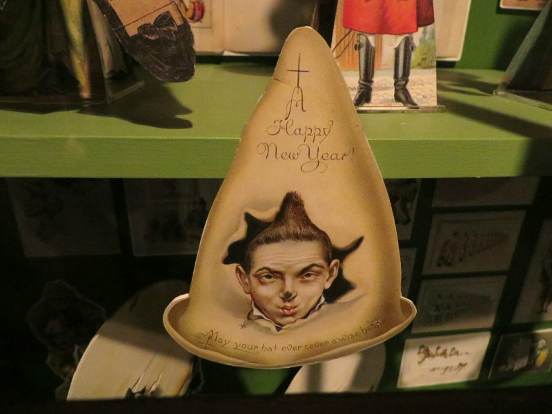

*Threaten Your Friends and Enemies at New Years with this Card From The Museum of London!*

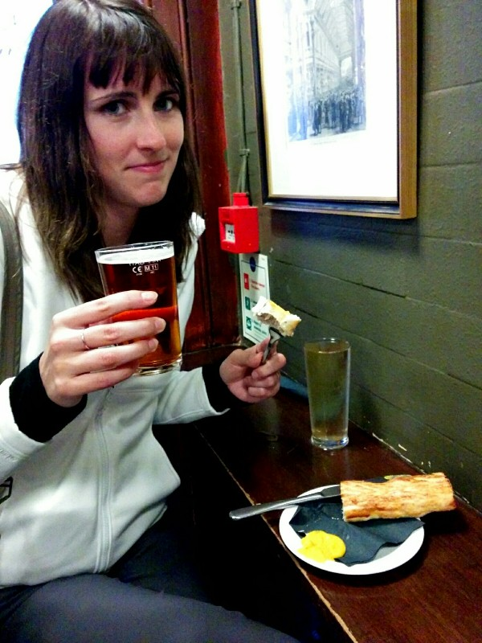

*Cold Sausage Roll and Warm Beer on the Pub Tour... Not So Sure About This*

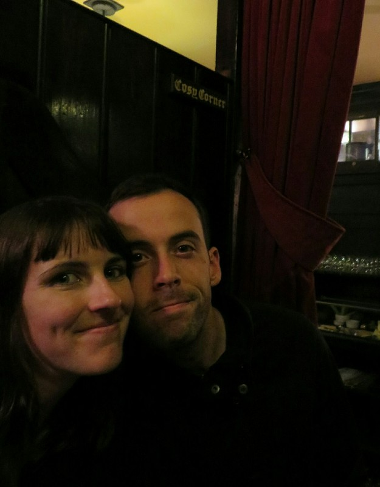

*Canoodling in the Cosy Corner*
