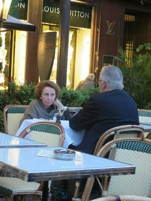
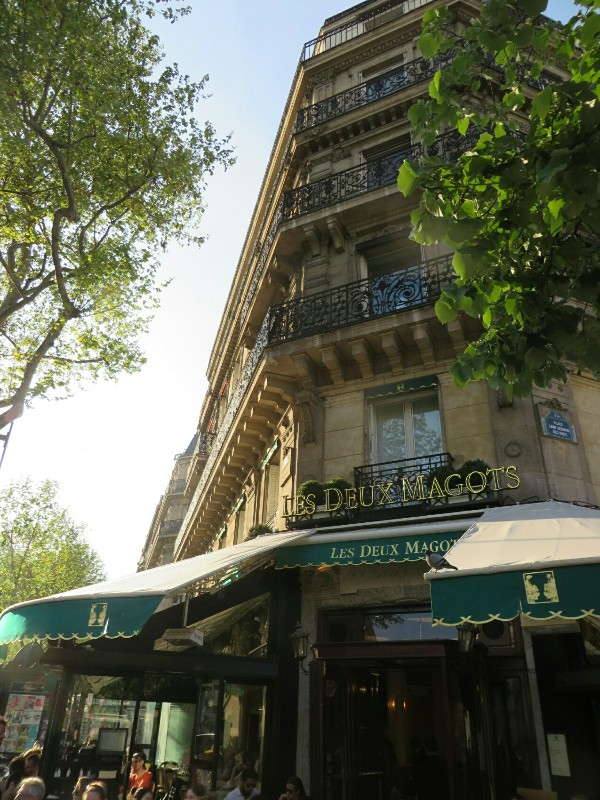

Up too too early we headed to Kings Cross (the international train station - not the drug dealing, bogan brawl capital of Sydney). As we were queued waiting to check in the fire alarm went off and there was an announcement to evacuate immediately. Pat started towards the door, then realizing Kate wasn't following went back to fetch her. She refused, "I'm not giving up my place in this queue for some measly fire!" Pat shifted anxiously from foot to foot, deciding which was a worse fate: his death if there was a fire, or his wife's wrath if it was a false alarm. The decision was made by a station worker telling people in the Eurostar queue to stay in line. Even fires respect the sanctity of a line for international check in apparently. Through check in, immigration and security without further incident, despite the pocket knives in our bags. Those things have nine lives. Also we never learn.

The train trip was uneventful, then we arrived in Paris! We were immediately reminded of all the things we don't like about this city. Despite being an international train station with people arriving from all over the world, there is only one ATM and it only dispenses 50 euro notes. The ticket machines for the metro do not accept notes, only coins or EU issued credit cards. The alternative is joining an endless queue with only two counters selling tickets to the hundreds of people in the same ridiculous situation as us. Which we did. While waiting we looked around and were reminded of another frustrating thing about France- their complete inability to accept English is now the international language. The signs are in French. Only in French. We understand enough that it's not causing us issue, but the Russians, Japanese, South East Asian, Turkish etc etc tourists also rely on English as the language of communication. Too bad! You're in France now!

*Kate Taking More Creepy Photos of People Looking Stereotypical of their Culture*

Anyway. We got to the apartment eventually (another Air BnB job) and checked out the local area. We walked towards the river for dinner thanks to Angela, Maarten and Dr Skopal at a restaurant they recommend, Les Deux Magots. This reminded us of what we love about Paris. Quaint cafe on the corner of a busy street packed mostly with locals enjoying a glass of wine and a cigarette. We spend the first half hour of the night just soaking in the atmosphere before ordering just about everything on the menu. Smoked salmon for an entrée, rack of lamb and roast veal for mains, assorted cheese plate for dessert, and a bottle of French red to accompany the lot. In total, we received 6 mini baguettes with our meal which were irresistibly crunchy, chewy, and soft at the same time. As soon as we finished one the waiter would be by with another plate and a little pad of butter. Good thing we're only here for 5 days or else this city would be the end of our waist lines.

Walking home, Pat can't get over all of the old buildings (mostly apartments), and churches and how overwhelmingly French they all are. The apartments all have beautiful wrought iron balconies and wooden shutters flung open carelessly to let the cool night air in. Some have planter boxes with flowers in bloom which just makes the whole building that much more ridiculously French. I love every single detail of it all.

To top it off, we pass endless numbers of people walking home after dinner with a baguette under their arm. When they're as delicious as they are here, who can blame them?? We make a mental note to grab some cheese and a baguette tomorrow night to eat before bed, but for now we call it a day.

*Parisian Dinner Spot*
