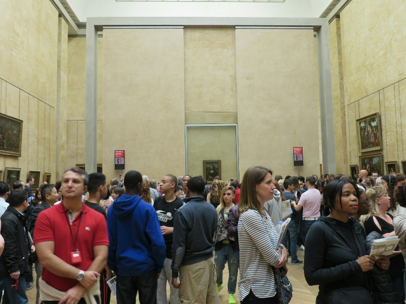
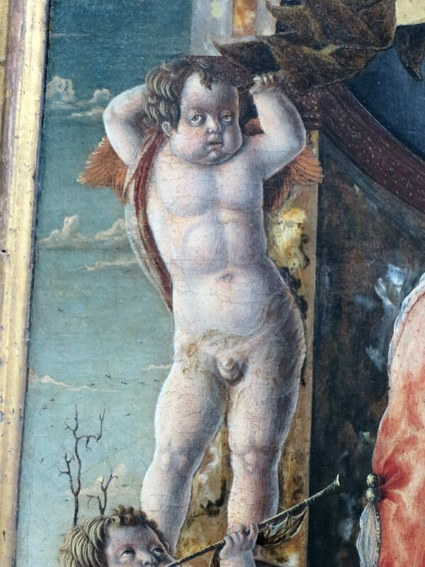
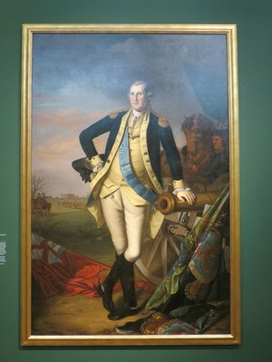
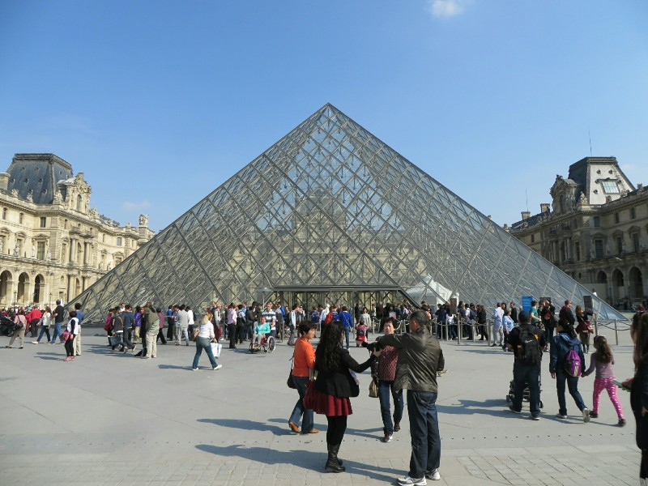
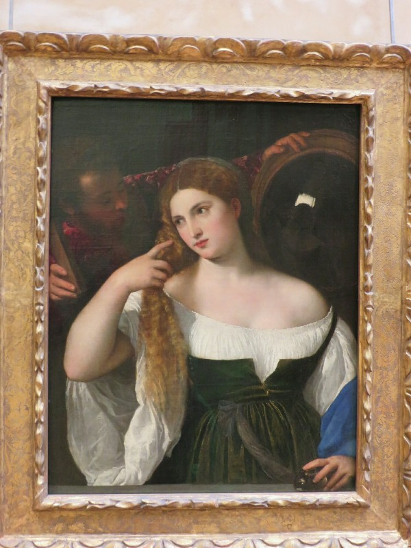

Day one in Paris and we have our plan- The Louvre, the entry a gift from Jim and Debbie. This means waking up early early to get there hopefully before opening to avoid the queue, then as many hours as we can hack of art, history and close contact with massive tour groups.

The day started a bit later than planned (getting up is hard!) but we made it to the museum just as it was opening. Having found last time she visited that there are no English explanations of anything and staring intently at French signs somehow doesn't translate them, Kate insisted on getting English audio guides. They were absolutely awesome. The museum used Nintendo DS's for the guides with inbuilt museum map and GPS so you could see where you are and what you're looking at (rather than searching for numbers). The information was also top notch- all about the artistic movements, the period history to give context, then for every piece with a guide they had 3 tracks with general information moving through to specific details of the piece. Absolutely more than worth 5 euro. Even just for the map and GPS. Because this place is HUGE. And confusing!

First stop on arrival- The Mona Lisa. Already crowded within 5 minutes of the museum opening. Hearing the guide explain the painting made it much more interesting to Kate than last time when it just looked like another picture of a woman. Although now we both forget the details why...

*Mona Lisa Plus Crowds*

We then popped over to the Venus De Milo- honestly not that impressed with it. It was found centuries ago on the Greek island of Milos, sounds like it was famous then because of how random the discovery was and the romanticism of the sexy lady with a lack of arms. Then it's just remained famous for being famous. The artist didn't even bother carving details on the back of her because she was presumably kept in a corner and no one would see anyway. Again hugely crowded with tourists taking selfies, pushing us out of the way because actually looking at the art isn't anywhere near as important as a Facebook photo to prove you saw it. Or maybe you didn't look at it because you were starting at your phone camera, but you were in the same room as it.

After hitting the big attractions, we spent our time mainly working through Italian Renaissance paintings with a little Spanish and English painting thrown in for good measure (another Turner painting- Kate apparently loves him, greatly regrets not going to the exhibition in Adelaide). What Kate found most interesting was hearing about the pieces as they were received when they were painted. A lot of the motivation behind famous pieces was to do something new or different, using canvas instead of wood, oil instead of egg yolk, utilizing geometric perspective and painting the people in the background smaller than the people in the foreground, trying to convey the personality of the subject, not just their appearance... Stuff that seems completely standard now was groundbreaking not that long ago. We could draw a lot of parallels between this art and the art we saw at the Tate Modern in terms of the process and thought behind it. I wonder if 7 panes of glass leaning on a wall will be displayed here in 500 years.

*Fantastic Example of Italian Renaissance Painting at its Peak- Oh Yeah Ladies, You Know You Want This*

We visited a tiny exhibit with three paintings of George Washington on loan from a few different museums - one comissioned just after the war of independence and was the first portrait of him sent back to England, supposedly. The other two were painted after his first and second terms as president respectively and showed the evolution of how he wanted his image to be perceived across the nation and world: initially as a politian with all the robes and wigs that go with it, and finally as the incorruptible guardian of the nation. Interesting to see the progression. We managed to get lost every time we tried to go out the front for a snack, even with a GPS, although that did give us a glimpse of the Egyptian tomb reproduction and some Greek sculptures.

*Strike a Victorious Pose, President Washington, Washington Term 2*

At about 3.30 we were starting to get arted out. We decided to finish off with the 'History of the Louvre' exhibition. Totally fascinating. It starts by taking you into the basement of the building where you can see foundations of the ancient defensive fort the building started as in the 12th century. Eventually the city grew beyond the outpost, and when it was enveloped by the city walls it was converted into a royal palace. Over the centuries and many different monarchs the small building grew and grew (displacing a lot of residents living in houses that were in the way unfortunately) and eventually was converted into the museum it is today.

Now about 4.30, almost eight hours of learning later, it was crepe o'clock so we returned our guides and skedaddled.

*The Louvre Museum- Famous Primarily as a Locale in the Da Vinci Code*

Last time we were in Paris, after much searching and 3 crepes each in a 24 hour period, we found a creperie we were satisfied with. We headed along the river towards St Michael's in its direction. We happened upon another creperie just down the road from the one with our tick of approval and decided to branch out. Ordered one ham and cheese crepe each. Yum. Crepe cooked in front of us (some places reheat precooked ones), real slices of ham (not the weird fritz some places use), about 500 grams of cheese, wrapped up in a fatty, salty, buttery delicious package. Mmmmmmm. We took this one out of the Tim and Ann McCormack 'use this money to buy food in France' budget.

After reinforcing the developing heart disease we stated to head home. On the walk we stopped at another little street front cafe and had a drink and some French Onion soup. On we carried and stumbled onto a market. First there was a gourmet cheese shop. Naturally, we bought some. We turned to leave and saw just behind us was a local wine shop! So we popped in there. Then a cured meat stall! The owner helpfully explained what meats were in the sausage in an international language - "oink oink, bah bah, moooo". We finished the best markets ever off with a patisserie for a fresh baguette, chocolate tart and eclair.

Went home and had the best post dinner picnic ever. Paris will be the death of us!

*I Swear This is Kate Winslet. Vampire?*
