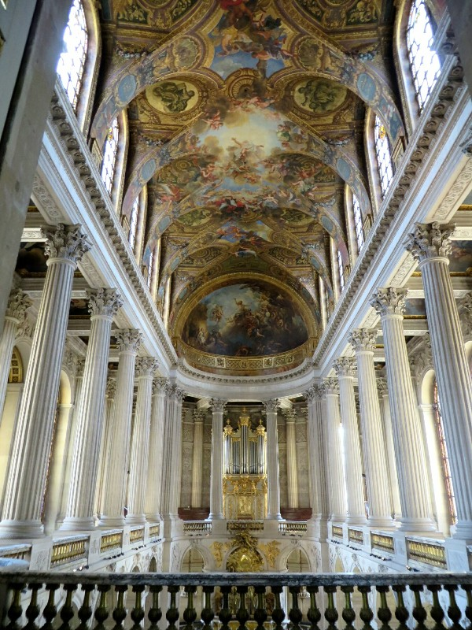
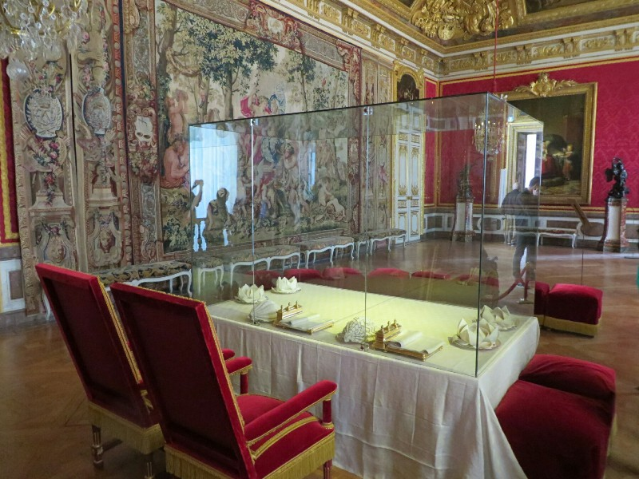
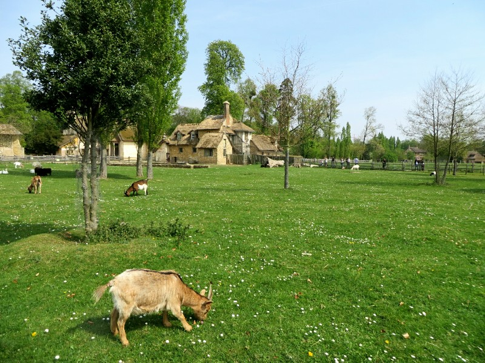
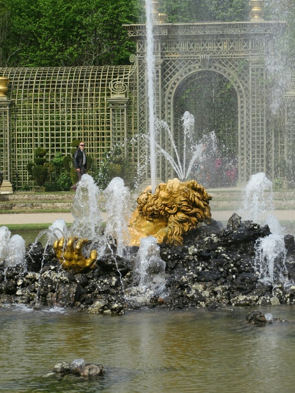
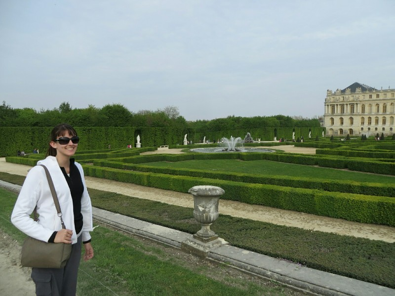
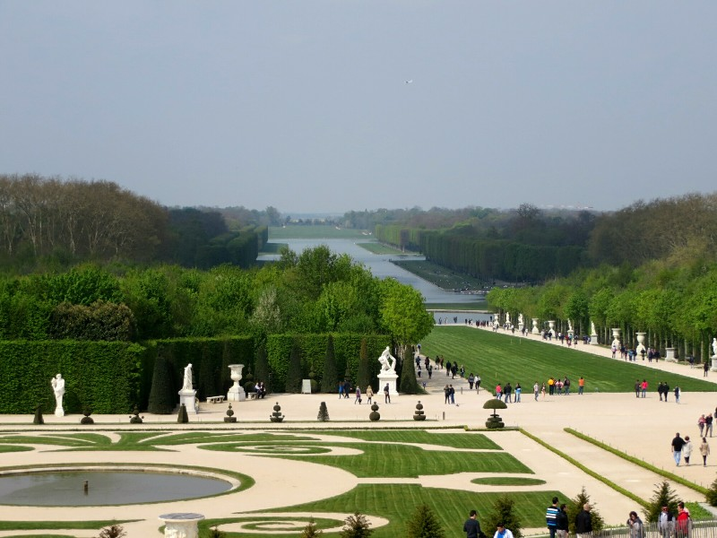
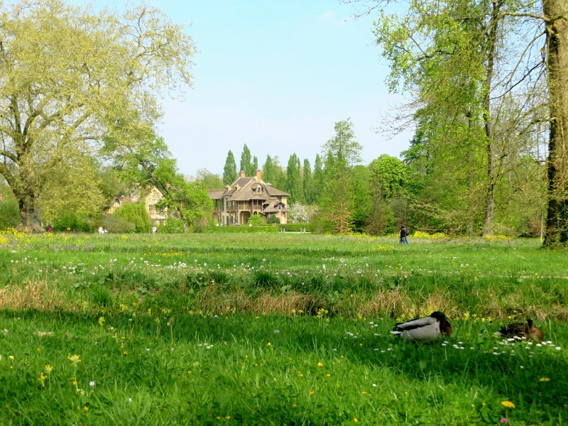
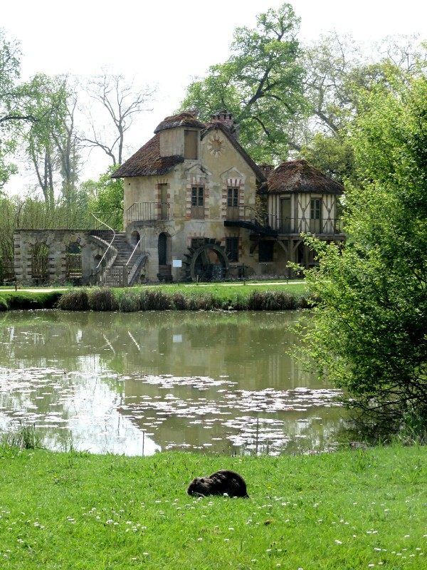
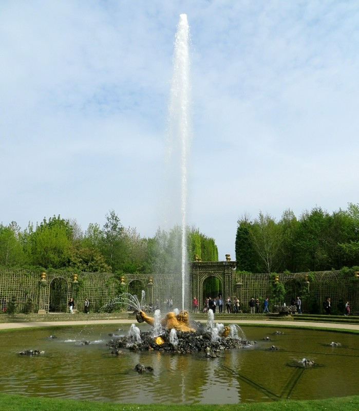

Another early morning. Why must there be so much to see in a place with such great cheese, wine and bread encouraging you to stay up late gorging??

We hopped a train to the Palace of Versailles, the previous residence of a few king Louis' and Marie Antoinette, again a suggestion/gift from Angela, Maarten and Dr Skopal. They told us to try to go when the fountains are turned on (irregularly due to a water shortage in the area according to Wikipedia) and luckily we timed the visit not only to see the fountains, but during a special event where the fountain shows are set to classical music! Sounds lovely!

We started with the palace itself. Which meant an enormous queue. Even at 9am, on a weekend there were tons of school groups. One Italian group in particular was the bane of our existence, going in the individual queue instead of the group queue, just in front of us, and holding us up the whole way.

*The Royal Chapel*

The palace tour was broken into four parts. First the history of the castle and museum (originally a 'humble' hunting lodge, converted into the epitome of the French monarchy's opulence and excess). This part was painful just because of the crowds, the rooms were tiny and with the million people crammed in there was no chance of seeing anything properly. Next, the royal residence. Huge room after huge room with excessive but tasteful decoration and furniture including the King's apartment and the Queen's apartment, which were in separate wings. Apparently the key to a successful and happy royal marriage was to spend as little time as possible with your husband/wife.

Third was the history of France, specifically the military campaigns dating back to the 800s. We walked through an impressively large corridor which housed oversized paintings of each military victory in which France was involved including the American Revolution. Finally there was a lovely, quiet, well narrated tour through the former residence of two of the King's unmarried daughters, Adelaide and Victoria. Each apartment, like the King and Queen's, consisted of a set of 5 rooms: an outer meeting room, an inner meeting room, a dining room, their bed chambers, and a private reading room / retreat. The rooms were organised in a line so the idea was that as you moved through the rooms they got more private. But given that the palace was a state building, not necessarily a private residence, this meant everyone including the King and Queen had to deal with daily rituals like having everyone watch you get in to and out of bed. Sounds awful to us. This is why the royal family had several other houses set up in the palace gardens which served as a private refuge from the hustle and bustle of the main palace. Rough life.

*Royal Dinner Table with Stools for Observers of the Meal*

After the palace we went for a wander through the gardens to Marie Antoinette's 'apartments'. A humble collection consisting of three separate buildings, including a working farm, joined by huge landscaped gardens. The gardens and the buildings were amazing to walk through and looked so pretty this time of year. The grass was full of wildflowers and there were animals everywhere. As is our style, we got lost trying to walk back to the main palace gardens. We eventually followed a path and came out a door marked 'staff only, do not enter' on the outside. Oops. We quickly walked away and bought a cider and a beer to blend in with the crowd.

*Marie Antoinette's Farm*

We'd had our fill of buildings so went to enjoy gardens and fountains. The gardens were huge, you could just about spend a full day getting lost walking around trying to discover all of the hidden fountains and sculptures. As it was, we were a bit short on time so we tried to hit the main fountains that had a classical music score to accompany the water show. Some of the fountains were very impressive, a couple smaller ones a bit less so, but still very nice. We stumbled across one that reminded us of the fountains at Bellagio in Las Vegas - quite a bit smaller but felt much classier with the jets dancing to a gentle classical soundtrack. Given the surroundings, we both decided that, while smaller than Bellagio, it was significantly more scenic. Another was a bronze figure bursting from the pool with fountains of water spurting from his fingertips and gushing from his mouth while dramatic operatic music blasted over the speakers. The drama was slightly compromised by the man with a little whistle squeaking every time someone got too close.

*Favourite Fountain*

After watching the final fountain display for the day with hundreds of other people, we walked to the station (along with all the other visitors to the palace that day) to head back into Paris. And very unfortunately had to deal with the Paris metro again. Sometimes I can see that, as well as delicious baked goods, South East Asia's disorganization may have been a gift from the French. Again dramas with tickets.  There are only two ticket machines which only take coins, leaving the hundreds of people leaving the palace at closing time in long queues to the ticket window. Then after a half hour of the queue ever growing as people make their way to the station, the guy behind the second window stands up, pulls down the shutter and the two enormous queue merge to form some new kind of hybrid super queue monster.

*Beautiful Gardens*

Ugh. Eventually, at about 7pm we got back into town and headed for more crepes. Always more crepes. This time at a very fancy place; an actual sit down restaurant. We ordered two crepes that both had some combination of cheese, mushrooms, cream, and ham. When they came out we weren't disappointed- both so big they spilled over the plate. Yum! I can see us coming back to Paris again and again just for the food. Then again, I can say that about a lot of the places we've been to on this trip!

Because apparently we haven't gorged enough today, on the way home we pick up some more cheese and wine to finish off the night in a proper Parisian style. Really glad we kept our Australian private health insurance. I have a feeling we might need it...

*"Everything the light touches..."*

*Marie Antoinette Wants An English Cottage In Her French Backyard, She Gets It*

*What Is This Adorable Animal?*

*Fountain of Enceladus, Half Dragon Giant Man of Greek Mythology*
