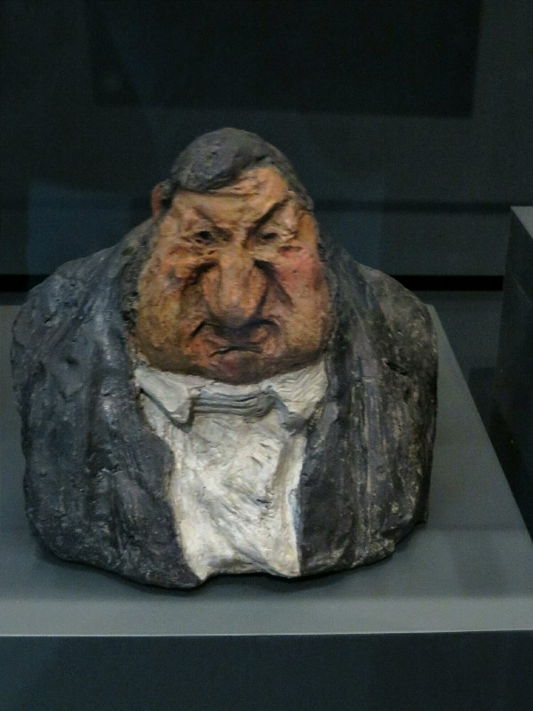
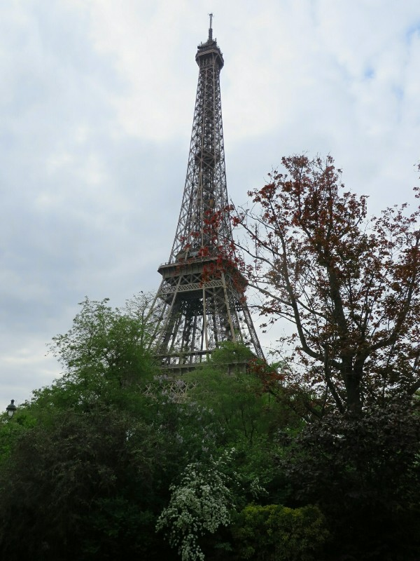
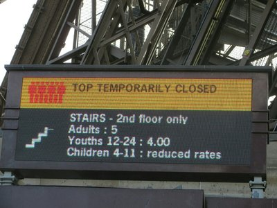
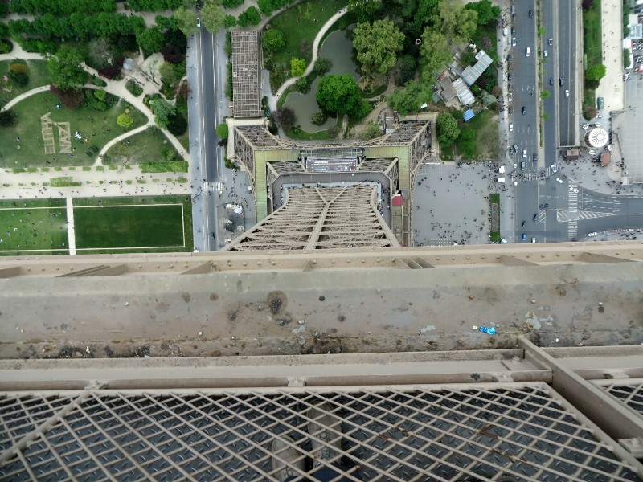

More museums! Also suggested and gifted by Angela, Maarten and Dr Skopal! It's great having someone plan our trip for us, Em Loh in Japan and these guys for Paris.

We started with Musse d'Orsay. For the first time in Paris we arrived at a museum more than a few minutes after opening and the difference was obvious. We waited for a half hour in a queue snaking out the door and back and forth around the square out the front. Eventually we succeeded in entering. Hooray!

This is another art museum which covers a very specific time period from 1848 to 1915. They had a special exhibit about Van Gogh on the day we visited. They presented it in quite an original way- they had excerpts and quotes from a book on Van Gogh by another artist about how Van Gogh didn't kill himself because of mental illness, he was killed by society misunderstanding and mistreating him. The paintings were grouped in a way to try to support this, I suppose. It may have been a more convincing thesis if the writer hadn't been so clearly deranged himself. He came across like Chris Crocker - 'Leave Brittany Alone!!'. Also a bit annoying- they displayed a number of Van Gogh paintings from their own collection but removed the entries from the audio guides to try to make you buy another guide for the special collection. They also only had explanations on the walls in French. They really do like to make things inaccessible here to people who don't speak French. I think it wouldn't hurt them to realise with the amount people travel these days it's impractical/impossible to learn the language of every country you visit. What's really frustrating is you know the people who decide not to put any English on signs in France are taking advantage of the English translations when they visit any other country in the world. Sigh! Rant over.

*Model an Artist Used To Draw His Caricatures- Only Photo in the Museum Before We Were Told It's Not Allowed*

After the Van Gogh exhibition we had a general meander around the museum. Between 1848 and 1915 there was apparently a big conflict in the art world between classical art and the impressionists (Monet, Van Gogh, Renoir, etc). At the time, the impressionists were dismissed and cast aside by critics and their art was rejected from the prestigious Salon art show. Only the classical style paintings were accepted. When their modern style of art started to be accepted and lauded, there was a backlash against the popular classical art of the time and everything from the period that had been considered worthy was now seen as tacky, boring, predictable and not worth anyone's time. Now, 100 years later, both styles of art can be presented and appreciated for their merits. It was really very interesting to see the vastly different styles next to each other and kind of (without sounding too pretentious) explore the beauty in each. OK... Definitely sounded too pretentious. We must be visiting too many museums...

That said, we had one more on the to do list - Musse d'Orangerie. This is a much smaller museum just focused on the impressionists. It's most famous for housing Monet's paintings of water-lilies. Which were huge! There were 8 paintings in two purpose built rooms, each painting measuring about 2.5x10 meters. I had no idea how big they were! It was a very serene experience to sit in this massive white room surrounded by gentle representations of the calm elegance of nature, surrounded by other people but everyone equally quiet and enjoying their personal experience. This was probably Kate's favourite museum in Paris. Small, concise, well presented.

*Eiffel Tower Looking Speccy*

To wrap up the day we set ourselves a mammoth challenge- get up the bloody Eiffel Tower! Last time we came it was 'on strike', this time we are determined to go up. We made our way to the base, joined a queue and waited to buy tickets. When we got close to the ticket booth we saw a sign above it - 'top level closed'. Geeettt stuffed. At the front of the queue the lady in the booth says it's too crowded but it'll reopen later when people come down. Could be an hour wait. Kate doesn't care- it's her third trip to Paris, she will conquer this blasted tower.

*Curses!!*

We climb the stairs to level 2- quite a few stairs. We're using every climb like this to try to work out how far we'll be going on the Inca Trail. We decide that must have been 200 meters so if we did that five times in a row it'd be equivalent to the biggest climb on the Inca Trail. Would be tricky, but we could probably manage it. Then we see a sign it was only 100 elevation meters. Hm... We might need to buy a portable stair machine to practice with for the next two months.

We join a queue of people waiting at the closed ticket booth for tickets to the top. We are all equally hopeful and deranged. Pat is hungry and getting fed up. Kate will not submit!

After almost an hour there's movement up ahead. Yes! A window is open! Something is happening! The queue is moving! Tickets are selling! Yayyyy! So, finally finally finally we get into the lift and are whisked away to the top and are rewarded with a spectacular panoramic view of Paris. Looking at the tower from the outside on the ground you don't appreciate how much taller it is than everything around it. It really does, pardon the awful pun, tower over the city. We take some time to soak it all in before heading back down to reality.

Getting dark and cold we make a few pit stops to replenish our dwindling cheese and wine supplies and we head towards the apartment and celebrate our victory over the Eiffel Tower once and for all!

*Looking Down From The Tower*
