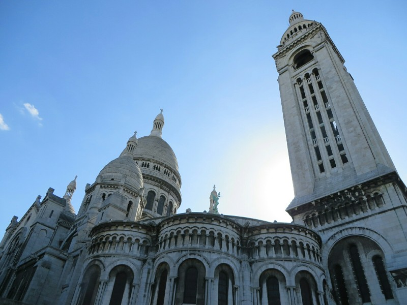
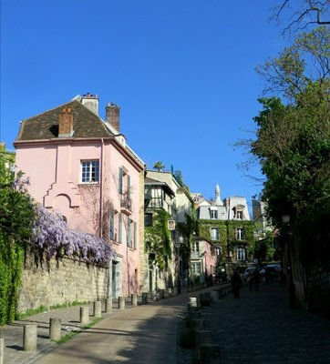
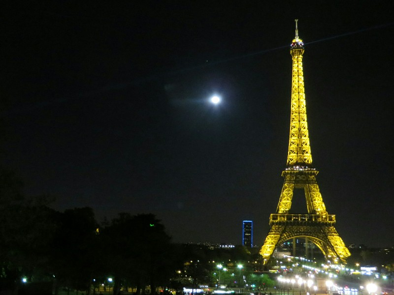

After a slow morning of laundry and boring errands, we caught the metro into town, headed to a highly recommended restaurant to find French onion soup. Apparently the best soup in Paris! We were so excited and on getting to the cute wooden door in the narrow ultra Parisian alley, we found it locked and closed. Damnnnnn! So. The one next door is probably just as good. We'll try that.

We were squeezed into a tiny table sitting in the laps of the people next to us. So close, that for Kate to get to the seat they had to pull the table all the way out, then once she was seated push it back in again. Very French! The soup itself... Mmmm. Maybe not highly recommended, but still pretty delicious. The onion soup was good enough, but what really made it stand out was the half kilo of cheese they melted on top. It was honestly more of a cheese soup than onion, but that suites Pat just fine. We wonder if they serve the same style soup to the locals or if they just know tourists love cheese. Either way, we don't care. After the soup we headed to the metro! Stopping for crepes with homemade salted caramel and a few chocolates from a local chocolaterie on the way. Bellies ever growing... We may be unrecognisable from the neck down. Or even up.

The crowded metro steps annoyed us the same as every public transit system since the wonderful organisation of Japan. We pushed past a slow slow moving woman ambling down the stairs completely blocking them then on passing her realised she was blind. Oops.

*Sacre Coeur*

We spent the afternoon investigating Sacre Cour and Montmartre. Absolutely French French French. It was a lot of fun, but as it was getting late we decided to walk towards the river and find somewhere to watch the Eiffel Tower sparkle. We got peckish (must be 20 minutes since our last meal!) so we grabbed a kebab from a very nice French man. We looked at the map to find a park to eat it in. Then discovered we had spent the last hour walking in exactly the wrong direction.

Argh!

Luckily the metro is quite extensive and we'd only just walked past the end of the line. We headed back to get some cheese, wine, baguette... The normal gear, then went to find a good spot to watch the Tower as the sun set.

*So French!*

We settled on a spot just in front of Trocadero on a nice patch of grass overlooking the river and the tower. We unpacked our picnic and before too long we realised that we weren't alone. A little family of rats from a nearby bush had taken an interest in our food and were quietly scheming trying to come up with a plan to make it theirs. Kate kept them at bay with a watchful eye until one brave rat soul stood brazenly out in the open. Pat got up to shoo him away when two of his compatriots ran behind him towards the now less guarded food. Luckily, unlike Pat, Kate was a bit more clever than the rats and anticipated their move. She stayed put and foiled their plan with a stern look towards the approaching would-be looters.

After the excitement with the rats the clock ticked over to the o'clock and the tower started to sparkle (somewhat spastically Pat thought). We sat and enjoyed the show and when it was over we realised that it was actually freezing out and we should probably head home. After packing up, we tossed a few scraps of baguette towards the bush with the rats rewarding them for their cleverness.

*Sparking Tower, Cool Breeze, Smell of Cheese, Sound of Rats*
