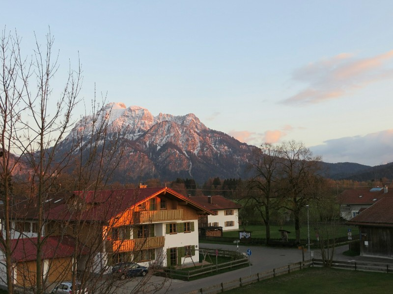
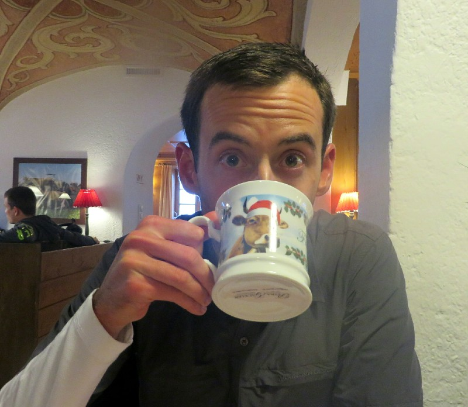
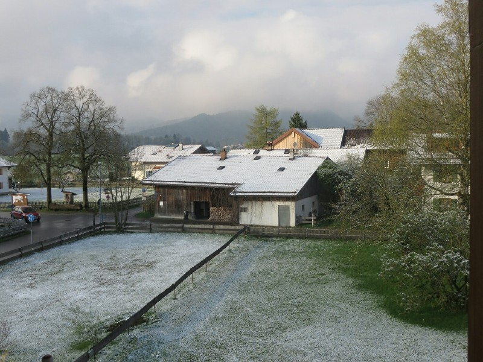
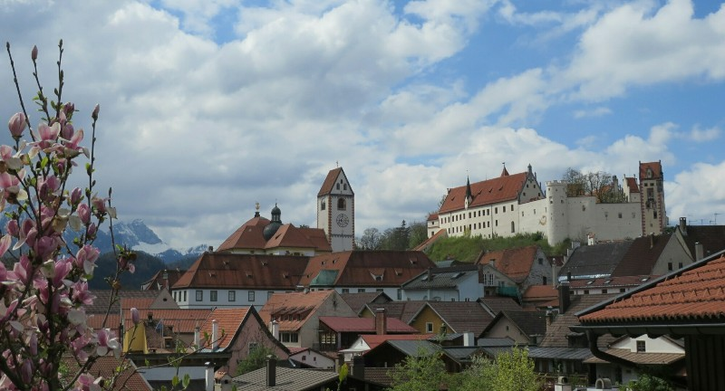
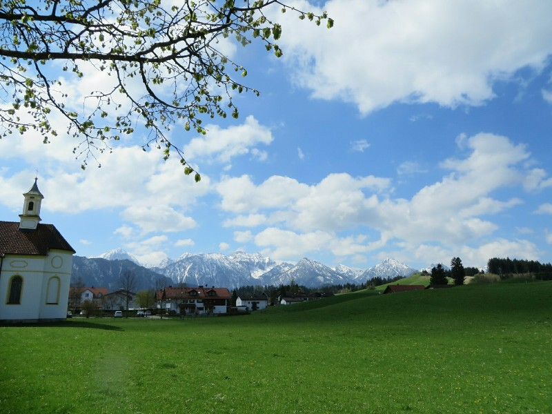

We got up to head to the station bright and early for our eight hour train journey to Füssen, Germany. As we were leaving the flat we realised our online digital tickets needed to be presented printed on an A4 piece of paper. Naturally. As nowhere would be open this early to print anything for us, all we could do was put it on a USB hope we could print it at the station. But that would be too easy! The ticket office pointed us out into the street to look for a Western Union and with 15 minutes until the train departs Kate minded the bags and Pat ran off down the street.

Rather than bothering with a Western Union, Pat ducked into the first hotel he came across. Out of breath, he managed to convey to the very nice man behind the desk that we needed to print our train tickets in a hurry. He kindly obliged and plugged the USB into the reception computer and printed the document Kate saved. Thinking this was all too easy, Pat thanked the man as much as his limited French allowed and was about to leave when he noticed that Kate had saved the bus schedule for Füssen to the USB instead of the train tickets. Perfect.

Eight minutes to go and all we've managed to print was a bus schedule. Pat frantically tries to log on to his webmail account on the reception computer but the keyboard layout is completely different than an English keyboard. After 5 failed attempts at typing in his password, he gives up and logs on to the hotel's free WiFi network and emails the ticket to the reception desk for him to print. The seconds are ticking away but it finally arrives and the helpful man prints them. Again, more awkward, mispronounced thanks and Pat sprints out the door and down the road back towards the station. Two minutes to departue, Kate sees him running, puts her bag on, and they rush to the platform which is devoid of people except for one conductor looking at his watch. We scramble as fast as we can, show him the ticket and take our seat literally as the train is pulling out of the station. Closest we've come to missing a flight or train so far!

The scenery on the train ride was really beautiful. Tiny French towns with stunning old church steeples, old German towns with narrow painted houses, green and gold fields of flowers and crops, the occasional dairy cow... Maybe we'll move to the European country side? After two timely train changes we start to pull into Füssen. We're greeted with mountains, fresh cold air, snow, and castles in the distance. This town could not be more picturesque if it tried.

*Sunset from the Balcony*

We caught the local bus to our guest house and got settled in our room. The whole guesthouse was decked out with Easter decorations which made it feel very homey and welcoming. We venture out in search of dinner and decide on a little German hotel and order up some rich German food. As we're waiting for the meals, we notice that there are cow decorations literally everywhere. On the mugs, on the ash trays, pictures on the walls, stuffed animals, tablecloths. Everywhere. It would be creepy if they weren't so adorable. After we were suitably stuffed, we ordered apple strudel for dessert. There's always room for strudel. Half asleep at the table we brave the cold weather and walk home to turn in for the night.

*Cows cows cows. Best restaurant ever!*

We looked out the window in the morning and Pat had an excitement breakdown- there was snow! What a change from 46 degree dry heat in Adelaide to 38 degree with one million percent humidity in Cambodia to minus something snow today. Brr.

We walked along the lake to town. Turns out it's not so much a lake as mud at this time of year. There was no water and it was not that pretty. Mainly very cold. After a trundle we came to a fenced off area. The signs on the fence were all in German. The only one Kate could understand said please close the gate, so we decided to go on and closed the gate behind us. Probably all good? We ended up in someone's farm. Cute hairy cows watched us pass by.

*Snow!!*

Eventually we got to Füssen. We spent the day looking around the town. It was fairly picturesque. We enjoyed the historical buildings, had a coffee and people watched a bit. We visited an old church and 13th century cemetery (although the oldest graves we saw were from within the last century). We grabbed another German meal for lunch- some pork sausages, sauerkraut and delicious fried bacon and onion potatoes. After lunch we finished our walk around town then when it got late headed back to the guesthouse.

*Looking Over Füssen*

*Australia Has Never Seen This Shade of Green*
