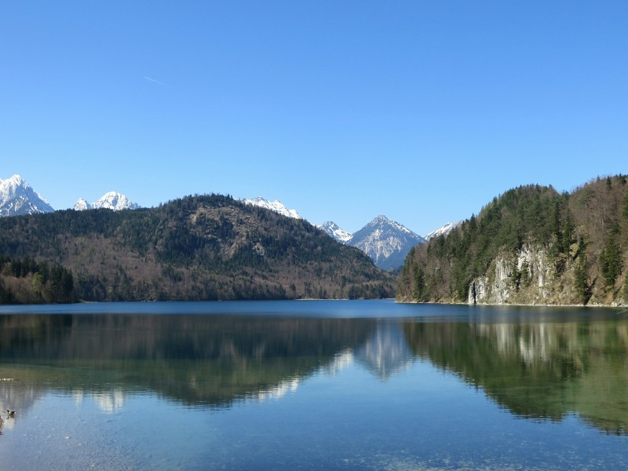
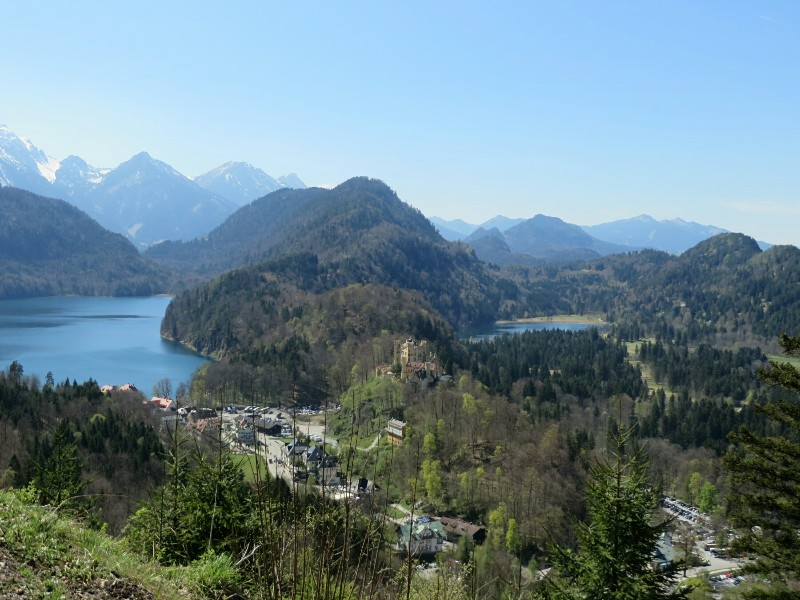
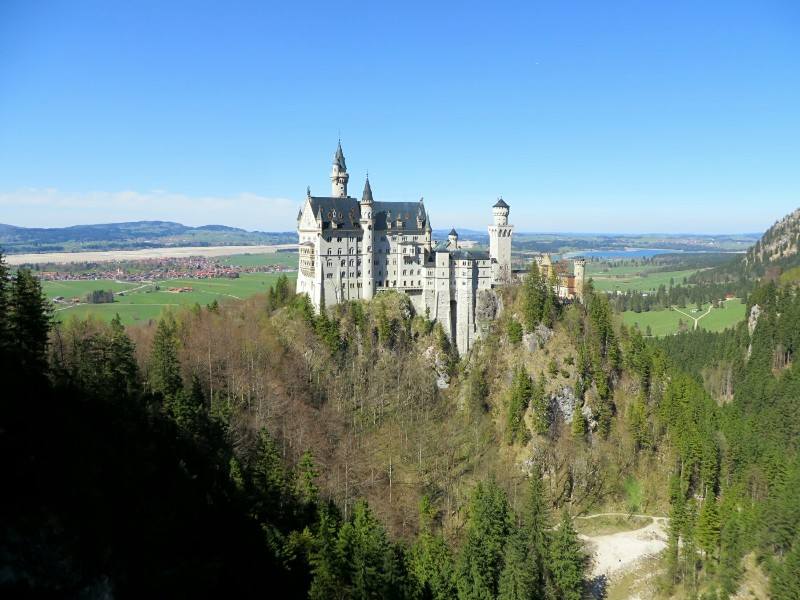
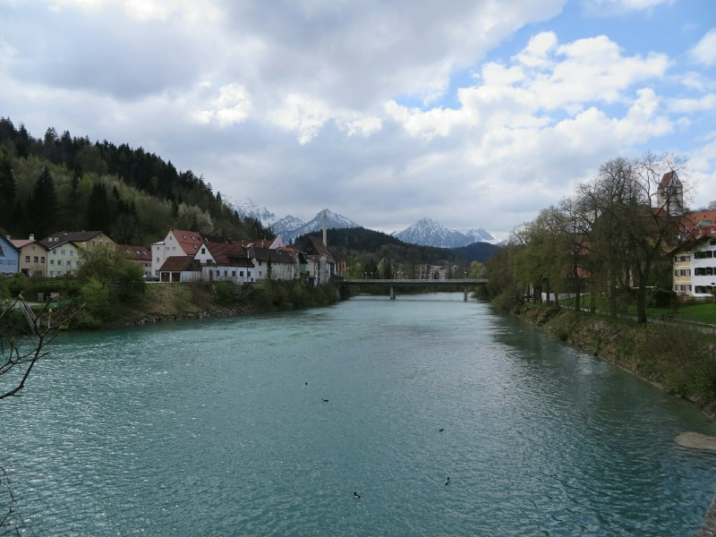

We awoke to a beautiful day. Not a cloud in the sky, perfectly clear and sun shining. Today we're visiting the local castles, many thanks to Lem (that's Lap and Em for the uninitiated). As the day was so gorgeous we took the hour walking route to the castles. First up was Hohenschwangau. This was originally a medieval knight's fortress built in the 12th century or so called Schwanstein. In 1829 the crown prince was having a wander in the area, saw the ruins, loved them and (as one does) purchased them and rebuilt the castle in 1833, renaming it Hohenschwangau Castle. Being royalty sounds awesome in Europe.

"Build me a castle on those ruins! Build me an English country manor in my backyard!" "Yes sir, right away"!

*We Might Just Move Here*

In 1848 the prince became King Maximilian II and made the castle his family's Summer residence. To go inside you had to go on a guided tour, but it was really an excellent tour so we didn't mind. The castle was beautiful, full of fantastic paintings, beautiful antique wooden furniture, and strangely some 100 plus year old bread someone royal got a a gift at some point so they've been holding onto it. Petrified, not mouldy so that's a plus. Sadly no photos allowed.

When King Maximilian II died in 1864, his eldest son Ludwig took the throne. Ludwig was *crazy*. Definitely bonkers. When he took over the palace he painted the celing of his new bedroom like stars then decided to build an even bigger and better castle up the hill from his Dad's castle on the ruins of an ancient fort called Hohenschwangau. The same name as Maximilian's castle. Ludwig named his new castle Neuschwanstein. Very similar to the name of the fort Hohenschwangau castle was built on. They effectively switched names. Very confusing. So after our tour of Hohenschwangau Castle (built on the ruins of Schwanstein) we headed to Neuschwanstein (built on the ruins of Hohenschwangau), stopping for a couple of quick bratwursts on the way...

*Hohenschwangau Castle and The Alps*

Neuschwanstein Castle is fairly famous as the castle Walt Disney's Sleeping Beauty castle was modeled on. And to be fair, it is pretty speccy. When Ludwig took over, Bavaria was in a bit of strife and within a couple of years was swallowed up as a part of Prussia/The German Empire. He was basically king in title only. He seemed fairly disinterested in any kind of leadership role, really like quite a recluse, and was quite obsessed with the composer Richard Wagner. He spent his time in charge bankrupting himself, his family, then borrowing copious amounts of money getting more and more into debt for huge building projects, like this castle which was devoted to Wagner. He seemed desperate to recreate a medieval knight's lifestyle. Plus some perks- the castle was to be 200 rooms, just for him, his servants and (when he was in town) our old friend Wagner. He moved into the castle as soon as it was safe to do so, well before it was finished.

In the end he was declared insane (although this was by a doctor who never examined him so there is some controversy about that), then he and the doctor were soon after both found dead in a lake under mysterious circumstances. They still don't know what happened- murder suicide? Accident? Shrug. Ludwig died well before his castle was complete having lived there for about 6 months. As the royal family didn't have the money to start it in the first place it was left unfinished and opened to the public almost immediately after Ludwig's death (for a fee).

Again we can't go inside unless we're on a tour and this tour wasn't quite as good. The castle was a lot busier, but was admittedly amazing. Only 12 rooms complete, but they were fantastic. Every room was covered in frescos (mostly depicting Wagner operas), there was a theatre with a permanent set of a Wagner opera and an indoor cave (based on a scene from something by Wagner). It was also super high tech for the time with a telephone and flushing toilets. South East Asia don't have that even now! It was really really very cool. That said, we're still fairly sure Ludwig was mad.

*Neuschwanstein, Mickey Mouse is Probably Tied Up in a Tower with Wagner's Skeleton*

Next, two more bratwursts. Then the Museum of Bavarian Kings. There aren't too many of them so it wasn't too big. Lots of interesting stuff about Maximilian I and II, and Ludwig I (whose wedding celebration was so fun it was repeated every year creating Oktoberfest) and crazy Ludwig II. After his declaration of insanity/death Ludwig II was succeeded by his brother Otto. Otto was even crazier than Ludwig- he got into a rage any time he saw a closed door (because why not?) and insisted on starting every day by shooting a peasant. Hid servants dealt with this by taking turns handing him a gun loaded with blanks, and dressing as a peasant then falling down 'dead' at the appropriate moment. So his uncle basically ran the show (although his uncle is the one who held onto a loaf of bread for a century so you have to wonder about him too). Not that there was too much to run at this point, The German Empire was really in control. When he died his son Ludwig III took over, but didn't last long due to the outbreak of WWII. He became quite unpopular and fled Germany. However he never abdicated so there's still a Bavarian royal family today who get fancy state funerals when they die. The rest of the museum followed the unofficial royal family, including their opposition to the Nazi regime and internment in concentration camps. Don't worry- they're back to being mega rich now!

After all this, we headed out for a mulled wine and apple strudel. Mmm.

*Peter, Jill - if you have any more suggestions of places to visit, let us know. This was a winner!*
