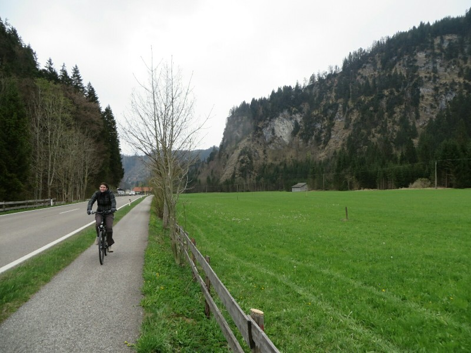
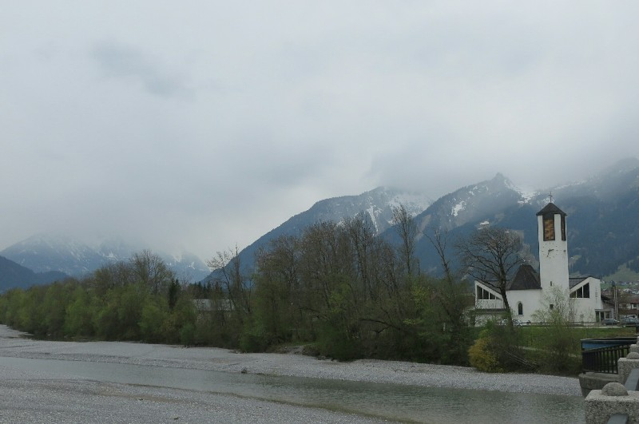
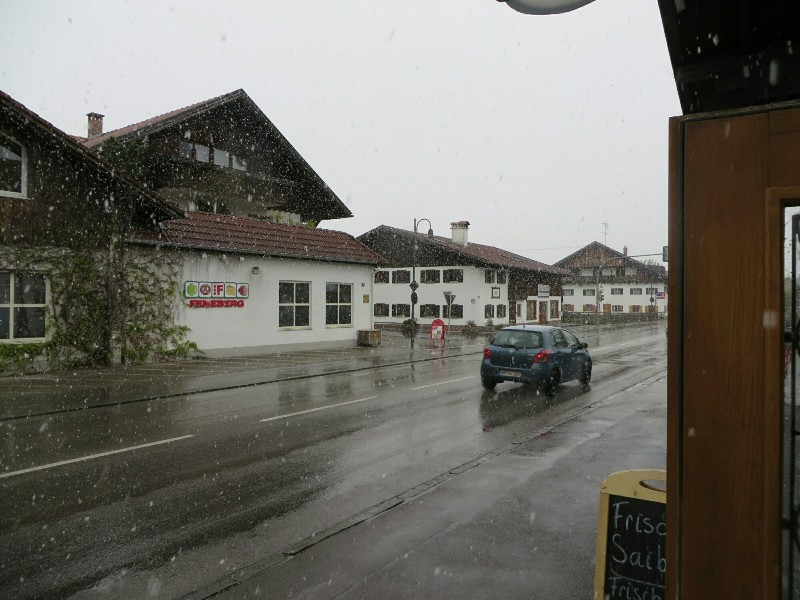
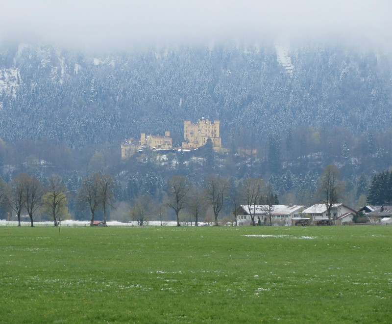
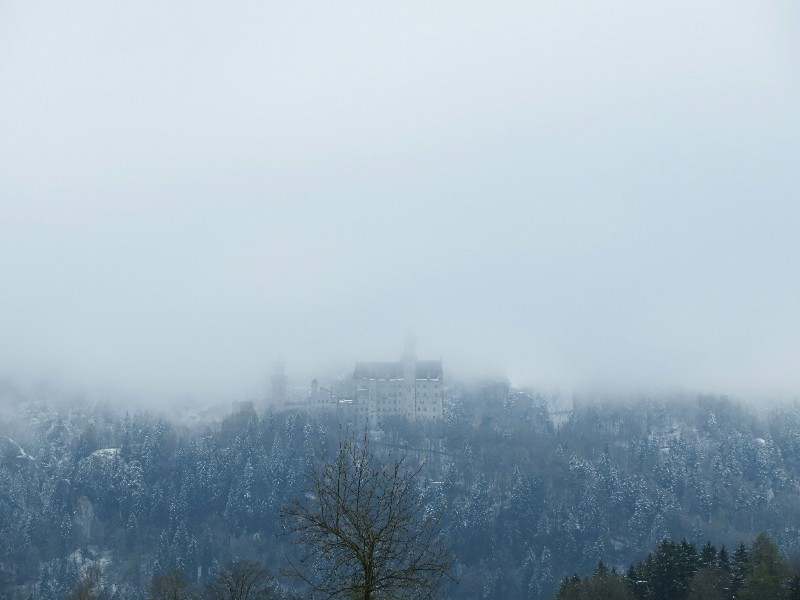
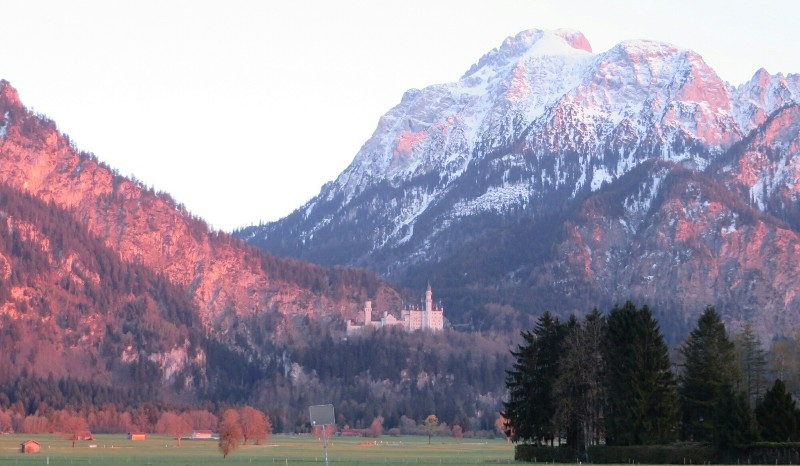

Today is Good Friday so nothing in Germany is open. However, the lady at the information stand told us Austria is going to be business as usual, so we decided to rent bikes and cycle through the alps to Austria. Yeah, we're just hardcore like that.

Also it's apparently a fairly flat 20km ride, so nothing too terrible. We think we can have a mulled wine and some stodgy food and explore the town a bit. We hired bikes and set off. Oh my God so much better than the bikes we hired in Asia! Well maintained with working gears and brakes!

*Kate riding in a straight line!*

We then immediately got lost and discover the ride wasn't flat at all! It's steep and gravel and awful! We get to a crossroad and opt for the high road figuring if we go downhill now, we'll just have to go uphill again later. A German man points at the sign and yells out after us, 'gefährlich '! We smile, reply 'Austria!' and carry on. It soon becomes apparent this was a bad idea. We turn back, look at the sign again, see it says the same word, gefährlich ... Then Kate remembers that means 'dangerous'. Oh. Right. That's what the man was getting at!

So. We backtrack and find a new path. This one is flat and paved. Might be where we were meant to be all along. It's already lunchtime and we're not even to the border. It's cold, we're hungry, there are probably wolves after us. Kate the sang Sound Of Music soundtrack to keep our spirits up. It was just like that movie, green fields and snowy alps in the distance! But it didn't work. It's a lot colder being there than watching it on a TV.

*Austria Being Cold*

Eventually eventually just after 2pm we found the town we were looking for! All the hotels and restaurants are closed. The information lady lied! She didn't even have a lanyard to demonstrate her untrustworthiness! We went to an Aldi and bought a sandwich and some chocolate, then sat in the carpark stairwell and ate. With a bit more energy we walked into the town proper and confirmed it was closed. Well... Something of a fail but at least Pat can add an extra country to his list! We hopped back on the bikes and rode home. Sadly it's now colder still, and raining. Kate is somewhat less miserable with some food in her system and being able to wear a big coat without getting too hot.

40 km later we return the bikes and find the local cow restaurant is open! Mulled wine and cheese noodles. Who needs Austria? As the food arrives the rain outside turns to snow and Pat loses his mind and goes outside to take pictures. Kate stays inside with the warmth and the mulled wine. I'm so glad we missed that on the bikes. Once we'd warmed up we waked home in the snow, ate some corn chips, drank some wine and watched some season 1 Offspring (makes us homesick for Melbourne and we've never even lived there!)

*One of Pat's Many Photos of Uninteresting Streets Because Snow!*

No visibility on waking up, lots of snow still on the ground and thick fog completely obscuring our alpine view. Our plans to go up mountain to the view point may need to go on hold pending better weather this arvo. Instead we head back in to Füssen town. It is absolutely mental! The roads are all bumper to bumper packed with cars, the guesthouse is fully booked, the streets are full of people. This must be a popular long weekend vacay spot! Every store is full to the brim with people. We wander through a local market selling homemade plates, bowls, jugs, giant coffee mugs and beer steins. I would buy all of them if I wasn't backpacking and unable to carry them!

*Not A Great Day To Climb a Mountain (Hohenschwangau Castle)*

We head to a shoe shop and after trying a million pairs on we buy a pair of hiking shoes each. Inca Trail here we come! Kate finds this shopping incredibly exhausting and frustrating because nothing fits her very-large-size-but-not-fat proportions properly so we take a beer and lunch break. Pork sausages and schnitzel, cheese noodles and potatoes. Mmmmmmmmmmm. Fatty.

The weather hasn't cleared so we finish off the day with a visit to the Füssen museum, a little museum in a local historical abbey. Lots of info on the local history of production of musical instruments including a really excellent movie showing a craftsman make a violin. What a piece of art, how could you give it up to someone else after making it?

Finally, we grab a hot chocolate (actual melted dark chocolate with hot milk) and get a bus home and morn our last night. We will miss Füssen!

*Neuschwanstein Obscured by Fog*

*More Castle Photos- They're Just So Pretty!*
