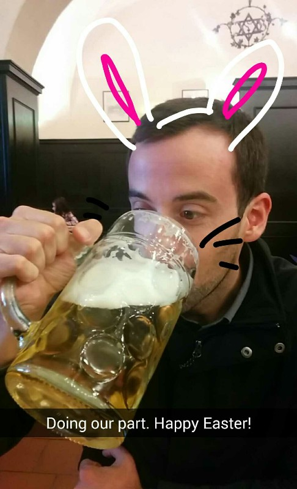
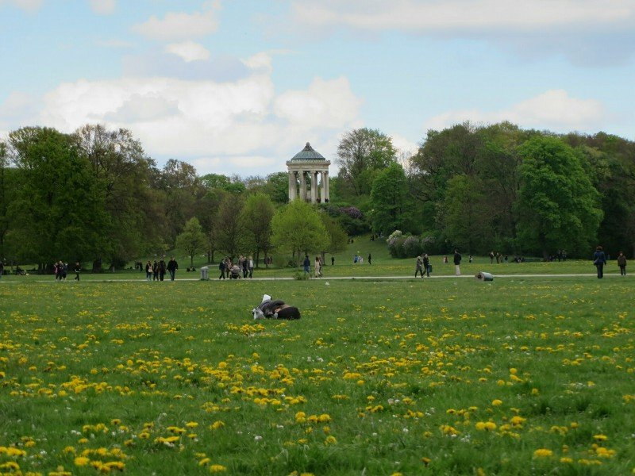
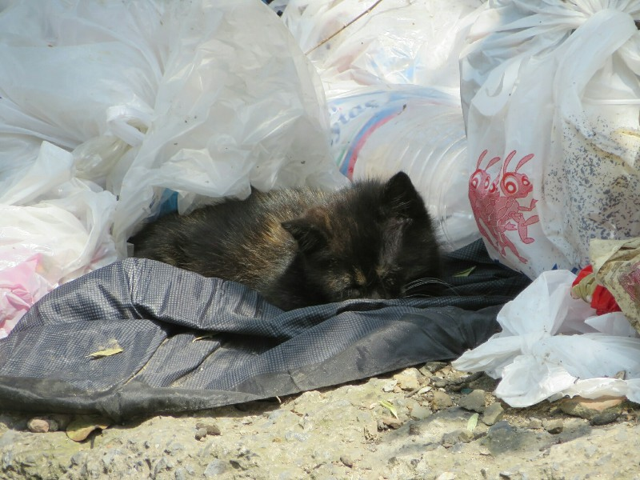

Happy Easter!

We are on the first train out of Füssen to Munich today so we're up early and have a quick breakfast at the guesthouse. We're both a bit sad to be leaving the laid back German countryside, but Munich and Istanbul are beckoning so we soldier on! The train departs right on time and after a couple uneventful hours we arrive in Munich for our whirlwind one day tour to find everything, unsurprisingly, closed. It is Easter Sunday after all, not sure what we expected.

Walking through the city we notice it's really only tourists that are out today. Everyone else is at home with loved ones enjoying hot cocoa and probably some meat and cheese. Lucky for us, while all the shops are closed all of the pubs and restaurants are open for business! We find a suitable looking bierhaus and grab a table. Pat excitedly orders a liter of beer in a gigantic glass and a couple "Munich" style sausages. Kate settles for a half liter (wimp) and a cheese plate. The food arrives and is not bad for the most part- the mustard was super sweet, not at all like the hot German mustard we were expecting, and the cheese plate that supposedly came with camembert was closer to cream cheese. No one here is complaining though- they serve beer in one liter glasses!

*Unfortunately The Only Photo We Got Of The Beer Was A Kate Decorated Snapchat*

Once we finished we picked a direction and kept wandering. We found a church that was entering its third hour of their Easter mass. A bit long for even the most seasoned of Catholics! As it was right off the pedestrian mall lots of tourists popped their heads in and took a few sneaky pictures of the proceedings.

Not quite satisfied by the last bierhaus we decided we would find another one and just set up shop for the afternoon. Not like there was much else to do today. A couple more sausages and a couple more beers and we were both ready for a food coma. We walked to the nearby English Garden and found a suitable spot on the grass amidst the wild flowers and laid down for a rest. The garden itself was really beautiful consisting of mostly informal landscaped areas so it all looks more or less natural. The wide patches of grass aren't flat, rather they all have subtle undulations in them with heaps of wildflowers and trees smatterd all around. There is even a stream running through the garden which according to Kate you can jump into during the summer and float down the length of it. Fun!

*Snoozing In The English Garden*

After Pat's snoring jarred him awake, we looked at the time and discovered we'd been dozing for two hours. While the day was a bit of a fail in terms of exploring Munich, it certainly could have been a lot worse. We managed to eat more than our fair share of wurst and pretzels and drank enough beer to keep the locals from getting suspicious of us. All that was left to do now was catch the subway to our hotel and turn in for the night. Of course this being Germany there's no story there: the train ran on time and the bus took us to within 50m of where we needed to be. Someday maybe the rest of the world's public transport will catch up. Sigh.

The following day is another day of transit! After a bit of a wander we find a bakery open on Easter Monday and grab a bite. Next, bags in hand, to the airport. After the most thorough security we've ever passed through (not invasive or rude or inefficient, just really thorough) we grabbed our last meal in Germany, a sandwich, and got on the plane. In terms of the flight- it was fine but I'd recommend avoiding Pegasus airlines. They blasted ads for duty free garbage in Turkish over the speakers the whole flight. Didn't add much to the atmosphere of the flight, which was not exactly pleasant already.

In Istanbul we arrived at the far away airport and caught the local bus into town. 90 minutes later we arrived. We checked in, cute mini hotel, then went in search of some Turkish food. We tried two kebab places, both pretty good. No garlic sauce though, we did miss that. And by this time it was cold and dark so we headed home! There was some noisy kind of middle Eastern music blasting from the streets from about 9.30-9.45 when we got home, but the wailing did give up eventually. If that could just never repeat itself, we might get along with Turkey just fine!

*There Are Loads Of Cats All Over Istanbul*
