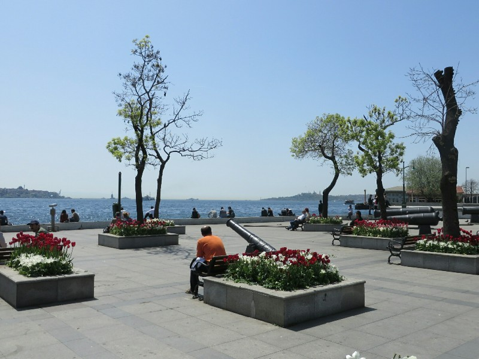
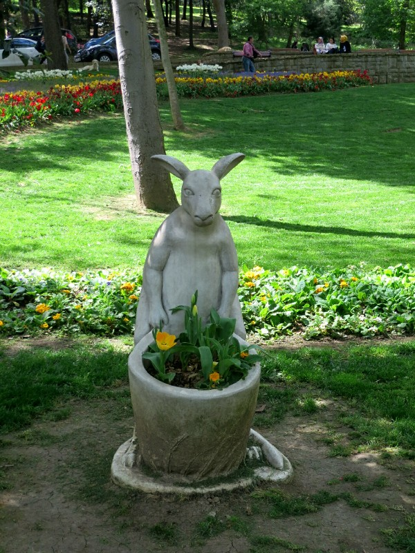
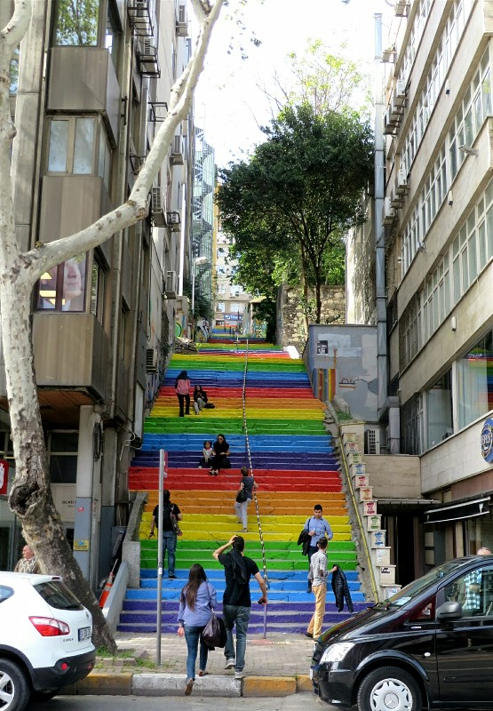
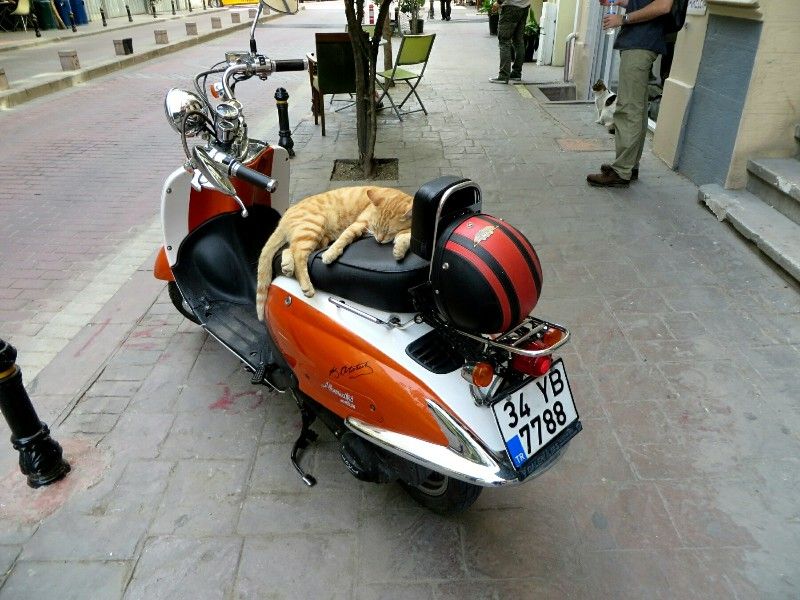

As is becoming a habit with us we get a bit of a late start. After some research on things to see, we set off walking north in the direction of an apparently nice area with a good mosque. The walk was quite a bit longer than we expected and not very scenic. Was more of a wander along main, noisy arterial roads that were very difficult to navigate as a pedestrian. It was especially hard to cope with the noise and hubbub coming from quiet relaxing Füssen. Along the walk we grabbed a simit, a circular piece of bread coated with seaseme seeds sold from a street vendor for 1 lira ($0.50). Definitely hits the spot! The vendor was out the front of the 'New' Ottoman Palace, Dolmabahçe Palace. We thought about going in, but the line was about 200 meters long so we gave it a miss.

We finally arrived at the neighborhood (Ortaköy) only to find out that the mosque we had ventured to admire was closed and completely covered with cloth and scaffolding to hide the renovation works that were being done. Just our luck! The area itself was pretty enough with lots of street vendors, all almost identical to each other, selling waffles and baked potatoes mixed with all sorts of delicious filling. Not quite hungry we decide to give them a miss. A whole baked potato isn't exactly a snack! We did, however, have room for ice cream. One thing Istanbul (Turkey?) is know for is their ice cream, which has some sort of something in it that makes it thick and a little chewy, sort of like a fudge? We order a waffle cone. He serves up the tiniest scoop ever and we are not impressed. Until we eat it. Mmmm. Some of the best chocolate ice cream Kate's ever had! The word "amazing" may have been tossed around. Basically chewy, cold, rich chocolate fudge sauce. Yum.

*Looking Over the Bosphorus to Asia*

Not entirely won over by our walk we head back. On the way we stop at a large park. It's full of beautiful tulips and stray dogs. The stray dogs are big here, not a huge number of them but they look well nourished. And they're all very friendly. There are absolutely tons of stray cats, also looking well fed. We wonder who looks after them. The people here all seem to be quite nice when we talk to them, but no one smiles on the streets. They also walk really fast, which is unusual because the whole city is on steep hills. They must be fit to go uphill so fast, and well balanced to go down. They are all seemingly awful drivers. No one looks before they reverse and we saw a number of near misses and minor collisions (especially with gutters). We are more cautious walking behind stationary cars than in front of fast moving ones.

*Looks Terribly Uncomfortable For The Poor Kangaroo*

After a sit we headed back down to the river and had a leisurely stroll along the water's edge. We stopped for a fish sandwich, apparently another speciality, not that special. Eventually we spotted some amazing rainbow stairs we simply had to climb. All the concrete stairs had little kitten paw prints in the cement and cats were hanging out all over them. There were little cat houses on every landing and frequent piles of cat food someone was leaving for them... Who????

*Real Life Rainbow Road A la Mario Kart*

We got ourselves a pide (Turkish pizza) from a local restaurant. They actually brought us a pizza... It was on delicious Turkish bread, but other than that tomato sauce, pepperoni and cheese. Not very Turkish. Oh well. Plenty of time to find another!

We grabbed a bottle of wine from the local store, the nice man gave Kate a free little baklava after she stared at it longingly for a while, then went home and watched some Offspring. Turning into a habit.

*Cat Of The Day*
