We break with habit this morning and are up nice and early to head to Istanbul's busiest attraction, Hagia Sophia. It's a huge building in the middle of old town originally built as an Orthodox Church in 502, converted into a Catholic Church for a period in the 1200s, back to an Orthodox Church for a couple of hundred years, then into an Islamic Mosque in 1435 when the Ottomans took over, then finally into a museum in 1935. Phew! It's famous for being the world's largest cathedral until the 1500s, for its massive dome and for being an apparently great example of Byzantine architecture. It served as the model for the design of many other mosques in and out of Istanbul.

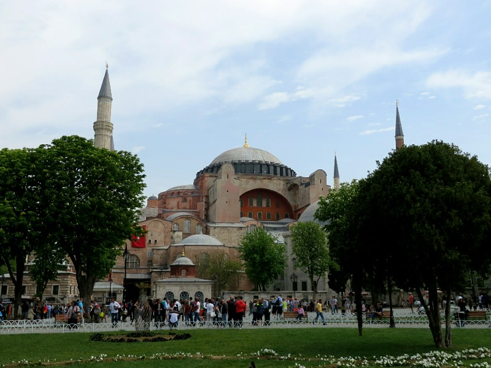

*Hagia Sophia*

After a little wait in a queue, we wandered in. Pat was not blown away. Partially because of unexpected scaffolding covering a quarter or so of the building which prevented us really appreciating the size of the room, the completeness (or incompleteness) of the artwork and architecture and kind of ruined any 'wow' factor. Kate thought it was still fairly nice, especially the marble. There were about a billion different colours and patterns from a huge range of place throughout the Roman empire (which Istanbul, then Constantinople, was the capital of). There were some huge calligraphic plates installed after the conversion, which we gather are the Islam equivalent to the Christan cross as the words of the Qur'an are sacred.

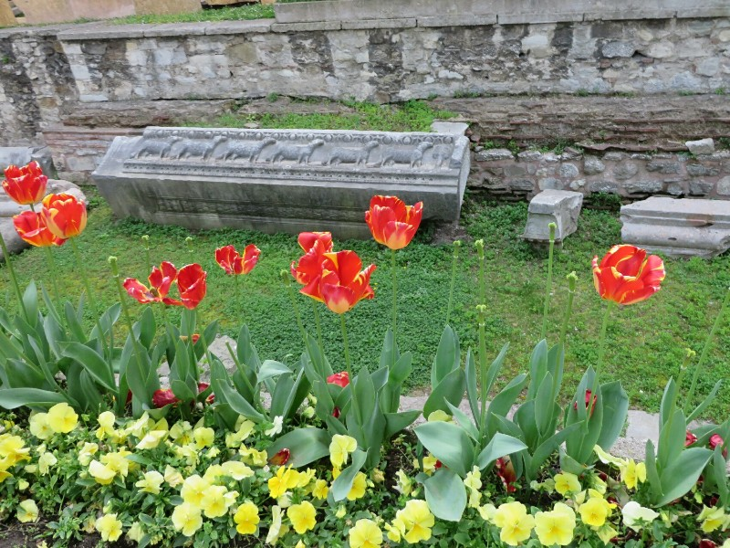

*1900 Year Old Remains From The First Hagia Sophia Church*

The whole thing felt a bit wonky from conversion to a mosque (apparently the original church wasn't on a straight axis to face Mecca for prayers) and many of the old Christan mosaics were lost or badly damaged (although they were still present as they were just plastered over with the conversion, not removed entirely). All in all it was definitely not as well maintained as similar historic sites in other European cities despite the charging the same price for entry. Maybe the scaffolding and renovation is a good thing. However, still admittedly impressive for a 1500 year old building, especially given the history it represents!

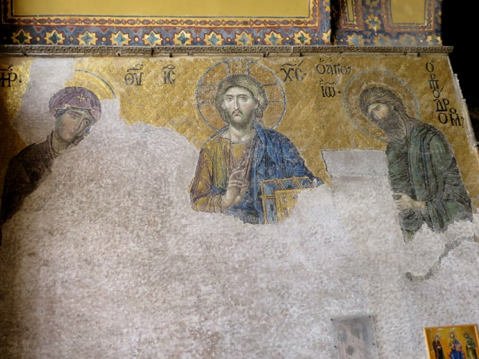

*Remaining Half Of An Old Mosaic*

Next stop was across the square to the Blue Mosque, a very nice looking mosque built in the 1600s, nicknamed the Blue Mosque because of the thousands of blue tiles decorating the interior. Another queue, Kate was quite worried because she read online they lend out free headscarfs to women but could see no sign of it. Luckily at the front of the queue it turned out it was true- free headscarf! And shawl because her elbows were offensive also. On entering a few younger girls immediately removed the robes to get back down to their miniskirts. Wonderful to see the respect shown for sites of all different religions throughout the world is equal! The interior lived up to its name - it was totally covered in small white tiles decorated with various blue patterns. We read that because so many tiles had to be produced for the mosque the sultan agreed on a price for everything ahead of time. By the time half of them had been completed the price of making the tiles had risen significantly. As the manufacturers were unable to raise the selling price, the quality of the tiles fell dramatically which is now evident when comparing the tiles side by side. On the cheaper ones the white had faded to a dull yellow while the higher quality ones had remained a brilliant white.

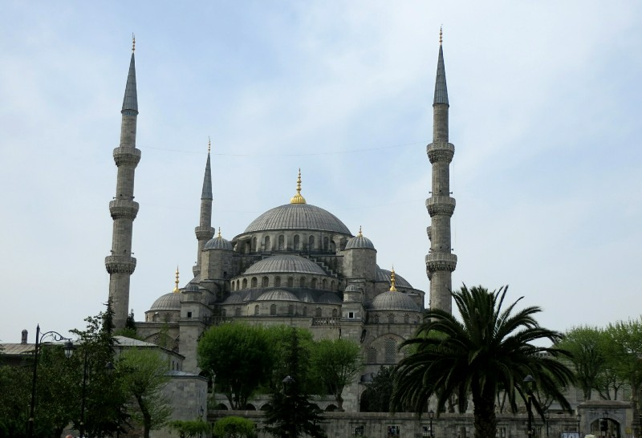

*Blue Mosque- Look At All Those Minarets*

Having grown up in western countries dominated by churches, neither of us had much chance to visit mosques, so seeing the inside of the Blue Mosque first hand was an interesting experience. The decor is completely different from what you would expect to see in a christian church. No pews since everyone kneels and places their head on the floor during the service. The lack of statues and other imagery, much like Hagia Spohia, highlighted all of calligraphy panels with important passages from the Qur'an. There were a few people praying, but for the most part it was filled with tourists.

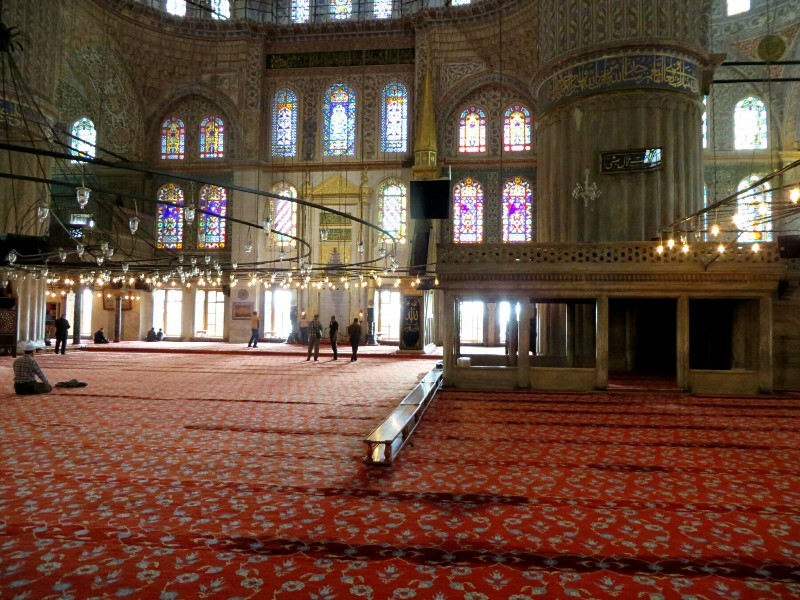

*Prayers in the Blue Mosque- Men Only Area*

After the mosque we grabbed lunch- we had quite a good pide with some hummus which was unusually sweet. I guess that's how they do it here. After the meal they gave us free baklava and tea, which was nice (at least it was nice once we started thinking of the 'tea' as sweet apple candy flavoured water rather than actually expecting a tea like flavour).

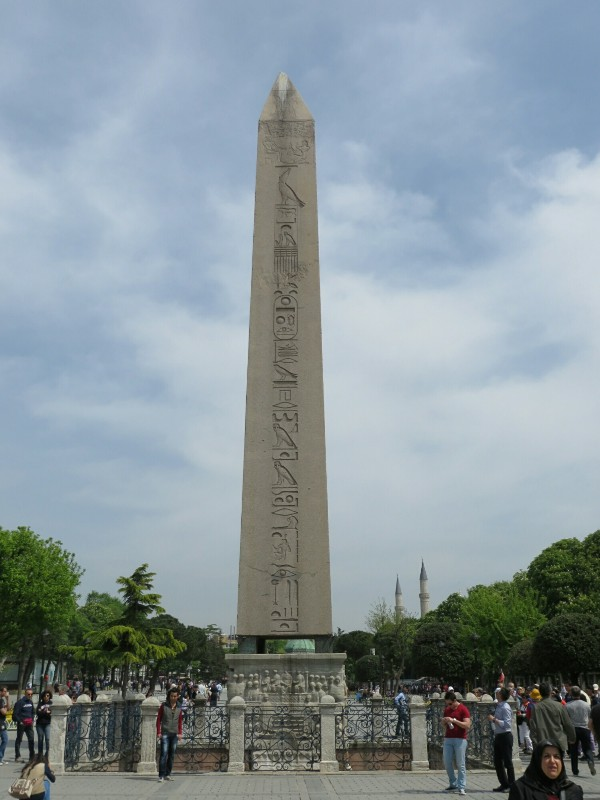

*Random 3500 Year old Egyptian Obelisk We Stumbled Across In The Middle Of A Square That Was Apparently An Ancient Horseracing Track... Why Not?*

Off we wandered, pretty aimlessly, and ended up in the Grand Bazaar, a huge indoor complex of shop fronts selling everything from rugs, to souvenirs, to crockery, to rugs, to spices, teas and candy, to rugs, to chess sets, right the way down to Turkish rugs! Everything was crazy overpriced so we didn't buy anything (except a few rugs, of course), but we had fun looking.

Next we wandered towards the river through a big park full of people and gorgeous tulips. Apparently in Istanbul you can't admire the beauty of a flower without sticking your face in front of it to take a photo. And I don't just mean standing near them, which I'd have no issue with. The tulips were being trampled by people stomping through them to get a photo surrounded by a sea of flowers. Never mind the ones squished in their wake, they should appreciate how much the addition of that lady's face is improving their decidedly average natural beauty.

Kate really really love tulips, she was (as you can see) terribly offended by their mistreatment.

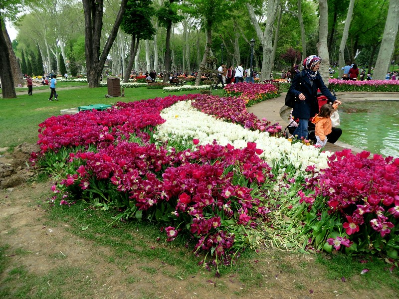

*Beautiful Flowers? Better Stomp On Them.*

After we enjoyed the still-standing flowers, we walked across the bridge to Galata Tower, a medieval tower that dominates the northern bank's skyline, and continued up the pedestrian mall towards home. We stopped for another pide and a weird pasta thing at a balcony cafe along the way and watched the ocean of people walk by below. We stumbled on a Christian Church in a decidedly Italian looking courtyard just off the mall. Apparently it was the Church of St. Anthony of Padua - the largest Catholic Church in Istanbul and was built by a local Italian community. We are totally on the ball with our architecture calls. We high fived and carried on.

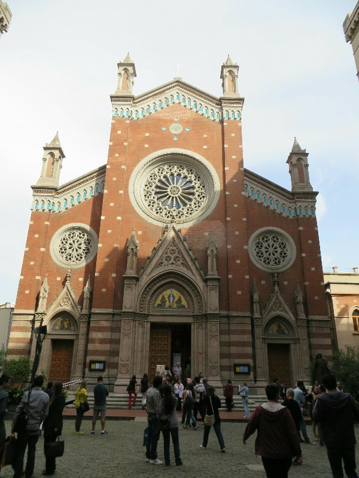

*Sneaky Christian church hiding in the middle of Istanbul*

Almost home, we grabbed a kebab and a burger for dinner, (the sloppy burger was apparently local specialty- pretty good), a local Snickers for desert (packed with whole peanuts, yum) and called it a day.

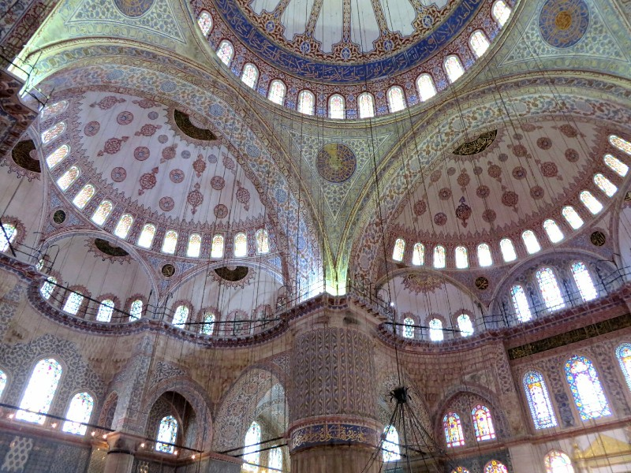

*Blue Mosque Ceiling Tiles*

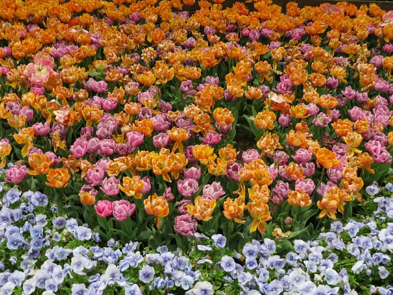

*How Much Better These Flowers Would Be With Someone Standing On Them!*

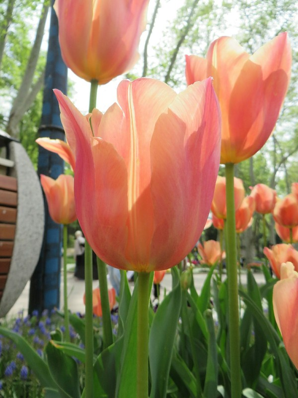

*Beautiful Not Squished Tulip*

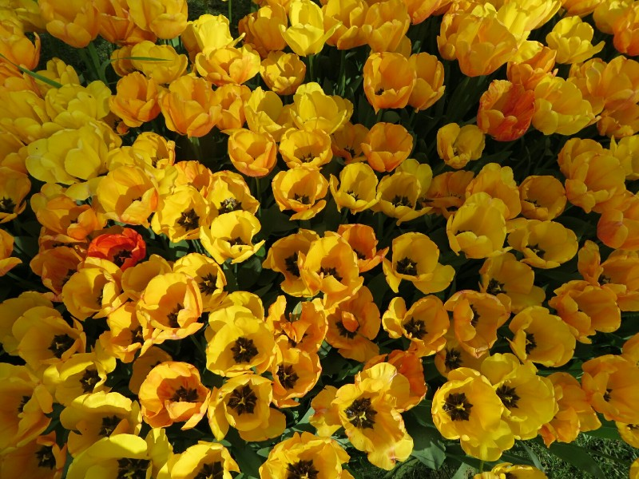

*Not Tulips, Still Pretty*
