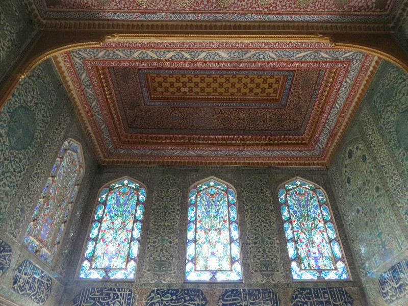
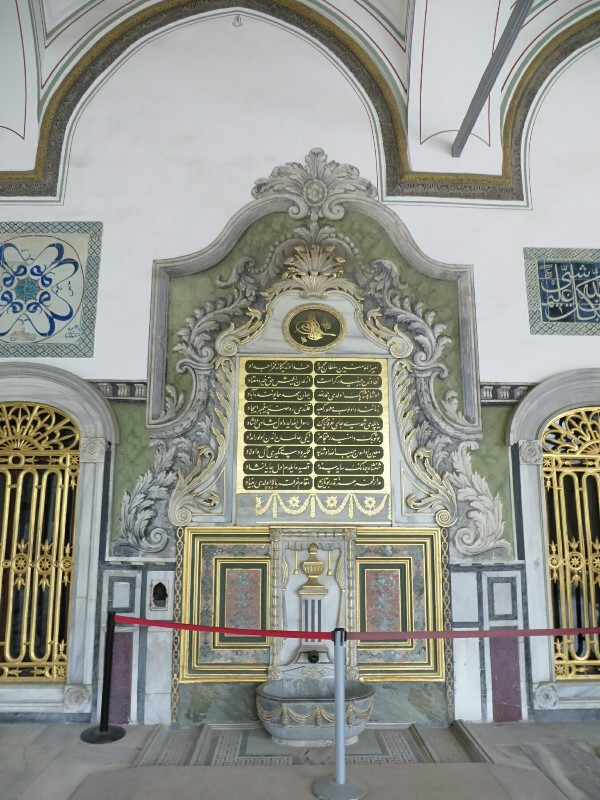
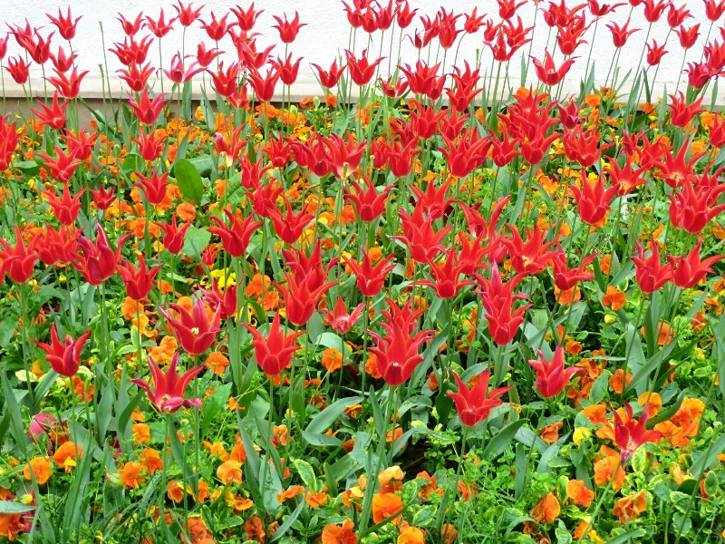
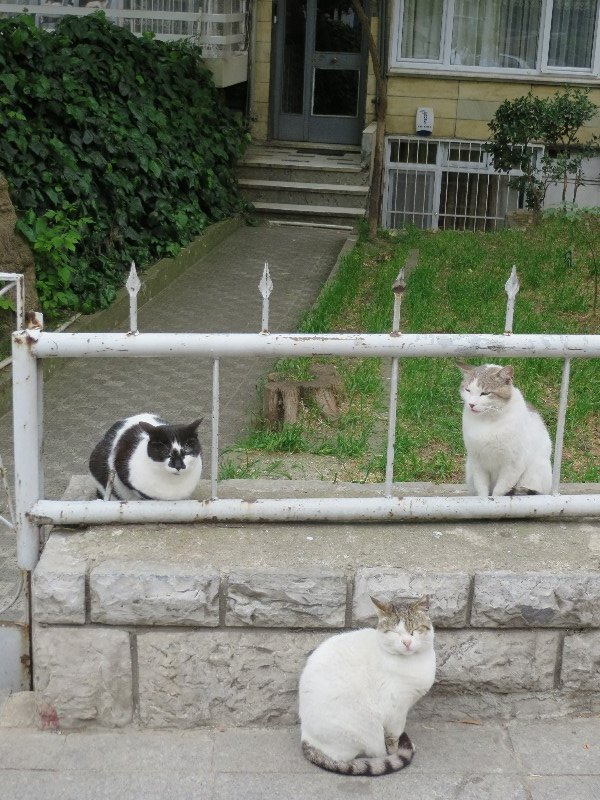

Sleep wasn't fantastic- prayers at 9.30pm, 5.30am and 7am don't really work well with a restful night. Other guests were also slamming doors all night, a baby was crying and someone was smoking outside our door. Neither of us was too cheery on waking, but we forced ourselves up moderately early again and public transit-ed to Topkapi Palace, the residence of the Ottoman Sultans for 400 years (til they decided it was outdated in 1856 and built the new one we saw by the river the other day). It was raining when we arrived, but luckily there wasn't a big queue so we didn't get too wet. Tickets to the palace and audio guides were sold in two parts- one for two thirds of the palace and another for the 'haram'- the residence of the sultan's mother, wives, concubines and eunuchs. By splitting everything up rather than having an all inclusive ticket we ended up paying more to visit this palace than to visit Versailles. We set our expectations to high!

First off we visited the Haram as we heard this gets very crowded and a limited number of people are allowed in. It didn't set a great tone. First the audio guide gave less information than the free explanatory signs and in much worse English (for example he'd say - "This is bathroom, the walls are decorated in tiles"... We could actually see that without your assistance helpful man)! The guide also spoke about everything with a real tone of pride in their heritage, which is all well and good until you hear what the heritage is!

*The Harem Rooms Were Quite Small- Tricky to Get Good Photos*

They started by showing us a courtyard with about 15 rooms coming off it, then explained something like 50-100 girls lived in these rooms. They were Christian girls taken at a young age from their families and 'trained' to be concubines (effectively sex slaves, not a suitable job for Muslim girls). If they were pretty they'd get to 'pleasure' the sultan, if not they were forced to marry his guards. It sounded absolutely horrendous! If you were really lucky you'd be a favourite or even be made his wife, then you get a slightly bigger and private room. However they still weren't allowed to leave the harem at all. They had eunuchs  (young boys also taken from their families as children and castrated) to 'guard' them and bring them groceries etc to stop any interaction with the outside world. Maybe something was lost in the terrible English translation, but it made us both feel dirty to be waking through these corridors and rooms that were used for child rape and mutilation! We're aware this kind of stuff was common in the past, but hearing it spoken about with pride and as a less important point than the spectacular tile work was quite disconcerting.

After the harem we continued on through the remainder of the palace. The whole place was a mishmash of styles and buildings, none seeming to fit with the others. Apparently this is because each sultan wanted to show their importance by slapping on a room or two of their own, or by expanding the existing structures. It earned it a place on UNESCO's list of world heritage sites as the best example of a palace of the Ottoman era. We feel the Ottoman civilization just weren't as aesthetically aware as some others- the tiling is beautiful, but the style is so inconsistent with different styles plonked all over the place with a random English style painting of fruit in the corner or something... Maybe the rain detracted?

*Apparently People Kept Trying To Use The 500 Year Old Basin...*

After looking at the main buildings we went into a few of the museums. These we found particularly hard to swallow. In one they presented a stick and claimed it was Moses' staff used to part the red sea. It's survived surprisingly well for a 3000 year old piece of wood! They also displayed the hand of John the Baptist (coated in gold and jewels) and Joseph's hat (a very Ottoman turban)! Apparently when the Ottomans conquered Egypt in the 1500s it was standard for the sultan to return with religious relics to show his power and that God supports his cause. So that probably explains where they came from, but it does seem a little ridiculous to continue to present them in a museum setting with signs saying '1000BC' next to them... They had a number of relics from Mohammed also, but these were also presented strangely. Even within one gallery their signs would have conflicting information about Mohammed's date of birth or upbringing or accomplishments which seemed very odd for such an important religious figure. Everything had a big 'UNESCO' stamp on it as though they'd gone through, fact checked and given it a tick of international approval, glossing over that the stamp was for the architecture, not the artefacts.

After the religious treasures we went to look at the gold and jewels treasures, but at this point the place was getting so packed we were unable to get closer than 5 rows back from the displays. In a dimly lit room through smudged glass we couldn't see an awful lot. Looking at the masses of people now circling the palace grounds and listening to our grumbly stomachs we decided to leave for a late lunch rather than persisting.

*One Thing Istanbul Has Going For It- Gorgeous Flowers Even At Creepy Palaces*

After a long walk we found a place Pat deemed suitable for a kebab. It was pretty darn good- they cooked capsicum and onion in the stick of kebab meat to infuse the flavour, and they used a delicious spicy sauce. Mmm. The rain was persisting so we decided to try for a little afternoon snooze.

After a break from life (interrupted at 5pm for the blasting music of prayer time) we ventured out for dinner. Taksim square was full of police and armored vehicles. A little nervous with the history of violent riots in this square we walked a little further and around a corner to confront a street packed shoulder to shoulder with thousands of people all facing the square. No shouting or chanting or anything, but didn't look promising. We decided rather than wandering in like we might have in Thailand, we'd just find somewhere else to eat. We edged quietly away and on the other end of the square found a little restaurant to eat.

*And More Cats*

We had some fairly good lamb and (what else) pide, but at the end the sneaky snake waiter tried to overcharge us on the bill (told us how much it was, didn't match with our math, we asked to see the bill, he tried to evade then eventually agreed and when it showed a much smaller cost he pretended he thought we'd had a bunch of entrees as well). Unfortunately this left a sour taste in our mouths after an already average day, so we called it quits and headed home to try for a better night's sleep.
