Today we decide we need to get out of the city and have a break from crowds. We miss Füssen a little. We get the tram to Chora Church, a church dating to the Roman rule famous for it's very artistic and well preserved murals and frescos. It certainly was impressive! The mosaics were created in the 1300s by an unknown artist. Unfortunately about a third of the building was closed for renovations, but the majority of the mosaics were in the accessible portion. This was a handy time to have Patrick around as he could recognize many of the biblical scenes being depicted and explain them to Kate. For the ones he wasn't sure about Kate subtly took a sneaky peek at a guide book in the gift shop while Pat distracted the staff by loudly buying a postcard. *evil cackle*!

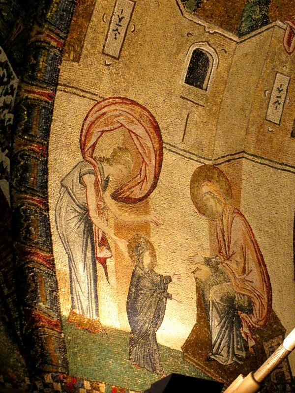

*Mosaic from Chora Church - Mary Learning To Walk*

After a good few laps around the church with our necks craned we popped into the restaurant next door for lunch. They were a serious traditional Turkish restaurant. Over all the invasions and changes in leadership in Istanbul over the years much of the cuisine has been lost. This restaurant has been reading through papers from the old palace kitchens for recipes and shopping lists, reading letters and diaries of old diplomats and generally doing their research to try to piece together what traditional Ottoman cuisine would have been like.

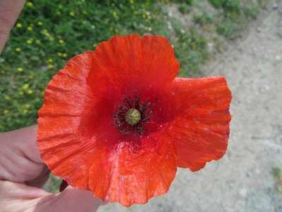

*Anzac Poppy*

To be honest- they could be way off base and we wouldn't care. Delicious dips, amazing (and distressingly buttery) cous cous, a spiced lamb dish and a melt in your mouth chicken pastry pocket. Pat sampled the home made lemonade and Kate had a traditional salted yoghurt drink (nicer than it sounds)! This was meant to be a light lunch, but it didn't work out quite like that...

When we were able to stand with the new weight of our bellies, we walked along the old city wall, built by emperor Theodosius in about 400AD. It's naturally a bit falling down, but some sections are still accessible to walk up and the whole thing is in good enough nick to walk alongside without getting lost. We walked up the newly installed metal stairs to the top of one open section, then climbed some ancient steps for tiny 400AD sized feet for a view from the tower. Pat tempted Kate up the super steep but miniature depth stairs saying there were other, newer stairs to go down once you got up there. She wobbled her way sideways up, feeling a bit sick at the thought that the other half of the half collapsed stairs may go at any minute. At the top she found a triumphant Pat who encouraged her to enjoy the lovely view! And found there actually wasn't another way down. Ugh. Patrick and his trickery! After 5 minutes of a very tentative/panicked descent, we continued along the wall at street level. It was very strange to see the neighbourhood built right up to this 1600 year old structure- it's being used as the back wall for some slum houses and as a fence for a local playground! Towards the end it cut a field in half, which we wandered through. Kate found a wild poppy, which reminded us it's Anzac Day. We took a moment's silence then carried on to the river.

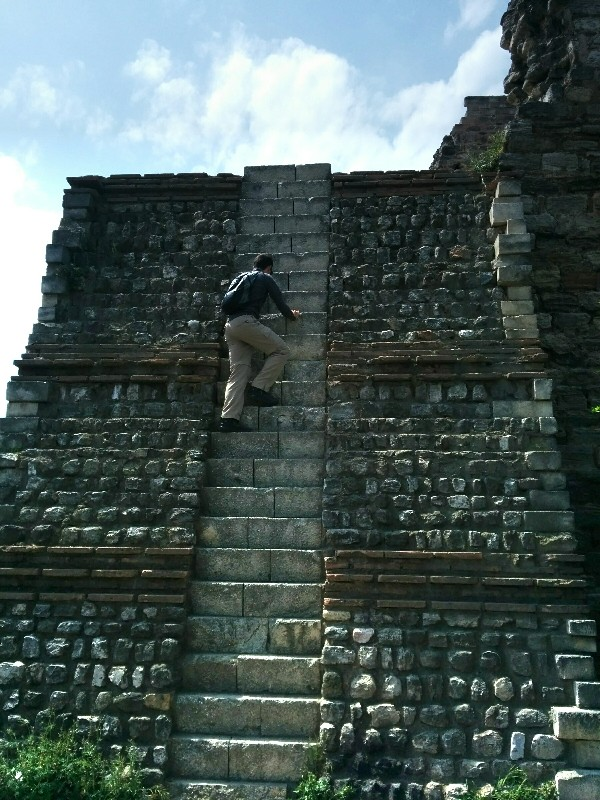

*Very Steep, Shallow, High Death Stairs*

At the river the wall ended. We walked along the river to Eyüp, a strongly Muslim neighborhood with a huge mosque, delicious ice cream and a popular tea house on the top of a hill. We grabbed an ice cream and watched end of the afternoon prayers. The front of the mosque opened onto a large square- people were spilling out of the mosque and packing the whole square. Walking into the square was like accidentally wandering onto the altar in the middle of a Catholic Mass! Luckily everyone was too focused to get cross so we just made a hasty exit when we could.

We spotted the hill which seemed to be the site of an old graveyard. We wandered through the tombstones along the path, admiring the dozen or so cats sleeping along the way (including one with a few adorable kittens sleeping on it). We have realised looking after the cats seems to be a whole city team effort. We've seen all kinds of people putting out boxes of cat food, butchers feeding the cats their left over scraps, men in suits feeding them kebab meat, old ladies giving them a cuddle and some laundry to sleep on. It's kind of nice, the cats are all very friendly as a result. At the top of the walk we found the tea house and had a Turkish tea each while overlooking the Golden Horn.

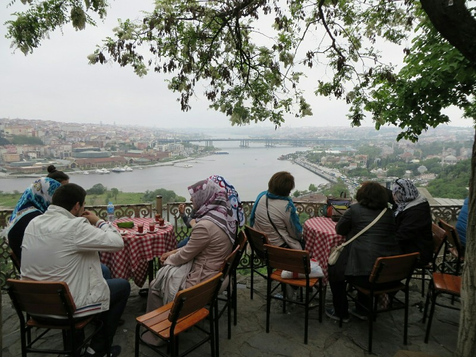

*Fancy a cuppa?*

After a nice break we wandered back down the hill and took the ferry back to old town. We walked aimlessly up the hill and ended up in the middle of the spice markets. They were selling an even larger selection than the Grand Bazaar; guns, knives, mannequins, rugs, scarves, food... It was a lot to look at!

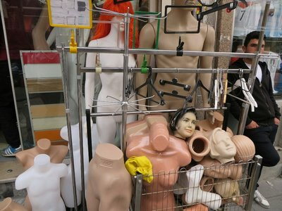

*Ice Truck Killer's Favourite Shop*

We made our way right over the hill and down the other side to have a local beer overlooking the Mediterranean Sea. It was starting to get late so we grabbed a tram back to Taksim Square and found another restaurant for another pide. They're just not living up to expectations from Australia! Either the bread is excellent quality or the toppings are, but never both. Sigh! Of course, it was still good enough that we finished it. And so finished our second last day in Istanbul.

On our last day we decided we enjoyed yesterday's excursion so much we'd avoid the tourist center again and venture out a bit. First we walked to the dock to a restaurant we're told is very popular with locals and serves an authentic Turkish breakfast. Like all good places we have to wait a little for a table, but when we get into the restaurant we're pretty impressed. The interior is huge with multiple counters for drinks, sweets, cured meats, breads, honeys and cooked breakfasts- like a marketplace but all under one roof and with table service. We started with a big Turkish omelette, a mixed cheese and meat plate, some honeycomb and clotted cream, some Turkish bread and a couple of coffees. Everything was absolutely to die for. Especially the honey- some of the best Kate has ever had. So we decided to stuff our faces further and got a second course with fried hamouli and chorizo skewers and fried eggs with beef. By this point we were feeling a bit sickly full so we decided to pay and leave before we accidentally ordered more and were forced to eat it, so as not to look ungrateful...

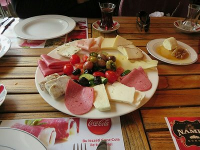

*Cheese and Meat Platter, and Haloumi/Chorizo Skewers. Mmm*

After breakie we took a ferry to the Asian side of the city and walked around for a while. It had a very Melbournian vibe; lots of kitch cafes with checkers or backgammon boards on the tables, lots of fun stores selling strange things and lots of posters for protests and alternative looking band concerts. Entertaining to walk through. We eventually came upon a park and had a sit for a while. There were lots of other people in the park; we watched a group of Uni students playing a casual game of badminton while a stray cat chased the shuttlecock back and forth between the two players. Eventually they hit it into a tree and spent a while unsuccessfully trying to encourage the cat to climb up chase it down for them.

We wandered back to the water and had a tea, then continued south along the waters edge looking out at the Turkish islands on the Mediterranean sea. The rocks and nearby park were filled with napping teenagers and cats enjoying the sunshine. We walked past some extremely fun looking adult sized play structures with swings, climbing webs and other things and wished we weren't feeling so fat because it looked like enormous fun! Another time.

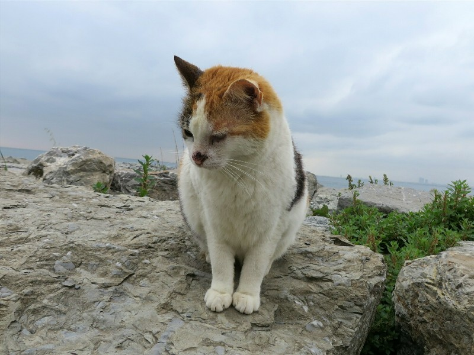

*Dr Seuss Would Have A Clever Rhyme About This Cat*

As it started to get late we looped back to the ferry terminal and headed back to the European side of town. Approaching Topkapi Palace, The Blue Mosque and Hagia Sophia from the water they look a lot more impressive. At the dock there was a man with a little barbeque set up selling fresh fish sandwiches. Kate grabbed one- miles better than the one from the first day but unfortunately full of bones which made it hard to enjoy. She gave the last bit to a friendly looking cat sleeping on a car we passed.

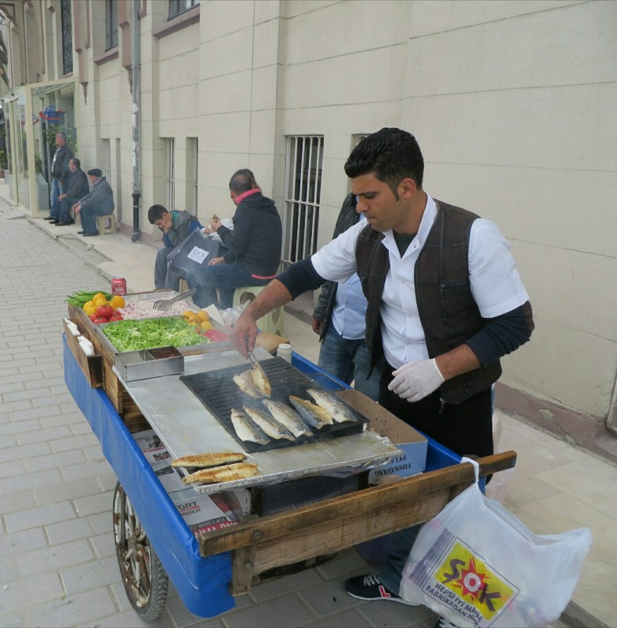

*Fresh Fish Sandwich Stand*

We took a long route home, watching the locals doing the same as us, heading home at the end of a long Saturday. We stopped in to our local shop for a farewell wine and the shopkeeper gave Kate a free chocolate bar. I guess not everyone is trying to rob us after all...

Istanbul wasn't like either of us expected, but especially after exploring the less central areas the last few days we're both keen to come back and see more. Although as prayers start blasting from speakers from mosques all over town at 9.30 we think maybe it's time for now to explore somewhere new and maybe get more than 6 hours sleep in a night... Italy tomorrow!

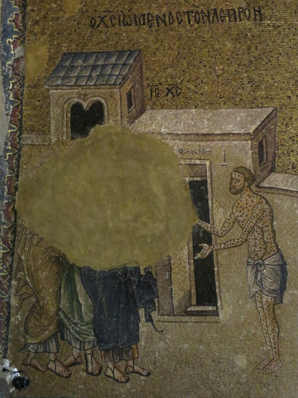

*The Spots Might Throw You, But Pat Assures Me This Is A Leper, Not A Leopard*

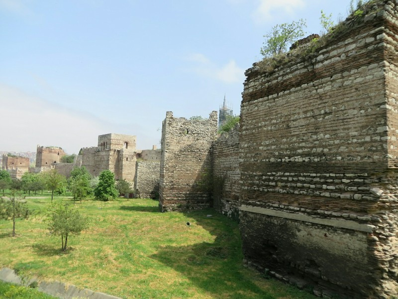

*This Ancient Wall is Totally Ruining the Park's Ambience!*

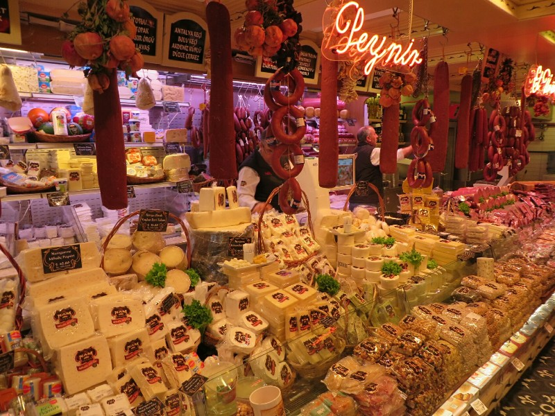

*An Appropriate Selection Of Cheese And Meat For Breakfast*

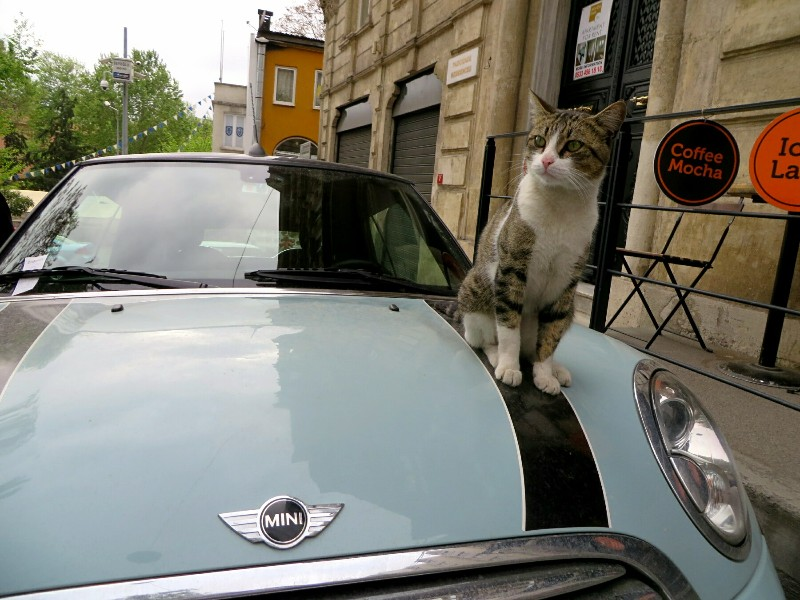

*Last Istanbul Cat, We Promise*
