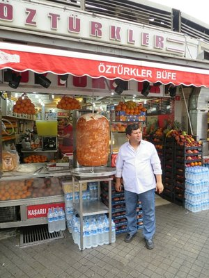
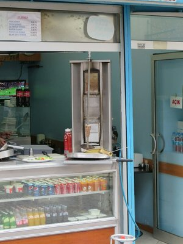
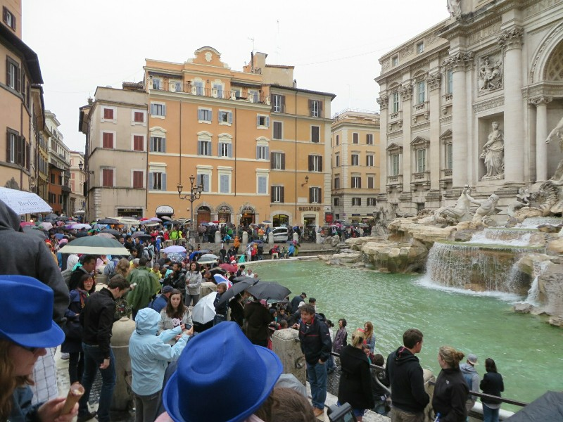

Early flight, disgustingly early. We were up before the first morning prayers. Ugh. We took a painless bus ride to the airport, then passed through security prior to even entering the airport- odd. The queue to check in was miles long already. After a short wait we were told to move to another counter where there was no line, so we dragged out bags there. On arrival we ended up having to wait quite a while anyway- they brought us to the empty gold queue counters just as all the gold flyers arrived. Eventually we got our tickets. As we walked away Kate checked them and the woman helpfully added "no seats together". Row 9 and 26 are as close as it gets checking in for an international flight at 6am, three hours before departure apparently. Hm.

*To Farewell Istanbul- Man And His Meat Stick. It's a kebab, get your mind out of the gutter! (Biggest Kebab Rotissary We Saw)*

The flight was fine, Kate was next to two very friendly Italian men returning from a business trip, Pat spent his flight battling for leg and arm room with the large man next to him.

*This Man Was Too Embarrassed To Pose With His Meat Stick (Smallest Kebab Rotissary We Saw)*

In Rome we head to the B&B and meet the lovely woman who owns the flat. She rents out the two extra rooms for company and extra income. She was very friendly, very chatty. She asked if we were here for the Pope. We said sure, maybe we'll see him. She says no no, and drew circles around her head until Kate clicked she was talking about the canonization of Popes John Paul II and John XXIII. Apparently the reason there was no accommodation available was because two live Popes were getting together to canonize two dead Popes today. Makes a lot of sense all of a sudden. Claudia recommends we avoid the Vatican today as it will be mental. Sounds reasonable.

We're getting pretty hungry now so we grab a quick lunch from a local pizzeria- a few pieces of sliced pizza paid by weight of each slice. Delicious. Then, despite the warnings of hoards of tourists, we decided to head out to the city. Sadly as we walk out the door it starts to rain. Not to be deterred we get on the bus and head in anyway. On the plus side the city has cleared from people because of this weather, on the negative side we kind of want to follow their lead... We wander briefly then find a wine bar to hide in. And now we're here it would probably be rude not to try a few... They're all quite nice, but we figure we can only hide here for so long. We get back out on the cobbled streets and wander a bit aimlessly. Eventually we stumble on the Trevi Fountain. That seems like good enough sight seeing to justify the bus ride. We grab another pizza and some pasta from a little restaurant and grab a bus back to Claudia's place to save our energy for tomorrow's (hopefully!) better weather!

*Trevi Fountain- Packed Rain or No*
