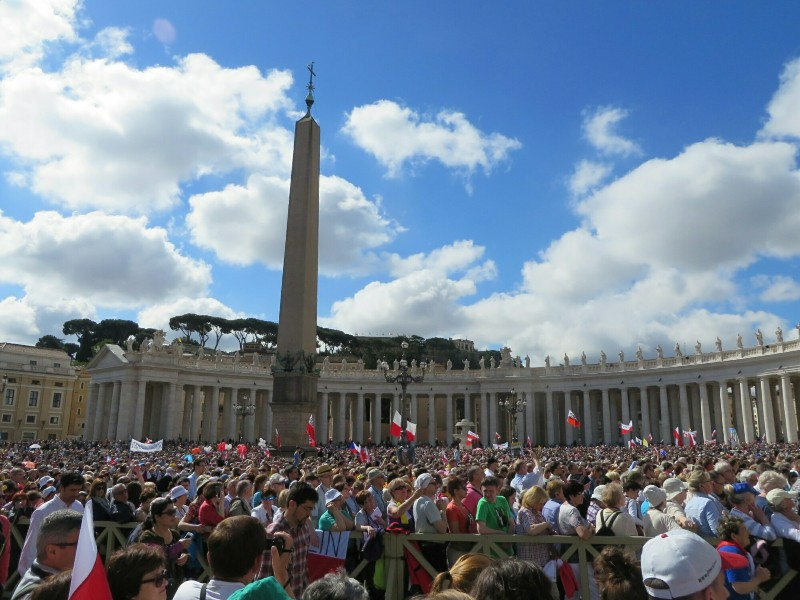
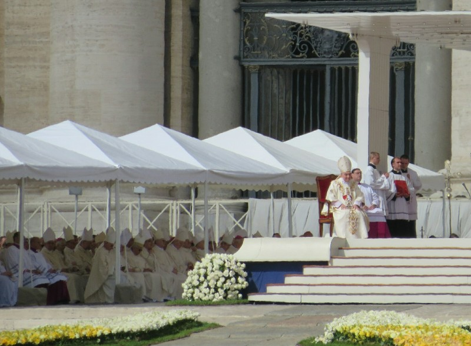
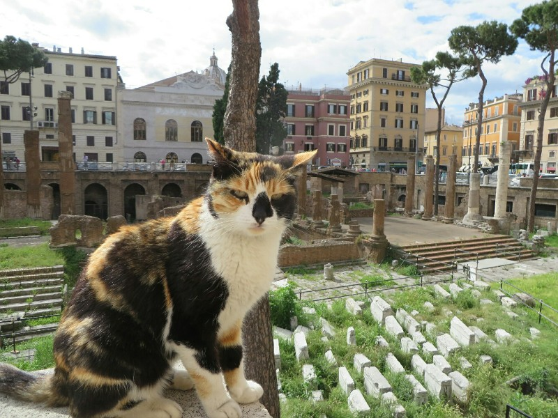
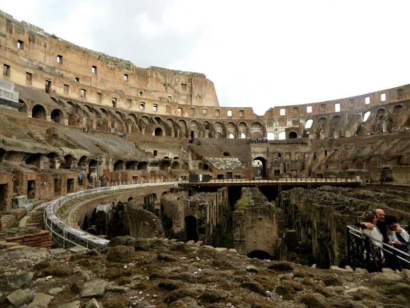
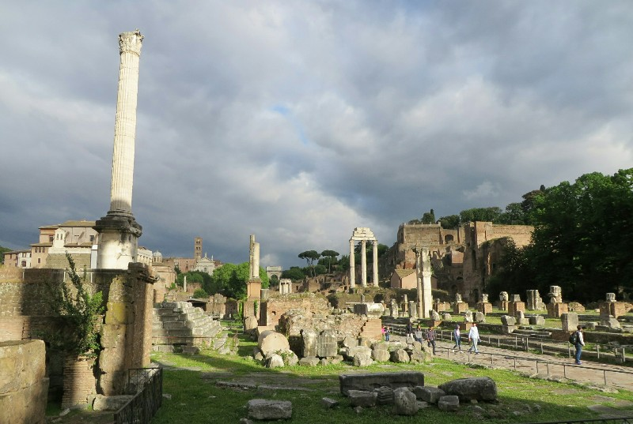
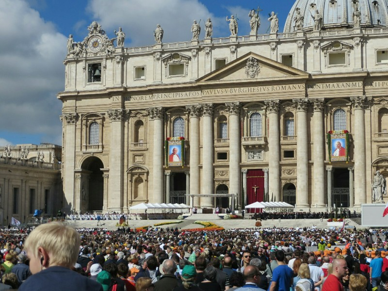
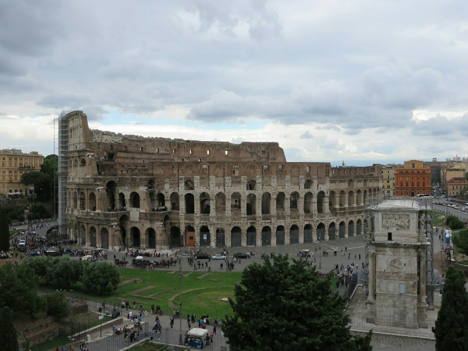
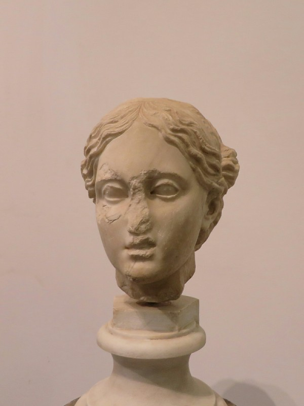

We get up early to head to the Vatican Museum today. The bus is packed! What was a 20 minute ride yesterday on a rainy Sunday is over an hour on a Monday morning around rush hour. So we arrive at the station to transfer to the subway later than planned. And it only gets worse. The metro is shoulder to shoulder packed with Poles singing hymns and waving flags filling the whole way from the platform backing up through the corridor and up the stairs. It's possibly worse than China. When we eventually pop like a champagne cork through the crowds into a train the singing continues. Perhaps the Vatican isn't a good idea today... Or this week...

At the station the train stops but the door doesn't open. People start banging on doors to be let out at station. Rather than heeding their demands, the train starts going backwards. Passengers groan in unison with discontent. He tries to  move forwards back to the platform- he still had it in reverse. Oops.

Finally we get to our station and get out. It took 90 minutes, we had predicted 30. Ugh. We decide against going to Vatican Museum as it's already 9.30 and the line will be massive with all these people. We think we'll go to St Peter's Basilica instead, a huge square, shouldn't be so busy. A huge crowd walks with us the whole way there. There are more singing Poles, nuns, priests, everyone waving flags and pictures of the Popes. We definitely picked the worst week to visit Rome if you like sightseeing in peace.

*Not As Empty As We Expected!*

We wait with the crowd for about a half hour to get into St Peter's Square. The nuns seem to be good at sneakily making their way through the crowd and a lot of the priests are pushing. Not sure how priestly that is. At the front we head through metal detectors into the square. It is packed! Something is going on. A mass? There are people in white and black sitting on opposite sides of the stage, perhaps cardinals? We spy someone wearing a hat that looks like the one the Pope wears but even with the super zoom on our camera we can't make out faces. We decide that it probably is the Pope and add him to the list of world leaders we have seen. Queen Elizabeth II and Pope Francis, not a bad list so far.

*Possibly The Pope? Possibly Another Man In Similar Headgear? Thoughts Anyone?*

As more and more people start piling in to the square we decide that we aren't keen to stay squished here much longer so we politely edge our way towards the exit and head off.

We walk to the river, cross and head towards the Colosseum. The city is teeming with people! The worst crowds of anywhere in the last 3 months of tourist site after tourist site. It's so loud with all the traffic and people, there's no where to walk with all the tour group amorphous blobs filling the footpaths. We move to a side street- cute old buildings; little cafes and shops; quiet. Aah. We pass some old ruins from a few hundred BC- Largo di Torre Argentina. Apparently this is where Julius Caesar was killed! Now it's a cat shelter. Three legged cats wander around the ruins, probably napping exactly where Brutus betrayed Julius.

*A Cat Planning To Follow in Brutus' Footsteps and Murder Me Here Next...*

We walk some more along the uneven road because the footpaths are completely inaccessible through the groups. Kate falls down and twists her ankle. Ouch. Time for a panini break (paninis at €3.50 each somehow ends up costing €17 with taxes and mystery costs. Sneaky Italians).

After a bite we head to Colosseum. It's very cool! Walking in the footsteps of gladiators and spectators from thousands of years ago is a humbling feeling. Of course, there are tons of people here too. Rude guides stand in front of signs we're reading, when we ask them to please stand to the side they wave their lanyards at us like it's a free pass to be an ungracious and horrible human. Maybe they are? Haven't exactly had good luck with people wearing lanyards...

*The Pits Where The Gladiators, Lions, Tigers And Bears Were Kept (Oh My!)*

After wishing Colosseum was still active to pit the horrible lanyard people against each other in a battle to the death, we head to the Roman Forum. We can't find audio guides. We ask 3 separate staff members all of whom fob us off (after attempts to ignore us altogether fail). We are finding people here much much much ruder than in Paris. Big flip from Kate's visit 8 years ago. Maybe they just hate the huge crowds as much as we do?

We decide an audio guide isn't happening. Luckily we have our handy City Maps 2 Go app. It has been a lifesaver with offline maps of all the cities we've visited, GPS and offline Wikipedia articles about points of interest. And free! Anyway, the GPS on the app is especially useful. Looking at the ruins without information it's hard to work out what they are and were. With the articles, looking at some ruins you can imagine exactly how the ancient city would have looked. We explore until closing, then head to a hill above for a view of the ruins with the setting sun. Naturally as soon as we reach the crest of the hill clouds get in the way. Oh well!

*Ruins in the Roman Forum*

We get the bus towards home and go to a family run restaurant Claudia recommended for dinner. The starters (mushroom bruscetta and croquettes) are OK, but the two pasta mains are amazing. The best carbonara either of us has ever had. The way they cook their pasta here is perfect. We pair it with a bottle of local wine which was equally delicious. Pat decided to get a second course too, a weird crumbed lamb dish. It was not so good. So, won some and lost some! Next we head to bed to try again earlier tomorrow for the Vatican.

*Sea Of People And Maybe The Pope?*

*Colosseum From Afar*

*2000 Year Old Bust From The Roman Forum- Not Pleased To Pose For This Sculpture*
