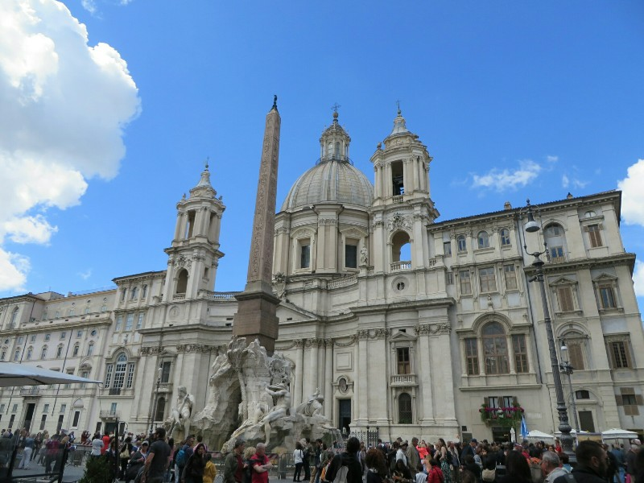
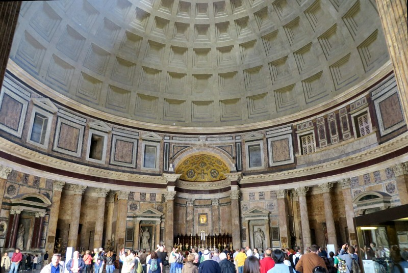
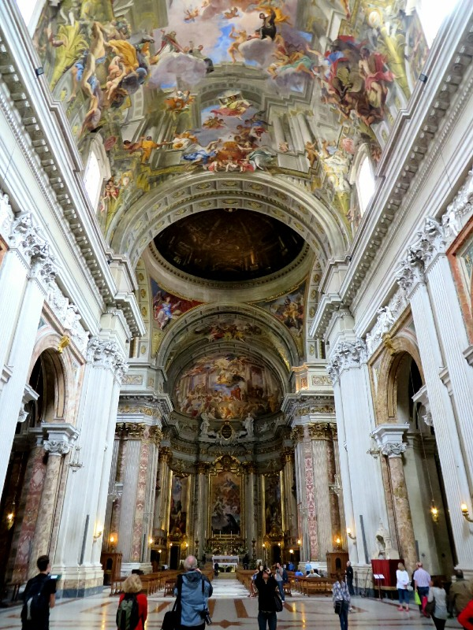
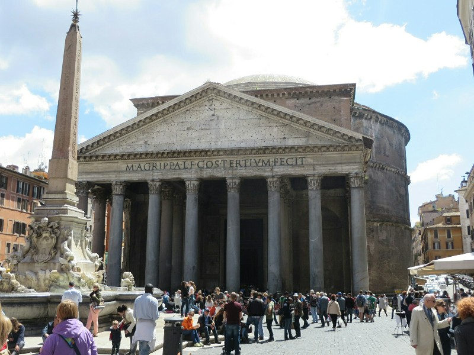
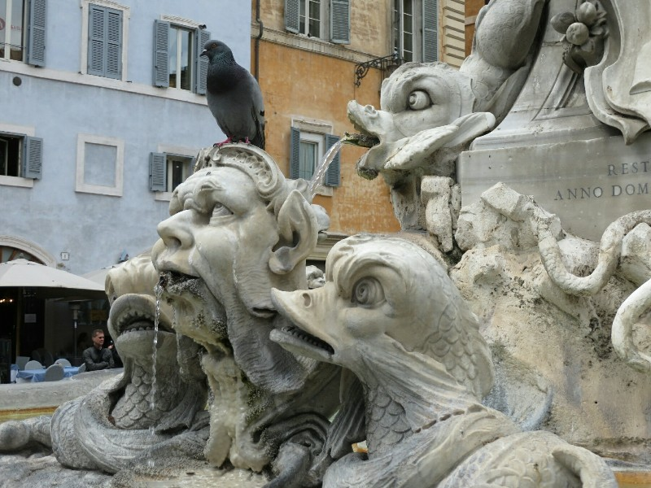
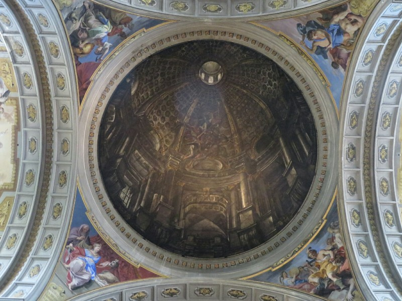

Kate's alarm doesn't go off, spoiling any attempt at an early start and avoiding queues at the Vatican museum. We look at day trips out of the overcrowded city as an alternative, decide it's all too hard and settle on a enoteca for wine tasting and cheese. That should raise our spirits.

We get on the bus. It was not a good choice. We've missed rush hour and caught unemployed, no motivation to shower hour instead. It stinks like moldy skin, BO and stale cigarettes. It's worse than China. So bad in fact we actually have to make a hasty premature exit and walk instead. It takes Kate several blocks to get over her nausea from the smell- and remember she works with disgusting stinky breath from people with months old food stuck in their teeth every day in Australia!

Eventually we get to the enoteca, at lunch actually so probably more appropriate. We get a few varieties of local wine to compare and a mix plate of cheese and cured meat with sun dried tomatoes and artichoke on the side. Yum.

*Another Ancient Egyptian Obelisk, They Just Left Them All Over The Place For Us To Trip Over*

When we'd had our fill we headed towards the Pantheon which Kate had seen already but was all new for Pat. THIS is how you do decorations with marble, the Byzantines need to take notes! Compared to Hagia Sophia, the walls and floors here looked much more balanced and complimentary. Less like they had taken every type and colour of marble they could find and glued it to the wall and more like someone sat down and planned everything from start to finish. What was more impressive was the massive hole in the top of the dome ceiling which creates a different atmosphere in the building depending on the time of day and the time of year. The Romans were certainly a clever bunch. Two thumbs up!

*Marble Work Inside The Pantheon*

We leave looking for lunch and on our walk pass a church. Kate suggests checking it out. Pat's not keen, needs food, but relents and we head in. He is glad we did! Another absolutely beautiful church, gorgeous frescos and marble; Chiesa di Sant'Ignazio. Areas in the front section look incomplete, areas where the walls aren't painted with frescos and the walls aren't covered in marble. Nothing on Wikipedia to explain it though!

*Frescos in Chiesa di Sant'Ignazio*

After a good round we grabbed lunch at a restaurant called Il Falchetto. They refused to give tap water (which I'll admit, is common here), but in addition the pizza was floppy and the carbonara was basically easy mac with bacon. Then they rounded up service charge from 2.40 to 3.00. Not wonderful, but I guess not every restaurant can be good!

Next we wandered past the Trevi fountain again. Even busier than in the rain! We didn't last terribly long. We headed down to the Jewish Quarter (the Roman Ghetto). In the 1500s the Pope ordered it built here to house the Jewish population as the area is regularly flooded and undesirable to live in- this area of the city was walled and the gates were bolted every night. While the gates were knocked down some time ago, the Jewish population were already settled and many remained here. We watched the Jewish kids head home after school, and watched a skittish cat try to hunt pigeons. When he had a group of seven nearby he pounced. And missed them all. Apparently we weren't the only ones watching- everyone in the square laughed at once. Poor cat.

Rome is a fairly beautiful place, we easily spent the day walking, admiring the architecture and enjoying the city. And as it got late we went home again with big plans again for the Vatican in the morning!

*Impressive Pantheon*

*Unfortunately For Him, The Statue Knows Exactly What That Pigeon Is About To Do*

*Sneaky Painting Designed To Look Like A Dome*
